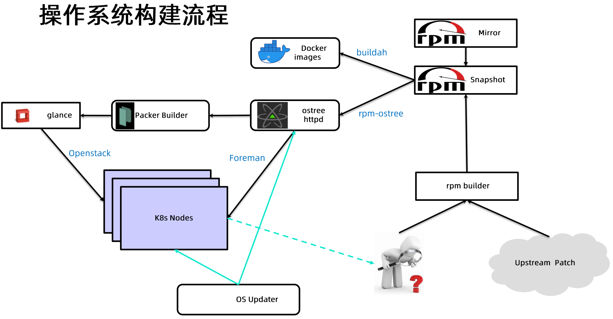

# 生产化集群的管理

包括以下几个部分：

* 计算节点相关
* 操作系统选择
* 节点资源管理
* 节点异常检测
* 常用节点问题排查手段
* 基于 extended resource 扩展节点资源
* 构建和管理高可用集群
* Cluster Autoscaler
* 集群管理实践案例分享
* 多租户集群管理


## 计算节点相关

计算节点:

* 如何批量安装和升级计算节点的操作系统?
* 如何管理配置计算节点的网络信息?
* 如何管理不同 SKU ( Stock Keeping Unit)的计算节点?
* 如何快速下架故障的计算节点?
* 如何快速扩缩集群的规模?


控制平面:

* 如何在主节点上下载、安装和升级控制平面组件及其所需的配置文件?
* 如何确保集群所需的其他插件，例如 CoreDNS、监控系统等部署完成?
* 如何准备控制平面组件的各种安全证书?
* 如何快速升级或回滚控制平面组件的版本?


## 操作系统选择

**通用操作系统**

* Ubuntu
* CentOS
* Fedora

**专为容器优化的操作系统**

* 最小化操作系统
  * CoreOS
  * RedHat Atomic
  * Snappy Ubuntu Core
  * RancherOS

**操作系统评估和选型的标准**

* 是否有生态系统
* 成熟度
* 内核版本
* 对运行时的支持
* Init System
* 包管理和系统升级
* 安全

**容器优化操作系统的优势**

* 小
* 原子级升级和回退
* 更高的安全性


| 操作系统         | CentOS       | Ubuntu       | CoreOS                                                 | Atomic*               | Snappy                           | RancherOS                                          |
| ---------------- | ------------ | ------------ | ------------------------------------------------------ | --------------------- | -------------------------------- | -------------------------------------------------- |
| 分类             | 通用操作系统 | 通用操作系统 | 容器优化                                               | 容器优化              | 容器优化                         | 容器优化                                           |
| 生态系统和成熟度 | 成熟         | 成熟         | 最早的容器优化操作系统，不过公司体量小，目前已被收购。 | RedHat 出品，品质保证 | Canonical出品,最初为移动设备设计 | 相对较新,RancherOS中运行的所有服务都是docker容器。 |


### 云原生的原则

> 云原生语境下追求的是不可变基础设施。

**可变基础设施的风险**

* 在灾难发生的时候，难以重新构建服务。持续过多的手工操作，缺乏记录，会导致很难由标准初始化后的服务器来重新构建起等效的服务。
* 在服务运行过程中，持续的修改服务器,就犹如程序中的可变变量的值发生变化而引入的状态不一致的并发风险。这些对于服务器的修改，同样会引入中间状态，从而导致不可预知的问题。

**不可变基础设施(immutable infrastructure)**

* 不可变的容 器镜像
*  不可变的主机操作系统


### Atomic*

* 由Red Hat支持的软件包安装系统
* 多种 Distro
  * Fedora
  * CentOS
  * RHEL

* 优势
  * 不可变操作系统，面向容器优化的基础设施
    * 灵活和安全性较好
    * 只有/etc和/var可以修改，其他目录均为只读
  * 基于 rpm-ostree 管理系统包
    * rpm-ostree是一个开源项目，使得生产系统中构建镜像非常简单
    * 支持操作系统升级和回滚的原子操作


### 最小化主机操作系统

原则：

* 最小化主机操作系统
* 只安装必要的工具
  * 必要：支持系统运行的最小工具集
  * 任何调试工具，比如性能排查，网络排查工具,均可以后期以容器形式运行
* 意义
  * 性能
  * 稳定性
  * 安全保障


### 操作系统构建流程




### ostree

提供一-个共享库( libostree)和一些列命令行
提供与 git 命令行一致的体验，可以提交或者下载一个完整的可启动的文件系统树
提供将 ostree 部署进 bootloader 的机制

https://github.com/ostreedev/ostree/blob/main/src/boot/dracut/module-setup.sh

```bash
install() {
    dracut_install /usr/lib/ostree/ostree-prepare-root
    inst_simple "${systemdsystemunitdir}/ostree-prepare-root.service"
    mkdir -p "${initdir}${systemdsystemconfdir}/initrd-root-fs.target.wants"
    ln_r "${systemdsystemunitdir}/ostree-prepare-root.service" \
        "${systemdsystemconfdir}/initrd-root-fs.target.wants/ostree-prepare-root.service"
}
```


#### 构建 ostree

rpm-ostree

* 基于 treefile 将 rpm 包构建成为 ostree
* 管理 ostree 以及 bootloader 配置

treefile

* refer：分支名(版本，cpu架构)
* repo：rpm package repositories 
* packages：待安装组件

将 rpm 构建成 ostree

```bash
rpm-ostree compose tree --unified-core --cachedir=cache --repo=. /build-repo/path/to/treefile.json
```


#### 加载 ostree


初始化项目

```bash
ostree admin os-init centos-atomic-host
```

导入 ostree repo

```bash
ostree remote add atomic http://ostree.svr/ostree
```

拉取 ostree

```bash
ostree pull atomic centos-atomic-host/8/x86_64/standard
```

部署 OS

```bash
ostree admin deploy --os=centos-atomic-hostcentos-atomic-host/8/x86_64/standard --karg=' root=/dev/atomicos/root'
```


#### 操作系统加载

物理机

* 物理机通常需要通过 foreman 启动，foreman 通过 pxe boot,并加载 kickstart
* kickstart 通过ostree deploy 即可完成操作系统的部署

虚拟机

* 需要通过镜像工具将 ostree 构建成 qcow2 格式，vhd, raw 等模式


