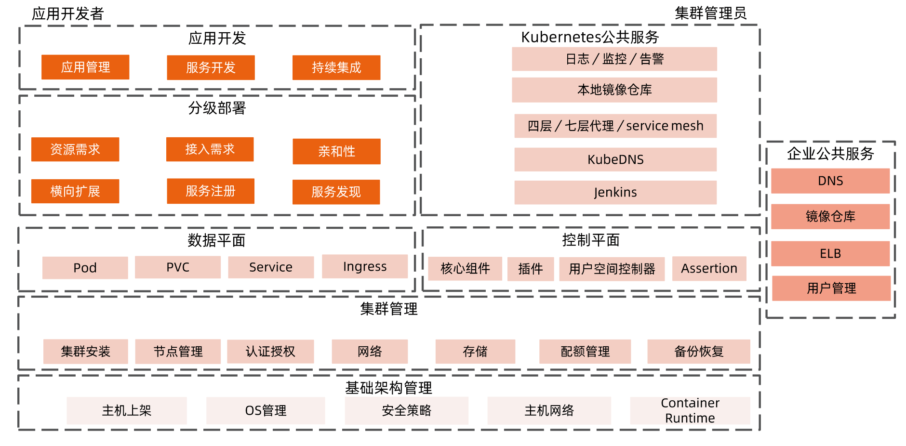
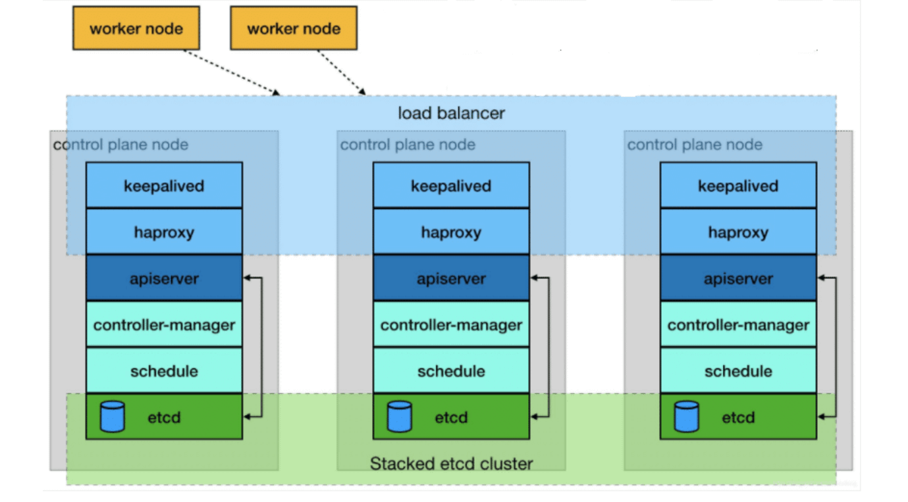

# 构建和管理高可用集群

## k8s 高可用层级

如上图所示，应用开发者和集群管理员的关注点其实是不同的。

### 高可用的数据中心

* 多地部署
* 每个数据中心需要划分成具有独立供电、制冷、网络设备的高可用区
* 每个高可用区管理独立的硬件资产，包括机架、计算节点、存储、负载均衡器、防火墙等硬件设备

### Node 的生命周期管理

运营 Kubernetes 集群，不仅仅是集群搭建那么简单，运营需要对集群中所有节点的完整申明周期负责。

* 集群搭建
* 集群扩容 / 缩容
* 集群销毁(很少)
* 无论是集群搭建还是扩容,核心是 Node 的生命周期管理
  * Onboard
    * 物理资产上架
    * 操作系统安装
    * 网络配置
    * Kubernetes 组件安装
    * 创建 Node 对象
  * 故障处理
    * 临时故障?重启大法好
    * 永久故障?机器下架
  * Offboard
    * 删除 Node 对象
    * 物理资产下架，送修/报废

### 主机管理

* 选定哪个版本的系统内核、哪个发行版、安装哪些工具集、主机网络如何规划等。

* 日常的主机镜像升级更新也可能是造成服务不可用的因素之一。
  * 主机镜像 更新可以通过 A / B系统 OTA (Over The Air) 升级方式进行。
  * 分别使用 A、B 两个存储空间，共享一份用户数据。在升级过程中，OTA 更新即往其中一个存储
    空间写入升级包，同时保证了另一个系统可以正常运行，而不会打断用户。如果 OTA 失败,那
    么设备会启动到 OTA 之前的磁盘分区，并且仍然可以使用。

### 生产化集群管理

* 如何设定单个集群规模
  * 社区声明单一集群可支持 5000 节点，在如此规模的集群中，大规模部署应用是有诸多挑战的。
    应该更多还是更少?如何权衡?
* 如何根据地域划分集群
  * 不同地域的计算节点划分到同一集群
  * 将同一地域的节点划分到同一集群
* 如何规划集群的网络
  * 企业办公环境、 测试环境、预生产环境和生产环境应如何进行网络分离
  * 不同租户之间应如何进行网络隔离
* 如何自动化搭建集群
  * 如何自动化搭建和升级集群，包括自动化部署控制平面和数据平面的核心组件
  * 如何与企业的公共服务集成

### 企业公共服务

* 需要与企业认证平台集成，这样企业用户就能通过统一认证平台接入 Kubernetes 集群，而无须重新设计和管理一套用户系统。
* 集成企业的域名服务、负载均衡服务，提供集群服务对企业外发布的访问入口
* 在与企业的公共服务集成时，需要考虑它们的服务是否可靠
* 对于不能异步调用的请求，采用同步调用需要设置合理的超时时间、
* 过长的超时时间，会延迟结果等待时间，导致整体的链路调用时间延长，从而降低整体的 TPS
* 有些失败是短暂的、偶然的(比如网络抖动)，进行重试即可。而有些失败是必然的，重试反而会造成调用请求量放大，加重对调用系统的负担

### 控制平面的高可用

* 针对大规模的集群，应该**为控制平面组件划分单独节点**，减少业务容器对控制平面容器或守护进程的干扰和资源抢占
* 控制平面所在的节点，应确保在不同机架上，以防止因为某些机架的交换机或电源出问题，造成所有的控制面节点都无法工作
* 保证控制平面的每个组件有足够的 CPU、内存和磁盘资源，过于严苛的资源限制会导致系统效率低下，降低集群可用性
* 应尽可能地减少或消除外部依赖。在 Kubneretes 初期版本中存在较多 Cloud Provider API 的调用，导致在运营过程中，当 Cloud Provider API 出现故障时，会使得 Kubernetes 集群也无法正常工作。
* 应尽可能地将控制平面和数据平面解耦，确保控制平面组件出现故障时，将业务影响降到最低。
* Kubernetes 还有一些核心插件，是以普通的 Pod 形式加载运行的，可能会被调度到任意工作节点，与普通应用竞争资源。这些插件是否正常运行也决定了集群的可用性。

### 高可用集群

### 集群安装方法比较

| 安装工具  | 方法                                                         | 优势                                                         | 缺点                                                         |
| --------- | ------------------------------------------------------------ | ------------------------------------------------------------ | ------------------------------------------------------------ |
| 二进制    | 下载二进制文件，并通过设置 systemd 来管理                    | 灵活性强                                                     | 复杂，需要关心每一个组件的配置，对系统服务的依赖性过多       |
| Kubeadm   | Kubeadm是一个搭建集群的命令行工具 管理节点通过kubeadm init初始化 计算节点通过kubeadm join加入 | 相比二进制，控制面组件的安装和配置被封装起来了 管理集群的生命周期，比如升级、证书管理等 | 操作系统层面的配置无自动化 运行时安装配置等复杂步骤依然是必须的 CNI 插件等需要手工安装 |
| Kubespary | 通过 Ansible- playbook 完成集群搭建                          | 自动完成操作系统层面的配置 利用了kubeadm作为集群管理工具  | 缺少基于声明式API的支持                                      |
| kops      | 基于声明式 API 的集群管理工具                                | 基于社区标准的Cluster API进行集群管理 节点的操作系统安装等全自动化 | 与云环境深度集成 灵活性差                                |

> 推荐使用 KubeClipper 进行集群安装。

