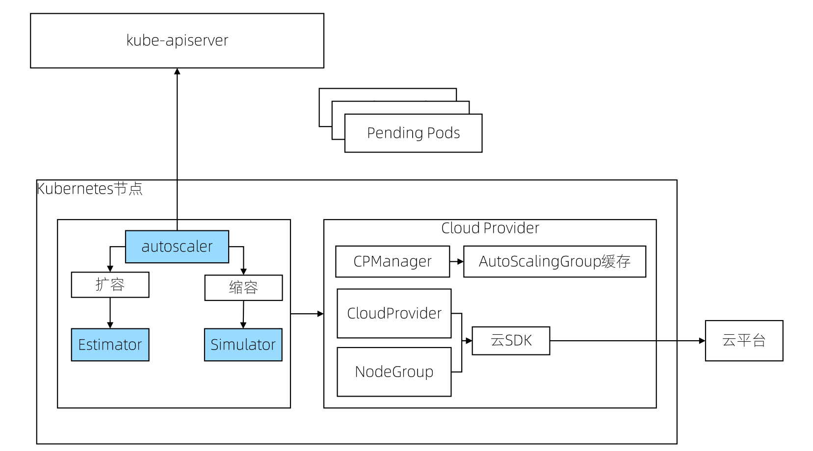

# Cluster AutoScale

### 工作机制

* 扩容:
  * 由于资源不足，pod 调度失败,即有 pod 一直处于 Pending 状态

* 缩容
  * node 的资源利用率较低时，持续 10 分钟低于 50%
  * 此 node 上存在的 pod 都能被重新调度到其他 node 上运行

### Cluster AutoScaler 架构

* Autoscaler：核心模块，负责整体扩缩容功能
* Estimator：负责评估计算扩容节点
* Simulator：负责模拟调度,计算缩容节点
* Cloud-Provider：与云交互进行节点的增删操作,每个支持 CA 的主流厂商都实现自己的 plugin 实现动态缩放

### Cluster Autoscaler的扩展机制

为了自动创建和初始化 Node, Cluster Autoscaler 要求 Node 必须属于某个 Node Group,比如：

* GCE/GKE 中的 Managed instance groups (MIG)
* AWS 中的 Autoscaling Groups 
* Cluster API Node

当集群中有多个 Node Group 时，可以通过`--expander=<option>`选项配置选择 Node Group 的策略，支持如下四种方式

* random：随机选择
* most-pods： 选择容量最大(可以创建最多Pod)的Node Group
* least-waste：以最小浪费原则选择，即选择有 最少可用资源的Node Group
* price：选择最便宜的Node Group

### 代码走读

Cluster Autoscaler 代码

https://cncamp.notion.site/CA-204f3767ba8d4ed0a464d2ea6ac2abca

Cluster API 与 Cluster Autoscaler 的整合
https://cluster-api.sigs.k8s.io/tasks/automated-machine-management/autoscaling.html
