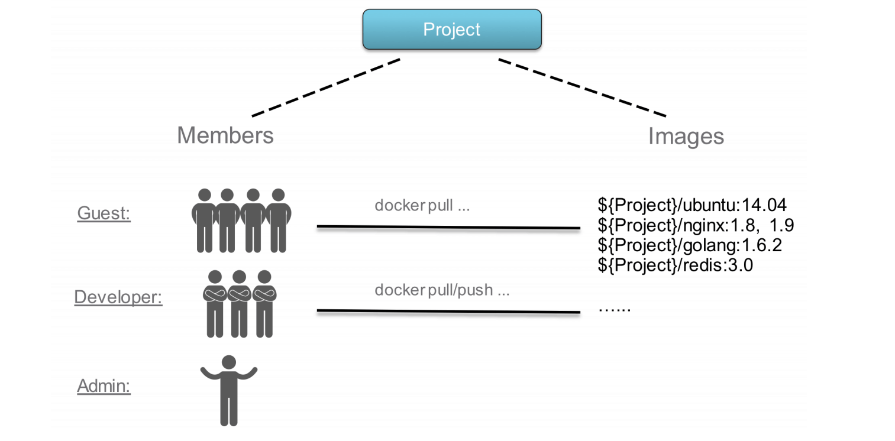

## 镜像仓库

镜像仓库(Docker Registry)负责存储、管理和分发镜像。

镜像仓库管理多个 Repository, Repository 通过命名来区分。每个 Repository 包含一个或多个镜像，镜像通过镜像名称和标签(Tag)来区分。

客户端拉取镜像时，要指定三要素:

* 镜像仓库：要从哪一个镜像仓库拉取镜像,通常通过 DNS 或 IP 地址来确定一个镜像仓库，如 hub.docker.com

* Repository：组织名，如 cncamp
* 镜像名称+标签：如 nginx:latest


### 镜像仓库遵循OCI的Distribution Spec

| HTTP Method | Path                                    | 功能                         |
| ----------- | --------------------------------------- | ---------------------------- |
| GET         | `/v2/`                                  | 检查镜像仓库实现的规范、版本 |
| GET         | `/v2/_catalog`                          | 获取仓库列表                 |
| GET         | `/v2/<name>/tags/list`                  | 获取一个仓库下的所有标签     |
| PUT         | `/v2/<name>/manifest/<reference>`       | 上传镜像 manifest 信息       |
| DELETE      | `/v2/<name>/manifest/<reference>`       | 删除镜像                     |
| GET         | `/v2/<name>/manifest/<reference>`       | 获取镜像 manifest 信息       |
| GET         | `/v2/<name>/blobs/<digest>`             | 获取一个镜像的文件层         |
| POST        | `/v2/<name>/blobs/uploads`              | 启动一个镜像的上传           |
| PUT         | `/v2/<name>/blobs/uploads/<session_id>` | 结束文件层上传               |


### 数据和块文件

镜像由元数据和块文件两部分组成,镜像仓库的核心职能就是管理这两项数据。

* 元数据
  * 元数据用于描述一个镜像的核心信息，包含镜像的镜像仓库、仓库、标签、校验码、文件层、镜像构建描述等信息。
  * 通过这些信息，可以从抽象层面完整地描述一个镜像：它是如何构建出来的、运行过什么构建命令、构建的每一个文件层的校验码、打的标签、镜像的校验码等。
* 块文件(blob)
  * 块文件是组成镜像的联合文件层的实体，每一个块文件是一个文件层，内部包含对应文件层的变更。


### 镜像仓库

公有镜像仓库优势

* 开放：任何开发者都可以上传、分享镜像到公有镜像仓库中。
* 便捷：开发者可以非常方便地搜索、拉取其他开发者的镜像，避免重复造轮子。
* 免运维：开发者只需要关注应用开发,不必关心镜像仓库的更新、升级、维护等
* 成本低：企业或开发者不需要购买硬件、解决方案来搭建镜像仓库，也不需要团队来维护。

私有镜像仓库优势

* 隐私性：企业的代码和数据是企业的私有资产,不允许随意共享到公共平台。
* 敏感性：企业的镜像会包含一些敏感信息，如密钥信息、令牌信息等。这些敏感信息严禁暴露到企业外部。
* 网络连通性：企业的网络结构多种多样，并非所有环境都可以访问互联网。
* 安全性：而在企业环境中，若使用一些含有漏洞的依赖包，则会引入安全隐患。


### Harbor

Harbor 是 VMware 开源的企业级镜像仓库，目前已是 CNCF 的毕业项目。它拥有完整的仓库管理、镜像管理、基于角色的权限控制、镜像安全扫描集成、镜像签名等。


#### Harbor提供的服务

* Harbor核心服务：提供Harbor的核心管理服务API, 包括仓库管理、认证管理 、授权管理 、配置管理、项目管理、配额管理、签名管理、副本管理等。

* Harbor Portal： Harbor的Web界面 。
* Regitry：Registry负 责接收客户端的pull/ push请求,其核心为docker/ Distribution。
* 副本控制器:：Harbor可以以主从模式来部署镜像仓库，副本控制器将镜像从主镜像服务分发到从镜像服务。
* 日志收集器：收集各模块的日志。
* 垃圾回收控制器：回收日常操作中删除镜像记录后遗留在块存储中的孤立块文件。


#### harbor 架构


#### harbor 安装

Download harbor helm chart

```sh
helm repo add harbor https://helm.goharbor.io
helm fetch harbor/harbor --untar
kubectl create ns harbor
```

Update values.yaml

```sh
vi .harbor/values.yaml
```

And change:

```yaml
expose:
  type: nodePort
tls:
  commonName: 'core.harbor.domain'

persistence: false
```

Install helm chart

```sh
helm install harbor ./harbor -n harbor
```

Wait for all pod being ready and access harbor portal

`http://192.168.34.2:30002`

```
admin/Harbor12345
```

Download repository certs from

```sh
https://192.168.34.2:30003/harbor/projects/1/repositories
```

Copy the downloaded ca.crt to vm docker certs configuration folder

```sh
mkdir /etc/docker/certs.d/core.harbor.domain
copy the ca.crt to this folder
systemctl restart docker
```

Edit /etc/hosts to map core.harbor.domain to harbor svc clusterip

```sh
10.104.231.99 core.harbor.domain
```

Docker login

```sh
docker login -u admin -p Harbor12345 core.harbor.domain
```

Docker tag a image to core.harbor.domain and push it and you will see it in harbor portal

Check repositories and blobs

```sh
kubectl exec -it harbor-registry-7d686859d7-xs5nv -n harbor bash
ls -la /storage/docker/registry/v2/repositories/
ls -la /storage/docker/registry/v2/blobs
```

Database operator

```sh
kubectl exec -it harbor-database-0 -n harbor -- bash
psql -U postgres -d postgres -h 127.0.0.1 -p 5432
\c registry
select * from harbor_user;
\dt
```


#### harbor 高可用架构


#### harbor 用户管理



* 访客可以拉取镜像
* 开发人员可以拉取/推送镜像
* 管理员则可以进行用户管理


#### 垃圾回收

镜像删除时，blob 文件不会被删除。( 你能想起来为什么吗)

需要通过垃圾回收机制来删除不用的 blob,进而回收存储空间。


因为镜像是分层的，每一层可能对会被多个镜像共用，因此镜像删除后也不能直接删除 blob 文件，因为不知道是否有某一层是被共用的。因此需要用单独的垃圾回收功能来处理。

gc 时会扫描所有 blob，看是否有 manifest 引用该 blob，如果有则说明该 blob 是有用的，如果没有则说明该 blob 可以被回收了。


### 本地镜像加速Dragonfly

**Dragonfly 是一款基于 P2P 的智能镜像和文件分发工具**，它旨在提高文件传输的效率和速率，最大限度地利用网络带宽，尤其是在分发大量数据时

* 应用分发
* 缓存分发
* 日志分发
* 镜像分发


#### 优势

基于 P2P 的文件分发

非侵入式支持所有类型的容器技术

机器级别的限速，

被动式 CDN

高度一致性

磁盘保护和高效 I/O

高性能

自动隔离异常

对文件源无压力

支持标准HTTP头文件.

有效的 Registry 鉴权并发控制

简单易用


#### 镜像下载流程

dfget proxy 也称为 dfdaemon,会拦截来自 docker pull 或 docker push 的 HTTP 请求，然后使用 dfget 来处理那些跟镜像分层相关的请求。


dfget proxy 先判断本地有没有该镜像，没有就向 cluster manager 发送请求，cluster manager 有把请求转发到 registry，最后从 registry 拿到镜像的 manifest 之后结果返回给 dfget proxy。

这个过程中如果 cluster manager 发现有别的 dfget proxy 也在拉取同一个镜像，那么就会进行优化了，因为镜像是分层的，比如该镜像有 9 层，然后有 3个 dfget proxy 同时在拉取该镜像， 那么优化后每个 dfget proxy 只拉取其中的 3 层，然后剩下的 6 层就使用 P2P 的方式，从别的  dfget proxy 那里去拿。

如果有第 4 个 dfget proxy 加入进来拉取该镜像就可以直接从另外 3 个  dfget proxy 里拿了。


#### 镜像下载流程

每个文件会被分成多个分块，并在对等节点之间传输。


## 镜像安全

### 镜像安全的最佳实践

* 构建指令问题
  * 避免在构建竟像时，添加密钥，Token 等敏感信息(配置与代码应分离)
* 应用依赖问题
  * 应尽量避免安装不必要的依赖
  * 确保依赖无安全风险，一些长时间不更新的基础镜像的可能面临安全风险，比如基于 openssl1.0,只支持tls1.0 等
* 文件问题
  * 在构建镜像时，除应用本身外，还会添加应用需要的配置文件、模板等，在添加这些文件时，会无意间添加一些包含敏感信息或不符合安全策略的文件到镜像中。
  * 当镜像中存在文件问题时，需要通过引入该文件的构建指令行进行修复，而不是通过追加一条删除指令来修复。


### 镜像扫描(Vulnerability Scanning )

镜像扫描通过扫描工具或扫描服务对镜像进行扫描，来确定镜像是否安全

* 分析构建指令、应用、文件、依赖包
* 查询 CVE 库、安全策略
* 检测镜像是否安全，是否符合企业的安全标准

扫描镜像

* 1）镜像扫描服务从镜像仓库拉取镜像。
* 2）解析镜像的元数据。
* 3）解压镜像的每一个文件层。 
* 4）提取每一层所包含的依赖包、可运行程序、文件列表、文件内容扫描。
* 5）将扫描结果与 CVE 字典、安全策略字典进行匹配，以确认最终镜像是否安全。


### 镜像准入策略

镜像准入控制是在部署 Pod、更新 Pod 时，对 Pod 中的所有镜像进行安全验证以放行或拦截对 Pod 的操作:

* 放行：Pod 中所有的镜像都安全，允许此次的操作，Pod 成功被创建或更新。
* 拦截：Pod 中的镜像未扫描，或已经扫描但存在安全漏洞，或不符合安全策略, Pod 无法被创建或更新。


### 镜像扫描服务

| 供应商         | Anchore | Aqua | Twistlock | Clair        | Qualys |
| -------------- | ------- | ---- | --------- | ------------ | ------ |
| 镜像文件扫描   | 支持    | 支持 | 支持      | 支持         | 支持   |
| 多 CVE 库支持  | 支持    | 支持 | 支持      | 支持         | 支持   |
| 是否开源       | 是      | 部分 | 是        |              |        |
| 商业支持       | 支持    | 支持 | 支持      |              | 支持   |
| 可定制安全策略 | 支持    |      | 支持      |              |        |
| 镜像仓库支持   | Harbor  |      |           | Quay、Harbor |        |

开源版本推荐使用 [Clair](https://github.com/quay/clair)

 

#### Clair 架构

