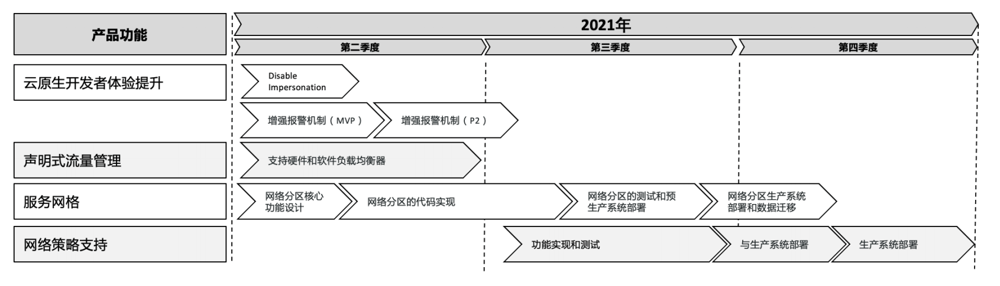

# 基于 k8s 的 devops

### 定义 production  readiness

Function ready VS. production ready

* Function Ready只是交付的软件产品从功能层面满足需求定义
* Production Ready除了功能就绪还包含
  * LnP测试通过，满足性能需求
  * 用户手册完成，用户可按照用户手册使用既定功能
  * 管理手册完成，运维人员可以依照管理手册部署，升级产品并解决现网问题
  * 监控，包括
    * 组件健康状态检查 (UP)
    * 性能指标( Metrics )
    * 基于性能指标，定义 alertrule,在系统故障或缓慢时，发送告警信息给运维人员
    * Assertion,定期测试某功能并检查结果，比如每小时创建 service,测试 vip 连通性

### 理想的 devops

Dev和Ops需要责权划分，可以有overlap,同时做部署,同时做计划,但Dev应侧重功能开发, Ops偏重生产系统运维
Ops参与到版本规划流程中，并为-一个功能能不能release和deploy把关

Dev

* Plan
* Code
* Build
* Test
* Release
* Deploy

Ops

* Deploy
* Operate
* Monitor
* Plan

### 产品愿景

产品愿景的定义有多个目的:

* 统一团队思想，让团队成员知道我们要往哪里去，这有助于让团队专注于交付产品价值。
* 长期愿景往往是有野心的，能对团队成员起到激励作用，比如“业界尖端技术"往往能刺激团队成员努力自我提升。
* 该愿景应该是团队成员的共识，是所有人的共同理想。
* 愿景要产生真正的价值，是真正建立在对当前业务痛点的充分理解基础之上的。

案例：

长期愿景

* 基于业界尖端技术打造下一-代流量管理平台

产品价值

* 节省时间成本，负载均衡上架时间从数月降低到分钟级
* 移除供应商依赖问题，出现生产系统故障不再依赖供应商上门调试
* 构建一套统一模型管理所有业务场景,降低系统集成成本
* 全自动化，减少手工操作，降低维护人力成本
* 故障检测和根因分析能力，快速定位故障，提升可用性

### 产品路线图定义

而项目执行需要有明确时间线的近期目标，因此需要将产品价值转化成可控的产品需求。

产品需求的输入包括新功能和当前产品的功能缺陷等，产品经理需要与核心团队一道定义近期(比如2-3
个季度)的产品核心功能,并定义近期产品版本需要包含的功能。

