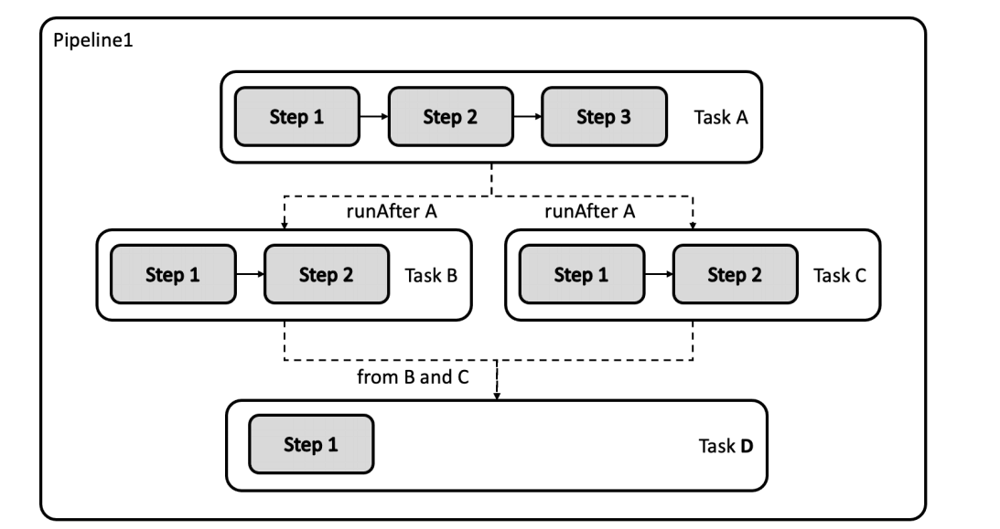
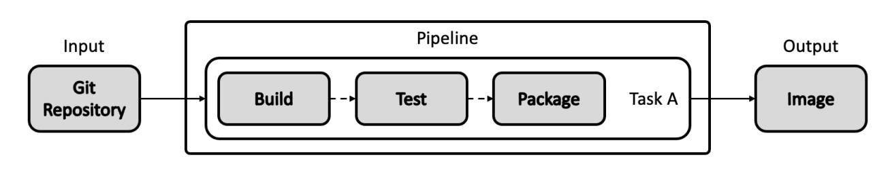
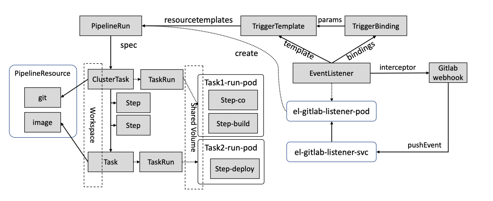

# Tekton

面向云原生的流水线。 

* https://tekton.dev/
* https://github.com/tektoncd

### Jenkins的不足

* 基于脚本的Job配置复用率不足
  * Jenkins等工具的流水线作业通常基于大量不可复用的脚本语言，如何提高代码复用率
* 代码调试困难
  * 如何让流水线作业的配置更好地适应云原生场景的需求越来越急迫

### 基于声明式 API 的流水线-Tekton

* **自定义**：Tekton对象是高度自定义的，可扩展性极强。平台工程师可预定义可重用模块以详细的
  模块目录提供，开发人员可在其他项目中直接引用。
* **可重用**：Tekton对象的可重用性强，组件只需一次定义，即可被组织内的任何人在任何流水线都
  可重用。使得开发人员无需重复造轮子即可构建复杂流水线。
* **可扩展性**：Tekton组件目录(Tekton Catalog)是一个社区驱动的Tekton组件的存储仓库。任何
  用户可以直接从社区获取成熟的组件并在此之.上构建复杂流水线，也就是当你要构建-个流水线
  时，很可能你需要的所有代码和配置都可以从Tekton Catalog直接拿下来复用，而无需重复开发。
* **标准化**：Tekton作为Kubernetes集群的扩展安装和运行,并使用业界公认的Kubernetes资源模型;
  Tekton作业以Kubernetes容器形态执行。
* **规模化支持**：只需增加Kubernetes节点，即可增加作业处理能力。Tekton的能力可依照集群规模
  随意扩充，无需重新定义资源分配需求或者重新定义流水线。

### Tekton核心组件

* Pipeline：对象定义了一个流水线作业，一个 Pipeline 对象 由一个或数个 Task 对象组成。
* Task：一个可独立运行的任务，如获取代码，编译，或者推送镜像等等，当流水线被运行时，k8s 会为每个Task 创建一个 Pod。 一个 Task 由多个 Step 组成，每个 Step 体现为这个 Pod 中的一个容器 

### 输入输出资源

Pipeline 和 Task 对象可以接收 git reposity, pull request 等资源作为输入，可以将 lmage, 
Kubernetes Cluster, Storage，CloudEvent 等对象作为输出。

### 事件触发的自动化流水线

### EventListener

**EventListener**
事件监听器，该对象核心属性是 interceptors 拦截器，该拦截器可监听多种类型的事件，比如监
听来自 GitLab 的 Push 事件。
当该 EventListener 对象被创建以后, Tekton 控制器会为该 EventListener 创建 Kubernetes Pod
和 Service,并启动一个 HTTP 服务以监听 Push 事件。

当用户在 GitLab 项目中设置 webhook 并填写该 EventListener 的服务地址以后,任何人针对被管
理项目发起的 Push 操作，都会被 EventListener 捕获。