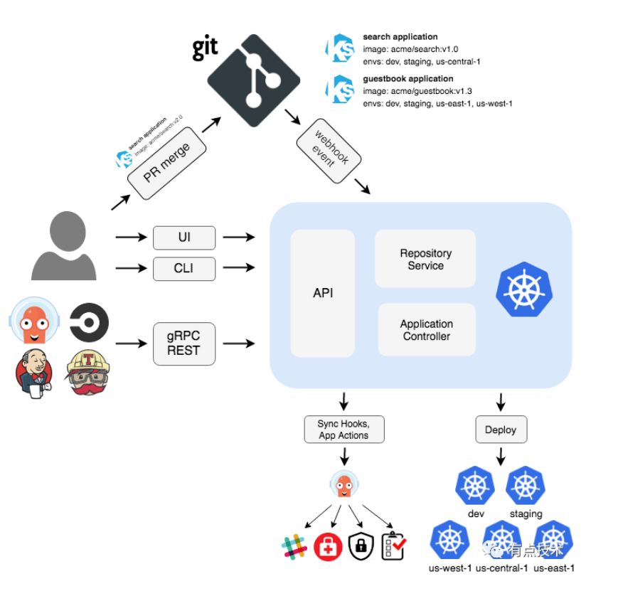

# argocd

### argocd 作用

Argo CD 是用于Kubernetes的声明性GitOps连续交付工具。

**将 k8s 中的 deployment、svc 等等对象的 yaml 提交到 git 仓库进行版本控制，然后由 argocd 进行触发，接收到 push 或者 merge 后 argocd 可能根据仓库里最新的 yaml 文件进行应用部署。**


**为什么选择Argo CD?**

* 应用程序定义，配置和环境应为声明性的，并受版本控制。
* 应用程序部署和生命周期管理应该是自动化的，可审核的且易于理解的。


### argocd 架构

* Argo CD 被实现为 kubernetes 控制器，该控制器连续监视正在运行的应用程序，并将当前的活动状态与所需的目标状态(在Git存储库中指定)进行比较。

* 其活动状态偏离目标状态的已部署应用程序被标记为OutOfSynC。

* Argo CD报告并可视化差异，同时提供了自动或手动将实时状态同步回所需目标状态的功能。

* 在Git存储库中对所需目标状态所做的任何修改都可以自动应用并反映在指定的目标环境中，





### 安装

1）install

```sh
kubectl create namespace argocd
kubectl apply -n argocd -f https://raw.githubusercontent.com/argoproj/argo-cd/stable/manifests/install.yaml
```


2）Update argocd-server service to NodePort

3）Access argocd console

- user: `admin`
- password:
  ```sh
  k get secret -n argocd argocd-initial-admin-secret -oyaml
  ```

Manage repositories->connect repo using https

https://github.com/cncamp/test.git

Create application

- sync policy: `manual`
- path: `.`

Create sync

Scale the deploy by cmd

```sh
k scale deployment httpserver --replicas=2
```

Check appstatus and sync again

Change the sync policy to `auto` and check


### argocd的适用场景

* 低成本的Gitops利器
* 多集群管理
  * 不同目的集群：测试，集成，预生产，生产
  * 多生产集群管理

