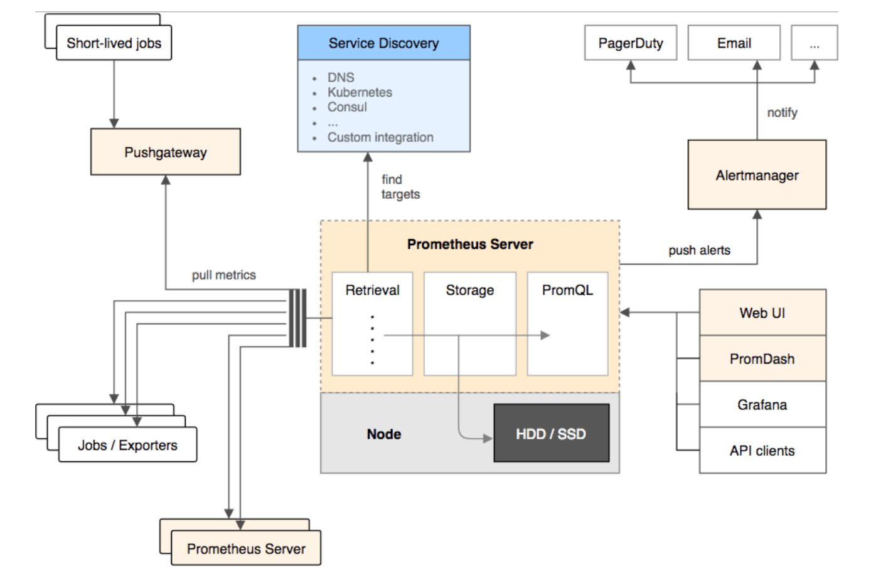

# 监控系统

**为什么监控，监控什么内容?**

* 对自己系统的运行状态了如指掌,有问题及时发现，而不让用户先发现我们系统不能使用。
* 我们也需要知道我们的服务运行情况。例如，slowsql处于什么水平，平均响应时间超过200ms的占比有百分之多少?

**我们为什么需要监控我们的服务?**

* 需要监控工具来提醒我服务出现了故障，比如通过监控服务的负载来决定扩容或缩容。如果机器普遍负载不高，则可以考虑是否缩减一下机器规模， 如果数据库连接经常维持在一一个高位水平，则可以考虑一下是否可以进行拆库处理，优化一下 架构。
* 监控还可以帮助进行内部统制，尤其是对安全比较敏感的行业，比如证券银行等。比如服务器受到攻击时，我们需要分析事件，找到根本原因，识别类似攻击，发现没有发现的被攻击的系统，甚至完成取证等工作。

**监控目的**

* 减少宕机时间
* 扩展和性能管理
* 资源计划
* 识别异常事件
* 故障排除、分析


### Prometheus




### 在 k8s 中汇报指标

需要在 Pod 上声明指标汇报端口和地址

```yaml
apiVersion: V1
kind: Pod
metadata:
  annotations:
    prometheus.io/port: http-metrics #和下面的 prot名字对应
    prometheus.io/scrape: "true" #表明需要汇报指标，prometheus 就会来采集数据
name: loki-0
namespace: default
spec:
  ports:
    - containerPort: 3100
    name: http-metrics #
    protocol: TCP
```

对应的，代码里需要注册 相关的 handler

应用启动时,需要注册metrics

```go
http.Handle("/metrics", promhttp.Handler()) //  prometheus 内置的
http.ListenAndServe(sever.MetricsBindAddress, nil)
```

注册指标

```go
func RegisterMetrics() {
registerMetricOnce.Do(func() {
 // 指定要处理哪些指标
prometheus.MustRegister(APIServerRequests)
prometheus.MustRegister(WorkQueueSize)
})
```

这些指标什么时候进行变化，具体值是什么，需要在代码里处理：

比如在收到一个 HTTP 请求后，调用下面的代码就可以把 request 指标的值 +1

```go
metrics.AddAPIServerRequest(controllerName,
constants.CoreAPIGroup, constants.SecretResource,
constants.Get, cn.Namespace)
```


### Prometheus中的指标类型

* Counter (计数器器)
  * Counter 类型代表- -种样本数据单调递增的指标，即只增不减,除非监控系统发生了重置。

* Gauge (仪表盘)
  * Guage类型代表-种样本数据可以任意变化的指标，即可增可减。
* Histogram (直方图)
  * Histogram 在一段时间范围内对数据进行采样 (通常是请求持续时间或响应大小等)， 并将其计入可配置的存储桶(bucket)中，后续可通过指定区间筛选样本,也可以统计样本总数,最后-般将数据展示为直方图
  * 样本的值分布在bucket中的数量，命名为`<basename>_ bucket{le="<. 上边界> "}`
  * 所有样本值的大小总和，命名为`<basename>_ sum`
  * 样本总数,命名为`<basename>_ count`. 值和`<basename>_ bucket{le=" +Inf"}`相同
* Summary (摘要)
  * 与Histogram类型类似，用于表示- -段时间内的数据采样结果(通 常是请求持续时间或响应大小等)，但它直接存储了分位数(通过客户端计算，然后展示出来)，而不是通过区间来计算
  * 它们都包含了`<basename>_ sum`和`<basename>_ count` 指标
  * Histogram需要通过`< basename>_bucket` 来计算分位数，而Summary则直接存储了分位数的值。


### 开启告警

prometheus 相关配置是使用 configmap 来存储的，我们可以通过编辑该配置来添加告警规则

```bash
kubectl edit configmap loki-prometheus-server
```

告警规则语法如下：

```yaml
groups:
  - name: example
    rules:
      - alert: ContainerKilled # 告警名
        expr: time() - container_last_seen > 60 # 什么情况触发告警
        for: 5m # 持续多久才触发
        labels:
          severity: warning # 告警级别
        annotations:
          summary: 'Container killed (instance {{ $labels.instance }})'
          description: "A container has disappeared\n  VALUE = {{ $value }}\n  LABELS: {{ $labels }}"
```


### 构建支撑生产的监控系统

Metrics

* 收集数据

Alert

* 创建告警规则，如果告警规则被触发,则按不同眼中程度来告警

Assertion

* 以一定时间间隔，模拟客户行为,操作kubernetes对象，并断言成功，如果不成功则按眼中程度告警


### 来自生产系统的经验分享

Prometheus需要大内存和存储

* 最初prometheus经常发生OOM kill
* 在提高指定的资源以后，如果发生crash或者重启，prometheus需 要30分钟以上的时间来读取数据进行初始化

Prometheus是运营生产系统过程中最重要的模块

* 如果prometheus down机，则没有任何数据和告警，管理员两眼一黑，什么都不知道了


## 练习

1）为HTTPServer添加0- 2秒的随机延时
2）为HTTPServer项目添加延时Metric
3）将HTTPServer部署至测试集群，并完成Prometheus配置
4）从Promethus界面中查询延时指标数据

5）(可选)创建一-个Grafana Dashboard展现延时分配情况