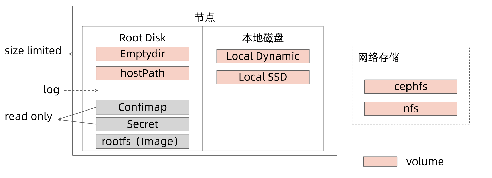
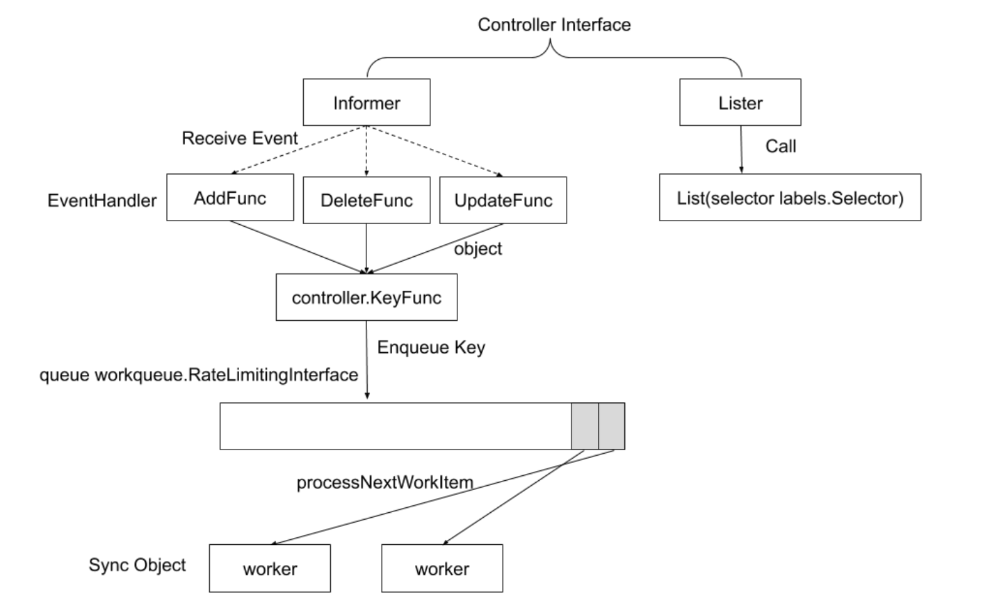

# 应用接入最佳实践


## 应用容器化

### 目标

**稳定性、可用性、性能、安全。**


从多维度思考高可用的问题

**1）单个实例视角**

* 资源需求
* 配置管理
* 数据保存
* 日志和指标收集

**2）应用视角**

* 冗余部署
* 部署多少个实例
* 负载均衡
* 健康检查
* 服务发现
* 监控
* 故障转移
* 扩缩容

**3）安全视角**

* 镜像安全
* 应用安全
* 数据安全
* 通讯安全


### 应用容器化的思考

**1）应用本身**

* 启动速度
* 健康检查
* 启动参数

**2）Dockerfile**

* 用什么基础镜像
  * 基础镜像越小越好
* 需要装什么Utility，lib 越少越好吗?
  * lib 越少越安全，但是需要进行调试时就越麻烦
  * 不过在新版 k8s 中可以使用 debug container 进行调试
* 多少个进程
  * 最理想的状态是，但是总有特殊情况
  * 一个容器多个进程的情况下主次要分清楚，哪个是决定状态的主程序
  * Fork bomb的危害，危险 pod 疯狂 fork 耗光主机 pid，然后这个 pod 会被 evict 到其他 node ，然后再对其他 node 造成伤害，然后依次波及到集群中的所有 node。可以再 kubelet 中配置每个pod最多可以起多少进程。
* 代码(应用程序)和配置分离
  * 配置如何管理
    * 环境变量
    * 配置文件
* 分层的控制
  * 多个命令写在一起减少层数
  * 把不经常变的层放到前面以利用缓存提升构建效率
* Entrypoint


**思考: GOMAXPROCS会如何设置?**

pod spec 里通过 dowardapi 把 spec 里的 request limit 数据以环境变量方式注入到容器中，应用里读取环境变量拿到真实的 cpu 数，然后设置对应的 GOMAXPROCS 值。

uber 提供的一个库 [automaxprocs](https://github.com/uber-go/automaxprocs) 就是做这个事情的，使用时只需要引入该库即可。

```go
package main

import (
    "fmt"
    _ "go.uber.org/automaxprocs"
    "runtime"
)

func main() {
    fmt.Println("real GOMAXPROCS", runtime.GOMAXPROCS(-1))
}
```

同时 uber 还做了相关性能测试，为该容器分配的是 2 核 cpu，具体测试数据如下：

| GOMAXPROCS         | RPS       | P50 (ms) | P99.9 (ms) |
| ------------------ | --------- | -------- | ---------- |
| 1                  | 28,893.18 | 1.46     | 19.70      |
| 2 (equal to quota) | 44,715.07 | 0.84     | 26.38      |
| 3                  | 44,212.93 | 0.66     | 30.07      |
| 4                  | 41,071.15 | 0.57     | 42.94      |
| 8                  | 33,111.69 | 0.43     | 64.32      |
| Default (24)       | 22,191.40 | 0.45     | 76.19      |

可以看到，在设置的 GOMAXPROCS 为 2，即和配额相等时 rps 达到最大值，后续随着 GOMAXPROCS 增加，rps 越来越低，p99.9 则越来越高，说明正确设置 GOMAXPROCS 对程序性能确实是有影响的。


### 容器化额外开销和风险

Log driver

* Blocking mode
  * 日志 buffer 满了会由Log driver 写入到磁盘上，如果写入磁盘这个过程比较慢，就会导致 buffer 经常满，在 block 模块下就会后续的日志打印就会阻塞从而导致应用卡住
* Non blocking mode
  * 该模式下如果 buffer 满了就会丢弃日志，但是不会阻塞应用

共用kernel所以

* 系统参数配置共享
* 进程数共享- Fork bomb
* fd 数共享
* 主机磁盘共享


### 容器化应用的资源监控

在容器化之前很多应用都会监控自己的资源，在不改造的情况下，应用运行到容器里获取到的资源都是主机上的，和实际容器能使用的资源不一致，就会导致各种问题出现。

解决办法：

* 1）判断应用是否运行在容器中
* 2）如果在容器中则使用新的方法来获取对应资源


#### 判断应用是否运行在容器中

容器中看到的资源是主机资源

* Top
* Java runtime.GetAvailableProcesses()
  * 这个在新版本 Java 中已经解决了，老版本还存在
* cat / proc/cpuinfo
* cat /proc/meminfo
* df -k

解决方案

* 查询 /proc/1/cgroup 是否包含 kubepods 关键字(docker关键字不可靠)。
  * 11:cpu,qpuacct:/kubepods.slice/ kubepods-besteffort.slice/ kubepods- besteffort-
    pod521722c3_ 85a8_ 11e9_ 87fc_ _3cfdfe57c998.slice/9568cc0d8ae 182395e1ce172e2cac
    723c4781 a999e89e0f9f10d33af079a56e9
* **包含 kubepods 关键字，则表明是运行在 Kubernetes 之上。**


#### 对应用造成的影响

Java
* Concurrent GC Thread;
* Heap Size;
* 线程数不可控。

Node.js

* 多线程模式启动的 Thread 数量过多，导致OOM Kill。


#### 内存开销

配额

* cat /sys/fs/cgroup/ memory/memory.limit_in_bytes

* 3685477171 2

用量

* cat /sys/fs/cgroup/ memory/memory.usage_in_bytes
* 448450560


#### CPU

**配额**，分配的 CPU 个数= quota / period, quota = -1代表 besteffort

* cat /sys/fs/cgroup/cpu/cpu.cfs_quota_us
  * -1
* cat /sys/fs/cgroup/ cpu/cpu.cfs_period_us
  * 100000

**用量**

* cat /sys/fs/cgroup/cpuacct/cpuacct.usage_percpu (按CPU区分)
  * 140669504971 148500278385 149957919463 152786448674
* cat /sys/fs/cgroup/cpuacct/cpuacct.usage
  * 12081 100465458

#### 其他方案

lxcfs

* 通过so挂载的方式，使容器获得正确的资源信息
* 该方案具体实现也是判断 1 好进程 cgroup 是否有 kubepods 关键字，但是使用 lxcfs 需要每个容器都挂载该文件比较麻烦，不如直接在应用里做

Kata

* VM 中跑 container

Virtlet

* 直接启动VM


## 将应用迁移至Kubernetes

除了对应用本身进行调整之外，k8s 这边也需要一些处理。


### PodSpec

* 初始化需求(init container)
* **需要几个主container**
* 权限? Privilege和Securityontext(PSP)
* **共享哪些Namespace(PID, IPC, NET, UTS, MNT)**
* 配置管理
* 优雅终止]
* 健康检查
  * Liveness Probe
  * Readiness Probe
* DNS策略以及对 resolv.conf 的影响
* imagePullPolicy Image 拉取策略


### Probe误用会造成严重后果

```yaml
 readinessProbe:
        exec:
          command:
            - /opt/rprobe.sh
        initialDelaySeconds: 30
        periodSeconds: 10
        timeoutSeconds: 1
```

在上述配置下，kubelet 每过 10 秒就会执行 /opt/rprobe.sh 进行监控检测（在pod主进程下启动一个子进程来），但是这里超时时间设置比较短，只有1 秒，如果超时了那么 kubelet 就会把启动的 /opt/rprobe.sh 进程 kill 掉，如果pod 主进程没有回收子进程的能力，那么这个子进程就会变成僵尸进程，频繁出现该情况也**会导致宿主机 pid 被耗尽**。


### 如何防止 pid 泄露

单进程容器

合理的处理多进程容器

* 容器的初始化进程必须负责清理fork出来的所有子进程
* 开源方案
  * https://github.com/krallin/tini
  * 采用 Tini 作为容器的初始化进程(PID=1)，容器中僵尸进程的父进程会被置为1

如果不采用特殊初始化进程

* 建议采用 HTTPCheck 作为 Probe
* 为 execProbe 设置合理的超时时间


### 在 k8s 上部署应用的挑战

资源规划

* 每个实例需要多少计算资源
  * CPU/GPU?
  * Memory
* 超售需求
* 每个实例需要多少存储资源
  * 大小
  * 本地还是网盘
  * 读写性能
  * Disk IO
* 网络需求
  * 整个应用总体QPS和带宽


### Pod 的数据管理

* local-ssd: 独占的本地磁盘，独占IO,固定大小，读写性能高。
* Local-dynamic：基于LVM,动态分配空间，效率低。



* 如果只是普通数据可以直接写到 emptydir，emptydir 中的数据生命周期和 Pod 一致
  * emptydir 是有大小限制的，具体由 kubelet 处理，定时检测 emptydir 大小，如果超过限制 Pod 会被驱逐
* hostPath 则是将数据写入到具体 Node 上了，Pod 删除后数据还在，但是需要调度到对应Node才能用
* 如果需要持久化则推荐 local ssd/dynamic 或者 网络存储
* 如果只是配置文件建议使用 configmap 和 secret，或者直接打到镜像里也不是不行，但是不推荐


| 存储卷类型        | 应用进程重启后数据是否存在 | Pod重新调度至其他节点后数据是否存在 | 容量限制      | 注意                                                     |
| ----------------- | -------------------------- | ----------------------------------- | ------------- | -------------------------------------------------------- |
| emptydir          | Yes                        | No                                  | Yes           | 推荐，需要了解 emptydir 的 size limit 行为               |
| hostPath          | Yes                        | No                                  | No            | 需要额外权限，不建议普通应用使用，一般是开放给节点管理员 |
| local ssd/dynamic | Yes                        | No                                  | Yes<br/>Qouta | 无备份                                                   |
| 网络存储          | Yes                        | Yes                                 | Yes<br/>Qouta | 依赖网络存储稳定性                                       |
| 容器 rootfs       | No                         | No                                  | No            | 不要写数据                                               |


### 应用配置

传入方式

* Environment Variables
* Volume Mount

数据来源

* Configmap
* Secret
* Downward API


### 高可用部署

* 需要多少实例?
* 如何控制失败域，部署在几个地区，AZ,集群?
* 如何进行精细的流量控制?
* 如何做按地域的顺序更新?
* 如何回滚?


### PodDisruptionBudget

PDB是为了自主中断时保障应用的高可用。

> 保证 Pod 不会被意外的驱逐掉。


在使用PDB时，你需要弄清楚你的应用类型以及你想要的应对措施:

无状态应用:

* 目标：至少有60%的副本Available。
* 方案：创建 PDB Object, 指定 minAvailable 为 60%，或者 maxUnavailable 为40%。

单实例的有状态应用:

* 目标：终止这个实例之前必须提前通知客户并取得同意。
* 方案：创建PDB Object, 并设置 maxUnavailable 为 0。


多实例的有状态应用:

* 目标：最少可用的实例数不能少于某个数 N，例如 etcd.

* 方案：设置 maxUnavailable=1 或者 minAvailable=N, 分别允许每次只删除一个实例和
  每次删除expected_replicas - minAvailable 个实例。


### 基础架构与应用团队的约束

**应用开发人员针对敏感应用，可定义PDB来确保应用不会被意外中断**

```yaml
apiVersion: policy/v1
kind: PodDisruptionBudget
metadata:
  name: nginx-deployment
spec:
  minAvailable: 1
  selector:
    matchLabels:
      app: nginx
```

**基础架构团队在移除一个节点时，应遵循如下流程**

* 将node置为不可调度

```bash
kubectl cordon <node name>
```


* 执行node drain排空节点，将其上运行的
  Pod平滑迁移至其他节点

```bash
kubectl drain <node name>
```


不能直接 delete pod，而是使用以下 api 来驱逐 pod

> 没有对应的 kubectl 命令，只能调用 api

```bash
curl -v -H 'Content-type: application/json' --key client.key --cert client.crt https://192.168.34.2:6443/api/v1/namespaces/default/pods/nginx-deployment-6799fc88d8-ds499/eviction -d @eviction.json
```

eviction.json 内容如下：

```json
{
  "apiVersion": "policy/v1",
  "kind": "Eviction",
  "metadata": {
    "name": "nginx-deployment-6799fc88d8-ds499",
    "namespace": "default"
  }
}
```

驱逐失败的响应如下
```json
{
"kind": "Status",
"apiVersion": "v1",
"metadata": {}
'status": "Failure",
"message": "Cannot evict pod as it would violate the pod's disruption budget."，
"reason": "TooManyRequests"，
"details": {
    "causes": [
    {
    	"reason": "DisruptionBudget" ,
        "message": "The disruption budget nginx-deployment needs 1 healthy pods and has 1 currently"
	}
    ]
},
"code": 429

```


### 部署方式

* 多少实例
* 更新策略
  * MaxSurge
  * MaxUnavailable (需要考虑ResourceQuota的限制)
* 深入理解PodTemplateHash导致的应用的易变性


### 服务发布

需要把服务发布至集群内部或者外部，服务的不同类型：

* ClusterIP ( Headless)
* NodePort
* LoadBalancer
* ExternalName


证书管理和七层负载均衡的需求

需要gRPC负载均衡如何做?

DNS需求

与上下游服务的关系


### 服务发布的挑战

kube-dns

* DNSTTL问题

Service

* ClusterIP 只能对内
* Kube-proxy支持的iptables/ipvs规模有限
* IPVS的性能和生产化问题
* kube-proxy的drift问题
* 频繁的Pod变动(spec change, failover, crashLoop) 导致LB频繁变更、
* 对外发布的Service需要与企业ELB即成
* 不支持gRPC
* 不支持自定义DNS和高级路由功能

Ingress

* Spec 要 deprecate

其他可选方案?


## 有状态应用

### 有状态应用-operator

创建 Operator 的关键是 CRD (自定义资源)的设计。

Kubernetes对象是可扩展的,扩展的方式有：

**基于原生对象**

* 生成 types 对象,并通过 client-go 生成相应的 clientset，lister , informer。
* 实现对象的 registery backend，即定义( CustomResourceDefinition )为这样对象任何存储进 etcd。
* 注册对象的 scheme 至 apiserver。
* 创建该对象的apiservice生命,注册该对象所对应的api handler。

基于原生对象往往需要通过 aggregation apiserver 把不同对象组合起来。

**基于CRD**

*  在不同应用业务环境下，对于平台可能有一些特殊的需求 ,这些需求可以抽象为 Kubernetes 的扩展资源,而Kubernetes 的 CRD 为这样的需求提供了轻量级的机制,保证新的资源的快速注册和使用。
* 在更老的版本中, TPR( ThirdPartyResource )是与CRD类似的概念，但是在1.9以上的版本中被弃用，而CRD则进入的beta状态。

### 如何使用CRD

用户向 Kubernetes API 服务注册一个带特定 schema 的资源，并定义相关 API

* 注册一系列该资源的实例
* 在Kubernetes的其它资源对象中引用这个新注册资源的对象实例
* 用户自定义的controller例程需要对这个引用进行释义和实施，让新的资源对象达到预期的状态


### 基于CRD的开发过程

**借助 Kubernetes RBAC 和 authentication 机制来保证该扩展资源的 security、access control.
authentication 和 multitenancy。**

将扩展资源的数据存储到 Kubernetes 的 etcd 集群。

借助 Kubernetes 提供的 controller 模式开发框架，实现新的 controller,并借助 APIServer 监听
etcd 集群关于该资源的状态并定义状态变化的处理逻辑。

该功能可以让开发人员扩展添加新功能，更新现有的功能，并且可以自动执行一-些管理任务,这些
自定义的控制器就像Kubernetes原生的组件一样，Operator 直接使用 Kubernetes API 进行开
发，也就是说他们可以根据这些控制器内部编写的自定义规则来监控集群、更改 Pods/Services、
对正在运行的应用进行扩缩容。


### 控制器模式




## FAQ

### kubelet 驱逐 pod 后会留下 excited 状态的 pod 记录

Q：Pod被驱逐了，已经在其他 node 恢复了，但是在当前节点留下了一个 excited 状态的 pod,需要手动删。

A：这个是正常的，kubelet 在驱逐 Pod 后故意留下一个  excited 状态的 pod 记录，便于让管理员知道节点发生过驱逐的情况。 excited 状态的 pod 资源已经全部释放了，只是留了一个 mainfest 记录在。


### pdb与驱逐逻辑

Q：有一个 deploy 有两个 pod，这两个 pod 在同一个 nodeA ,配置 pdb 最小可用为 1,此时 kubectl drain nodeA 会怎么样?

A：会先驱逐一个，第二个由于 pdb 的存在，驱逐不掉，需要等在别的 Node 上重新拉起来一个 Pod 后，才能再次驱逐 NodeA 上的第二个 Pod。

Q：节点内存压力大发生驱逐时，pdb 有用吗？

A：pdb 只对主动驱逐有效，被动驱逐不会看 pdb，所以节点内存压力大发生驱逐时 pdb 是无效的。

