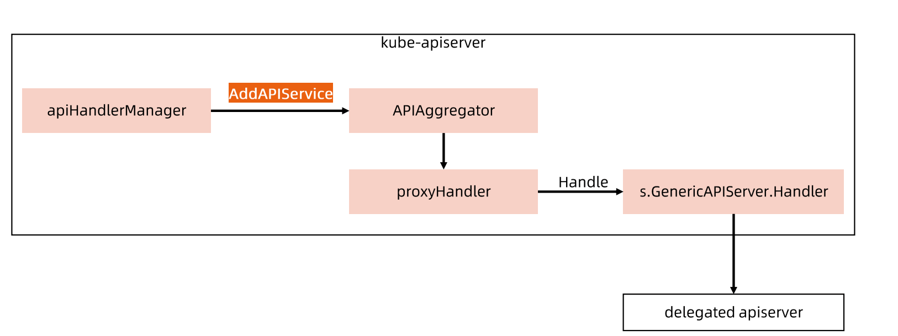
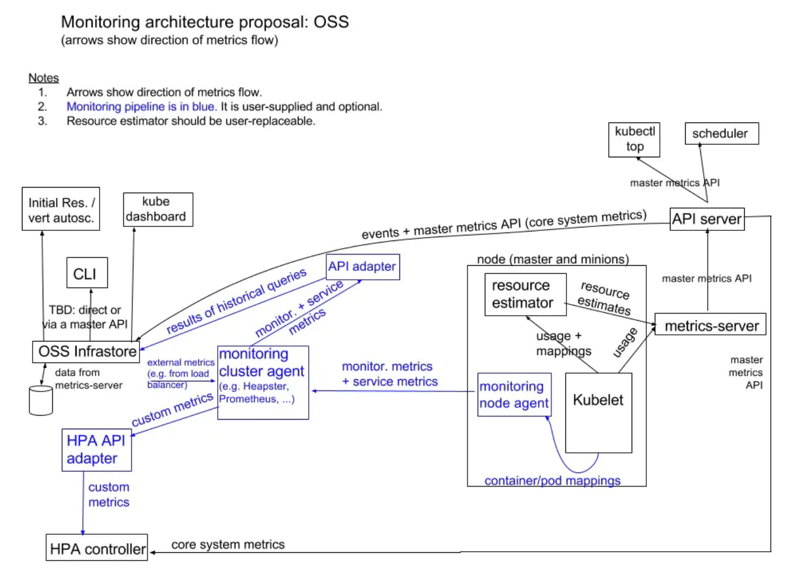

# metric-server

## aggregated-apiserver



在 aggregated-apiserver 模式下，可以把 kube-apiserver 看做是一个代理服务器，通过某些特殊的 url 访问  kube-apiserver 时， kube-apiserver 会把请求转发到外部的 server 来处理。


## metrics-server

**metrics-server 是 Kubernetes 监控体系中的核心组件之一**，它负责从 kubelet 收集资源指标，然后对这些指标监控数据进行聚合(依赖kube-aggregator) ,并在 Kubernetes Apiserver 中通过 Metrics API ( /apis/ metrics.k8s.io/)公开暴露它们，但是 **metrics-server只存储最新的指标数据(CPU/Memory)**

* 你的kube- apiserver要能访问到metrics-server;
* 需要kube-apiserver启用聚合层;
* 组件要有认证配置并且绑定到metrics-server;
* Pod / Node指标需要由Summary API通过kubelet公开。


## monitoring arch

kubectl top 命令获取到的时候其实就是访问 metrics-server 拿到的，而 metrics-server 中的数据又是由 kubelet 上报的，根据这些数据就可以做 hpa。




##  metrics-server 的本质

将指标数据转换成 metrics. k8s.io 的 api 调用返回值，下面两个命令其实是等价的

```bash
k get --raw "/api/v1/nodes/node1/proxy/metrics/resource"
```

```bash
kubectl top node

kubectl top pod 
```
