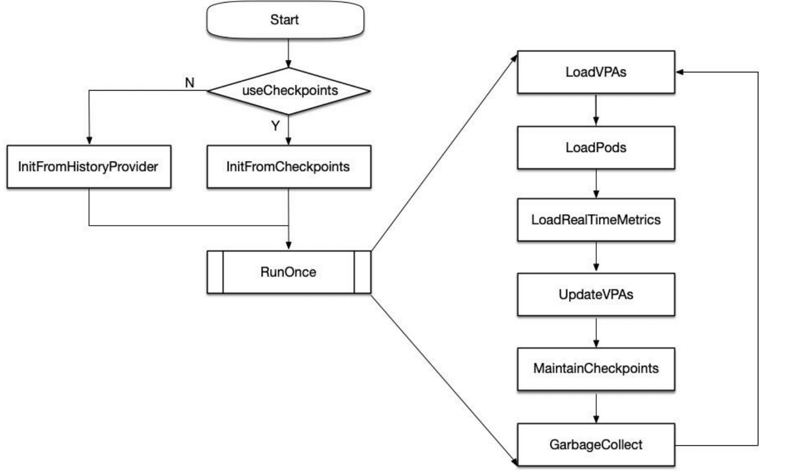

# 自动扩缩容 vpa

## VPA

**VPA 全称 Vertical Pod Autoscaler,即垂直 Pod 自动扩缩容**,它根据容器资源使用率自动设置 CPU 和内存的requests,从而允许在节点上进行适当的调度，以便为每个Pod提供适当的资源。它既可以缩小过度请求资源的容器，也可以根据其使用情况随时提升资源不足的容量。


使用VPA的意义:

* Pod 资源用其所需，提升集群节点使用效率;
* 不必运行基准测试任务来确定 CPU 和内存请求的合适值;
* VPA可以随时调整CPU和内存请求,无需人为操作，因此可以减少维护时间。


注意:
**VPA目前还没有生产就绪，在使用之前需要了解资源调节对应用的影响。**


## VPA架构图


VPA Controller中有两个组件：

* Recommender
* Updater

其中 Recommender 会根据应用当前的资源使用情况以及历史的资源使用情况，计算接下来可能的资源使用阈值，如果计算出的值和当前值不一致则会给出一条资源调整建议。

然后 Updater 则根据这些建议进行调整，具体调整方法为：

* 1）Updater 根据建议发现需要调整，然后调用 api 驱逐 Pod
* 2）Pod 被驱逐后就会重建，然后再重建过程中VPA Admission Controller 会进行拦截，根据 Recommend 来调整 Pod 的资源请求量
* 3）最终Pod重建出来就是按照推荐资源请求量重建的了。

正因为调整资源请求量需要重建 Pod，所以这是一个破坏性的操作，因此 VPA 还没有生产就绪。


## VPA组件

* VPA引入了一种新型的API资源: **VerticalPodAutoscaler**。

* VPA Recommender 监视所有Pod,不断为它们计算新的推荐资源，并将推荐值存储在 VPA 对象中。它使用来自Metrics-Server 的集群中所有Pod 的利用率和 OOM事件。

* 所有Pod创建请求都通过 **VPA Admission Controller**

* VPAUpdater 是负责 Pod 实时更新的组件。如果 Pod 在"Auto"模式下使用 VPA,则 Updater 可以决定使用推荐器资源对其进行更新。
* History Storage 是一个存储组件( 如Prometheus)，它使用来自API Server的利用率信息和 OOM (与推荐器相同的数据)并将其持久存储。
* VPA更新模式:
  * Off
  * Auto


##  VPA工作原理


## Recommenderd 设计理念

**推荐模型(MVP) 假设内存和CPU利用率是独立的随机变量，其分布等于过去N天观察到的变量(推荐值为N=8以捕获每周峰值)。**

* 对于 **CPU**，目标是将容器使用率超过请求的高百分比(例如95%)时的时间部分保持在某个阈值(例如1%的时间)以下。在此模型中，**"CPU 使用率”**被定义为在短时间间隔内测量的平均使用率。测量间隔越短，针对尖峰、延迟敏感的工作负载的建议质量就越高。**最小合理分辨率为1/min,推荐为1/sec**。
* 对于**内存**，目标是将特定时间窗口内容器使用率超过请求的概率保持在某个阈值以下(例如，**24小时内低于1%**)。窗口必须很长(≥24小时)以确保由 OOM 引起的驱逐不会明显影响(a)服务应用程序的可用性(b)批处理计算的进度(更高级的模型可以允许用户指定SLO来控制它)。


### 主要流程




checkPoints 是 VPA 里维护的一个缓存，由于 VPA 依赖过去 N 天的数据，如果外部 prometheus 出问题，VPA 拿不到数据就无法工作了，因此 VPA 会先拿到全部数据，然后自己存一份。


## 滑动窗口与半衰指数直方图


Recommender 的资源推荐算法主要受 Google AutoPilot moving window 推荐器的启发，**假设 CPU 和 Memory消耗是独立的随机变量，其分布等于过去N天观察到的变量分布( 推荐值为N=8以捕获每周业务容器峰值)**。

Rmmender组件获取资源消耗实时数据，存到相应资源对象CheckPoint中。CheckPoint CRD资源本质上是一个直方图。


## 半衰期和权重系数

* 为每个样本数据权重乘上**指数2^((sampleTime - referenceTimestamp) / halfLife)**, 以保证较新的样本被赋予更高的权重，而较老的样本随时间推移权重逐步衰减。
* 默认情况下，**每24h为一个半衰期**,即每经过24h,直方图中所有样本的权重( 重要性)衰减为原来的一半。

* 当指数过大时，referenceTimestamp就需要向前调整，以避免浮点乘法计算时向，上溢出。
  * CPU使用量样本对应的权重是基于容器CPU request值确定的。当CPU request增加时，对应的权重也随之增加。
  * 而Memory使用量样本对应的权重固定为1.0。


## VPA的不足

* **VPA的成熟度还不足**
* 更新正在运行的Pod资源配置是VPA的一项试验性功能，会导致Pod的重建和重启，而且有可能被调度到其他的节点上。
* **VPA不会驱逐没有在副本控制器管理下的Pod**。 目前对于这类Pod, Auto模式等同于Initial模式。
* 目前VPA不能和监控CPU和内存度量的Horizontal Pod Autoscaler (HPA) 同时运行,除非HPA只监控其他定制化的或者外部的资源度量。

* VPA使用admission webhook作为其准入控制器。如果集群中有其他的admission webhook,需要确保它们不会与VPA发生冲突。准入控制器的执行顺序定义在APIServer的配置参数中。
* VPA会处理出现的绝大多数 OOM (Out Of Memory)的事件，但不保证所有的场景下都有效。
* VPA的性能还没有在大型集群中测试过。
* VPA对Pod资源requests的修改值可能超过实际的资源上限，例如节点资源上限、空闲资源或资源配额，从而造成Pod处于Pending状态无法被调度。同时使用集群自动伸缩(ClusterAutoscaler)可以一定程度上解决这个问题。
* 多个VPA同时匹配同一个Pod会造成未定义的行为。


## Demo

vpa.yaml

```yaml
# This config creates a deployment with two pods, each requesting 100 millicores
# and trying to utilize slightly above 500 millicores (repeatedly using CPU for
# 0.5s and sleeping 0.5s).
# It also creates a corresponding Vertical Pod Autoscaler that adjusts the
# requests.
# Note that the update mode is left unset, so it defaults to "Auto" mode.
---
apiVersion: "autoscaling.k8s.io/v1"
kind: VerticalPodAutoscaler
metadata:
  name: hamster-vpa
spec:
  # recommenders field can be unset when using the default recommender.
  # When using an alternative recommender, the alternative recommender's name
  # can be specified as the following in a list.
  # recommenders:
  #   - name: 'alternative'
  targetRef:
    apiVersion: "apps/v1"
    kind: Deployment
    name: hamster
  resourcePolicy:
    containerPolicies:
      - containerName: '*'
        minAllowed:
          cpu: 100m
          memory: 50Mi
        maxAllowed:
          cpu: 1
          memory: 500Mi
        controlledResources: ["cpu", "memory"]
---
apiVersion: apps/v1
kind: Deployment
metadata:
  name: hamster
spec:
  selector:
    matchLabels:
      app: hamster
  replicas: 2
  template:
    metadata:
      labels:
        app: hamster
    spec:
      securityContext:
        runAsNonRoot: true
        runAsUser: 65534 # nobody
      containers:
        - name: hamster
          image: k8s.gcr.io/ubuntu-slim:0.1
          resources:
            requests:
              cpu: 100m
              memory: 50Mi
          command: ["/bin/sh"]
          args:
            - "-c"
            - "while true; do timeout 0.5s yes >/dev/null; sleep 0.5s; done"
```


Clone the code

```sh
git clone https://github.com/kubernetes/autoscaler.git
```

Install vpa

```sh
cd vertical-pod-autoscaler
./hack/vpa-up.sh
```

Test vpa

```sh
kubectl apply -f vpa.yaml
```

Recommmender run once per min, updater run once per min

Check updater parameter for rate limit config

Updater flows


1. Get all pods->

2. Get live pods->

3. Get pods managed by vpa && evictable ->

4. Add to updater queue->

5. If `(within recommend range && no oom) || (oom but resourcediff==0)` -> no update

   else pods enqueue with priority->

6. Sort by priority ->

7. Kill with ratelimit configured in command line parameter


