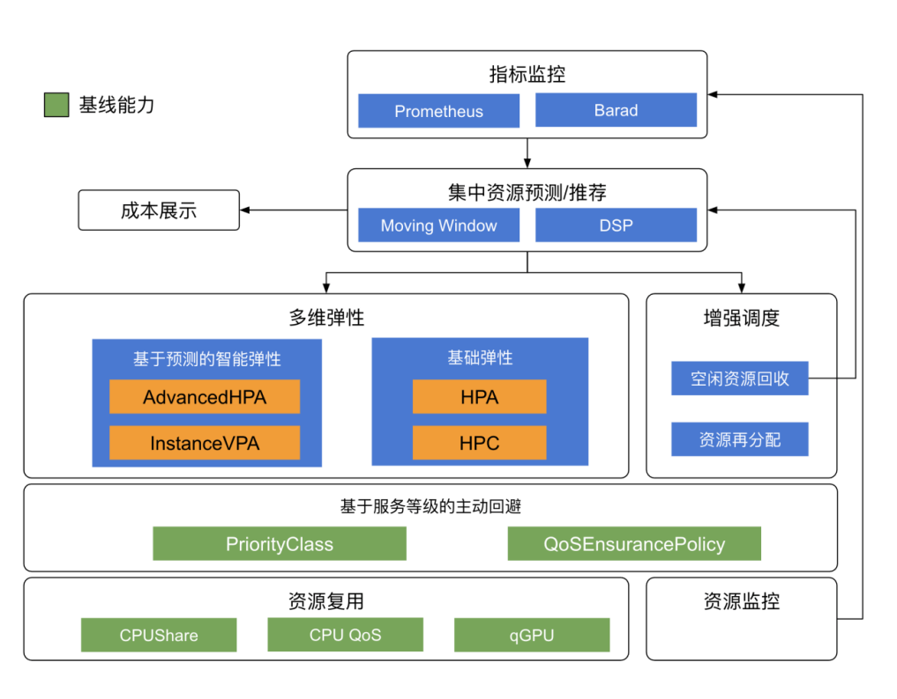

# 如何解决社区基础弹性能力不足的问题

## 弹性的意义

| 目标 | 方法     | 流程   | 工具                                           |
| ---- | -------- | ------ | ---------------------------------------------- |
| 增效 | 研发效能 | Devops | Continuous Integration & Continuous Deployment |
| 降本 | 资源效能 | FinOps | Cloud Resource Analytics and Economics         |

##  成本优化的关键路径

* **成本是业务稳定性跟资源利用率的矛盾**
  * 大多数稳定性都是由冗余换来的
* **成本还是企业内不同组织/角色的矛盾**
  * 业务团队VS资源团队
* **成本是业务投入跟技术投入的矛盾**
  * 就一个人力，投入业务还是投入优化
* **云业务的去中心化部署和运维为成本管理带来挑战**
  * 可以通过技术手段和组织手段减少矛盾

## Finops 流程

* **Inform**：观测各个业务资源占用情况
* **Optimize**：根据观测到的数据给出优化建议
* **Operate**：根据优化建议调整

## gocrane

gocrane 能力矩阵

* 成本可视化
* 成本优化
* 成本分析
* 成本预测
* 成本分配
* 资源回收再利用
* 弹性
* 服务分级和混合部署
* 质量保证

## crane 高层架构

Predictor 驱动整个生态系统

* 成本趋势展示
* 基于预测的资源回收与再分配
* 基于预测的智能弹性

基线能力

* 基于业务优先级的主动回避
  

