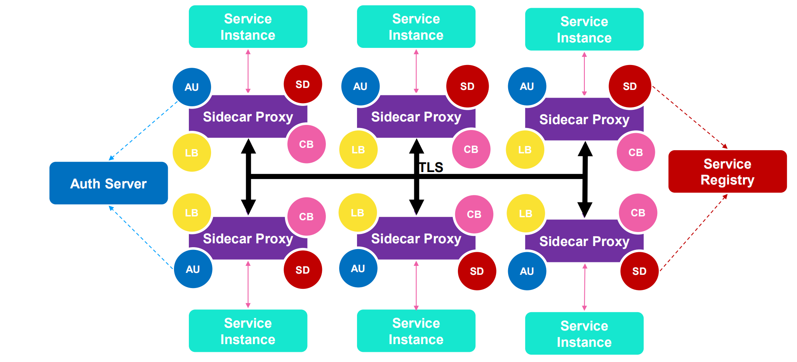

# Service Mesh

### 什么是 Service Mesh？

Service Mesh 把认证鉴权、服务发现、负载均衡、熔断等通用能力整合到 Sidecar 里，让业务专注于业务本身。

AU:Auth

SD：server discover

LB：LoadBalance

CB：circuit breaker

### 通用能力

适应性

* 熔断
* 重试
* 超时处理
* 失败处理
* 负载均衡
* Failover

服务发现

* 路由

安全和访问控制

* TLS 和证书控制

可观测性

* Metrics
* 监控
* 分布式日志
* 分布式 Tracing

部署

* 容器

通讯

* HTTP
* Websocket
* gRPC
* TCP

### 优劣

优势

* 将基础架构逻辑从业务代码抽离
  * 分布式 Tracing
  * 日志
* 自由选择技术栈
* 帮助业务开发部门只关注业务逻辑

劣势

* 复杂化
  * 更多的运行实例
* 可能带来额外的网络跳转
  * 每一个服务调用都要经过 sidecar
* 解决了一部分问题，同时要付出代价
  * 依然要处理复杂路由，类型映射，与外部系统整合等方面问题
* 不解决业务逻辑或服务整合，服务组合等问题

## 为什么需要 Service Mesh / Istio？

当前说的 Service Mesh 一般就是指 Istio。

* HTTP、gRPC、WebSocket 和TCP流量的自动负载均衡。
* 通过丰富的路由规则、重试、故障转移和故障注入，可以对流量行为进行细粒度控制。
* 可插入的策略层和配置API，支持访问控制、速率限制和配额。
* 对出入集群入口和出口中所有流量的自动度量指标、日志记录和跟踪。
* 通过强大的基于身份的验证和授权，在集群中实现安全的服务间通信。

## Istio 能力

### 流量管理

**连接**

通过简单的规则配置和流量路由，可以控制服务之间的流量和API调用。Istio 简化了断路器、超时和重试等服务级别属性的配置，并且可以轻松设置A/B测试、金丝雀部署和基于百分比的流量分割的分阶段部署等重要任务。

**控制**

通过更好地了解流量和开箱即用的故障恢复功能，可以在问题出现之前先发现问题，使调用更可靠，并且使您的网络更加强大一无 论您面临什么条件。

### 安全

* **使开发人员可以专注于应用程序级别的安全性**。Istio提供底层安全通信信道，并大规模管理服务通信的认证、授权和加密。使用lstio,服务通信在默认情况下是安全的，它允许跨多种协议和运行时一致地实施策略所有这些都很少或根本不需要应用程序更改。

* **虽然lstio与平台无关，但将其与Kubernetes ( 或基础架构)网络策略结合使用，其优势会更大，包括在网络和应用层保护Pod间或服务间通信的能力。**

### 可观测性

Istio 生成以下类型的遥测数据，以提供对整个服务网格的可观察性：

* **指标**：lstio 基于4个监控的黄金标识(延迟、流量、错误、饱和)生成了一系列服务指标。Istio还为网格控制平面提供了更详细的指标。除此以外还提供了- -组默认的基于这些指标的网格监控仪表板

* **分布式追踪**：Istio 为每个服务生成分布式追踪span,运维人员可以理解网格内服务的依赖和调用流程。

* **访问日志**：当流量流入网格中的服务时，Istio 可以生成每个请求的完整记录,包括源和目标的元数据。此信息使运维人员能够将服务行为的审查控制到单个工作负载实例的级别。

**所有这些功能可以更有效地设置、监控和实施服务上的SLO，快速有效地检测和修复问题。**

### Istio 架构演进

数据平面

* 由一组以Sidecar方式部署的智能代理(Envoy) 组成。这些代理可以调节和控制微服务及Mixer之间所有的网络通信。

控制平面

* 负责管理和配置代理来路由流量。此外控制平面配置Mixer以实施策略和收集遥测数据。

架构演进

* 从微服务回归单体

最初架构设计过于理想化，从架构上来说是完美的，但是对运维排查问题、版本升级等来说过于复杂。因此最终多个组件合并了，回归单体应用。

同时移除了过于复杂的 miner 组件，添加了 Galley 组件。

### 设计目标

**最大化透明度**

* Istio将自身自动注入到服务间所有的网络路径中，运维和开发人员只需付出很少的代价就可以从中受益。
* lstio 使用Sidecar代理来捕获流量,并且在尽可能的地方自动编程网络层， 以路由流量通过这些代理,而无需对已部署的应用程序代码进行任何改动。
* 在Kubernetes中，代理被注入到Pod中，通过编写iptables规则来捕获流量。注入Sidecar代理到Pod中并且修改路由规则后，Istio就能够调解所有流量。
* 所有组件和API在设计时都必须考虑性能和规模。

**增量**

* 预计最大的需求是扩展策略系统，集成其他策略和控制来源，并将网格行为信号传播到其他系统进行分析。
  策略运行时支持标准扩展机制以便插入到其他服务中。

**可移植性**

* 将基于Istio的服务移植到新环境应该是轻而易举的，而使用Istio将- -个服务同时部署到多个环境中也是
  可行的(例如，在多个云上进行冗余部署)。

**策略一致性**

* 在服务间的API调用中，策略的应用使得可以对网格间行为进行全面的控制，但对于无需在API级别表达的资源来说，对资源应用策略也同样重要。
* 因此，策略系统作为独特的服务来维护，具有自己的API,而不是将其放到代理/sidecar中，这容许服务根据需要直接与其集成。

