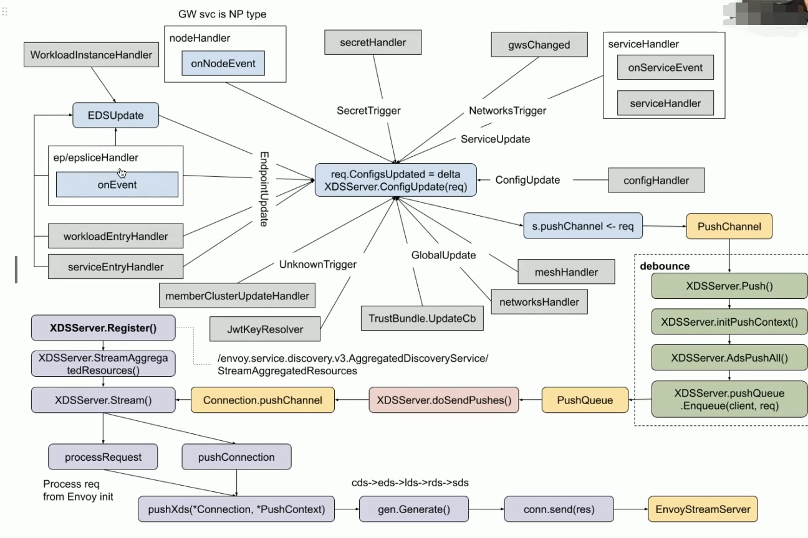
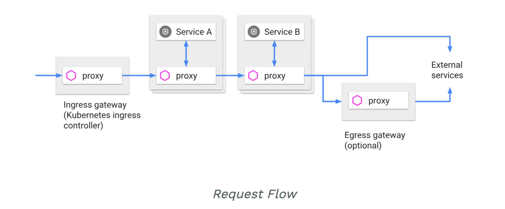
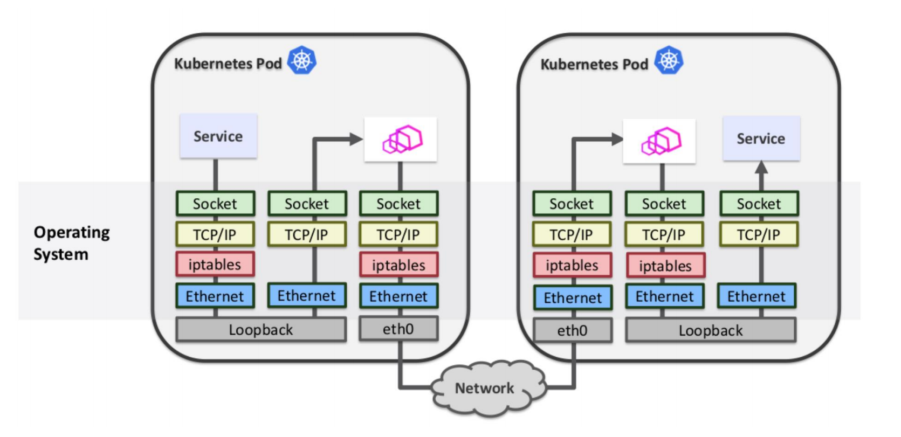
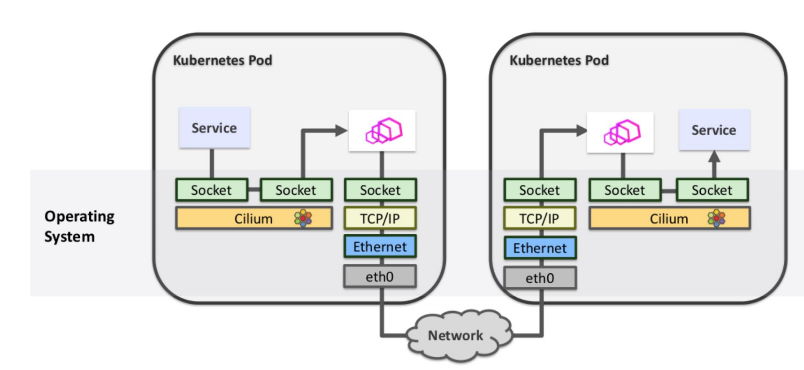

# Istio 流量管理

相关对象：

* Gateway
* VirtualService
* DestinationRule
* ServieEntry
* WorkloadEntry
* Sidecar


### Istio 的流量拦截机制

**为用户应用注入Sidecar**

* 自动注入
* 手动注入
  * istioctl kube-inject -f yaml/istio-bookinfo/ bookinfo.yaml

**注入后的结果**

* 注入了init-container istio-init
  * istio-iptables -p 15001 -z 15006-u 1337 -m REDIRECT-i * -X -b 9080 -d 15090,15021,15020
* 注入了sidecar container istio-proxy


### init container

**将应用容器的所有流量都转发到 Envoy 的 15001 端口。**

* 使用 istio-proxy 用户身份运行，UID 为 **1337**，即 Envoy 所处的用户空间，这也是 istio-proxy 容器默认使用的用户，见 YAML 配置中的 runAsUser 字段。
  * iptables 中会对 owner uid 为 1337 的流量特殊处理
* 使用默认的 REDIRECT 模式来重定向流量。将所有出站流量都重定向到 Envoy 代理。将所有访问 9080 端口( 即应用容器 productpage 的端口)的流量重定向到 Envoy 代理。


iptables 规则如下：

```text
//所有入站TCP流量走ISTIO INBOUND
-A PREROUTING -p tcp -j ISTIO_INBOUND

//所有出站TCP流量走ISTIO OUTPUT
-A OUTPUT -p tcp -j ISTIO_OUTPUT

//忽略ssh，health check等端口
-A ISTIO_INBOUND -p tcp -m tcp --dport 22 -j RETURN
-A ISTIO_INBOUND -p tcp -m tcp --dport 15090 -j RETURN
-A ISTIO_INBOUND -p tcp -m tcp --dport 15021 j RETURN
-A ISTIO_INBOUND -p tcp -m tcp --dport 15020 j RETURN

//所有入站TCP流量走ISTIO IN_REDIRECT
-A ISTIO_INBOUND -p tcp j ISTIO_IN_REDIRECT

// TCP流量转发至15006端口
-A ISTIO_IN_REDIRECT -p tcp j REDIRECT --to-ports 15006

// loopback passthrough
-A ISTIO_OUTPUT -s 127.0.0.6/32 -o lo j RETURN

//从loopback口出来,目标非本机地址, owner是envoy ,交由ISTIO_IN_REDIRECT处理
-A ISTIO_OUTPUT ! -d 127.0.0.1/32 -0 lo -m owner --uid-owner 1337 -j ISTIO_IN_REDIRECT

//从lo口出来, owner非envoy，return
-A ISTIO_ OUTPUT -0 lo -m owner ! --uid-owner 1337 j RETURN

// owner是envoy , return
-A ISTIO OUTPUT -m owner --uid-owner 1337 -j RETURN
-A ISTIO OUTPUT ! -d 127.0.0.1/32 -0 lo -m owner --gid-owner 1337 -j ISTIO_IN_REDIRECT
-A ISTIO _OUTPUT -o lo -m owner ! --gid -owner 1337 -j RETURN
-A ISTIO_ OUTPUT -m owner --gid-owner 1337 -j RETURN
-A ISTIO_ OUTPUT -d 127.0.0.1/32 -j RETURN

//如以上规则都不匹配,则交给ISTIO _REDIRECT处理
-A ISTIO_OUTPUT -j ISTIO_REDIRECT

-A ISTIO_REDIRECT -p tcp j REDIRECT --to-ports 15001

```


### Sidecar container

**Istio 会生成以下监听器**

* 0.0.0.0:15001上的监听器接收进出 Pod 的所有流量，然后将请求移交给虚拟监听器。
* 每个 service IP 一个虚拟监听器，每个出站 TCP/HTTPS 流量一个非 HTTP 监听器。
* 每个 Pod 入站流量暴露的端口一个虚拟监听器。
* 每个出站 HTTP 流量的 HTTP 0.0.0.0 端口一个虚拟监听器。


istio 提供了一个 configdump的接口，可以查看当前 istio 中的所有配置

```bash
curl localhost:15000/config_dump
```

不过内容会比较多，不容易查看

可以使用 istioctl 单独查看需要的配置信息,比如

```bash
istioctl proxy-config listeners productpage-v1-8b96c8794-bttdd -n bookinfo --port 15001 -ojson
```

> istioctl 和 config_dump 差不多，不过 istioctl 会对结果进行过滤，只返回用户关心的部分配置


我们的请求时找到 9080 的出站请求，这意味着它被切换到 0.0.0.0:9080 虚拟监听器。然后，此监听器在其配置的 RDS 中查找路由配置。在这种情况下它将查找由 Pilot 配置的 RDS 中的路由 9080（通过 ADS）。

```bash
istioctl proxy-config listeners productpage-v1-8b96c8794-bttdd -n bookinfo --port 9080 --address 0.0.0.0 -ojson 
```


**9080 路由配置仅为每个服务提供虚拟主机**。我们的请求正在前往 reviews 服务，因此 Envoy 将选择我们的请求与域匹配的虚拟主机。一旦在域上匹配,Envoy 会查找与请求匹配的第一条路径。在这种情况下，我们没有任何高级路由，因此只有一条路由匹配，所有内容。

这条路由告诉 Envoy 将请求发送到 outboundl9080llreviews.default.svc.cluster.local 集群。

```bash
istioctl proxy-config routes productpage-v1-8b96c8794-bttdd --name 9080 -o json -n bookinfo
```


### Istio envoy 配置更新流程

下图描述了 istio 如何 watch k8s 中的对象变更，并把对象信息推送到各个 sidecar 中的 envoy 的。




Istio 会 watch 多种 k8s 对象的变化，每次变化都会导致 envoy 配置更新，为了不过于频繁的下发配置，Istio 进行了取舍，将所有变更写入 PushChannel，由 debounce 从该 channel 中取出变更后进行 merge，每 100ms 下发一次，相当于是将 100ms 中的所有变更 merge 成了一个，然后下发，通过这种方式来降低压力。

debounce 将 merge 好的变更写入 PushQueue，因为一个 Istiod 会面多成百上千的 sidecar，因此为每个 envoy 弄了一个 connection.pushChannel，每个连接过来都会有一个单独的 pushChannel，然后把变化单独推送到不同的 envoy。

每个 envoy 和 istiod 都会建立一个双向的 grpc stream，初始化时 envoy 通过 processRequest 向 istiod 请求完成的配置，初始化完成后则由 istiod 每 100ms 将配置变更通过 pushConnection 方法推送给 envoy，其实和 infomrer 机制比较相似。

不管是 processRequest  还是 pushConnection 都会经过 pushXds 的这个方法，这个方法最后会调用 gen.Generate 方法，该方法就会真正的把 k8s 中的对象变化的信息转换为 envoy 中的 xds 配置，比如 cds，eds，lds 等等，最终发送到 envoy 的就是 xds 数据了。

> 这里使用的时候 ADS 进行下发，因此有一定的顺序，按照 cds>eds>lds>rds>sds这个顺序进行组装，全部完成后就会发送到 envoy。


小结：istiod watch k8s 中的各个对象的变化，比如 Service，endpoint 等，将这些信息转换成 xds 数据后下发给 envoy，因此在集群中的 pod新建或者删除后 envoy 可以及时更新配置。


### 请求路由

**特定网格中服务的规范表示由 Pilot 维护**。服务的 Istio 模型和在底层平台(Kubernetes、 Mesos 以及Cloud Foundry等)中的表达无关。特定平台的适配器负责从各自平台中获取元数据的各种字段，然后对服务模型进行填充。

**Istio 引入了服务版本的概念，可以通过版本(v1、 v2)或环境(staging、 prod)对服务进行进一步的细分**。这些版本不一定是不同的API版本:它们可能是部署在不同环境(prod、 staging或者dev等)中的同一服务的不同迭代。使用这种方式的常见场景包括A/B测试或金丝雀部署。
**Istio的流量路由规则可以根据服务版本来对服务之间流量进行附加控制。**


### 服务之间的通讯

**服务的客户端不知道服务不同版本间的差异**。它们可以使用服务的主机名或者IP地址继续访问服务。Envoy sidecar/代理拦截并转发客户端和服务器之间的所有请求和响应。

Istio还为同一服务版本的多个实例提供流量负载均衡。可以在服务发现和负载均衡中找到更多信息。

Istio不提供DNS。**应用程序可以尝试使用底层平台(kube-dns、mesos-dns等)中存在的 DNS 服务来解析FQDN**。


### Ingress 和 Egress

**lstio 假定进入和离开服务网络的所有流量都会通过 Envoy 代理进行传输。**

通过将 Envoy 代理部署在服务之前，运维人员可以针对面向用户的服务进行A/B测试、部署金丝雀服务等。

类似地，通过使用 Envoy 将流量路由到外部 Web 服务(例如，访问 MapsAPI 或视频服务 API )的方式，运维人员可以为这些服务添加超时控制、重试、断路器等功能，同时还能从服务连接中获取各种细节指标。




### 服务发现和负载均衡

**Istio 负载均衡服务网格中实例之间的通信。**

Istio 假定存在服务注册表，以跟踪应用程序中服务的 pod/VM。它还假设服务的新实例自动注册到服务注册表，并且不健康的实例将被自动删除。诸如 Kubernetes、Mesos 等平台已经为基于容器的应用程序提供了这样的功能。为基于虚拟机的应用程序提供的解决方案就更多了。

Pilot 使用来自服务注册的信息，并提供与平台无关的服务发现接口。网格中的Envoy实例执行服务发现，并相应地动态更新其负载均衡池。

网格中的服务使用其 DNS 名称访问彼此。服务的所有 HTTP 流量都会通过 Envoy 自动重新路由。Envoy 在负载均衡池中的实例之间分发流量。**虽然Envoy支持多种复杂的负载均衡算法,但 Istio 目前仅允许三种负载均衡模式：轮循、随机和带权重的最少请求。**

**除了负载均衡外，Envoy还会定期检查池中每个实例的运行状况。**Envoy 遵循熔断器风格模式,根据健康检查 API 调用的失败率将实例分类为不健康和健康两种。当给定实例的健康检查失败次数超过预定阈值时，将会被从负载均衡池中弹出。类似地，当通过的健康检查数超过预定阈值时,该实例将被添加回负载均衡池。您可以在处理故障中了解更多有关 Envoy 的故障处理功能。

**服务可以通过使用 HTTP 503 响应健康检查来主动减轻负担。在这种情况下，服务实例将立即从调用者的负载均衡池中删除。**


### 故障处理

* 超时处理
* 基于超时预算的重试机制
* 基于并发连接和请求的流量控制
* 对负载均衡器成员的健康检查
* 细粒度的熔断机制，可以针对 Load Balance Pool 中的每个成员设置规则


### 微调

**Istio 的流量管理规则允许运维人员为每个服务/版本设置故障恢复的全局默认值。**然而，服务的消费者也可以通过特殊的 HTTP 头提供的请求级别值覆盖超时和重试的默认值。在 Envoy 代理的实现中，对应的 Header 分别是 x-envoy-upstream-rq-timeout-ms 和 x-envoy-max-retries。


### 故障注入

**为什么需要错误注入**

* 微服务架构下，需要测试端到端的故障恢复能力。

Istio 允许在网络层面按协议注入错误来模拟错误，无需通过应用层面删除 Pod,或者人为在 TCP 层造成网络故障来模拟。

**注入的错误可以基于特定的条件，可以设置出现错误的比例**

* Delay-提高网络延时;
* Aborts-直接返回特定的错误码。


### 规则配置

* **VirtualService**在 Istio 服务网格中定义路由规则，控制路由如何路由到服务上。
  * 对应 Envoy 中的 Route
* **DestinationRule**是 VirtualService 路由生效后，配置应用与请求的策略集。
* **ServiceEntry**是通常用于在 Istio 服务网格之外启用对服务的请求。
* **Gateway**为 HTTP/TCP 流量配置负载均衡器，最常见的是在网格的边缘的操作，以启用应用程序的入口流量。
  * 对应 Envoy 中的 listener
  * 定义在哪些 gateway pod 里启动哪些 listener
  * istio 里的 gateway pod 跑的也是 Envoy


#### VirtualService

**是在Istio服务网格内对服务的请求如何进行路由控制。**


#### DestinationRule

**路由规则对应着一或多个用 VirtualService 配置指定的请求目的主机。**


这些主机可以是也可以不是实际的目标负载，甚至可以不是同一网格内可路由的服务。例如要给到 reviews 服务的请求定
义路由规则，可以使用内部的名称 reviews,也可以用域名 bookinfo.com, VirtualService 可以定义这样的 host 字段:

```yaml
hosts:
- reviews
- bookinfo.com
```

host 字段用显示或者隐式的方式定义了一或多个完全限定名(FQDN) 。上面的 reviews, 会隐式的扩展成为特定的 FQDN,例如在Kubernetes 环境中，全名会从 VirtualService 所在的集群和命名空间中继承而来( 比如说 reviews. default.svc.cluster.local)。


### 流量镜像

mirror 规则可以使 Envoy 截取所有request,并在转发请求的同时，将 request 转发至 Mirror 版本同时在 Header 的 Host/Authority 加上-shadow。
**这些 mirror 请求会工作在 fire and forget 模式，所有的 response 都会被废弃。**

```yaml
mirror:
  host: httpbin
  subset: v2
```


### 规则委托

类似于 nginx 的配置文件，可以 include 别的配置文件进来，从而避免写一个超级大的文件。

Istio 的 VirtualService 也可以通过 delegate 机制实现该功能，匹配某些规则的请求交给指定 namespace 下的指定 name 的 VirtualService 处理。

```yaml
apiVersion: networking.istio.io/v1alpha3
kind: VirtualService
metadata:
  name: worker-pool
spec:
  hosts:
  - worker-pool.default.svc.cluster.local
  http:
    - name: "route 1"
      match:
        - headers:
            customer-id:
              exact: alice
      delegate:
        name: worker-for-alice
        namespace: nsA
    - name: "route 2"
      match:
        - headers:
            customer-id:
              exact: bob
      delegate:
        name: worker-for-bob
        namespace: nsB
```


```yaml
apiVersion: v1
kind: Service
metadata:
  name: worker-for-alice
   namespace: nsA
  labels:
    app: worker-for-alice
    service: worker-for-alice
spec:
  ...
---
apiVersion: networking.istio.io/v1alpha3
kind: VirtualService
metadata:
  name: worker-for-bob
  namespace: nsB
spec:
  http:
  - route:
    - destination:
        host: worker-for-alice
```


### 优先级

**当对同一目标有多个规则时，会按照在 VirtualService 中的顺序进行应用，换句话说，列表中的第一条规则具有最高优先级。**

当对某个服务的路由是完全基于权重的时候，就可以在单一规则中完成。另一方面，如果有多重条件(例如来自特定用户的请求)用来进行路由，就会需要不止一条规则。这样就出现了优先级问题，需要通过优先级来保证根据正确的顺序来执行规则。常见的路由模式是提供一或多个高优先级规则，这些优先规则使用源服务以及Header来进行路由判断，然后才提供--条单独的基于权重的规则，这些低优先级规则不设置匹配规则，仅根据权重对所有剩余流量进行分流。


### 目标规则

**在请求被 VirtualService 路由之后， DestinationRule 配置的一系列策略就生效了。**

这些策略由服务属主编写，包含断路器、负载均衡以及 TLS 等的配置内容。

```yaml
apiVersion: networking.istio.io/v1alpha3
kind: DestinationRule
metadata:
  name: reviews
spec:
  host: reviews
  subsets:
    - name: v1
      labels:
        version: v1
      trafficPolicy:
        connectionPool:
          tcp:
            maxConnections: 100
```


#### 断路器

可以用一系列的标准，例如连接数和请求数限制来定义简单的断路器。
可以通过定义 outlierDetection 自定义健康检查模式。


### ServiceEntry

**Istio 内部会维护一个服务注册表，可以用 ServiceEntry 向其中加入额外的条目**。通常这个
对象用来启用对 Istio 服务网格之外的服务发出请求。

ServiceEntry 中使用 hosts 字段来指定目标，字段值可以是一个完全限定名，也可以是个通配符域名。其中包含的白名单，包含一或多个允许网格中 服务访问的服务。

**只要 ServiceEntry 涉及到了匹配 host 的服务，就可以和 VirtualService 以及 DestinationRule 配合工作。**


### Gateway

**Gateway 为 HTTP/TCP 流量配置了一个负载均衡，多数情况下在网格边缘进行操作,用于启用一个服务的入口(ingress) 流量。**

和 Kubernetes Ingress 不同，Istio Gateway 只配置四层到六层的功能(例如开放端口或者TLS配置)。绑定一个 VirtualService 到 Gateway 上，用户就可以使用标准的 Istio 规则来控制进入的 HTTP 和 TCP 流量。


### 遥测

基本Metrics 针对HTTP，HTTP/2和GRPC协议，Istio 收集以下指标。

* 请求数
* 请求处理时长
* 请求包大小
* 响应包大小

针对 TCP 协议Istio 收集以下指标： 

* 发送的数据响应包总大小
* 接收到的数据包大小
* TCP 连接数
* 关闭的 TCP 连接数


## 跟踪采样

### 跟踪采样配置

Istio 默认捕获所有请求的跟踪。例如，何时每次访问时都使用上面的 Bookinfo 示例应用程序 /productpage 你在 Jaeger 看到了相应的痕迹仪表板。此采样率适用于测试或低流量目。

* 在运行的网格中，编辑 istio-pilot 部署并使用以下步骤更改环境变量:

```bash
istioctl upgrade --set values.global.tracer.zipkin.address=jaeger-collector:9411
```


### 应用程序埋点

**虽然 Istio 代理能够自动发送 Span 信息,但还是需要一些辅助手段来把整个跟踪过程统一起来。**

应用程序应该自行传播跟踪相关的 HTTP Header,这样在代理发送 Span 信息的时候，才能正确的把同一个跟踪过程统一起来。为了完成跟踪的传播过程，应用应该从请求源头中收集下列的 HTTP Header,并传播给外发请求：

* x-request-id
* x-b3-traceid
* x-b3-spanid
* x-b3-parentspanid
* x-b3-sampled
* x-b3-flags
* x-ot-span-context


### Service Mesh 涉及的网络栈



可以看到每次请求都需要在 real service 和 envoy sidecar 之间进行一次转发，肯定是对性能有损耗的。

可以使用 cilium 进行数据平面加速，具体如下：



> 数据显示大致有 5%~20% 的性能提升，具体和很多因素有关，因此区间比较大。


## 小结

**微服务架构是当前业界普遍认可的架构模式，容器的封装性，隔离性为微服务架构的兴盛提供了有力的保障。**

Kubernetes 作为声明式集群管理系统,代表了分布式系统架构的大方向：

* kube-proxy 本身提供了基于 iptables/ipvs 的四层 Service Mesh方案;
* Istio/linkerd 作为基于 Kubernetes 的七层 Service Mesh 方案，近期会有比较多的生产部署案例。
  * Istio 复杂但是功能强，linkerd 功能弱但是比较简单

生产系统需要考虑的，除了 Service Mesh 架构带来的便利性，还需要考虑：

* 配置一致性检查
  * 比如控制面更新转发规则后，如果没有推送到全部的 envoy，可能就会造成服务无法访问的请求。
  * 
  * 因为 Istio 也是和 k8s 一样走的最终一致性，某些对一致性需求比较强的场景可能需要额外处理，比如使用 istioctl 命令查看是否同步完成，长时间未同步完成则进行告警等操作。
* endpoint 健康检查
* 海量转发规则情况下的 scalability
  * 比如集群里有 几万 Service 几十万 Pod，这种情况下 istio 开销特别大，可以通过 exportTo 来设置可见性
  * 

