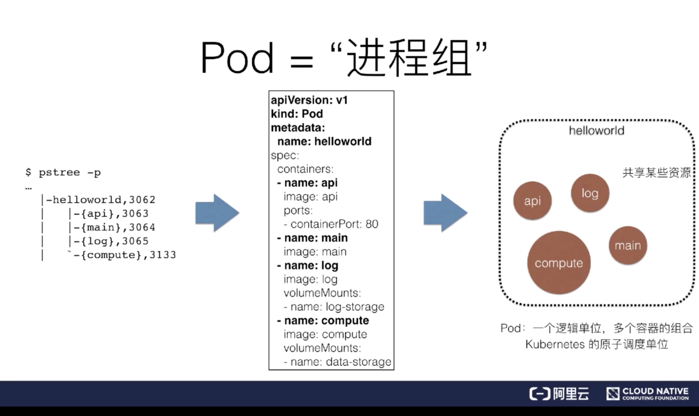

# Pod 容器设计模式

## 一、概述

### 1. Pod

**容器的本质实际上是一个进程，是一个视图被隔离，资源受限的进程。**

很多人都说 Kubernetes 是云时代的操作系统，这个非常有意思，因为如果以此类推，容器镜像就是这个操作系统的软件安装包，它们之间是这样的一个类比关系。

Linux 系统中，我们的程序可能会由多个线程组构成。比如我们有一个 Helloworld 应用，由四个线程组成的，分别是 **{api、main、log、compute}**，那么如何在容器中运行呢？

当然，最自然的一个解法就是，我现在就启动一个 Docker 容器，里面运行四个进程。可是这样会有一个问题，这种情况下容器里面 PID=1 的进程该是谁? 比如说，它应该是我的 main 进程，那么问题来了，“谁”又负责去管理剩余的 3 个进程呢？

**但是由于容器实际上是一个“单进程”模型**，所以如果你在容器里启动多个进程，只有一个可以作为 PID=1 的进程，而这时候，如果这个 PID=1 的进程挂了，或者说失败退出了，那么其他三个进程就会自然而然的成为孤儿，没有人能够管理它们，没有人能够回收它们的资源，这是一个非常不好的情况。

> 注意：Linux 容器的“单进程”模型，指的是容器的生命周期等同于 PID=1 的进程（容器应用进程）的生命周期，而不是说容器里不能创建多进程。当然，一般情况下，容器应用进程并不具备进程管理能力，所以你通过 exec 或者 ssh 在容器里创建的其他进程，一旦异常退出（比如 ssh 终止）是很容易变成孤儿进程的。

反过来，其实可以在容器里面 run 一个 systemd，用它来管理其他所有的进程。这样会产生第二个问题：实际上没办法直接管理我的应用了，因为我的应用被 systemd 给接管了，那么这个时候应用状态的生命周期就不等于容器生命周期。这个管理模型实际上是非常非常复杂的。

### 2. Pod = “进程组”

在 kubernetes 里面，Pod 实际上正是 kubernetes 项目为你抽象出来的一个可以类比为进程组的概念。

前面提到的，由四个进程共同组成的一个应用 Helloworld，在 Kubernetes 里面，实际上会被定义为一个拥有四个容器的 Pod。

> Google 工程师发现在 Borg 下面部署应用时，很多场景下都存在着类似于“进程与进程组”的关系。更具体的是，这些应用之前往往有着密切的协作关系，使得它们必须部署在同一台机器上并且共享某些信息。

### 3. 为什么 Pod 必须是原子调度单位？

两个容器的资源需求是这样的：

* App 容器需要 1G 内存
* LogCollector 需要 0.5G 内存

而当前集群环境的可用内存是这样一个情况：

* Node_A：1.25G 内存
* Node_B：2G 内存。

假如说现在没有 Pod 概念，就只有两个容器，这两个容器要紧密协作、运行在一台机器上。可是，如果调度器先把 App 调度到了 Node_A 上面，接下来会怎么样呢？

这时你会发现：LogCollector 实际上是没办法调度到 Node_A 上的，因为资源不够。其实此时整个应用本身就已经出问题了，调度已经失败了，必须去重新调度。

以上就是一个非常典型的成组调度失败的例子。英文叫做：**Task co-scheduling 问题**,当然在很多项目里也有对应的解决方案

比如说在 Mesos 里面，它会做一个事情，叫做**资源囤积（resource hoarding）**：即当所有设置了 Affinity 约束的任务都达到时，才开始统一调度，这是一个非常典型的成组调度的解法。

> 所以上面提到的“App”和“LogCollector”这两个容器，在 Mesos 里面，他们不会说立刻调度，而是等两个容器都提交完成，才开始统一调度。这样也会带来新的问题，首先调度效率会损失，因为需要等待。由于需要等还会有外一个情况会出现，就是产生死锁，就是互相等待的一个情况。这些机制在 Mesos 里都是需要解决的，也带来了额外的复杂度。

另一种解法是 Google 的解法。它在 Omega 系统（就是 Borg 下一代）里面，做了一个非常复杂且非常厉害的解法，叫做**乐观调度**。比如说：不管这些冲突的异常情况，先调度，同时设置一个非常精妙的回滚机制，这样经过冲突后，通过回滚来解决问题。这个方式相对来说要更加优雅，也更加高效，但是它的实现机制是非常复杂的。

而像这样的一个 Task co-scheduling 问题，在 Kubernetes 里，就直接通过 Pod 这样一个概念去解决了。因为在 Kubernetes 里，这样的一个 App 容器和 LogCollector 容器一定是属于一个 Pod 的，它们在调度时必然是以一个 Pod 为单位进行调度，所以这个问题是根本不存在的。

### 4. 再次理解 Pod

首先 Pod 里面的容器是**超亲密关系**。

> 这里有个“超”字需要大家理解，正常来说，有一种关系叫做亲密关系，这个亲密关系是一定可以通过调度来解决的。

* **亲密关系 - 调度解决**
  * 两个应用需要运行再同一台宿主机
* **超亲密关系 - Pod 解决**
  * 会发生直接的文件交换
  * 使用localhost或者Socket文件进行本地通信
  * 会发生非常频繁的RPC调用
  * 会共享某些Linux Namespace
  * ...

## 二. Pod 的实现机制

因为容器之间原本是被 Linux Namespace 和 cgroups 隔开的，所以现在实际要解决的是怎么去打破这个隔离，然后共享某些事情和某些信息。这就是 Pod 的设计要解决的核心问题所在。

**所以说具体的解法分为两个部分：网络和存储。**

### 1.共享网络

在 Kubernetes 里的解法是这样的：**它会在每个 Pod 里，额外起一个 Infra container 小容器来共享整个 Pod 的 Network Namespace**。

Infra container 是一个非常小的镜像，大概 100~200KB 左右，是一个汇编语言写的、永远处于“暂停”状态的容器。由于有了这样一个 Infra container 之后，其他所有容器都会通过 Join Namespace 的方式加入到 Infra container 的 Network Namespace 中。

所以说一个 Pod 里面的所有容器，它们看到的网络视图是完全一样的。即：它们看到的网络设备、IP地址、Mac地址等等，跟网络相关的信息，其实全是一份，这一份都来自于 Pod 第一次创建的这个 Infra container。这就是 Pod 解决网络共享的一个解法。

### 2.共享存储

Pod 共享存储就相对比较简单,实际上就是把 volume 变成了 Pod level。然后所有容器，就是所有同属于一个 Pod 的容器，他们共享所有的 volume。

## 三、详解容器设计模式

### InitContainer

### Sidecar

什么是 Sidecar？就是说其实在 Pod 里面，可以定义一些专门的容器，来执行主业务容器所需要的一些辅助工作，比如我们前面举的例子，其实就干了一个事儿，这个 Init Container，它就是一个 Sidecar，它只负责把镜像里的 WAR 包拷贝到共享目录里面，以便被 Tomcat 能够用起来。

## 4. 小结

- Pod 是 Kubernetes 项目里实现“容器设计模式”的核心机制；
- “容器设计模式”是 Google Borg 的大规模容器集群管理最佳实践之一，也是 Kubernetes 进行复杂应用编排的基础依赖之一；
- 所有“设计模式”的本质都是：解耦和重用。
