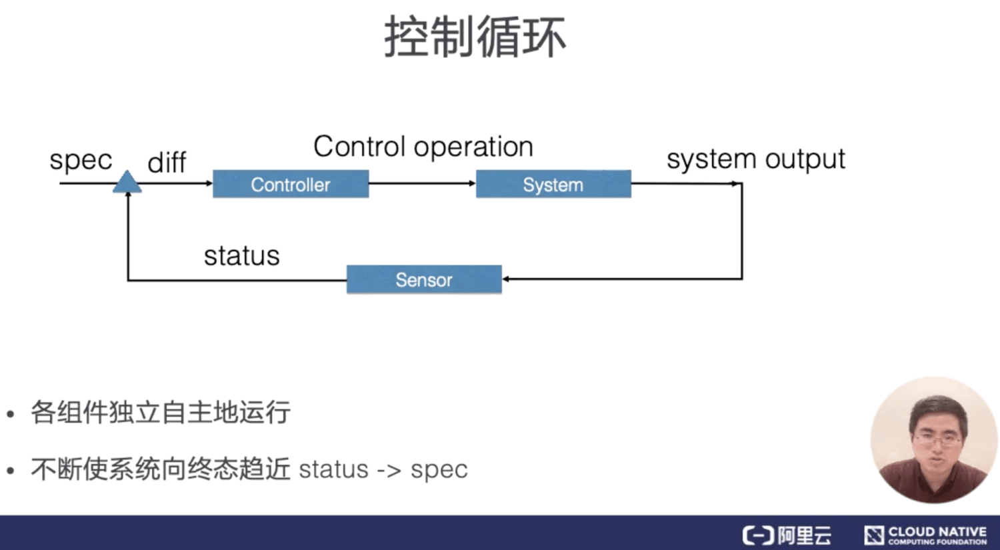
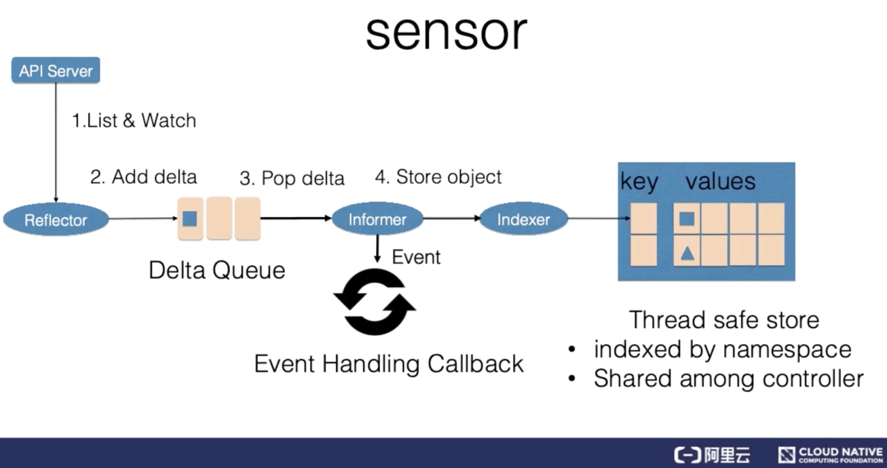

# 资源元信息

## 一、资源元信息

### 资源对象

Kubernetes 的资源对象组成：主要包括了 Spec、Status 两部分。

* 其中 Spec 部分用来描述期望的状态
* Status 部分用来描述观测到的状态。

除此之外还有另外一个部分，即元数据部分：

* Labels：用来识别资源的标签
* Annotations： 用来描述资源的注解
* OwnerReference：用来描述多个资源之间相互关系的


#### labels

第一个元数据，也是最重要的一个元数据是：**资源标签**。资源标签是一种具有标识型的 Key：Value 元数据，这里展示了几个常见的标签。

几个简单的例子：

```yaml
env: dev
disk: ssd
release: stable
```


标签主要用来筛选资源和组合资源，可以使用类似于 SQL 查询 select，来根据 Label 查询相关的资源。


####  Selector

* 相等型 Selector
  * 单个：key: value
  * 多个：key1: value1,key2: value2
* 集合型 Selector
  * in：Key in (value1,value2)
  * notin：Key notin (value1,value2)


#### Annotations

另外一种重要的元数据是：annotations。**一般是系统或者工具用来存储资源的非标示性信息，可以用来扩展资源的 spec/status 的描述**。

> Annotations 中可以包括空格，逗号等特殊符号，甚至直接指定成一个 json 字符串，labels 则不行。


#### Ownereference

 Ownereference 即所有者，一般就是指集合类的资源，比如说 Pod 集合，就有 replicaset、statefulset。

集合类资源的控制器会创建对应的归属资源。比如：replicaset 控制器在操作中会创建 Pod，被创建 Pod 的 Ownereference 就指向了创建 Pod 的 replicaset，Ownereference 使得用户可以方便地查找一个创建资源的对象，另外，还可以用来实现级联删除的效果。

> 就是 Pod 被 replicaset 进行管理，所以 Pod 的所有者就是 replicaset。


### 2. 演示

#### label

通过`--show-labels`选项来查看 Pod 上的标签

```shell
kubectl get pods --show-labels
```

也可以直接查看详细信息

```shell
kubectl get pods nginx1 -o yaml | less
```


新增/修改标签

```shell
kubectl label pods nginx1 env=test
# 修改的话必须带上 --overwrite 选项
kubectl label pods nginx1 env=test --overwrite
```


删除标签

> 如果想要对 Pod 去掉一个标签，也是跟打标签一样的操作，但是 env 后就不是等号了。只加上 label 名字，后面不加等号，改成用减号表示去除 label 的 k:v；

```shell
# 减号-表示删除的意思，这条命令就是删除 nginx pod 上的 tie 标签
kubectl label pods nginx tie-
```


通过`-l`参数指定 selector

```shell
# 查询带有env=test标签的pod
kubectl get pods —show-labels -l env=test
# 多个匹配条件，查询同时带有 env=dev和tie=front标签的 pod
kubectl get pods —show-labels -l env=dev,tie=front

# 集合型selector in操作 注意需要带引号
kubectl get pods —show-labels -l ’env in (dev,test)’
```


#### annotate

使用 annotate 命令添加注解。

```shell
kubectl annotate pods nginx1 my-annotate=‘my annotate,ok’
```


## 二、控制器模式

### 1、控制循环

控制型模式最核心的就是控制循环的概念。在控制循环中包括了控制器，被控制的系统，以及能够观测系统的传感器，三个逻辑组件。

当然这些组件都是逻辑的，外界通过修改资源 spec 来控制资源，控制器比较资源 spec 和 status，从而计算一个 diff，diff 最后会用来决定执行对系统进行什么样的控制操作，控制操作会使得系统产生新的输出，并被传感器以资源 status 形式上报，控制器的各个组件将都会是独立自主地运行，不断使系统向 spec 表示终态趋近。





#### Sensor

控制循环中逻辑的传感器主要由 Reflector、Informer、Indexer 三个组件构成。



Reflector 通过 List 和 Watch K8s server 来获取资源的数据。List 用来在 Controller 重启以及 Watch 中断的情况下，进行系统资源的全量更新；而 Watch 则在多次 List 之间进行增量的资源更新；Reflector 在获取新的资源数据后，会在 Delta 队列中塞入一个包括资源对象信息本身以及资源对象事件类型的 Delta 记录，Delta 队列中可以保证同一个对象在队列中仅有一条记录，从而避免 Reflector 重新 List 和 Watch 的时候产生重复的记录。


Informer 组件不断地从 Delta 队列中弹出 delta 记录，然后把资源对象交给 indexer，让 indexer 把资源记录在一个缓存中，缓存在默认设置下是用资源的命名空间来做索引的，并且可以被 Controller Manager 或多个 Controller 所共享。之后，再把这个事件交给事件的回调函数。

控制循环中的控制器组件主要由事件处理函数以及 worker 组成，事件处理函数之间会相互关注资源的新增、更新、删除的事件，并根据控制器的逻辑去决定是否需要处理。对需要处理的事件，会把事件关联资源的命名空间以及名字塞入一个工作队列中，并且由后续的 worker 池中的一个 Worker 来处理，工作队列会对存储的对象进行去重，从而避免多个 Woker 处理同一个资源的情况。


### 2、命令式 API VS 声明式API

命令式 API 存在以下问题：

* 命令 API 最大的一个问题在于错误处理；

在大规模的分布式系统中，错误是无处不在的。一旦发出的命令没有响应，调用方只能通过反复重试的方式来试图恢复错误，然而盲目的重试可能会带来更大的问题。

* 实际上许多命令式的交互系统后台往往还会做一个巡检的系统，用来修正命令处理超时、重试等一些场景造成数据不一致的问题；

然而，因为巡检逻辑和日常操作逻辑是不一样的，往往在测试上覆盖不够，在错误处理上不够严谨，具有很大的操作风险，因此往往很多巡检系统都是人工来触发的。

* 最后，命令式 API 在处理多并发访问时，也很容易出现问题；

假如有多方并发的对一个资源请求进行操作，并且一旦其中有操作出现了错误，就需要重试。那么最后哪一个操作生效了，就很难确认，也无法保证。

* 相对的，声明式 API 系统里天然地记录了系统现在和最终的状态。

不需要额外的操作数据。另外因为状态的幂等性，可以在任意时刻反复操作。在声明式系统运行的方式里，正常的操作实际上就是对资源状态的巡检，不需要额外开发巡检系统，系统的运行逻辑也能够在日常的运行中得到测试和锤炼，因此整个操作的稳定性能够得到保证。


### 3、控制器模式总结

1. Kubernetes 所采用的控制器模式，是由声明式 API 驱动的。确切来说，是基于对 Kubernetes 资源对象的修改来驱动的；
2. Kubernetes 资源之后，是关注该资源的控制器。这些控制器将异步的控制系统向设置的终态驱近；
3. 这些控制器是自主运行的，使得系统的自动化和无人值守成为可能；
4. 因为 Kubernetes 的控制器和资源都是可以自定义的，因此可以方便的扩展控制器模式。特别是对于有状态应用，我们往往通过自定义资源和控制器的方式，来自动化运维操作。这个也就是后续会介绍的 operator 的场景。


## 4. 小结

- Kubernetes 资源对象中的元数据部分，主要包括了用来识别资源的标签：Labels， 用来描述资源的注解；Annotations， 用来描述多个资源之间相互关系的 OwnerReference。这些元数据在 K8s 运行中有非常重要的作用；
- 控制型模式中最核心的就是控制循环的概念；
- 两种 API 设计方法：声明式 API 和命令式 API ；Kubernetes 所采用的控制器模式，是由声明式 API 驱动的；