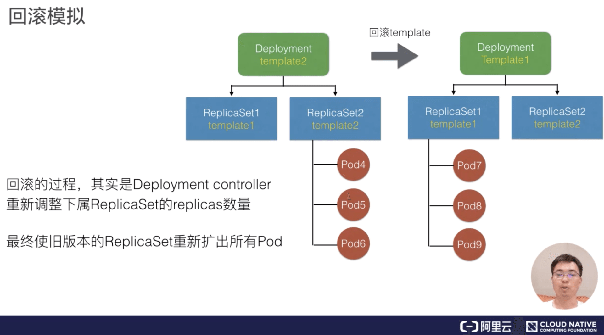

# Deployment

## 1. 概述

 Deployment 能帮我们做什么事情呢？

1）首先，Deployment 定义了一种 Pod 期望数量，比如说应用 A，我们期望 Pod 数量是四个，那么这样的话，controller 就会持续维持 Pod 数量为期望的数量。当我们与 Pod 出现了网络问题或者宿主机问题的话，controller 能帮我们恢复，也就是新扩出来对应的 Pod，来保证可用的 Pod 数量与期望数量一致；

 2）配置 Pod 发布方式，也就是说 controller 会按照用户给定的策略来更新 Pod，而且更新过程中，也可以设定不可用 Pod 数量在多少范围内；

3）如果更新过程中发生问题的话，即所谓“一键”回滚，也就是说你通过一条命令或者一行修改能够将 Deployment 下面所有 Pod 更新为某一个旧版本 。


Deployment 创建出来的 Pod 的命名格式：

```shell
${deployment-name}-${template-hash}-${random-suffix}
```

比如：nginx-deployment-123456789-ck974。

最前面一段：nginx-deployment，其实是 Pod 所属 Deployment.name；

中间一段：template-hash

最后一段，是一个 random 的字符串


### 更新镜像

更新镜像的命令如下：

```shell
$ kubectl set image deployment.v1.apps/nginx-deployment nginx=nginx:1.9.1
```

命令分析

* set image：固定写法，表示更新镜像
* deployment.v1.apps：资源类型，固定写法，也可以简写成 deployment，这样默认就会有 v1版本和apps组
* nginx-deployment：要更新的 deployment 名字
* nginx：要更新的容器名字，因为一个Pod里可能存在多个容器
* nginx:1.9.1：新的镜像以及版本号


### 快速回滚

如果我们在发布过程中遇到了问题，也支持快速回滚。

通过 kubectl 执行的话，其实是“kubectl rollout undo”这个命令，可以回滚到 Deployment 上一版本；

通过“rollout undo”加上“to-revision”来指定可以回滚到某一个具体的版本。


回滚Deployment到上一个版本

```shell
$ kubectl rollout undo deployment/nginx-deployment
```

回滚Deployment到指定版本（需要先查询版本列表）

```shell
# 先查询历史版本 deployment中的revisionHistoryLimit用于指定保留的历史版本数
$ kubectl rollout history deployment.v1.apps/nginx-deployment
# 然后回滚到指定版本
$ kubectl rollout undo deployment.v1.apps/nginx-deployment --to-resivsion=2
```


### DeploymentStatus

每一个资源都有它的 spec.Status，Deployment 也不例外。

deploymentStatus 中描述的三个其实是它的 conversion 状态，也就是**Processing、Complete 以及 Failed**。


* Processing：处理中，正在扩容或者发布
* Complete：处理完成，正常状态的Pod数达到目标值
* Failed：处理失败，拉镜像失败、健康检测失败等等

> 需要注意的是这3个状态会不断进行转换的。

Processing 指的是 Deployment 正在处于扩容和发布中。比如说 Processing 状态的 deployment，它所有的 replicas 及 Pod 副本全部达到最新版本，而且是 available，这样的话，就可以进入 complete 状态。而 complete 状态如果发生了一些扩缩容的话，也会进入 processing 这个处理工作状态。

failed 状态指在处理过程中遇到一些问题：比如说拉镜像失败了，或者说 readiness probe 检查失败了。

 complete 状态则是 deployment 的期望状态，Pod数和replica数一致且都是最新版本。

如果在 complete 状态时发生了一些 pod readiness probe 检查失败，这个时候 deployment 也会进入 failed 状态。进入 failed 状态之后，除非所有点 replicas 均变成 available，而且是 updated 最新版本，deployment 才会重新进入 complete 状态。


## 2. 架构设计

* Deployment只负责管理不同版本的ReplicaSet,由ReplicaSet管理Pod副本数
* 每个ReplicaSet对应了Deployment template的一个版本
* 一个ReplicaSet下的Pod都是相同的版本

即：Deployment 创建 ReplicaSet，而 ReplicaSet 创建 Pod。他们的 OwnerRef 其实都对应了其控制器的资源。


### Deployment控制器


首先，我们所有的控制器都是通过 Informer 中的 Event 做一些 Handler 和 Watch。

这个地方 Deployment 控制器，其实是关注 Deployment 和 ReplicaSet 中的 event，收到事件后会加入到队列中。

而 Deployment controller 从队列中取出来之后，它的逻辑会判断 **Check Paused**，这个 Paused 其实是 Deployment 是否需要新的发布，如果 Paused 设置为 true 的话，就表示这个 Deployment 只会做一个数量上的维持，不会做新的发布。

如上图，可以看到如果 Check paused 为 Yes 也就是 true 的话，那么只会做 Sync replicas。也就是说把 replicas sync 同步到对应的 ReplicaSet 中，最后再 Update Deployment status，那么 controller 这一次的 ReplicaSet 就结束了。

那么如果 paused 为 false 的话，它就会做 Rollout，也就是通过 Create 或者是 Rolling 的方式来做更新，更新的方式其实也是通过 Create/Update/Delete 这种 ReplicaSet 来做实现的。


### ReplicaSet 控制器


当 Deployment 分配 ReplicaSet 之后，ReplicaSet 控制器本身也是从 Informer 中 watch 一些事件，这些事件包含了 ReplicaSet 和 Pod 的事件。从队列中取出之后，ReplicaSet controller 的逻辑很简单，就只管理副本数。也就是说如果 controller 发现 replicas 比 Pod 数量大的话，就会扩容，而如果发现实际数量超过期望数量的话，就会删除 Pod。

上面 Deployment 控制器的图中可以看到，Deployment 控制器其实做了更复杂的事情，包含了版本管理，而它把每一个版本下的数量维持工作交给 ReplicaSet 来做。


### 模拟

#### 扩容模拟

Deployment的副本数由ReplicaSet管理
修改Deployment replicas之后，controller会把replicas同步到当前版本的ReplicaSet中，由ReplicaSet执行扩容/缩容。

  

#### 发布模拟

我们再模拟一下发布，发布的情况会稍微复杂一点。这里可以看到 Deployment 当前初始的 template，比如说 template1 这个版本。template1 这个 ReplicaSet 对应的版本下有三个 Pod：Pod1，Pod2，Pod3。

  

这时修改 template 中一个容器的 image， Deployment controller 就会新建一个对应 template2 的 ReplicaSet。创建出来之后 ReplicaSet 会逐渐修改两个 ReplicaSet 的数量，比如它会逐渐增加 ReplicaSet2 中 replicas 的期望数量，而逐渐减少 ReplicaSet1 中的 Pod 数量。

 

那么最终达到的效果是：新版本的 Pod 为 Pod4、Pod5和Pod6，旧版本的 Pod 已经被删除了，这里就完成了一次发布。


#### 回滚模拟

来看一下回滚模拟，根据上面的发布模拟可以知道 Pod4、Pod5、Pod6 已经发布完成。这时发现当前的业务版本是有问题的，如果做回滚的话，不管是通过 rollout 命令还是通过回滚修改 template，它其实都是把 template 回滚为旧版本的 template1。

 

这个时候 Deployment 会重新修改 ReplicaSet1 中 Pod 的期望数量，把期望数量修改为 3 个，且会逐渐减少新版本也就是 ReplicaSet2 中的 replica 数量，最终的效果就是把 Pod 从旧版本重新创建出来。


发布模拟的图中可以看到，其实初始版本中 Pod1、Pod2、Pod3 是旧版本，而回滚之后其实是 Pod7、Pod8、Pod9。就是说它的回滚并不是把之前的 Pod 重新找出来，而是说重新创建出符合旧版本 template 的 Pod。


## 3. 字段解析

### spec 字段解析

- **MinReadySeconds**：判断Pod available 的最小 ready 时间。
  - Deployment 会根据 Pod ready 来看 Pod 是否可用，但是如果我们设置了 MinReadySeconds 之后，比如设置为 30 秒，那 Deployment 就一定会等到 Pod ready 超过 30 秒之后才认为 Pod 是 available 的。Pod available 的前提条件是 Pod ready，但是 ready 的 Pod 不一定是 available 的，它一定要超过 MinReadySeconds 之后，才会判断为 available；

- revisionHistoryLimit：即保留历史revision(ReplicaSet)的数量，默认值为 10 个。这里可以设置为一个或两个，如果回滚可能性比较大的话，可以设置数量超过 10；

- paused：标识Deployment 只做数量维持，不做新的发布，这里在 Debug 场景可能会用到；

- progressDeadlineSeconds：判断 Deployment status condition 为 failed 的最大时间。
  - 前面提到当 Deployment 处于扩容或者发布状态时，它的 condition 会处于一个 processing 的状态，**processing 可以设置一个超时时间，如果超过超时时间还处于 processing，那么 controller 将认为这个 Pod 会进入 failed 的状态**。


### 升级策略字段解析

Deployment 在 RollingUpdate 中主要提供了两个策略，一个是 MaxUnavailable，另一个是 MaxSurge。这两个字段解析的意思简单解释如下：

- MaxUnavailable：滚动过程中最多有多少个 Pod 不可用；
- MaxSurge：滚动过程中最多存在多少个 Pod 超过预期 replicas 数量。

需要保证可用性的话可以把 MaxUnavailable 设置小，MaxSurge 设置大。

资源比较紧张的话就把 MaxSurge 设置小，MaxUnavailable设置大。

需要注意：**这两个值不能同时为0，否则就没法更新了。**

> MaxUnavailable 为0那么更新的时候只能先增加新Pod，然后删除旧Pod。
>
> MaxSurge 为0那么更新的时候只能先删除旧Pod腾出位置后再创建新Pod。


## 小结

- Deployment 是 Kubernetes 中常见的一种 Workload，支持部署管理多版本的 Pod；
- Deployment 管理多版本的方式，是针对每个版本的 template 创建一个 ReplicaSet，由 ReplicaSet 维护一定数量的 Pod 副本，而 Deployment 只需要关心不同版本的 ReplicaSet 里要指定多少数量的 Pod；
- 因此，Deployment 发布部署的根本原理，就是 Deployment 调整不同版本 ReplicaSet 里的终态副本数，以此来达到多版本 Pod 的升级和回滚。