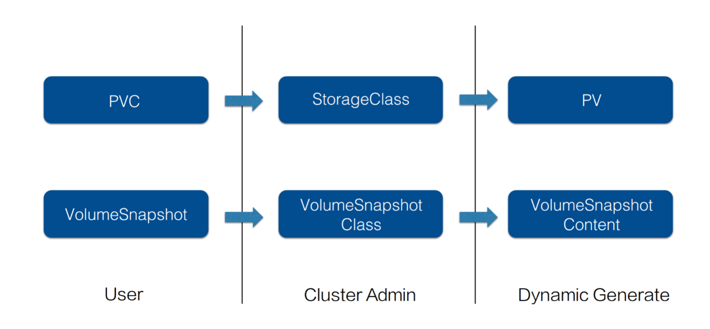
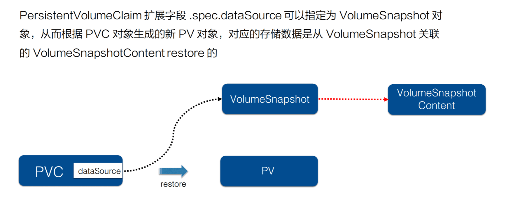
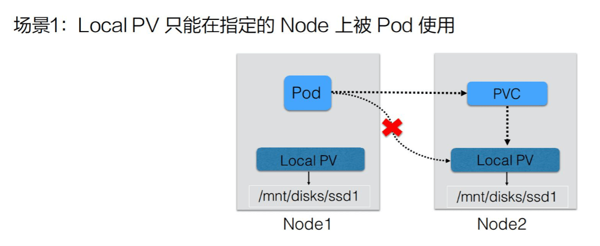
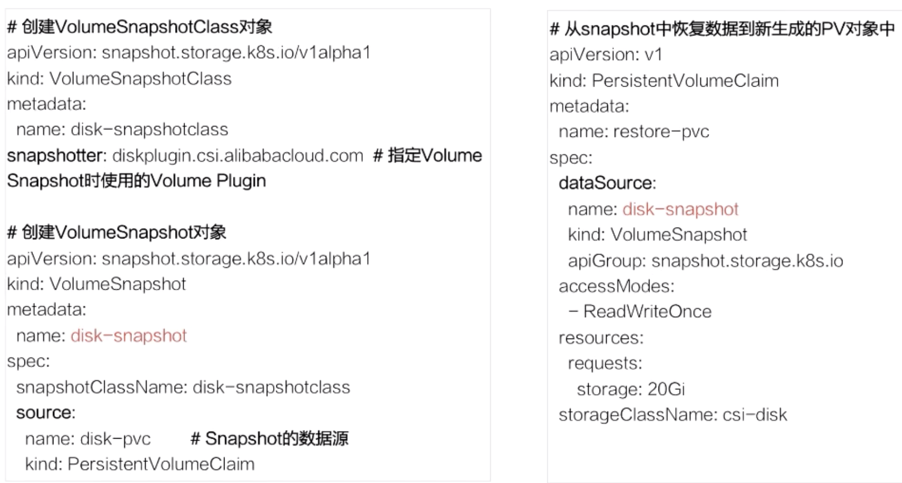
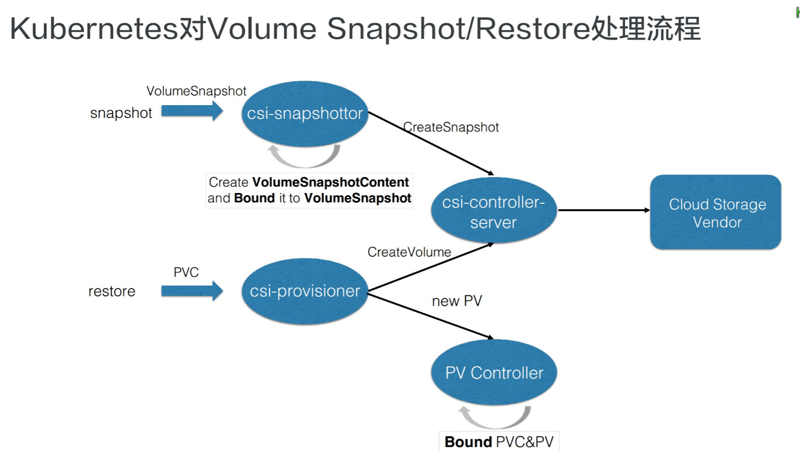
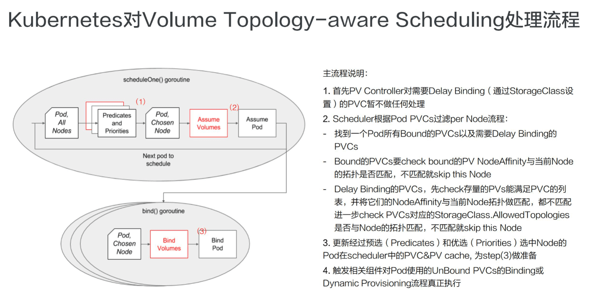

# 存储快照

[存储快照与拓扑调度](https://edu.aliyun.com/lesson_1651_18358)

## 1. 概述

### 背景

* 1）在使用存储时，**为了提高数据操作的容错性**，我们通常有需要对线上数据进行snapshot，以及能快速restore的能力。

* 2）另外，当需要对线上数据进行快速的复制以及迁移等动作，如进行环境的复制、数据开发等功能时，都可以通过存储快照来满足需求，而 K8s 中通过 **CSI Snapshotter controller** 来实现存储快照的功能。

### Snapshot 设计思路

**存储快照的设计其实是仿照 pvc & pv 体系的设计思想**。

当用户需要存储快照的功能时，可以通过 VolumeSnapshot 对象来声明，并指定相应的 VolumeSnapshotClass 对象，之后由集群中的相关组件动态生成存储快照以及存储快照对应的对象 VolumeSnapshotContent。

如下对比图所示，动态生成 VolumeSnapshotContent 和动态生成 pv 的流程是非常相似的。

### Restore

存储快照恢复流程如下：

如上所示的流程，**将 PVC 对象 dataSource 字段指定为 VolumeSnapshot 对象**。这样当 PVC 提交之后，会由集群中的相关组件找到 dataSource 所指向的存储快照数据，然后去创建对应的存储以及 pv 对象，将存储快照数据恢复到新的 pv 中，这样数据就恢复回来了，这就是存储快照的restore用法。

## 2. 拓扑调度

### 什么是拓扑

**拓扑是 K8s 集群中为管理的 nodes 划分的一种“位置”关系**，意思为：可以通过在 node 的 labels 信息里面填写某一个 node 属于某一个拓扑。

 

常见的有三种，这三种在使用时经常会遇到的：

- 第一种，在使用云存储服务的时候，经常会遇到 **region**，也就是地区的概念，在 K8s 中常通过 label failure-domain.beta.kubernetes.io/region 来标识。这个是为了标识单个 K8s 集群管理的跨 region 的 nodes 到底属于哪个地区；

- 第二种，比较常用的是可用区，也就是 available **zone**，在 K8s 中常通过 label failure-domain.beta.kubernetes.io/zone 来标识。这个是为了标识单个 K8s 集群管理的跨 zone 的 nodes 到底属于哪个可用区；

- 第三种，是 **hostname，**就是单机维度，是拓扑域为 node 范围，在 K8s 中常通过 label kubernetes.io/hostname 来标识，这个在文章的最后讲 local pv 的时候，会再详细描述。

 

上面讲到的三个拓扑是比较常用的，而**拓扑其实是可以自己定义的**。可以定义一个字符串来表示一个拓扑域，这个 key 所对应的值其实就是拓扑域下不同的拓扑位置。

 

举个例子：可以用 **rack，**也就是机房中的机架这个纬度来做一个拓扑域。这样就可以将不同机架 (rack) 上面的机器标记为不同的拓扑位置，也就是说可以将不同机架上机器的位置关系通过 rack 这个纬度来标识。属于 rack1 上的机器，node label 中都添加 rack 的标识，它的 value 就标识成 rack1，即 rack=rack1；另外一组机架上的机器可以标识为 rack=rack2，这样就可以通过机架的纬度就来区分来 K8s 中的 node 所处的位置。

### 存储拓扑调度产生背景

**在 K8s 中创建 pod 的流程和创建 PV 的流程，其实可以认为是并行进行的**，这样的话，就没有办法来保证 pod 最终运行的 node 是能访问到 有位置限制的 PV 对应的存储，最终导致 pod 没法正常运行。

这里来举两个经典的例子：

首先来看一下 **Local PV 的例子**：

Local PV 是将一个 node 上的本地存储封装为 PV，通过使用 PV 的方式来访问本地存储。

*为什么会有 Local PV 的需求呢？*

简单来说，刚开始使用 PV 或 PVC 体系的时候，主要是用来针对分布式存储的，分布式存储依赖于网络，如果某些业务对 I/O 的性能要求非常高，可能通过网络访问分布式存储没办法满足它的性能需求。这个时候需要**使用本地存储，刨除了网络的 overhead，性能往往会比较高**。但是用本地存储也是有坏处的！分布式存储可以通过多副本来保证高可用，但本地存储就需要业务自己用类似 Raft 协议来实现多副本高可用。

当用户在提交完 PVC 的时候，K8s PV controller 会寻找 PV 与其绑定，那么可能绑定的是 node2 上面的 PV。但是，真正使用这个 PV 的 pod，在被调度的时候，有可能调度在 node1 上，最终导致这个 pod 在起来的时候没办法去使用这块存储，因为 pod 真实情况是要使用 node2 上面的存储。

**场景2：单Region多Zone K8s集群，阿里云云盘当前只能被同一个Zone的Node上的Pod访问。**

如果搭建的 K8s 集群管理的 nodes 分布在单个区域多个可用区内。

在创建动态存储的时候，创建出来的存储属于可用区 2，但之后在提交使用该存储的 pod，它可能会被调度到可用区 1 了，那就可能没办法使用这块存储。

因此像阿里云的云盘，也就是块存储，当前不能跨可用区使用，如果创建的存储其实属于可用区 2，但是 pod 运行在可用区 1，就没办法使用这块存储，这是第二个常见的问题场景。

### 存储拓扑调度

首先总结一下之前的两个问题，它们都是 **PV 在给 PVC 绑定或者动态生成 PV 的时候，并不知道后面将使用它的 pod 将调度在哪些 node 上，但 PV 本身的使用，是对 pod 所在的 node 有拓扑位置的限制的**。

> 即：PV 和 PVC 的绑定以及 Pod 调度是异步的，二者可能出现冲突。

例如：

* 如 Local PV 场景是我要调度在指定的 node 上我才能使用那块 PV，
* 而对第二个问题场景就是说跨可用区的话，必须要在将使用该 PV 的 pod 调度到同一个可用区的 node 上才能使用阿里云云盘服务。

**具体实现如下：**

简单来说，**在 K8s 中将 PV 和 PVC 的 binding 操作和动态创建 PV 的操作做了 delay，delay 到 pod 调度结果出来之后，再去做这两个操作**。

 这样的话有什么好处？

- 首先，如果要是所要使用的 PV 是预分配的，如 Local PV，其实使用这块 PV 的 pod 它对应的 PVC 其实还没有做绑定，就可以通过调度器在调度的过程中，结合 pod 的计算资源需求(如 cpu/mem) 以及 pod 的 PVC 需求，选择的 node 既要满足计算资源的需求又要 pod 使用的 pvc 要能 binding 的 pv 的 nodeaffinity 限制;
- 其次对动态生成 PV 的场景其实就相当于是如果知道 pod 运行的 node 之后，就可以根据 node 上记录的拓扑信息来动态的创建这个 PV，也就是保证新创建出来的 PV 的拓扑位置与运行的 node 所在的拓扑位置是一致的，如上面所述的阿里云云盘的例子，既然知道 pod 要运行到可用区 1，那之后创建存储时指定在可用区 1 创建即可。

 

为了实现上面所说的延迟绑定和延迟创建 PV，需要在 K8s 中的改动涉及到的相关组件有三个：

- PV Controller 也就是 persistent volume controller，它需要支持延迟 Binding 这个操作。
- 另一个是动态生成 PV 的组件，如果 pod 调度结果出来之后，它要根据 pod 的拓扑信息来去动态的创建 PV。
- 第三组件，也是最重要的一个改动点就是 kube-scheduler。在为 pod 选择 node 节点的时候，它不仅要考虑 pod 对 CPU/MEM 的计算资源的需求，它还要考虑这个 pod 对存储的需求，也就是根据它的 PVC，它要先去看一下当前要选择的 node，能否满足能和这个 PVC 能匹配的 PV 的 nodeAffinity；或者是动态生成 PV 的过程，它要根据 StorageClass 中指定的拓扑限制来 check 当前的 node 是不是满足这个拓扑限制，这样就能保证调度器最终选择出来的 node 就能满足存储本身对拓扑的限制。

 

这就是存储拓扑调度的相关知识。

## 3. snapshot-demo

首先需要集群管理员，在集群中创建 VolumeSnapshotClass 对象，VolumeSnapshotClass 中一个重要字段就是 Snapshot，它是指定真正创建存储快照所使用的**卷插件**，这个卷插件是需要提前部署的，稍后再说这个卷插件。

接下来用户他如果要做真正的存储快照，需要声明一个 VolumeSnapshotClass，VolumeSnapshotClass 首先它要指定的是 VolumeSnapshotClassName，接着它要指定的一个非常重要的字段就是 source，这个 source 其实就是指定快照的数据源是啥。这个地方指定 name 为 disk-pvc，也就是说通过这个 pvc 对象来创建存储快照。提交这个 VolumeSnapshot 对象之后，集群中的相关组件它会找到这个 PVC 对应的 PV 存储，对这个 PV 存储做一次快照。

## 4. 处理流程

### snapshot 部分

K8s 中对存储的扩展功能都是推荐通过 csi out-of-tree 的方式来实现的。

 

csi 实现存储扩展主要包含两部分：

 

- 第一部分是由 K8s 社区推动实现的 csi controller 部分，也就是这里的 csi-snapshottor controller 以及 csi-provisioner controller，这些主要是通用的 controller 部分;
- 另外一部分是由特定的云存储厂商用自身 OpenAPI 实现的不同的 csi-plugin 部分，也叫存储的 driver 部分。

 

两部分部件通过 unix domain socket 通信连接到一起。有这两部分，才能形成一个真正的存储扩展功能。

 

如上图所示，当用户提交 VolumeSnapshot 对象之后，会被 csi-snapshottor controller watch 到。之后它会通过 GPPC 调用到 csi-plugin，csi-plugin 通过 OpenAPI 来真正实现存储快照的动作，等存储快照已经生成之后，会返回到 csi-snapshottor controller 中，csi-snapshottor controller 会将存储快照生成的相关信息放到 VolumeSnapshotContent 对象中并将用户提交的 VolumeSnapshot 做 bound。这个 bound 其实就有点类似 PV 和 PVC 的 bound 一样。

 

有了存储快照，如何去使用存储快照恢复之前的数据呢？前面也说过，通过声明一个新的 PVC 对象，并且指定他的 dataSource 为 Snapshot 对象，当提交 PVC 的时候会被 csi-provisioner watch 到，之后会通过 GRPC 去创建存储。这里创建存储跟之前讲解的 csi-provisioner 有一个不太一样的地方，就是它里面还指定了 Snapshot 的 ID，当去云厂商创建存储时，需要多做一步操作，即将之前的快照数据恢复到新创建的存储中。之后流程返回到 csi-provisioner，它会将新创建的存储的相关信息写到一个新的 PV 对象中，新的 PV 对象被 PV controller watch 到它会将用户提交的 PVC 与 PV 做一个 bound，之后 pod 就可以通过 PVC 来使用 Restore 出来的数据了。这是 K8s 中对存储快照的处理流程。

### 拓扑调度部分

**第一个步骤**其实就是要去声明延迟绑定，这个通过 StorageClass 来做的，上面已经阐述过，这里就不做详细描述了。

 

接下来看一下调度器，上图中红色部分就是调度器新加的存储拓扑调度逻辑，我们先来看一下不加红色部分时调度器的为一个 pod 选择 node 时，它的大概流程：

 

- 首先用户提交完 pod 之后，会被调度器 watch 到，它就会去首先做预选，预选就是说它会将集群中的所有 node 都来与这个 pod 它需要的资源做匹配；
- 如果匹配上，就相当于这个 node 可以使用，当然可能不止一个 node 可以使用，最终会选出来一批 node；
- 然后再经过第二个阶段优选，优选就相当于我要对这些 node 做一个打分的过程，通过打分找到最匹配的一个 node；
- 之后调度器将调度结果写到 pod 里面的 spec.nodeName 字段里面，然后会被相应的 node 上面的 kubelet watch 到，最后就开始创建 pod 的整个流程。

 

那现在看一下加上卷相关的调度的时候，筛选 node(**第二个步骤**)又是怎么做的？

 

- 先就要找到 pod 中使用的所有 PVC，找到已经 bound 的 PVC，以及需要延迟绑定的这些 PVC；
- 对于已经 bound 的 PVC，要 check 一下它对应的 PV 里面的 nodeAffinity 与当前 node 的拓扑是否匹配 。如果不匹配， 就说明这个 node 不能被调度。如果匹配，继续往下走，就要去看一下需要延迟绑定的 PVC；
- 对于需要延迟绑定的 PVC。先去获取集群中存量的 PV，满足 PVC 需求的，先把它全部捞出来，然后再将它们一一与当前的 node labels 上的拓扑做匹配，如果它们(存量的 PV)都不匹配，那就说明当前的存量的 PV 不能满足需求，就要进一步去看一下如果要动态创建 PV 当前 node 是否满足拓扑限制，也就是还要进一步去 check StorageClass 中的拓扑限制，如果 StorageClass 中声明的拓扑限制与当前的 node 上面已经有的 labels 里面的拓扑是相匹配的，那其实这个 node 就可以使用，如果不匹配，说明该 node 就不能被调度。

 

经过这上面步骤之后，就找到了所有即满足 pod 计算资源需求又满足 pod 存储资源需求的所有 nodes。

 

当 node 选出来之后，**第三个步骤**就是调度器内部做的一个优化。这里简单过一下，就是更新经过预选和优选之后，pod 的 node 信息，以及 PV 和 PVC 在 scheduler 中做的一些 cache 信息。

 

**第四个步骤**也是重要的一步，已经选择出来 node 的 Pod，不管其使用的 PVC 是要 binding 已经存在的 PV，还是要做动态创建 PV，这时就可以开始做。由调度器来触发，调度器它就会去更新 PVC 对象和 PV 对象里面的相关信息，然后去触发 PV controller 去做 binding 操作，或者是由 csi-provisioner 去做动态创建流程。