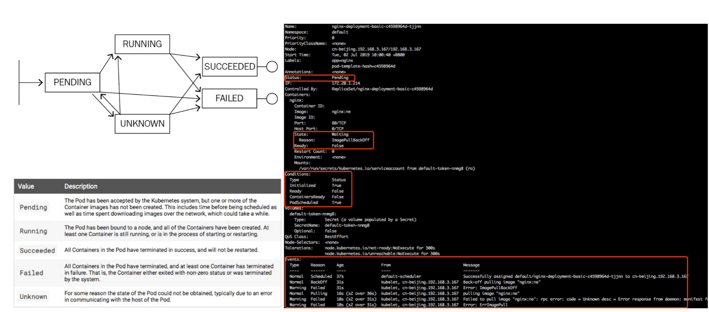

## Liveness 与 Readiness


Readiness probe 也叫**就绪指针**，用来判断一个 pod 是否处在就绪状态。

如果探测的一个结果是不成功，那么此时它会从 pod 上 Endpoint 上移除，也就是说从接入层上面会把前一个 pod 进行摘除，直到下一次判断成功，这个 pod 才会再次挂到相应的 endpoint 之上。

Liveness probe 是**存活指针**，它用来判断容器是否存活、判断 pod 是否 running。

如果 Liveness 指针判断容器不健康，此时会通过 kubelet 杀掉相应的 pod，并根据重启策略来判断是否重启这个容器。如果默认不配置 Liveness 指针，则默认情况下认为它这个探测默认返回是成功的。


**检测失败**

对于检测失败上面来讲 Liveness 指针是直接杀掉这个 pod，而 Readiness 指针是切掉 endpoint 到这个 pod 之间的关联关系，也就是说它把这个流量从这个 pod 上面进行切掉。

**适用场景**

Liveness 指针适用场景是支持那些可以重新拉起的应用，而 Readiness 指针主要应对的是启动之后无法立即对外提供服务的这些应用。


## 1. 使用方式

### 探测方式

Liveness 指针和 Readiness 指针支持三种不同的探测方式：

1. 第一种是 httpGet。它是通过发送 http Get 请求来进行判断的，当返回码是 200-399 之间的状态码时，标识这个应用是健康的；
2. 第二种探测方式是 Exec。它是通过执行容器中的一个命令来判断当前的服务是否是正常的，当命令行的返回结果是 0，则标识容器是健康的；
3. 第三种探测方式是 tcpSocket。它是通过探测容器的 IP 和 Port 进行 TCP 健康检查，如果这个 TCP 的链接能够正常被建立，那么标识当前这个容器是健康的。

 

### 探测结果

从探测结果来讲主要分为三种：

- 第一种是 success，当状态是 success 的时候，表示 container 通过了健康检查，也就是 Liveness probe 或 Readiness probe 是正常的一个状态；
- 第二种是 Failure，Failure 表示的是这个 container 没有通过健康检查，如果没有通过健康检查的话，那么此时就会进行相应的一个处理，那在 Readiness 处理的一个方式就是通过 service。service 层将没有通过 Readiness 的 pod 进行摘除，而 Liveness 就是将这个 pod 进行重新拉起，或者是删除。
- 第三种状态是 Unknown，Unknown 是表示说当前的执行的机制没有进行完整的一个执行，可能是因为类似像超时或者像一些脚本没有及时返回，那么此时 Readiness-probe 或 Liveness-probe 会不做任何的一个操作，会等待下一次的机制来进行检验。

 

那在 kubelet 里面有一个叫 ProbeManager 的组件，这个组件里面会包含 Liveness-probe 或 Readiness-probe，这两个 probe 会将相应的 Liveness 诊断和 Readiness 诊断作用在 pod 之上，来实现一个具体的判断。


## 2. 简单使用

### 参数

两个探针都有五个通用参数：

- 第一个参数叫 initialDelaySeconds，它表示的是说这个 pod 启动延迟多久进行一次检查，比如说现在有一个 Java 的应用，它启动的时间可能会比较长，因为涉及到 jvm 的启动，包括 Java 自身 jar 的加载。所以前期，可能有一段时间是没有办法被检测的，而这个时间又是可预期的，那这时可能要设置一下 initialDelaySeconds；

- 第二个是 periodSeconds，它表示的是检测的时间间隔，正常默认的这个值是 10 秒；

- 第三个字段是 timeoutSeconds，它表示的是检测的超时时间，当超时时间之内没有检测成功，那它会认为是失败的一个状态；

- 第四个是 successThreshold，它表示的是：当这个 pod 从探测失败到再一次判断探测成功，所需要的阈值次数，默认情况下是 1 次，表示原本是失败的，那接下来探测这一次成功了，就会认为这个 pod 是处在一个探针状态正常的一个状态；

- 最后一个参数是 failureThreshold，它表示的是探测失败的重试次数，默认值是 3，表示的是当从一个健康的状态连续探测 3 次失败，那此时会判断当前这个pod的状态处在一个失败的状态。


### 注意事项

在使用 Liveness 指针和 Readiness 指针的时候有一些注意事项。因为不论是 Liveness 指针还是 Readiness 指针都需要配置合适的探测方式，以免被误操作。

- 第一个是调大超时的阈值，因为在容器里面执行一个 shell 脚本，它的执行时长是非常长的，平时在一台 ecs 或者在一台 vm 上执行，可能 3 秒钟返回的一个脚本在容器里面需要 30 秒钟。所以这个时间是需要在容器里面事先进行一个判断的，那如果可以调大超时阈值的方式，来防止由于容器压力比较大的时候出现偶发的超时；

- 第二个是调整判断的一个次数，3 次的默认值其实在比较短周期的判断周期之下，不一定是最佳实践，适当调整一下判断的次数也是一个比较好的方式；

- 第三个是 exec，如果是使用 shell 脚本的这个判断，调用时间会比较长，比较建议大家可以使用类似像一些编译性的脚本 Golang 或者一些 C 语言、C++ 编译出来的这个二进制的 binary 进行判断，那这种通常会比 shell 脚本的执行效率高 30% 到 50%；

- 第四个是如果使用 tcpSocket 方式进行判断的时候，如果遇到了 TLS 的服务，那可能会造成后边 TLS 里面有很多这种未健全的 tcp connection，那这个时候需要自己对业务场景上来判断，这种的链接是否会对业务造成影响。


## 3. 问题诊断

### 状态机制

K8s 是整个的一个设计是面向状态机的，它里面通过 yaml 的方式来定义的是一个期望到达的一个状态，而真正这个 yaml 在执行过程中会由各种各样的 controller来负责整体的状态之间的一个转换。




上图左边部分实际上是一个 Pod 的一个生命周期。刚开始它处在一个 pending 的状态，那接下来可能会转换到类似像 running，也可能转换到 Unknown，甚至可以转换到 failed。然后，当 running 执行了一段时间之后，它可以转换到类似像 successded 或者是 failed，然后当出现在 unknown 这个状态时，可能由于一些状态的恢复，它会重新恢复到 running 或者 successded 或者是 failed。

### detail

下面对上图的右边部分详细解释：

 Pod 上面有一个字段叫 **Status**，这个 Status 表示的是 Pod 的一个聚合状态，在这个里面，这个聚合状态处在一个 pending 状态。

然后再往下看，因为一个 pod 里面有多个 container，每个 container 上面又会有一个字段叫 **State**，然后 State 的状态表示当前这个 container 的一个聚合状态。那在这个例子里面，这个聚合状态处在的是 waiting 的状态，那具体的原因是因为什么呢？是因为它的镜像没有拉下来，所以处在 waiting 的状态，是在等待这个镜像拉取。然后这个 ready 的部分呢，目前是 false，因为它这个进行目前没有拉取下来，所以这个 pod 不能够正常对外服务，所以此时 ready 的状态是未知的，定义为 false。如果上层的 endpoint 发现底层这个 ready 不是 true 的话，那么此时这个服务是没有办法对外服务的。

再往下是 **condition**，condition 这个机制表示是说：在 K8s 里面有很多这种比较小的这个状态，而这个状态之间的聚合会变成上层的这个 Status。那在这个例子里面有几个状态，第一个是 Initialized，表示是不是已经初始化完成？那在这个例子里面已经是初始化完成的，那它走的是第二个阶段，是在这个 ready 的状态。因为上面几个 container 没有拉取下来相应的镜像，所以 ready 的状态是 false。

然后再往下可以看到这个 container 是否 ready，这里可以看到是 false，而这个状态是 PodScheduled，表示说当前这个 pod 是否是处在一个已经被调度的状态，它已经 bound 在现在这个 node 之上了，所以这个状态也是 true。

那可以通过相应的 condition 是 true 还是 false 来判断整体上方的这个状态是否是正常的一个状态。而在 K8s 里面不同的状态之间的这个转换都会发生相应的事件，而事件分为两种： 一种叫做 normal 的事件，一种是 warning 事件。大家可以看见在这第一条的事件是有个 normal 事件，然后它相应的 reason 是 scheduler，表示说这个 pod 已经被默认的调度器调度到相应的一个节点之上，然后这个节点是 cn-beijing192.168.3.167 这个节点之上。

 

再接下来，又是一个 normal 的事件，表示说当前的这个镜像在 pull 相应的这个 image。然后再往下是一个 warning 事件，这个 warning 事件表示说 pull 这个镜像失败了。


### 常见问题

#### Pod 停留在 Pending

第一个就是 pending 状态，pending 表示调度器没有进行介入。此时可以通过 kubectl describe pod 来查看相应的事件，如果由于资源或者说端口占用，或者是由于 node selector 造成 pod 无法调度的时候，可以在相应的事件里面看到相应的结果，这个结果里面会表示说有多少个不满足的 node，有多少是因为 CPU 不满足，有多少是由于 node 不满足，有多少是由于 tag 打标造成的不满足。

 

#### Pod 停留在 waiting

那第二个状态就是 pod 可能会停留在 waiting 的状态，pod 的 states 处在 waiting 的时候，通常表示说这个 pod 的镜像没有正常拉取，原因可能是由于这个镜像是私有镜像，但是没有配置 Pod secret；那第二种是说可能由于这个镜像地址是不存在的，造成这个镜像拉取不下来；还有一个是说这个镜像可能是一个公网的镜像，造成镜像的拉取失败。

 

#### Pod 不断被拉取并且可以看到 crashing

第三种是 pod 不断被拉起，而且可以看到类似像 backoff。这个通常表示说 pod 已经被调度完成了，但是启动失败，那这个时候通常要关注的应该是这个应用自身的一个状态，并不是说配置是否正确、权限是否正确，此时需要查看的应该是 pod 的具体日志。

 

#### Pod 处在 Runing 但是没有正常工作

第四种 pod 处在 running 状态，但是没有正常对外服务。那此时比较常见的一个点就可能是由于一些非常细碎的配置，类似像有一些字段可能拼写错误，造成了 yaml 下发下去了，但是有一段没有正常地生效，从而使得这个 pod 处在 running 的状态没有对外服务，那此时可以通过 apply-validate-f pod.yaml 的方式来进行判断当前 yaml 是否是正常的，如果 yaml 没有问题，那么接下来可能要诊断配置的端口是否是正常的，以及 Liveness 或 Readiness 是否已经配置正确。

 

#### Service 无法正常的工作

最后一种就是 service 无法正常工作的时候，该怎么去判断呢？那比较常见的 service 出现问题的时候，是自己的使用上面出现了问题。因为 service 和底层的 pod 之间的关联关系是通过 selector 的方式来匹配的，也就是说 pod 上面配置了一些 label，然后 service 通过 match label 的方式和这个 pod 进行相互关联。如果这个 label 配置的有问题，可能会造成这个 service 无法找到后面的 endpoint，从而造成相应的 service 没有办法对外提供服务，那如果 service 出现异常的时候，第一个要看的是这个 service 后面是不是有一个真正的 endpoint，其次来看这个 endpoint 是否可以对外提供正常的服务。


## 4. 应用调试

### Pod 远程调试

进入一个正在运行的 pod

```BASH
kubectl exec -it pod-name /bin/bash
```

进入一个正在运行的包含多容器的  pod

```bash
# 通过 -c 参数指定进入的容器
kubectl exec -it pod-name -c container-name /bin/bash
```


### Servic 远程调试

service 的远程调试其实分为两个部分：

- 第一个部分是说我想将一个服务暴露到远程的一个集群之内，让远程集群内的一些应用来去调用本地的一个服务，这是一条反向的一个链路；
- 还有一种方式是我想让这个本地服务能够去调远程的服务，那么这是一条正向的链路。


在反向列入上面有这样一个开源组件，叫做 **Telepresence**，它可以将本地的应用代理到远程集群中的一个 service 上面，使用它的方式非常简单。

首先先将 Telepresence 的一个 Proxy 应用部署到远程的 K8s 集群里面。然后将远程单一个 deployment swap 到本地的一个 application，使用的命令就是 Telepresence-swap-deployment 然后以及远程的 DEPLOYMENT_NAME。通过这种方式就可以将本地一个 application 代理到远程的 service 之上、可以将应用在远程集群里面进行本地调试。

```BASH
Telepresence --swap-deployment $DEPLOYMENT_NAME
```

第二个是如果本地应用需要调用远程集群的服务时候，可以通过 port-forward 的方式将远程的应用调用到本地的端口之上。比如说现在远程的里面有一个 API server，这个 API server 提供了一些端口，本地在调试 Code 时候，想要直接调用这个 API server，那么这时，比较简单的一个方式就是通过 port-forward 的方式。

```bash
kubectl port-forward svc/app -n app-namespace
```


### kubectl-debug

kubectl-debug 是 kubectl 的一个插件。

我们知道在 K8s 里面，底层的容器 runtime 比较常见的就是类似像 docker 或者是 containerd，不论是 docker 还是 containerd，它们使用的一个机制都是基于 Linux namespace 的一个方式进行虚拟化和隔离的。

通常情况下 ，并不会在镜像里面带特别多的调试工具，类似像 netstat telnet 等等这些 ，因为这个会造成应用整体非常冗余。那么如果想要调试的时候该怎么做呢？其实这个时候就可以依赖类似于像 kubectl-debug 这样一个工具。

kubectl-debug 这个工具是依赖于 Linux namespace 的方式来去做的，它可以 datash 一个 Linux namespace 到一个额外的 container，然后在这个 container 里面执行任何的 debug 动作，其实和直接去 debug 这个 Linux namespace 是一致的。


## 5. 小结

- 关于 Liveness 和 Readiness 的指针。Liveness probe 就是保活指针，它是用来看 pod 是否存活的，而 Readiness probe 是就绪指针，它是判断这个 pod 是否就绪的，如果就绪了，就可以对外提供服务。这个就是 Liveness 和 Readiness 需要记住的部分；

- 应用诊断的三个步骤：首先 describe 相应的一个状态；然后提供状态来排查具体的一个诊断方向；最后来查看相应对象的一个 event 获取更详细的一个信息；

- 提供 pod 一个日志来定位应用的自身的一个状态；

- 远程调试的一个策略，如果想把本地的应用代理到远程集群，此时可以通过 Telepresence 这样的工具来实现，如果想把远程的应用代理到本地，然后在本地进行调用或者是调试，可以用类似像 port-forward 这种机制来实现。