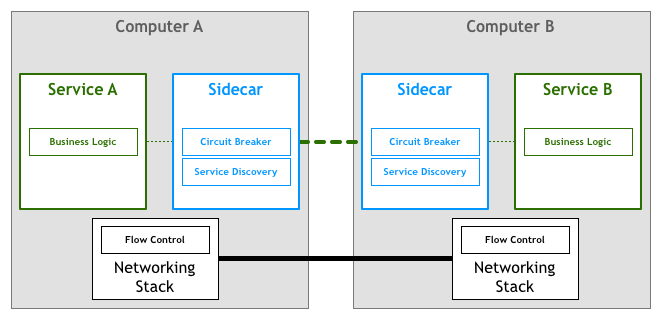

# 未来架构之从 Service Mesh 迈向云原生

## 1. ServiceMesh 演进历史

ServiceMesh 是为了满足我们对流量控制，对服务与服务之间通信的需求而产生的。


### 起源


**阶段一：逻辑耦合**


> 图源：[Pattern: Service Mesh](https://philcalcado.com/2017/08/03/pattern_service_mesh.html)

在写业务逻辑时难免需要写一个网络流量控制相关的逻辑，比如限流、过载保护、服务发现、服务治理等等。

即网络流量控制相关逻辑和业务代码耦合在一起。


**阶段二：公共库**


因为第一阶段中，控制逻辑和业务逻辑耦合严重，所以想着把它抽取出来，于是形成了公共库。

> 比如 Java 生态中比较火的 SpringCloud ，将服务发现、服务治理、流量控制等逻辑抽并整合在一起形成一个新的工具类库。

实现了解耦和复用，但还是不够完美，对业务逻辑还是有侵入的。

同时还有一个成本问题，学习和部署方面都是比较困难的，需要有专人负责。


**阶段三：代理**

这里的代理指 Nginx 这种 WebServer 组件，可以实现流控、负载均衡等功能。

虽然功能不够完善，但是这个思路是正确的。因为 Nginx 这样的组件已经和业务代码完全解耦。


### 产生


**阶段四：Sidecar**



所有流控相关逻辑，全部由 Sidecar 实现，部署时将 应用和 Sidecar 部署在一起，然后流量先进入到 Sidecar 走流控相关逻辑，之后再由 Sidecar 转发给应用执行真正的业务逻辑。

既实现了流控的所有功能又和业务完全解耦，是一个相对比较完美的解决方案。

> Sidecar 可以说就是 Service Mesh 的前身。


**阶段五：ServiceMesh**


图中绿色为微服务应用，蓝色为 Sidecar。

所有 Sidecar 组合而成的网络拓扑就是 ServiceMesh。

> 这也叫做第一代 ServiceMesh


### 发展

**阶段六：控制面板**


在第一代 ServiceMesh 基础上新增了 控制平面，由这个 控制平面 来管理整个 Sidecar 集群。

> 这也是现在的 ServiceMesh 形态，也叫作第二代 ServerMesh。


### 小结

ServiceMesh 的演进经历了  6 个阶段。

* 1）逻辑耦合
* 2）公共库
* 3）代理
* 4）Sidecar
* 5）ServiceMesh
* 6）ServiceMesh V2


## 2. 定义

> 这个定义是由 Linkerd 的 CEO William 给出来的。Linkerd 是业界第一个 Service Mesh，也是他们创造了 Service Mesh 这个词汇的，所以这个定义比较官方和权威。

A service mesh is a dedicated **infrastructure layer** for handling service-to-service communication. lt's responsible for the **reliable delivery of requests** through the complex topology of services that comprise a modern, cloud native application. In practice, the service mesh is typically implemented as an array of **lightweight network proxies** that are deployed alongside application code, **without the application needing to be aware.**

服务网格是一个**基础设施层**，用于处理服务间通信。云原生应用有着复杂的服务拓扑，服务网格负责在这些拓扑中实现**请求的可靠传递**。在实践中，服务网格通常实现为一组**轻量级网络代理**，它们与应用程序部署在一起，而**对应用程序透明。**


* 本质：基础设施层
* 功能：请求的可靠传递
* 部署形态：轻量级网络代理 Sidecar
* 特点：和业务逻辑完全解耦


ServiceMesh 是一个用来进行请求转发的基础设施，它以 Sidecar 代理的形式部署并且对业务透明。


## 3. 核心功能

* 流量控制
  * 灰度发布、蓝绿发布
  * 请求转发
* 策略
* 安全
* 可观测性


## 4. 发展情况

### 概览

* 2016 年
  * Linkerd
  * 九月 Envoy  1.0 发布

* 2017 年
  * Linkerd 加入 CNCF
  * 4 月 Linkerd 1.0 发布
  * 5 月 Istio 0.1 发布
  * 9月 Envoy 加入 CNCF
  * 12月  Conduit 发布
* 2018 年
  * 7 月 Istio 1.0 发布
  * Envoy 稳定发布
  * Conduit 并入 Linkerd 2.0
  * 国内大厂研发
* 2019 年
  * 3 月 Istio 1.1 发布
  * 4月AWS App Mesh GA
  * 5月Google Traffic Director beta发布
  * 9月Kong发布Kuma
  * 蚂蚁金服Mosn支持双11
* 2020
  * 3 月 Istio 1.5 发布


**Linberd**

第一个Service Mesh产品

2016年底在GitHub. 上发布0.x

2017年加入CNCF，4月发布1.0 版本

Conduit - Linkerd2.0，支持K8s,轻量化

**Envoy**

2016年9月发布

定位于 Sidecar 代理

第3个从 CNCF 毕业的产品

稳定可靠，性能出众

Istio 的默认数据平面

xDS 协议成为数据平面的事实标准

**Istio**

2017年5月发布0.1

Google,IBM, Lyft背书

第二代Service Mesh

收编Envoy作为默认数据平面

受到社区强烈追捧

**国内发展情况**

蚂蚁金服:SOFAMesh,MOSN数据平面

几大云厂商(腾讯、阿里、百度)

华为、微博

其他

**未来趋势**


标准化: UDPA, SMI

云端托管: Google Traffic Director, AWS App Mesh

兼容模式:多云、混合云、VM

Mesh模式化: DBMesh, CacheMesh,
MQMesh?


## 5. 网红Istio的自我救赎

Google 和 IBM 的云原生战略：

* 微服务 Istio
* 通信 gRPC
* 容器 Kubernetes


## 6. Istio 实践


## 7. 云原生的三驾马车

* Serverless
  * 让应用和服务器、实例解耦
* ServiceMesh
  * 云原生服务通讯层
* Kubernetes
  * 云原生的操作系统


云的核心能力：复制。给我一个实例，可以给你复制多份，带来了扩展性和高可用。


```sh
Istio 解读
https://mp.weixin.qq.com/s?__biz=MzA3MDg4Nzc2NQ==&mid=2652136078&idx=1&sn=b261631ffe4df0638c448b0c71497021&chksm=84d532b4b3a2bba2c1ed22a62f4845eb9b6f70f92ad9506036200f84220d9af2e28639a22045&mpshare=1&scene=1&srcid=0922JYb4MpqpQCauaT9B4Xrx&pass_ticket=DQ%2b13yxFroDiLJgSF3xOEOhvowBRom2sE4accBhVABdFMCE9q3EC/FqN6fLNDggP#rd
```


## 相关阅读

`https://philcalcado.com/2017/08/03/pattern_service_mesh.html`

`https://time.geekbang.org/article/2360`