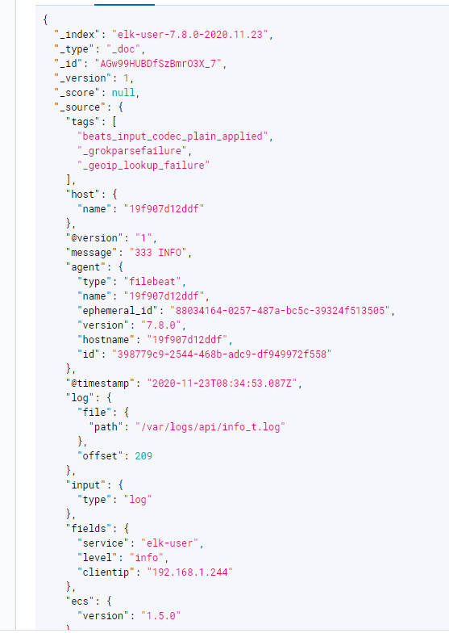

# ELK 环境搭建

## 1. 概述

ELK 是由 Elasticsearch、Logstash、Kibana、Filebeat 等开源软件组成的一个组合体。


**Elasticsearch**

Elasticsearch是一个高度可扩展全文搜索和分析引擎，基于 Apache Lucene 构建，能对大容量的数据进行接近实时的存储、搜索和分析操作，可以处理大规模日志数据，比如 Nginx、Tomcat、系统日志等功能。

**Logstash**

数据收集引擎。它支持动态的从各种数据源搜集数据，并对数据进行过滤、分析、丰富、统一格式等操作，然后存储到用户指定的位置；支持普通 log、自定义json 格式的日志解析。

**Kibana**

数据分析和可视化平台。通常与 Elasticsearch 配合使用，对其中数据进行搜索、分析和以统计图表的方式展示。

**Filebeat **

轻量级的采集器，主要用于从日志文件中采集日志。


App 将日志输出到各自的日志文件中，由 Filebeat 进行采集，并发送到 Logstash，Logstash则对日志进行过滤分类等操作，最后存储到 Elasticsearch，Kibana 则作为可视化界面从 Elasticsearch 中 读取数据并展示。


## 2. 部署

> 本文基于 docker compose 部署一个最基本的 ELK 平台，生成环境则建议使用集群模式。
>
> [docker 环境安装点这里](https://www.lixueduan.com/post/docker/02-install/)

为了简单起见，这里将分别启动 4 个软件，并使其运行在同一个 docker 网络中，通过容器名进行通信。

其中 ELK 可以部署在单独的机器上，Filebeat 则需要部署在每一个需要采集日志的机器上。

手动创建 docker network

```shell
# syntax docker network create {network-name}
$ docker network create elk
```

### 1. Elasticsearch

```yml
version: '3.2'
services:
  elasticsearch:
    image: docker.elastic.co/elasticsearch/elasticsearch:7.8.0
    container_name: elk-es
    environment:
      # JVM 参数
      - "ES_JAVA_OPTS=-Xms512m -Xmx512m"
      # 以单节点方式启动 ES
      - discovery.type=single-node
    volumes:
      - ./data:/usr/share/elasticsearch/data
      - ./logs:/usr/share/elasticsearch/logs
    ports:
      - 9200:9200

networks:
  default:
    external:
      name: elk
```


### 2. Logstash

```yml
version: '3.2'
services:
  logstash:
    image: logstash:7.8.0
    container_name: elk-logstash
    restart: always
    volumes:
      # 指定管道配置文件
      - ./logstash.conf:/usr/share/logstash/pipeline/logstash.conf:rw
    environment:
      - elasticsearch.hosts=http://elk-es:9200
      - "LS_JAVA_OPTS=-Xmx256m -Xms256m"
    ports:
      - 5044:5044

networks:
  default:
    external:
      name: elk
```

`logstash.conf` 配置文件如下

> logstash 由管道组成，而一个管道由 input、output 和 filter 三个元素组成

```yml
input {
    # 来源beats
    beats {
    # 端口
    port => "5044"
    }
}
 # 分析、过滤插件，可以多个
filter {
    grok {
    # 将日志内容存储到 Message 字段中
    match => { "message" => "%{COMBINEDAPACHELOG}"}
    }
    geoip {
    # 将客户端IP存储到 clientip 字段
    source => "clientip"
    }
}
output {
    # 选择elasticsearch
    elasticsearch {
    hosts => ["http://elk-es:9200"]
    # {fields} {service} 来自于 filebeat.conf 可以自定义字段名
    # {@metadata} {version} 则是自带属性
    index => "%{[fields][service]}-%{[@metadata][version]}-%{+YYYY.MM.dd}"
    }
}
```


### 3. Kibana

```yml
version: '3.2'
services:
  kibana:
    image: kibana:7.8.0
    container_name: elk-kibana
    environment:
      SERVER_NAME: kibana.local
      ELASTICSEARCH_HOSTS: http://elk-es:9200
      I18N_LOCALE: zh-en
    ports:
      - 5601:5601

networks:
  default:
    external:
      name: elk
```


### 4. Filebeat

```yml
version: '3.2'
services:
  # filebeat 从文件中读取日志并发送给 Logstash
  filebeat:
  image: elastic/filebeat:7.8.0
  container_name: elk-filebeat
  restart: always
  volumes:
    # 将宿主机目录挂载到容器中
    - /var/logs/elk:/var/logs
    # 指定配置文件
    - ./filebeat.conf.yml:/usr/share/filebeat/filebeat.yml
    - ./logs:/usr/share/filebeat/logs
    - ./data:/usr/share/filebeat/data
networks:
  default:
    external:
      name: elk
```

`filebeat.conf.yml` 配置文件如下：

```yml
filebeat.config:
  modules:
    path: ${path.config}/modules.d/*.yml
    reload.enabled: false
# 数据源
filebeat.inputs:
  # user
  - type: log
    enabled: true
    scan_frequency: 5s
    fields:
      service: elk
      # 增加IP字段用于区分不同的机器
      #clientip: ${SERVER_IP} 在环境变量中增加该值 或者写死在配置文件中
      clientip: 192.168.1.244
    paths:
      # 这里指定的是容器内的目录 需要在启动时将外部目录挂载到容器里才行
      - /var/logs/*.log

# 发送到 logstash
output.logstash:
  hosts: [ "elk-logstash:5044" ]
```

> 容器启动时将宿主机`/var/logs`目录挂载到了容器中的`/var/logs`，所以采集`/var/logs/*.log`日志就是采集宿主机上的文件。


## 3. 测试

手动写入一些日志看是否会被采集到 ES 中。

```shell
cd /var/log
mkdir elk
cd elk/
echo 333 INFO >> elk.log
```

不出意外的话 10s 左右就可以在 Kibana 中看到自己写的日志了。

> 因为 filebeat 默认采集频率是 10秒。


日志内容如下所示：

