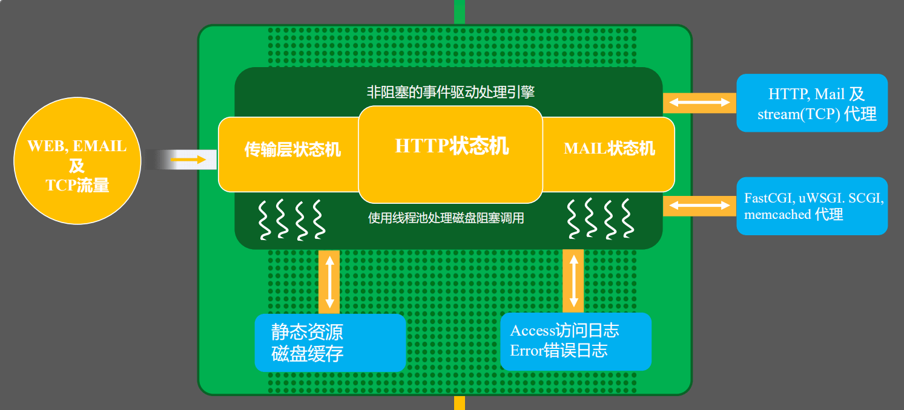
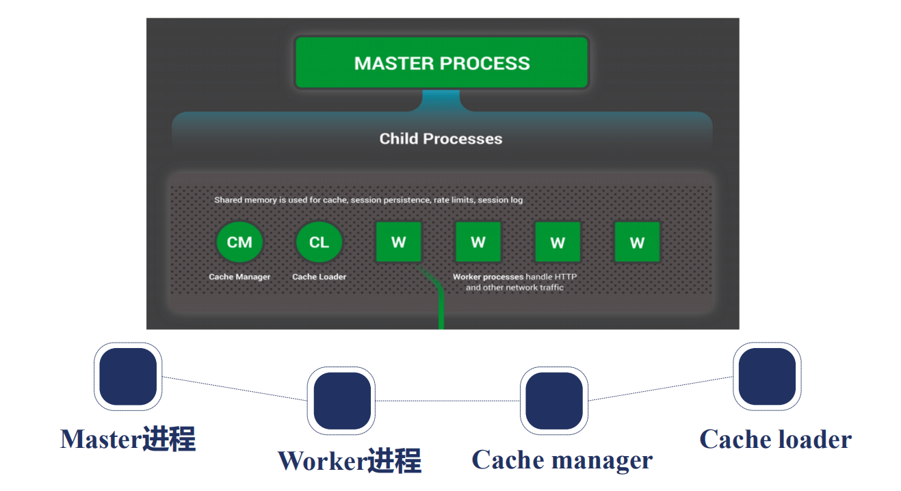
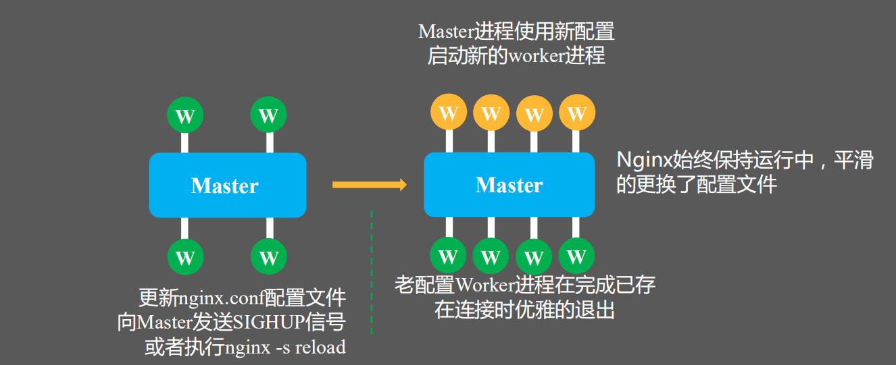
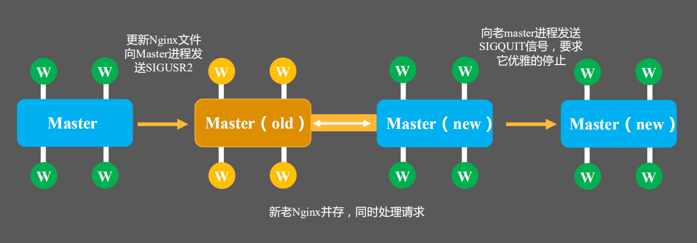
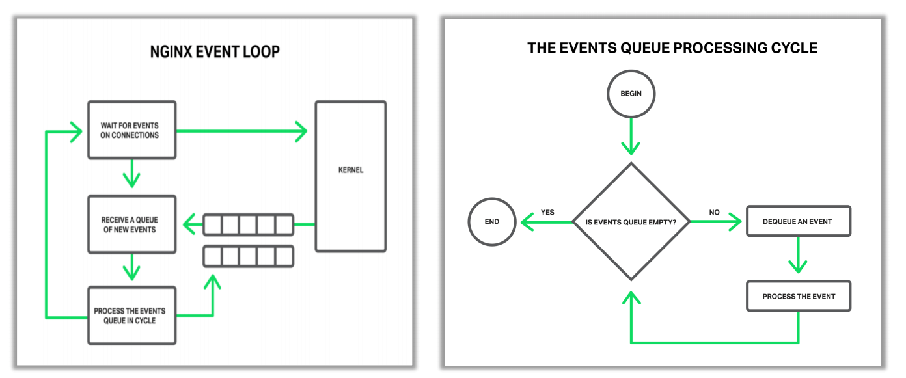
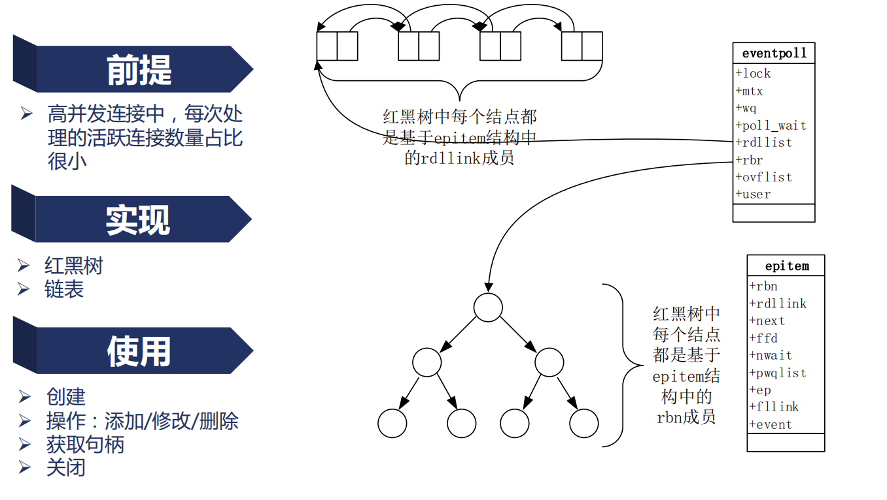

# Nginx 架构

## 1. 请求处理流程

从图左侧开始分析，WEB，EMAIL,TCP大致有三种流量进入Nginx以后，**Nginx有三个大的状态机**

- 处理TCP，UDP四层的传输层状态机
- 处理应用层的HTTP状态机
- 处理邮件的MAIL状态机*

**为什么要叫状态机呢？**

* **因为Nginx核心的深绿色的框是用非阻塞的事件驱动处理引擎，也就是我们所熟知的epoll**，但我们是用这种异步处理引擎以后，通常需要状态机把请求正确地识别和处理。
* 基于这样一种事件 - 状态处理机，我们在解析出请求，要访问静态资源的时候，走图中左下方的箭头，就找到了静态资源。如果去做反向代理的时候，对反向代理的内容可以做磁盘缓存，缓存到磁盘上，也是走左下方这条线。
* 但是我们在处理静态资源的时候，会有一个问题，当整个内存已经不足以完全地缓存住所有的文件缓存信息的时候，像AIO会退化成阻塞的磁盘调用。所以，在这里，我们需要一个线程池来处理，如图中“使用线程池处理磁盘阻塞调用”。

对于每一个处理完成的请求，我们会记录Access日志和Error日志，这里也是记录到磁盘中的

* 也可以通过**syslog协议，记录到远程机器上。**

## 2. 进程结构

Nginx 采用的是 **多进程**架构，多进程间可以通过`共享内存`、`信号`等进行管理，Nginx 中通常使用信号进行进程间管理。

**为什么不采用 `多线程`架构？**

为了保证高可用和高可靠性。线程之间是共享同一个进程空间的，如果某一个第三方模块出现问题后可能会导致整个 Nginx 进程挂掉，而采用多进程架构就不会有这样的问题。

> 通常 Master 进程中，第三方模块是不会加入自己的功能的。

Nginx 中的进程分为`Master`进程和`Worker`进程。

* Master 进程，1个。用于监控和管理 Worker 进程
* Worker 进程，多个。是真正用于处理请求的进程
* Cache Manager 1个。用于管理缓存
* Cache Loader 1个。用于加载缓存

Nginx 采用 事件驱动的方式，希望每个 Worker 进程能占用一个 CPU，所以 **一般建议 Worker 进程数量与服务器 CPU 核数一致**。

此外 Worker 进程与 CPU 核心绑定后能更好的利用 CPU 上的缓存，提升缓存利用率。

### Master 进程

* 1） 监控 Worker 进程
  * CHLD 子进程终止时会向父进程发起 CHLD 信号
* 2）管理 Worker 进程
* 3）接收信号
  * TERM，INT - 立刻停止 Nginx 进程
  * QUIT - 优雅的停止 Nginx 进程
  * HUP - 重载配置文件
  * USR1 - 重新打开日志文件，用于日志文件切割
  * 前面 4 个信号可以通过 Nginx 命令行加特定命令向 Nginx 发送，下面的两个只能通过 KILL 命令发送
  * **USR2**
  * **WINCH**

### Worker 进程

1）接收信号

* TERM，INT - 立刻停止 Nginx 进程
* QUIT - 优雅的停止 Nginx 进程
* HUP - 重载配置文件
* USR1 - 重新打开日志文件，用于日志文件切割

> 一般不会直接对 Nginx Worker 进程发信号
>
> 都是发给 Master 进程，再由 Master 进程发给 Worker进程

**Nginx 命令行**

* reload - HUP
* reopen - USR1
* stop - TREM
* quit - QUIT

Nginx 启动后会将 Master 进程 PID 存在指定文件中，使用 Nginx 命令行加`-s`参数时就会去读取这个 PID，然后根据指令想 Master 进程发送对应信号。

> 正是因为 nginx 命令行工具会去读取 Master 进程 PID 所以nginx -s xxx 和 kill pid xxx 效果是一样的

官方文档http://nginx.org/en/docs/control.html

## 3. reload 重载配置文件真相

**具体流程**

* 1）向 Master 进程发送 HUP 信号（reload 命令）
* 2）Master 进程校验配置文件语法是否正确
* 3）Master 进程打开新的监听端口（如果配置文件中新增了监听端口的话）
* 4）Master 进程用新的配置启动新的 Worker 子进程
* 5）Master 进程向老的 Worker 进程发送 QUIT 信号（quit 优雅退出）
* 6）老的 Worker 进程关闭监听句柄，处理完当前连接后结束进程

Nginx 为了保证平滑，所以必须先启动新的 Worker 进程，然后优雅关闭老的 Worker 进程。

**可能会出现的问题**: 新 Worker 进程启动后，新的请求都由新 Worker 来处理了，但是如果旧的请求一直处理不完，旧 Worker 就会一直存在。

于是 Nginx 新版本提供了配置项，可以指定新 Worker 启动后老 Worker 最长还运行多久，时间到了会直接结束旧 Worker。

## 4. 热升级流程

通过热升级，可以再不停机的情况下更新 Nginx。

**具体流程**

* 1）将旧 Nginx 文件换成新 Nginx 文件（注意备份）（`cp -f`才能覆盖正在使用中的文件）
* 2）向 Master 进程发送 `USR2 `信号（kill pid -USR2）
* 3）Master 进程修改 PID 文件名，增加后缀 `.oldbin`
* 4）Master 进程用新的 Nginx 文件启动新的 Master 进程
  * 此时也会生成 pid 文件，所以上一步先给老的pid文件增加了后缀

* 5）向老 Master 进程发送 WINCH 信号，关闭老 Worker 进程（pid 存在 .oldbin文件中 或者通过 ps 查看）
* 6）验证新版本是否正常
  * 验证没问题后，向旧Master进程发送QUIT信号，旧Master退出
  * 回滚情形：向旧master发送HUP，拉起新的 worker ,向新的master发送QUIT，让新 master 和 worker 一起退出

## 5. 优雅停止 Worker 进程

* 1）设定定时器 worker_shutdown_timeout
* 2）关闭监听句柄
* 3）关闭空闲连接
* 4）在循环中等待全部连接关闭
* 5）退出进程
  * 连接全部关闭：优雅退出
  * 超时时间到了：也立即退出，剩下的连接被强制关闭

因为连接全部被关闭或者第一步设置的超时时间到了都会立即退出，所以也不一定能真正的做到优雅停止。

## Nginx 事件驱动模型

Nginx 事件循环如下：

## 6. epoll 的优劣和原理

前提：高并发连接中，每次处理的活跃连接数占比很小

实现：

* 红黑树： 存储所有的事件连接，每一个节点都是基于 epitem 结构中的 rbn 成员
* 链表：存储当前的活跃连接，链表中的每个节点都是基于 epitem 结构中的 rdllink 成员

每次操作系统只需要去链表中去活跃连接即可，大大提升了效率。

## 7. Nginx 请求切换

**普通服务器 Apache Tomcat等**

一个线程一个连接：

* 不做连接切换；
* 依赖 OS 的进程调度实现并发

**Nginx**

一个线程同时处理多个连接：

* 在**用户态**完成连接切换；
* 尽量减少 OS 进程切换。

## 8. 阻塞非阻塞&同步异步

阻塞：调用方法可能会让当前进程切换到 sleep 状态。由于某种条件不满足，操作系统在当前时间片未用尽的情况下，操作系统主动切换到另外一个进程来使用 CPU。

> 阻塞 accpet 将监听套接字设为阻塞，如果 ACCEPT 队列为空则会等待，直到队列不为空然后将套接字从 ACCEPT 队列中移出并拷贝给进程

非阻塞：与阻塞相反，调用该方法永远不会出现时间片未使用完，操作系统就主动切换到其他进程的情况。

> 非阻塞 accept 监听套接字设置为非阻塞，如果 ACCEPT 队列为空 直接返回 EAGAIN 错误，如果不为空则将套接字从 ACCEPT 队列中移出并拷贝给进程

同步与异步则和写代码时的逻辑有关，比如在 非阻塞 ACCEPT 返回 EAGAIN 错误时，我们可以选择立即再次请求 ACCEPT 或者切换去做其他的任务。

## 9. 动态模块

* 1） 静态模块
  * Nginx 源码 + 模块源码 编译生成一个 二进制可执行文件
* 2） 动态模块
  * Nginx 源码 + 模块源码 编译生成一个 二进制可执行文件 + 模块文件，通过动态库调用方式来使用第三方模块
  * 需要更新第三方模块时，直接替换第三方模块动态库即可

具体流程：

* 1）Configure 加入动态模块
* 2）编译进 Binary
* 3）（Nginx）启动时初始化模块数组
* 4）读取 load_module 配置
* 5）打开动态库并加入模块数组
* 6）基于模块数组开始初始化