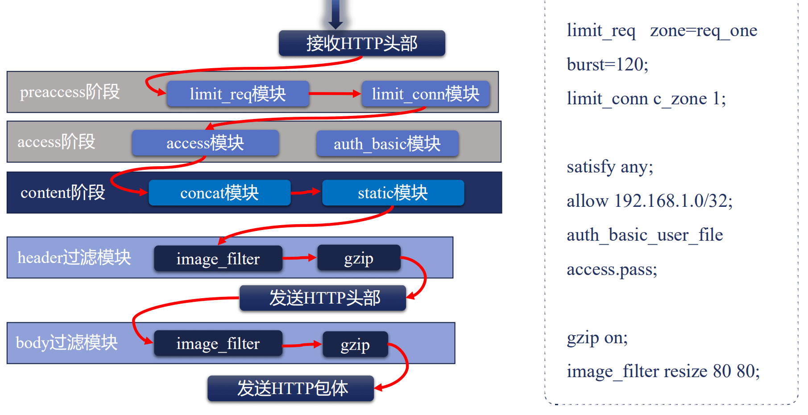

# http 模块

### http 过滤模块



 content 阶段处理好返回给用户的内容后，就会进入到 过滤模块。

由于 http header 和 body 是分别返回给用户的，所以一般一个 过滤模块都会分为 header 过滤模块和 body 过滤模块两部分。


比较重要的几个模块，按执行顺序排列。

* copy_filter 模块：复制包体内容
  * 比如使用了 send_file，此时 Nginx 会使用零拷贝技术，直接将数据发出去，但是如果还配置了 gzip 进行压缩，那么就需要先把数据拷贝一份，gzip 才能进行压缩
  * postpone_filter：处理子请求
  * header_filter：构造响应头部
  * write_filter：发送响应，这也是最后一个模块，该模块过后数据就已经发送给用户了。


### sub 模块

将响应中指定的字符串，替换为新的字符串。

> ngx_http_sub_filter_module 模块，默认未编译进 nginx，通过--with-http_sub_module 启用。


**sub_filter**：配置具体替换规则，忽略大小写。

Syntax：**sub_filter** string replacement;

Default：--

Context：http，server，location


**sub_filter_last_modified**：是否依旧给用户返回 last_modified 这个响应头，默认off 即不返回，因为这个模块已经把响应给修改了，所以 last_modified 这个响应头就不该返回了。

Syntax：**sub_filter_last_modified** on|off；

Default：sub_filter_last_modified  off;

Context：http，server，location

**sub_filter_once**：是否只替换一次，off 时会扫描完整的 body 替换所有满足条件的内容。

Syntax：**sub_filter_once** on|off;

Default：sub_filter_once on;

Context：http，server，location

**sub_filter_types**：只针对什么类型的文件进行替换，`*`表示所有内容都进行替换。

Syntax:**sub_filter_types** mime-type ...;

Default：sub_filter_types text/html;

Context：http，server，location


### addition 模块

在响应前或者响应后增加内容,而增加内容的方式是通过新增子请求的方式响应完成。

> ngx_http_addition_filter_module 模块，默认未编译进 Nginx，通过 --with-http_addition_module 启用。


**add_before_body**：在 body 之前增加内容，具体增加的内容就是这个指定的 uri 返回的内容。

Syntax：**add_before_body** uri;

Default：--

Context：http，server，location

**add_after_body**：在 body 之后增加内容。

Syntax：**add_after_body** uri;

Default：--

Context：http，server，location


**addition_types**：什么类型的内容才能执行该模块，对于一些二进制文件来说，在前后增加一些内容是没有意义的。`*`表示所有内容都可以执行。

Syntax：**addition_types** mime-type;

Default：addition_types text/html;

Context：http，server，location


### referer 模块--简单有效的防盗链手段

> referer 模块默认编译进 Nginx，可以通过--without-http_referer_module 禁用。

**场景**

某网站通过url弓|用了你的页面,当用户在浏览器上点击ur时, http请求的头部中会通过

referer头部,将该网站当前页面的url带上,告诉服务器本次请求是由这个页面发起的。

**目的**

拒绝非正常的网站访问我们的站点资源

**思路**

通过 referer 模块，用 invalid_referer 变量根据配置判断 referer 头部是否合法


**referer 模块提供的指令**

Syntax：**valid_referers** none|blocke|server_names|string...;

Default：--

Context：server，location


Syntax：**referer_hash_bucket_size** size；

Default：referer_hash_bucket_size 64；

Context：server，location


Syntax：**referer_hash_max_size** size;

Default：referer_hash_max_size 2048；

Context：server，location


valid_referers 指令可同时携带多个参数，表示多个 referer 头部都生效。

* none
  * 允许缺失 referer 头部的请求访问
* block
  * 允许 referer 头部没有对应值得请求访问
* server_names
  * 若 referer 中站点域名与 server_name 中的某个域名匹配则允许访问
* 字符串：表示域名及URL的字符串，对域名可在前缀或者后缀的含有`*`通配符
  * 若 referer头部的值匹配字符串后则允许访问
* 正则表达式
  * 若referer头部的值匹配正则表达式后，则允许访问


**invalid_referer** 变量取值：

* 允许访问时变量值为空
* 不允许访问时变量值为1


具体使用方式如下：

```conf
location / {
		valid_referers none server_names *.example.com;
		
		if ($invalid_referer){
			return 403;
		}
}
```

先通过 valid_referers 配置指定哪些referer可以访问，然后根据 invalid_referer 变量的值判断本次请求是否允许访问。


### secure_link 模块--防盗链的另一种解决方法

> ngx_http_secure_link_module 默认未编译进 nginx，需要通过 --with-http_secure_link_module 添加。

通过验证URL中的哈希值的方式防盗链。

**过程**

* 由服务器（也可以是Nginx）生成加密后的安全链接url，返回给客户端。
* 客户端通过安全url访问nginx，由nginx的secure_link模块判断是否验证通过

**原理**

* 哈希算法是不可逆的
* 客户端只能拿到执行过哈希算法的URL
* 仅生成URL的服务器、验证URL是否安全的nginx这二者,才保存执行哈希算法前的原始字符串
* 原始字符串通常由以下部分组成：
  * 资源位置,例如HTTP中指定资源的URI ,防止攻击者拿到一个安全URL后可以访问任意资源
  * 用户信息,例如用户IP地址,限制其他用户盗用安全URL
  * 时间戳,使安全URL及时过期。
  * **密钥**,仅服务器端拥有, 增加攻击者猜测出原始字符串的难度


**相关指令**


Syntax：**secure_link** expression；

Default：--

Context：http,server,location


Syntax：**secure_link_md5** expression;  // 指定加密方式

Default：--

Context：http,server,location


Syntax:**secure_link_secret** word; // 指定加密密钥

Default：--

Context：location


**相关变量**

* secure_link：是否通过
  * 值为字符串：验证不通过
  * 值为0：URL过期
  * 值为1：验证通过
* secure_link_expires：过期时间


**具体使用示例**

```conf
  location /download {
        secure_link $arg_md5,$arg_expires;
        secure_link_md5 "$secure_link_expires$uri secret";
		secure_link_secret mysecret;
        if ($secure_link = "") {
            return 403;
        }

        if ($secure_link = "0") {
            return 410;
        }
    }
```

通用是根据相关变量的值来返回。


**命令行生成安全链接**

* 原始请求
  * /test1.txt?md5=md5生成值&expires=时间戳（如123456789）
* 生成md5
  * echo -n '时间戳URL客户端IP 密钥'|openssl md5 -binary|openssl base64|tr +/-|tr -d =

**Nginx 配置**

* secure_link $arg_md5,$arg_expires;
* secure_link_md5 "$secure_link_expire$uri$remote_addr securt";


**仅对 URI 进行哈希的简单办法**

* 1）将请求 URL 分为 3 部分，prefix/hash/link
* 2）Hash 生成方式
  * 对 “link密钥” 做md5哈希求值
* 3）用 secure_link_secret secret 配置密钥


* 原始请求：link
* 生成的安全请求：/prefix/md5/link
* 生成md5：echo -n 'linksecret' |openssl md5 -hex
* nginx 配置：secure_link_secret secret;


### map 模块

通过映射新变量提供更多的可能性。

> ngx_http_map_module，默认编译进 nginx，可以通过 --without-http_map_module 禁用。


基于已有变量，使用类似switch {case ... default ...}的语法创建新变量，为其他基于变量值实现功能的模块提供更多的可能性。


**map 模块的指令**

Syntax：**map** string $variable {...};

Default：--

Context：http


Syntax：**map_hash_bucket_size** size；

Default：map_hash_bucket_size 32|64|128；

Context：http


Syntax：**map_hash_max_size** size；

Default：map_hash_max_size 2048；

Context：http


**具体规则**

**已有变量**

* 字符串
* 一个或者多个变量
* 变量与字符串的组合

**case 规则**

* 字符串严格匹配
* 使用 hostname 指令，可以对域名使用前后缀`*`泛域名匹配
  * 前缀匹配优先级高于后缀匹配
* ~和~* 正则表达式匹配，后者可以忽略大小写

**default 规则**

* 没有匹配到任何规则是，使用 default
* 缺失 default 时，返回空字符串给新变量

**其他**

* 使用 include 语法提升可读性
* 使用 volatile 禁止变量值缓存


**演示**

```conf
map $http_host $name {
hostnames;
default 0;
*.example.com 1;
a.example.* 2;
map.example.com 3;
}
```


### split_client 模块

> ngx_http_split_clients_module ,默认编译进 Nginx ,通 --without-http_split_clients_module禁用

基于已有变量创建新变量,为其他AB测试提供更多的可能性。

**原理**

* 对已有变量的值执行MurmurHash2算法得到32位整型哈希数字,记为hash

* 32位无符号整型的最大数字2^32-1 ,记为max

* 哈希数字与最大数字相除hash/max ,可以得到百分比percent

* 配置指令中指示了各个百分比构成的范围,如0- 1%,1%-5%等,及范围对应的值当percent落在哪个范围里,新变量的值就对应着其后的参数。
  * 这样可以将流量随机分到不同的环境中去


**已有变量**

* 字符串
* 一个或多个变量
* 变量与字符串的组合


**case规则**

* `xx.xx%`，支持小数点后两位，所有项的百分比相加不能超过100%
* `*`，由星号匹配剩余的百分比（100%减去以上所有项目相加的百分比）


**指令**

Syntax：**spilt_clients** string $variable {...}

Default：---

Context：http


**示例**

```conf
split_clients "$http_testcli" $variant {
   5.11%  .one;
   10.22% .two;
   15.33% .three;
   20.44% .four;
   *	   .five;
}
```

以上配置根据 $http_testcli 变量中的值计算出百分比，最后给 $variant 变量赋值，后续则可以根据 $variant 变量的取值将流量切换到不同的环境。

> http_testcli 变量回去 http 头中取 testcli 字段的值。


### geo 模块

根据客户端地址创建新变量。

> ngx_http_ geo_ module ,默认编译进nginx ,通过--without-http_geo_module禁用。


**指令**

Syntax：**geo** [$address] $variable {...}

Default：---

Context：http


**规则**

* 如果geo指令后不输入$address ,那么默认使用Sremote_ addr变量作为IP地址。
* {} 内的指令匹配：优先最长匹配
  * 通过IP地址及子网掩码的方式,定义IP范围, 当IP地址在范围内时新变量使用其
    后的参数值
  * default指定了当以上范围都未匹配上时,新变量的默认值
  * 通过proxy指令指定可信地址(参考realip模块) , 此时remote_ addr的值为X-Forwarded-For头部值中最后一个IP地址
  * proxy_ recursive允许循环地址搜索
  * include ,优化可读性
  * delete删除指定网络


**示例**

```conf
geo $country {
	default ZZ;
	#include conf/geo.conf
	proxy 116.62.160.193;
	
	127.0.0.0/24 US;
	127.0.0.1/32 RU;
	10.1.0.0/16 RU;
	192.168.1.0/24 UK;
}
```


### geoip 模块

根据IP地址创建新变量。

> ngx_http_geoip_module ,默认未编译进nginx，通过--with-http_geoip_module禁用


使用流程：

* 安装MaxMind里geoip的C开发库
  * https://dev.maxmind.com/geoip/legacy/downloadable/

* 编译nginx时带上--with-http_geoip_module参数
* 下载MaxMind中的二进制地址库
* 使用geoip_ country或者geoip_ city指令配置好nginx.conf
* 运行(或者升级nginx )


**geoip_country** 指令

Syntax：**geoip_country** file;

Default： --

Context：http


Syntax：**geoip_proxy** address |CIDR

Default： --

Context：http

**变量**

* geoip_country_code
  * 两个字母的国家代码，比如CN、US
* $geoip_country_code3
  * 三个字母的国家代码，比如CHN、USA
* $geoip_country_name
  * 国家名称，例如 ‘China’、‘United States’


**geoip_city** 指令

Syntax：**geoip_city** file；

Default： --

Context：http

**变量**

$geoip_latitude :纬度

$geoip_longitude :经度
$geoip_city_continent_code :属于全球哪个洲,例如EU或者AS
与geoip_country指令生成的变量重叠
$geoip_city_country_code :两个字母的国家代码,比如CN或者US
$geoip_city_country_ code3 :三个字母的国家代码，比如CHN或者USA
$geoip_city_country_name
e :国家名称,例如"China” ，"United States"
$geoip_ region :洲或者省的编码,例如02
$geoip_region_name :洲或者省的名称,例如Zhejiang或者Saint Petersburg
$geoip_city :城市名
$geoip_postal_code :邮编号
$geoip_area_code :仅美国使用的电话区号,例如408
$geoip_dma_code :仅美国使用的DMA编号,例如807


