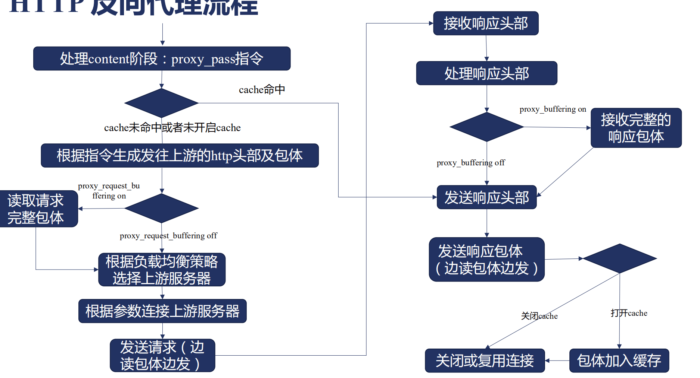
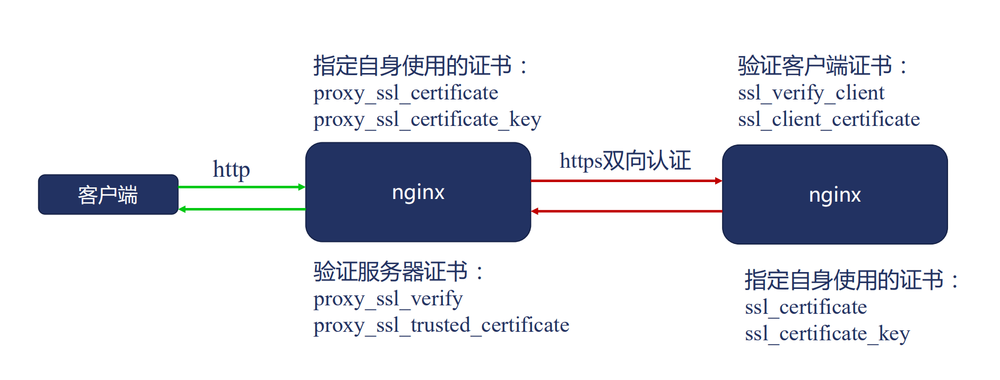

## 3. 反向代理模块

### http 反向代理流程




**1）cache 判断**

首先会判断是否命中 cache：

命中：则不需要向上游服务发送请求，直接根据 cache 生成响应头部和响应包体发送给客户端

未命中：此时则需要往上游服务发送请求了。

**2）请求上游服务**

* 先生成http头部及包体后才会去连接上游服务
  * 因为上游服务可能并发能力弱，要尽量减少对上游服务的影响，等Nginx生成好http头及包体后，再连接上游服务，连接建立后就可以直接发送数据了，而不是先建立连接然后才开始生成http头及包体数据。
* proxy_request_buffering：是否先读取完整请求包体
  * on：是，先把客户端的请求读完只会再去连接上游服务，这样可以避免因为客户端很慢从而导致和上游服务的连接一直不能释放的问题
  * off：关闭，边连接上游服务边接收客户端请求，这样上游服务能更加及时的收到数据。如果上游服务压力不大则可以关闭。
  * 建议开启

**3）接收上游服务返回的响应**

请求发给上游服务后就开始接收上游服务返回的响应了：

先是响应头，然后是响应包体，同样有一个 proxy_buffering 参数：

* on：开启后，会先接收到上游服务发来的完整的响应包体后Nginx才会响应给客户端
* off：关闭后则会边从上游服务接收响应，边发送给客户端。
* 一般也是建议开启，因为Nginx和上游服务一般都是在内网环境，响应很快，而客户端是在公网环境，如果边接收边发送给客户端，会因为客户端的网速等问题导致发送比较慢，连接被长时间占用。

**4）缓存和连接处理**

发送响应给客户端后进入最后一个流程：

* 如果本次响应包体需要缓存则加入到缓存中
* 连接则根据规则关闭或者复用


### proxy 模块

**功能**

对上游服务使用 http/https 协议进行反向代理。

**模块**

ngx_http_proxy_module，默认编译进Nginx，通过--without-http_proxy_module 禁用。

**指令**

Syntax：**proxy_pass** url;

Default：--

Context：location, if in location, limit_except

示例1：proxy_pass http://127.0.0.1:8080

示例2：proxy_pass http://127.0.0.1:8081/users

**URL参数规则**

* **URL必须以http://或者https://开头**，接下来是域名、IP、 unix socket地址或者upstream的名字，前两者可以在域名或者IP后加端口。最后是可选的URI。

* 当URL参数中携带URI与否，会导致发向上游请求的URL不同
  * 不携带URI,则将客户端请求中的URL直接转发给上游
    * location后使用正则表达式、@名字时，应采用这种方式
  * 携带URI,则对用户请求中的URL作如下操作:
    * 将location参数中匹配上的一段替换为该URI

* 该URL参数中可以携带变量
* 更复杂的URL替换，可以在location内的配置添加rewrite break语句


**proxy_pass 的 URL 结尾带 / 和 不带 / 结尾的区别？**

* 不带 / 意味着 Nginx 不会修改用户 URL，而是直接透传给上游应用服务器
* 带 /  意味着 Nginx 会修改用户 URL
  * 修改原则：将 location 后的URL 从用户URL中删除


示例：

不带 / 的用法

```conf
location /bbs/ {
		proxy_pass http://127.0.0.1:8080;
}
```

用户请求URL：/bbs/abc/test.html

请求到达Nginx的URL：/bbs/abc/test.html

请求到达上游应用服务器的URL：/bbs/abc/test.html

**不带 / 结尾时，URL自始至终不会发生变化。**


带 / 的用法：

```conf
location /bbs/ {
		proxy_pass http://127.0.0.1:8080/;
}
```

用户请求URL：/bbs/abc/test.html

请求到达Nginx的URL：/bbs/abc/test.html

请求到达上游应用服务器的URL：/abc/test.html。

**带/结尾时，URL被修改了，将location 中的 /bbs 从URL中删除掉了。**


**类似于 root 和 alias 的区别，不带/和root表现一致，带/则和alias表现一致**

和URL参数带URI时，Nginx会**将location参数中匹配上的一段替换为该URI**这条规则一致。

*代理到上游服务器的URL结尾是否有必要加 / ？*

两种写法没有优劣之分，主要看使用时的路径规划，主要是要统一，别一会带不会不带的。

> 个人感觉不带比较好理解。


### proxy-修改请求内容

#### 请求行


Syntax：**proxy_method** method;

Default：--

Context：http,server,location

作用：指定转发到上游时用得 HTTP Method。


Syntax：**proxy_http_version** 1.0|1.1; 

Default：proxy_http_version 1.0;

Context：http,server,location

> 默认为 http1.0，如果需要使用长连接则需要改成1.1版本


#### 请求头

Syntax：**proxy_pass_request_header** on|off;

Default：proxy_pass_request_header on；

Context：http,server,location

作用：是否将客户端传来的 header 发送给上游服务。


Syntax：**proxy_set_header** field value；

Default：proxy_set_header Host $proxy_host;

​				proxy_set_header Connection close;

Context：http,server,location

> 注意：若 value 的值为空字符串，则整条 header 都不会向上游发送。比如 host 为空时不会向上游发送Host：“” 这样的header，而是省略掉 Host 这条header。
>
> 默认关闭了长连接，如果需要则将  Connection  改成Keepalive


#### 请求体


Syntax：**proxy_pass_request_body** on|off；

Default：proxy_pass_request_body on；

Context：http,server,location

作用：是否将用户传来的 body 发送给上游服务，设置为 off 后，请求体就不会转发给上游服务器，默认 on 则会转发。


Syntax：**proxy_set_body** value;

Default：--

Context：http,server,location

作用：自定义传输给上游的 body。


### proxy_request_buffer-接收客户请求包体的方式

* 是接收完全部包体再一次性发送给上游服务器
* 还是一边接收包体一边发送

二者都可能，主要根据 proxy_request_buffer 指令决定。


Syntax： **proxy_request_buffer** on|off；

Default： proxy_request_buffer on；

Context：http,server,location


开启 buffer 后，Nginx 就会将收到的包缓存起来，然后一次性发送给上游服务器，如果关闭则不会缓存，Nginx收到包就会立马转发给上游服务器。

> 注：如果请求包太大了，超过 buffer 限制后会存到磁盘上，可能会产生一些磁盘IO。


适合开启的场景：

* 吞吐量要求高
* 上游服务并发处理能力低
* 客户端网速较慢

适合关闭的场景：

* 更及时的响应
* 减少 Nginx 读写磁盘的消耗
* 一旦开始发送内容，proxy_next_upstream 功能失效


### 客户端包体的接收

接收客户端包体时，会分配一段内存用于暂时存储，具体逻辑如下：

* 若接收头部时已经接收完全部包体,则不分配内存用于接收包体。
* 若剩余待接收包体的长度小于 client_ body_ buffer_ size ,则仅分配所需大小
* 否则就分配client_ body_ buffer_ size 大小内存接收包体
  * 就算 body 特别大，也只分配这个大点内存，一段一段的接收。


收到客户端包体后，根据 proxy_buffering 开关分别做以下处理：

* 关闭包体缓存时,将 client_ body_ buffer 中的内容及时发送给上游
* 打开包体缓存时，若 client_ body_ buffer 用完时,写入临时文件,释放内存，继续接收后续内容，直到完整 body 接收完成时，才开始发送给上游服务。
  * 具体临时文件的位置由 `client_body_tmp_path` 指令指定目录


Syntax：**client_body_buffer_size** size;

Default：client_body_buffer_size 8k|16k;  // 在32位系统下是8k，64位则是16k；

Context：http,server,location

作用：限制 proxy_request_buffer 的大小。


Syntax：**client_body_in_single_buffer** on|off;

Default：client_body_in_single_buffer on；

Context：http,server,location

作用：尽量将请求体分配到缓冲区的一块连续空间上


Syntax：**client_max_body_size** size;

Default：client_max_body_size 1M;

Context：http,server,location

作用：最大包体长度限制。

> 仅对请求头部中含有 Context-Length 字段的请求有效，超出最大长度后,返回413错误：Request Entity Too Large


### 临时文件路径格式


Syntax：**client_body_tmp_path** path [level1 [level2 [level3]]];

Default：client_body_tmp_path client_body_tmp;

Context：http,server,location

作用：指定磁盘临时存储路径

>  可以写相对路径，相对Nginx根目录。同时可以分为多级子目录，因为一个目录下不能存放太多文件，否则性能会严重降低。


Syntax：**client_body_in_file_only** on|clean|off;

Default：client_body_in_file_only off;

Context：http,server,location

作用：指定是否直接将请求体存到磁盘


> off：如果 body 很小，client_body_buffer 能直接存下就不写到文件里。
>
> clean 和 on 效果类似，都是直接将请求体存到磁盘上，不过 clean 会在请求结束后删除磁盘上的文件，on 则会一直保留。
>
> 这个命令一般用于排查问题，将所有 body 全部存下来，便于后续分析。


### 读取包体时的超时

Syntax：client_body_timeout time;

Default：client_body_timeout 60s;

Context：http,server,location

作用：指定两次读取包体间的最大时间间隔。

> 读取包体超时后，返回 408 错误。


### 向上游服务建立连接


Syntax：**proxy_connect_timeout** time;

Default：proxy_connect_timeout 60s；

Context：http,server,location

作用：指定Nginx 连接上游服务器的超时时间，即TCP 3次握手的超时时间。

> 超时后，会向客户端生成http响应，响应码为502。


Syntax：**proxy_next_upstream** http_502|...;

Default：proxy_next_upstream error timeout；

Context：http,server,location

作用：指定在遇到某些错误时，换一个上游服务器继续请求。


### 上游连接启用 TCP keepalive

Syntax：**proxy_socket_keepalive** on|off;

Default：proxy_socket_keepalive off；

Context：http,server,location

作用：是否直接复用 TCP 层的Socket长连接，之前说的都是应用层的长连接。


**TCP keepalive 原理**

在举例上次传输数据一段时间后，操作系统会发生一个探测包给对端，如果收到对端响应的探测包应答则不会关闭连接，否则会关闭连接。


### 上游连接启用 HTTPkeepalive

具体见 upstream 模块的 对上游服务使用 keepalive 长连接 章节。


### 修改 TCP连接中的 lcoal address


Syntax：**proxy_bind** address [transparent]|off;

Default：---

Context：http,server,location

作用：修改TCP连接中的源IP地址


**用途**

* Nginx 所在机器有多个IP地址时，手动指定需要使用的地址
* 透传IP地址

**用法**

* 可以使用变量
  * proxy_bind $remote_addr
* 可以使用不属于所在机器的IP地址
  * proxy_bind $remote_addr transparent


### 当客户端关闭连接时


Syntax：**proxy_ignore_client_bort** on|off;

Default：proxy_ignore_client_bort off;

Context：http,server,location

作用：指定代理服务器是否忽略客户端主动断开连接的指令，开启后如果客户端断开和Nginx的连接后，Nginx也会忽略掉Nginx之前发送给上游服务器的请求，默认为关闭。


### 向上游发送 HTTP 请求

**proxx_send_timeout**：代理服务器没有想上游发送任何内容的超时时间，超时后就会断开连接。

Syntax：**proxx_send_timeout** time;

Default：proxx_send_timeout 60s;

Context：http,server,location


### 接收上游的 HTTP响应头

Syntax：**proxy_buffer_size** size；

Default：proxy_buffer_size 4k|8k;

Context：http,server,location

作用：指定能接收上游服务器的最大header

> 超过后就不能正确的被Nginx处理，error log中会出现一条这样的错误：upstream sent to big header。
>
> 比如上游服务返回的大量的 Cookie 的时候，就可能超过限制。


### 接收上游的HTTP包体


Syntax：**proxy_buffers** number size;

Default：proxy_buffers 8 4k|8k;

Context：http,server,location

作用：指定分配来存储上游响应包体的内存大小，如果上游响应包体能全存放在内存中就不需要写入临时文件了。


Syntax：**proxy_buffering** on|off;

Default：proxy_buffering on；

Context：http,server,location

作用：指定是否缓存上游包体，等完全接收后再发送给客户端。

> 上游服务也可以通过一个 Nginx 特有的响应头来改变该值。
>
> X-Accel-Buffering yes|no；该请求头为 yes 时会强制要求 nginx 先接收完上游服务的响应再发送给客户端。


Syntax：**proxy_max_tmp_file_size** size；

Default：proxy_max_tmp_file_size 1024m；

Context：http,server,location

作用：指定将包体写入临时文件能占用的最大空间。


Syntax：**proxy_temp_file_write_size** size；

Default：proxy_temp_file_write_size 8k|16k；

Context：http,server,location

作用：指定每次向磁盘临时文件中写入的数据大小。


Syntax：**proxy_temp_path** path [level1 [level2 [level3]]];

Default：proxy_temp_path proxy_temp;

Context：http,server,location

作用：存放临时文件的目录以及使用几级目录。

> 一个目录下的文件数太多会影响效率，所以分为多级目录。


### 及时转发包体


Syntax：**proxy_busy_buffers_size** size;

Default：proxy_busy_buffers_size 8k|16k;

Context：http,server,location

作用：指定收到多大的响应后就向客户端发送一次，而不是等全部接收完了再发送给客户端。


### 接收上游时网速相关指令

Syntax：**proxy_read_timeout** time；

Default：proxy_read_timeout 60

Context：http,server,location

作用：指定两次读取间隔的最长时间


Syntax：**proxy_limit_rate** rate;

Default：proxy_limit_rate 0；

Context：http,server,location

作用：限制读取上游响应的最大速度，默认为0，即不限制。


### 上游包体的持久化

Syntax：**proxy_store_access** users:permissions ...;

Default：proxy_store_access user:rw;

Context：http,server,location

作用：指定保存的临时文件的访问权限，指定user和rwx权限。


Syntax：**proxy_store** on|off|string；

Default：proxy_store off;

Context：http,server,location

作用：指定是否开启上游包体持久化，on 则开启，默认会保存到 server 对应的 root 配置项中的目录，也可以指定目录。


示例：

```conf
upstream proxyups {
	server 127.0.0.1:8912 weight=1 ;
}

server {
	server_name example.com;
	root /tmp;
	location / {
		proxy_pass http://proxyups;
		proxy_store on;
		proxy_store_access user:rw group:rw all:r;
	}
}
```

上述配置中会把上游响应保存到 /tmp 目录中，权限为 `user:rw group:rw all:r`。


### 禁用上游响应头部的功能

Syntax：**proxy_ignore_headers** field ...;

Default：---

Context：http,server,location


**功能**

某些响应头部可以改变nginx的行为,使用proxy_ ignore_ headers可以禁止它们生效。

**可以禁用的头部**

* X-Accel-Redirect :由上游服务指定在nginx内部重定向,控制请求的执行。
* X-Accel-Limit-Rate :由上游设置发往客户端的速度限制,等同limit_rate指令
* X-Accel-Buffering :由上游控制是否缓存上游的响应
* X-Accel-Charset :由上游控制Content-Type中的Charset
* 缓存相关:
  * X-Accel-Expires :设置响应在nginx中的缓存时间,单位秒; @开头表示一天内某时刻
  * Expires :控制nginx缓存时间,优先级低于X-Accel-Expires
  * Cache-Control :控制nginx缓存时间,优先级低于X-Accel-Expires
  * Set-Cookie :响应中出现Set-Cookie则不缓存，可通过proxy_ ignore_ headers禁止生效
  * Vary :响应中出现Vary: *则不缓存,同样可禁止生效


### 转发上游的响应

Syntax:**proxy_hide_header** field;

Default：---

Context：http,server,location

作用：对于上游响应中的某些头部，设置不向客户端转发。


**默认不转发的响应头部**

* Date :由ngx_ http_ header_ filter_ module过滤模块填写,值为nginx发送响应头部时的时间
* Server :由ngx_http_header_filter_module过滤模块填写,值为nginx版本
* X-Pad :通常是Apache为避免浏览器BUG生成的头部,默认忽略
* X-Accel- :用于控制nginx行为的响应,不需要向客户端转发

如果想把默认响应头之外的不向客户端转发，则可以使用 proxy_hide_header。

而如果想把默认不转发的响应头部转发给客户端，则可以使用 proxy_pass_header指令：

Syntax：**proxy_pass_header** field；

Default：---

Context：http,server,location

作用：指定需要把哪些默认就不转发的头部转发给客户端。


### 修改返回的 Set-Cookie 头部

Syntax：**proxy_cookie_domain** off；

​				**proxy_cookie_domain** domain replacement；

Default：proxy_cookie_domain off；

Context：http,server,location

作用：指定修改 set-cookie 头部中的 domain。


Syntax：**proxy_cookie_path** off；

​				**proxy_cookie_path** path replacement；

Default：proxy_cookie_path off;

Context：http,server,location

作用：指定修改 set-cookie 头部中的 path。


### 修改返回的 Location 头部


Syntax：**proxy_redirect** default；

​				**proxy_redirect** off；

​				**proxy_redirect** redirect replacement；

Default：proxy_redirect off；

Context：http,server,location

作用：替换响应头部中的 location字段，即redirect的目标URL。


### 上游返回失败时的处理办法

 

Syntax：**proxy_next_upstream** error | timeout | invalid_header | http_500 | http_502 | http_503 | http_504 | http_403 | http_404 | http_429 | non_idempotent | off ...;

Default：proxy_next_upstream error timeout；

Context：http,server,location

作用：指定在遇到哪些错误时会向另外一个上游服务发送请求。


**前提**

* 此时，Nginx 没有向客户端发送任何内容，如果发送了内容给客户端则次指令无效。

**配置**

* error
* timeout
* invalid_header
* http_xxx 错误码
* non_idempotent
* off


Syntax：**proxy_next_upstream_timeout** time;

Default：proxy_next_upstream_timeout 0；

Context：http,server,location

作用：指定Nginx从收到客户端请求，到选择好上游服务的最大时间，默认为0，即不限制。


Syntax：**proxy_next_upstream_tries** number;

Default：proxy_next_upstream_tries 0;

Context：http,server,location

作用：指定最大重试次数，默认为0，即不限制。


### 用 error_page 拦截上游失败响应

当上游响应的响应码大于等于300时,应将响应返回客户端还是按error_ page指令处理。

Syntax：**proxy_intercept_errors** on|off;

Default：proxy_intercept_errors off；

Context：http,server,location

作用：指定上游响应的响应码大于300时，是否做特殊处理。为 on 时则会走error_page 逻辑。


示例

```conf
server {
	error_page 500 /test.txt
	location / {
		proxy_pass http://127..0.0.1:8013;
		proxy_intercept_errors on;
	}
}
```

假设上游服务返回的响应码为 500；

proxy_intercept_errors 为  off 时，Nginx 会将响应码 500 直接响应给客户端、

proxy_intercept_errors 为 on 时，则会进入 error_page 逻辑，由于配置了 error_page 500，所以最终Nginx 会把 test.txt 返回给客户端。


### SSL 连接



上图说明了 Nginx 的4种证书相关操作。


**对下游使用证书**

Syntax：**ssl_certificate** file；

Default：--

Context：http,server

作用：指定证书文件

Syntax：**ssl_certificate_key** file；

Default：--

Context：http,server

作用：指定私钥文件。


**验证下游证书**

Syntax：**ssl_verify_client** on|off|optional|optional_no_ca;

Default：ssl_verify_client off；

Context：http,server

作用：指定是否验证客户端的证书。


Syntax：**ssl_client_certificate** file；

Default：---

Context：http,server

作用：指定客户端的证书。

> 一般下游证书由上游证书进行签发，所以 ssl_client_certificate 配置，一般为签发证书。
>
> 比如：上游生成CA证书，后再用CA证书签发了一个证书给下游使用。
>
> 这样作为上游就可以使用CA证书来验证下游的证书是否为自己的CA证书签发的。


**对上游使用证书**

Syntax：**proxy_ssl_certificate** file；

Default：--

Context：http,server,location

作用：指定连接上游时用的证书文件。


Syntax：**proxy_ssl_certificate_key** file;

Default：--

Context：http,server,location

作用：指定连接上游时用的私钥文件。


**验证上游的证书**

Syntax：**proxy_ssl_verify** on|off；

Default：proxy_ssl_verify off；

Context：http,server,location

作用：指定是否验证上游证书。


Syntax：**proxy_ssl_trusted_certificate** file;

Default：---

Context：http,server,location

作用：指定信任的上游证书文件。


### SSL 模块提供的变量

**安全套件**


* ssl_cipher:本次通讯选用的安全套件,例如ECDHE-RSA-AES 128-GCM-SHA256
* ssl_ ciphers: 客户端支持的所有安全套件
* ssl_ protocol: 本次通讯选用的TLS版本,例如TLSv1.2
* ssl_ curves:客户端支持的椭圆曲线,例如secp384r1:secp521rl


**证书**

* ssl_ client_ _raw_ cert: 原始客户端证书内容
* ssl_ _client_ _escaped_ cert: 返回客户端证书做urlencode编码后的内容
* ssl_ client_ cert: 对客户端证书每一行内容前加tab制表符空白 ,增强可读性。
* ssl client fingerprint: 客户端证书的SHA 1指纹


**证书结构化信息**

* ssl server_ name: 通过TLs插件SNI( Server Name Indication )获取到的服务域名
* ssl_ client_ i _dn:依据RFC2253获取到证书issuer dn信息,例如: C........,.C=...
* ssl_client i_dn_legacy:依据RFC2253获取到证书issuer dn信息，例如: /C-.../...0-...CN=...
* ssl_client_s_dn: 依据RFC2253获取到证书subject dn信息,例如: C............C-....
* ssl_client_s_dn_legacy: 同样获取subject dn信息,格式为: ./......0-......CN=...


**证书有效期**

* ssl_ _client v_ end:返回客户端证书的过期时间,例如Dec 1 11:56:11 2028 GMT
* ssl_ client_ v_ remain: 返回还有多少天客户端证书过期,例如针对上面的ssl_ _client v_ end其值为3649
* ssl_ _client v_ start: 客户端证书的颁发日期,例如Dec 4 11:56:11 2018 GMT


**连接有效性**

* ssl_ client serial: 返回连接上客户端证书的序列号,例如8BE94767484 1BD44
* ssl_ early_ data: 在TLS1.3协议中使用了early data且握手未完成返回1 ,否则返回空字符串
* ssl_ client_ verify: 如果验证失败为F AILED:原因,如果没有验证证书则为NONE ,验证成功则为SUCCESS
* ssl_ session_ id: 已建立连接的sessionid
* ssl_ session_ reused: 如果session被复用(参考session缓存)则为r ,否则为.


**制作证书**

大致命令如下：

```sh
# 创建根证书
##创建CA私钥
openssl genrsa -out ca.key 2048
##创建CA公钥
openssl req -new -x509 -days 3650 -key ca.key -out ca.crt

# 签发证书
## 创建私钥
openssl genrsa -out a.pem 1024
openssl rsa -in a.pem -out a.key
## 生成签发请求
openssl req -new -key a.pem -out a.csr

## 使用CA证书进行签发
openssl x509 -req -sha256 -in a.csr -CA ca.crt -CAkey ca.key -CAcreateserial -days 3650 -out a.crt
## 验证签发证书是否正确
openssl verify -CAfile ca.crt a.crt
```

具体证书制作过程见[openssl制作证书](https://github.com/lixd/daily-notes/blob/master/ComputerScience/network/ssl%E8%AF%81%E4%B9%A6/openssl%E5%88%B6%E4%BD%9C%E8%AF%81%E4%B9%A6.md)


### Websocket 反向代理

功能由 ngx_http_proxy_modules 模块实现。

只需要增加以下3个配置即可：

* proxy_http_version 1.1;
* proxy_set_header Upgrade $http_upgrade;
* proxy_set_header Connection "upgrade";

