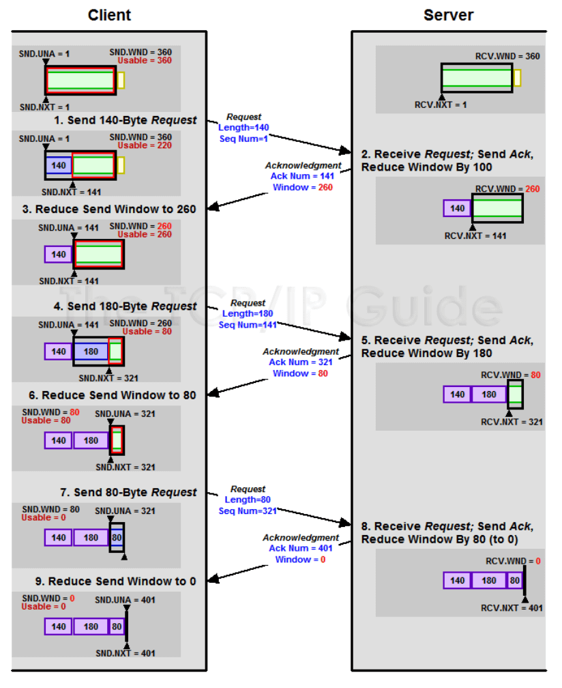
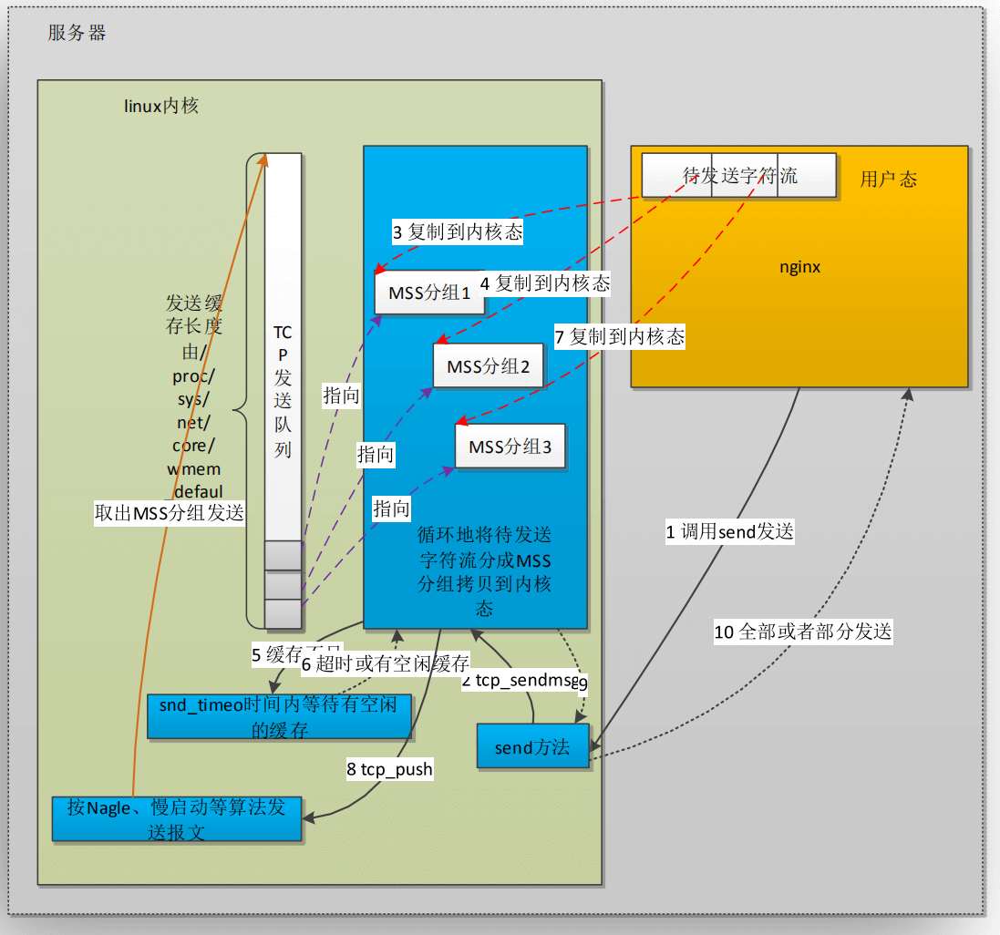
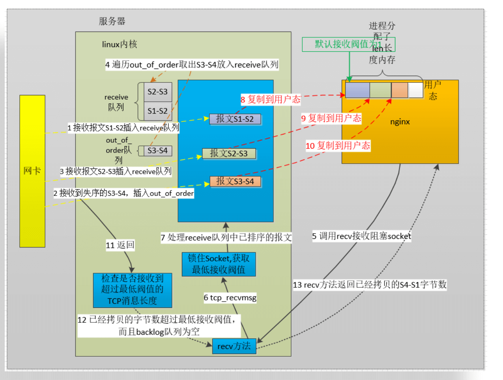
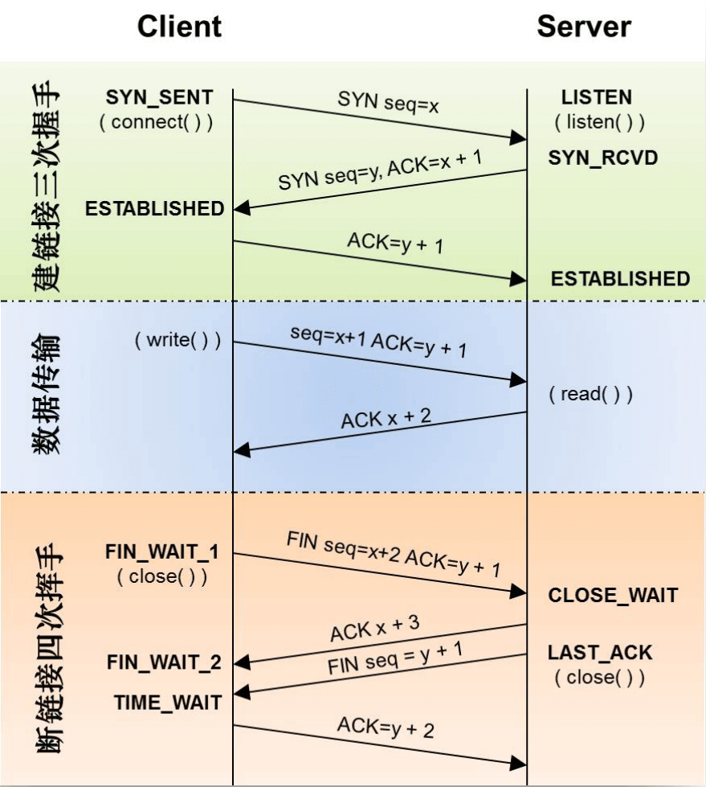

## 1. 优化方法论

从软件层面提升硬件使用效率

* 增大CPU的利用率
* 增大内存的利用率
* 增大磁盘IO的利用率
* 增大网络带宽的利用率


提升硬件规格

* 网卡:万兆网卡，例如10G、25G、 40G等
* 磁盘:固态硬盘、关注IOPS和BPS指标
* CPU:更快的主频，更多的核心，更大的缓存，更优的架构
* 内存:更快的访问速度

超出硬件性能上限后使用DNS，构建Nginx集群。


## 2. CPU

### 如何增加Nginx使用CPU的有效时长


能够使用全部CPU资源

* master- worker多进程架构
* worker进程数量应当等于CPU核数

Nginx进程间不做无用功浪费CPU资源

* worker进程不应在繁忙时,主动让出CPU
  *   worker进程间不应由于争抢造成资源耗散（即  worker进程数量应当等于CPU核数）
*  worker进程不应调用一些API导致主动让出CPU
  *   拒绝类似的第三方模块

  不被其他进程争抢资源

*   提升优先级占用CPU更长的时间
*   减少操作系统上耗资源的非Nginx进程


 


Syntax: **worker_processes** number | auto;

Default: worker_processes 1; 

Context: main

作用：设置worker进程数，auto则会自动设置为CPU核数相同值。设置过小会导致Nginx无法完全利用CPU，过大则或造成资源竞争。


Syntax: **listen** address[:port] [deferred];

Default: listen *:80 | *:8000; 

Context: server

作用：使用TCP DEFER ACCEPT延迟处理新连接。默认情况下，用户每次建立连接都会唤醒 Nginx 子进程一次，但是此时用户并没有发送数据，唤醒也没用，所以可以延迟处理，等用户真正发送数据时处理即可。


```sh
# 查看指定进程的上下文切换次数
pidstat -w -p $pid
```


**什么决定CPU时间片的大小?**

* Nice静态优先级: -20 -- 19
  * 值越大则表示进程越友好，越会把资源让给其他进程，所以对应需要资源的进程可以调低该值

* Priority动态优先级: 0-139


```c
#define SCALE_PRIO(x, prio) \
max(x * (MAX_PRIO - prio) / (MAX_USER_PRIO/2), MIN_TIMESLICE) 
static unsigned int task_timeslice(task_t *p) 
{ 
if (p->static_prio < NICE_TO_PRIO(0)) 
return SCALE_PRIO(DEF_TIMESLICE*4, p->static_prio); 
else 
return SCALE_PRIO(DEF_TIMESLICE, p->static_prio); 
}
```


Syntax: **worker_priority** number;

Default: worker_priority 0; 

Context: main

作用：设置worker进程优先级


### 有效利用CPU缓存

Syntax: 

**worker_cpu_affinity** cpumask ...;

**worker_cpu_affinity** auto [cpumask];

Default: —

Context: main

作用：将worker进程和CPU进行绑定。

* worker 子进程可能会被分配到不同 CPU 核心上运行，则会导致 CPU 缓存失效。
* 一般CPU有L1、L2、L3 三级缓存，其中 L1、L2为私有缓存，速度快，容量小，L3为共享缓存，速度比L1L2慢，但是容量大一些。
* 比如第一次时间片被分配到 CPU 核心1，第二次被分配到 CPU 核心2，此时就用不到 CPU 核心1 上的L1L2高速缓存了。
* 甚至有的服务器上还有多颗物理CPU，这样的话连L3缓存都无法公用了，影响则更大。


## 3. TCP协议相关优化

提升握手速度

提升并发数

提升数据传输速度


### 提升握手速度

主要是控制握手各个阶段的超时时间。

#### SYN_SENT 状态

**net.ipv4.tcp_syn_retries = 6**

主动建立连接时，发送SYN的重试次数。

表示应用程序进行connect()系统调用时，在对方不返回SYN + ACK的情况下(也就是超时的情况下)，第一次发送之后，内核最多重试几次发送SYN包;并且决定了等待时间.

Linux 中的默认值为6，即第一次超时后还会尝试6次，每次的等待时间是上一次等待时间的2倍，具体如下：

- 第 1 次发送 SYN 报文后等待 1s（2 的 0 次幂），如果超时，则重试
- 第 2 次发送后等待 2s（2 的 1 次幂），如果超时，则重试
- 第 3 次发送后等待 4s（2 的 2 次幂），如果超时，则重试
- 第 4 次发送后等待 8s（2 的 3 次幂），如果超时，则重试
- 第 5 次发送后等待 16s（2 的 4 次幂），如果超时，则重试
- 第 6 次发送后等待 32s（2 的 5 次幂），如果超时，则重试
- 第 7 次发送后等待 64s（2 的 6 次幂），如果超时，则超时失败

上面的结果累计刚好是 127 秒。也就是说 Linux 内核在尝试建立 TCP 连接时，最多会尝试 7 次。

> 这个时间已经超级超级长了


**net.ipv4.ip_local_port_range = 32768 60999**

建立连接时的本地端口可用范围。


#### 应用层的超时控制

Syntax: **proxy_connect_timeout** time;

Default: proxy_connect_timeout 60s; 

Context: http, server, location

Syntax: **proxy_connect_timeout** time;

Default: proxy_connect_timeout 60s; 

Context: stream, server


#### SYN_RCVD状态

**net.ipv4.tcp_max_syn_backlog**

SYN_RCVD状态连接的最大个数

**net.ipv4.tcp_synack_retries**

被动建立连接时，发SYN/ACK的重试次数


### SYN攻击

#### TCP 3次握手细节

* 1）客户端发送 SYN 包
* 2）服务端接收到SYN包后将该连接加入到 SYN 队列，并回复 SYN+ACK
* 3）客户端收到 SYN+ACK 包后再次回复 ACK 包
* 4）客户端正确收到ACK包后，将该连接从SYN队列移除，并添加到 ACCETP 队列中
* 5）至此，3次握手完成，连接建立。

可以看到该过程中 SYN 队列和 ACCEPT 队列都会影响到并发数。

* SYN 队列影响同时建立连接的数量
* ACCEPT 则影响最大连接数


#### SYN攻击原理

攻击者短时间伪造不同]IP地址的SYN报文,快速占满backlog队列,使服务器不能为正常用户服务


#### 缓解方案-调整参数

通过调大各个队列长度，可以缓解SYN攻击，但是不能完全解决。

**net.core.netdev_max_backlog**

当网卡接收数据包的速度大于内核处理的速度时，会有一个队列保存这些数据包。这个参数表示该队列的最大值，默认值为 1000；

**net.ipv4.tcp_max_syn_backlog**

SYN_RCVD状态连接的最大个数，就是SYN 队列长度，默认为 1024。

**net.ipv4.tcp_abort on_ overflow**

超出处理能力时,对新来的SYN直接回包RST ,丢弃连接

**net.core.somaxconn**

就是上述的 ACCEPT 队列的长度，超过这个数量就会导致连接超时或者触发重传机制，默认为 128，该参数不能超过 65535。


#### 解决方案-syncookie

**net.ipv4.tcp_syncookies = 0**

是否开启SYN Cookies。当出现SYN等待队列溢出时，启用cookies来处理，可防范少量SYN攻击，默认为0，表示关闭；

> 新版中一般都会开启，即默认值为1了。

开启后，对应每个 SYN 包只会计算 cookie 值，不会立马分配存储空间。同样回复 SYN+ACK，等最终收到客户端的ACK后先验证 cookie，验证通过后才会真正分配存储空间。

这样就避免了 SYN 队列被占满的情况。


### 提升并发连接数

#### 句柄数上限

句柄数限制分为3个层级，操作系统级、用户级和进程级。

操作系统全局

* fs.file-max：操作系统可使用的最大句柄数
* 使用fs.file-nr可以查看当前已分配、正使用、上限
  * 例如：fs.file-nr= 21632 0 40000500
  * 可以通过  sysctl -a |grep file-nr 命令查看

限制用户

*  /etc/security/limits.conf
  * root soft nofile 65535
  * root hard nofile 65535

限制进程：Nginx提供了对应配置

Syntax: **worker_rlimit_nofile** number;

Default: —

Context: main

作用：限制Nginx能打开的句柄数


Syntax: **worker_connections** number;

Default: worker_connections 512; 

Context: events

作用：设置worker进程最大连接数


#### SYN-ACCEPT队列长度

SYN-未完成握手队列

* net.ipv4.tcp_max_syn_backlog = 262144

ACCEPT-已完成握手队列

* net.core.somaxconn：系统级最大backlog队列长度
* Nginx中还可以设置对每个 port 的ACCEPT队列长度


Syntax: listen address[:port] [**backlog=number**]

Default: listen *:80 | *:8000; 

Context: server

作用：设置对应 port 的最大ACCEPT队列长度


### TCP FastOpen

TCP Fast Open（TFO） 是用来加速连续 TCP 连接的数据交互的TCP 协议扩展。由 Google 于 2011 年的论文提出。

优化前 TCP 交互流程如下：


* 1）客户端发送 SYN
* 2）服务端收到后回复 SYN+ACK
* 3）客户端再次回复 ACK
* 4）进入数据交互流程

可以看到此时 3 次握手和数据交互是独立的，需要3次握手之后才能客户端才能发送数据。

后续 TCP 协议的 3 次握手交互流程也进行了优化：


* 1）客户端发送 SYN
* 2）服务端收到后回复 SYN+ACK
* 3）客户端再次回复 ACK 并且到带上 DATA

优化点为 TCP 3 次握手的最后一次 ACK 时客户端就可以发送数据了，相比之前少了一次请求。

> 看似只有一个小优化，实际上对并发量大的服务来说提升还是比较明显的。


那么 TFO 又是如何优化的呢：


* 1）客户端发送SYN数据包，该数据包包含Fast Open选项，且该选项的Cookie为空，这表明客户端请求Fast Open Cookie；
* 2）支持TCP Fast Open的服务器生成Cookie，并将其置于SYN-ACK数据包中的Fast Open选项以发回客户端；
* 3）客户端收到SYN-ACK后，缓存Fast Open选项中的Cookie。

TFO 最大的优化不是首次握手，而是后续的握手，以下描述假定客户端在此前的TCP连接中已完成请求Fast Open Cookie的过程并存有有效的Fast Open Cookie：


* 1）客户端发送SYN数据包，该数据包包含数据（对于非TFO的普通TCP握手过程，SYN数据包中不包含数据）以及此前记录的Cookie；
* 2）支持TCP Fast Open的服务器会对收到Cookie进行校验：如果Cookie有效，服务器将在SYN-ACK数据包中对SYN和数据进行确认（Acknowledgement），服务器随后将数据递送至相应的应用程序；否则，服务器将丢弃SYN数据包中包含的数据，且其随后发出的SYN-ACK数据包将仅确认（Acknowledgement）SYN的对应序列号；
* 3）如果服务器接受了SYN数据包中的数据，服务器可在握手完成之前发送数据；
* 4）客户端将发送ACK确认服务器发回的SYN以及数据，但如果客户端在初始的SYN数据包中发送的数据未被确认，则客户端将重新发送数据；
* 5）此后的TCP连接和非TFO的正常情况一致。

> 注：客户端在请求并存储了Fast Open Cookie之后，可以不断重复TCP Fast Open直至服务器认为Cookie无效（通常为过期）

该功能默认是关闭的，需要在 内核参数中去开启，Linux kernel 3.7 及以上才支持 TCP Fast Open。


**net.ipv4.tcp_fastopen = 0**

指定是否开启 TFO，参数含义如下：

* 0：关闭
* 1：作为客户端时开启
* 2：作为服务端时开启
* 3：作为客户端和服务端都开启 


**net.ipv4.tcp_fastopen_key =  00000000-00000000-00000000-00000000**

设置 TFO 密钥，默认都为0。TFO密钥是16个字节，表示为32个字符的十六进制字符串，分为4个8个字符的块，用短划线分隔，类似这样：

```text
32100e0a-9876daaf-7654b836-21096051
```

该密钥用于对 cookie 进行加密，所以需要写到配置文件中，持久化保存，如果密钥变化了，那么之前的 cookie 都会失效，所以一般不会随意改动密钥。


为防止带数据的SYN攻击,限制最大长度,指定TFO连接队列的最大长度，Nginx中也提供了对应设置：

Syntax: listen address[:port] [fastopen=number];

Default: listen *:80 | *:8000; 

Context: server


## 4. 吞吐量

### 滑动窗口

功能：

* 用于限制连接的网速，解决报文乱序和可靠传输问题
* Nginx中limit_ rate等限速指令皆依赖它实现
* 由操作系统内核实现
* 连接两端各有发送窗口与接收窗口

发送窗口：

* 用于发送内容

接收窗口：

* 用于接收内容




Nginx消息发送底层逻辑：



Nginx消息接收底层逻辑：




#### Nginx的超时指令与滑动窗口

Syntax: **client_body_timeout** time;

Default: client_body_timeout 60s; 

Context: http, server, location

作用：指定两次**读**操作间的超时


Syntax: **send_timeout** time;

Default: send_timeout 60s; 

Context: http, server, location

作用：指定两次**写**操作间的超时

Syntax: **proxy_timeout** timeout;

Default: proxy_timeout 10m; 

Context: stream, server

作用：指定两次**读或写**操作间的超时


#### 丢包重传

限制重传次数

* net.ipv4.tcp_ retries1 = 3
  * 达到上限后，更新路由缓存

* net.ipv4.tcp_ retries2= 15
  * 达到上限后,关闭TCP连接

* 仅作近似理解，实际以超时时间为准，可能少于retries次数就认定达到上限


#### 优化缓冲区与传输效率

**TCP 缓冲区**

**net.ipv4.tcp_rmem = 4096 87380 6291456**

* 读缓存最小值、默认值、最大值,单位字节,覆盖net.core.rmem_ max

**net.ipv4.tcp_wmem = 4096 16384 41 94304**

* 写缓存最小值、默认值、最大值，单位字节，覆盖net.core.wmem_ max

**net.ipv4.tcp_mem = 1541646 2055528 3083292**

* 系统无内存压力、启动压力模式阈值、最大值，单位为页的数量

**net.ipv4.tcp_moderate_rcvbuf= 1**

* 开启自动调整缓存模式


Nginx 中也可以配置读写缓冲区的大小，nginx 中配置后就无法使用到操作系统的自动调整的这个功能了。

Syntax: **listen** address[:port] [rcvbuf=size] [sndbuf=size];

Default: listen *:80 | *:8000; 

Context: server


**调整接收窗口与应用缓存**

net.ipv4.tcp_adv_win_scale = 1

应用缓存 = buffer /(2^tcp_adv_win_scale)


**BDP**

BDP 带宽时延积 = 带宽 * 时延

吞吐量 = 窗口 / 时延


**接口窗口该设置多大呢？**

根据带宽和时延可以计算出最大有多少在飞行中的数据，**最大接收窗口就应该是这个飞行中的数据的值**。


#### Nagle 算法

功能：

* 避免一个连接上同时存在大量小报文
  * 最多只存在一个小报文（即，第一个小报文的ACK收到之前，后续的小报文都不会发出去，会存起来，等收到ACK时一起发送）
  * 合并多个小报文一起发送
* 提高带宽利用率


使用场景：

* 吞吐量优先，则启用该算法，tcp_nodelay off；
* 低时延优先，则关闭该算法，tcp_nodelay on；


Nginx 中的http模块和stream模块都提供了相关配置，控制是否开启该算法，on 表示 nodelay，实际是通过关闭 Nagle 算法来达到 nodelay 的目的的。


Syntax: **tcp_nodelay** on | off;

Default: tcp_nodelay on; 

Context: http, server, location

注意：这是HTTP模块提供的，仅针对 HTTP KeepAlive 连接生效

Syntax: **tcp_nodelay** on | off;

Default: tcp_nodelay on; 

Context: stream, server,

注意：这个是 stream 模块提供的，对所有连接都生效。


同时Nginx自己也可以避免发送小报文

Syntax: **postpone_output** size;

Default: postpone_output 1460; 

Context: http, server, location

作用：指定需要累计到多少字节数时才会把响应数据发送出去，如果当前已经是本次响应的最后一点数据了，则会立即发送，不会受该配置影响。


**CORK 算法**

CORK 算法比 Nagle 算法更严格，一个小报文都不允许。

Nginx中仅针对sendfile on开启时有效,完全禁止小报文的发送,提升网络效率

Syntax: **tcp_nopush** on | off;

Default: tcp_nopush off; 

Context: http, server, location


### 慢启动与拥塞窗口

流量控制具体逻辑：

* 拥塞窗口
  * 发送方主动限制流量
* 通告窗口(对端接收窗口)
  * 接收方限制流量
* 实际流量
  * 拥塞窗口与通告窗口二者的最小值


因为网络都是多对多的，所以需要从发送方和接收方分别进行控制。

> 比如客户端网络比较好，可以接收很多数据，但是服务端需要同时发送给多个客户端，如果都按照客户端的最大接收值发送，就可能会造成网络堵塞。


#### 拥塞控制

**慢启动**

* 指数扩展拥塞窗口( cwnd为拥塞窗口大小)
  * 每收到1个ACK , cwnd = cwnd +1
  * 每过一个RTT,cwnd=cwnd * 2

**拥塞避免:窗口大于threshold**

* 线性扩展拥塞窗口
  * 每收到1个ACK , cwnd = cwnd + 1/cwnd
  * 每过一个RTT ,窗口加1

**拥塞发生**

* 急速降低拥塞窗口
  * RTO超时, threshold = cwnd/2, cwnd= 1
  * Fast Retransmit，收到3个duplicate ACK , cwnd = cwnd/2，threshold = cwnd

**快速恢复**

* 当Fast Retransmit出现时, cwnd调整为threshold + 3*MSS


**RTT: Round Trip Time**

* 时刻变化
* 组成
  * 物理链路传输时间
  * 末端处理时间
  * 路由器排队处理时间
* 指导RTO

**RTO: Retransmission TimeOut**

* 正确的应对丢包


### TCP的 Keep-Alive功能

应用场景

* 检测实际断掉的连接
* 用于维持与客户端间的防火墙有活跃网络包


Linux的tcp keepalive

* 发送心跳周期
  * net.ipv4.tcp_ keepalive_ _time = 7200(秒)
* 探测包发送间隔
  * net.ipv4.tcp_ keepalive_ intvl = 75
* 探测包重试次数
  * net.ipv4.tcp_ keepalive_ probes = 9


Nginx的Tcp-keepalive

* so keepalive= =30m::10
* keepidle, keepintvl, keepcnt


### 减少 time_wait 状态连接




#### 被动关闭连接端的状态

CLOSE_WAIT状态

* 应用进程没有及时响应对端关闭连接

LAST_ACK状态

* 等待接收主动关闭端操作系统发来的针对FIN的ACK报文


#### 主动关闭连接端的状态

fin_ wait1状态

* net.ipv4.tcp_ orphan_ retries= 0：发送FIN报文的重试次数, 0相当于8

fin_ wait2状态

* net.ipv4.tcp_ fin_ timeout = 60：保持在FIN WAIT 2状态的时间


**time_ wait状态有什么作用?**

保证在至少一次报文的往返时间内端口是不可复用的，保证遗留在网络中的报文过期。

> 假设由于 IP 协议的不可靠性或者是其它网络原因，导致 Server 没有收到 Client 最后回复的 ACK。那么 Server 就会在超时之后继续发送 FIN，如果 Client 端在等待 2MSL 时间后都没收到信息，就可以说明 Server 端已经收到自己发送的 ACK 并且成功关闭了，此时自己也可以关闭了。


#### TIME_WAIT 优化


**net.ipv4.tcp_tw_reuse = 1**

* 开启后，作为客户端时新连接可以使用仍然处于TIME-WAIT状态的端口
* 由于timestamp的存在， 操作系统可以拒绝迟到的报文
  * net.ipv4.tcp_ timestamps= 1


**net.ipv4.tcp_tw_recycle= 0**

* 开启后，同时作为客户端和服务器都可以使用TIME_WAIT状态的端口
* 不安全，无法避免报文延迟、重复等给新连接造成混乱


**net.ipv4.tcp_max_tw_buckets = 262144**

* time_wait状态连接的最大数量
* 超出后直接关闭连接


### lingering_close 延迟关闭

#### lingering_close的意义

当Nginx处理完成调用close关闭连接后,若接收缓冲区仍然收到客户端发来的内容,则服务器会向客户端发送RST包关闭连接,导致客户端由于收到RST而忽略了http response。


#### lingering 配置指令


Syntax: **lingering_close** off | on | always;

Default: lingering_close on; 

Context: http, server, location

作用：配置是否开启延迟关闭功能。

参数含义：

off :关闭功能
on:由Nginx判断,当用户请求未接收完(根据chunk或者Content-Length头部等)时启用功能,否则
及时关闭连接
always :无条件启用功能

Syntax: **lingering_time** time;

Default: lingering_time 30s; 

Context: http, server, location

作用：指定开启延迟关闭功能后，最长的读取用户请求内容的时间，超过该时间后立即关闭连接。


Syntax: **lingering_timeout** time;

Default: lingering_timeout 5s; 

Context: http, server, location

作用：当功能启用时,检测客户端是否仍然有请求内容发送过来,若超时后仍没有数据到达,则立刻关闭连接。


### 以RST代替正常的四次挥手关闭连接

当其他读、写超时指令生效引发连接关闭时,通过发送RST立刻释放端口、内存等资源来关闭连接。

> 因为超时的时候，大概率是客户端出问题了，如果这时候还走正常的四次挥手关闭流程，肯定无法正常关闭，最终导致这个端口迟迟得不到释放。

Syntax: **reset_timedout_connection** on | off;

Default: reset_timedout_connection off; 

Context: http, server, location


## 5. 应用层协议的优化

### TLS/SSL优化握手性能

Syntax: **ssl_session_cache** off | none | [builtin[:size]] [shared:name:size];

Default: ssl_session_cache none; 

Context http, server

作用：指定是否使用 ssl_session_cache.

参数含义：

* off
  * 不使用Session缓存，且Nginx在协议中明确告诉客户端Session缓存不被使用
* none
  *  不使用Session缓存
* builtin
  * 使用OpenssI的Session缓存， 由于在内存中使用，所以仅当同一客户端的两次连接都命中到同一个worker进程时，Session缓存才 会生效
* shared:name:size
  * 定义共享内存，为所有worker进程提供Session缓存服务。 1MB大约可用于4000个Session

> 一般使用 shared:name:size,定义共享内存来存储cache。


### TLS/SSL 中的会话票证tickets

Nginx将会话Session中的信息作为tickets加密发给客户端，当客户端下次发起TLS连接时带上
tickets，由Nginx解密验证后复用会话Session，而不是再次进行非对称加密。

> 非对称加密是比较消耗资源的，所以这个功能也能提升性能。

会话票证虽然更易在Nginx集群中使用，**但破坏了TLS/SSL的安全机制，有安全风险**，必须频繁
更换tickets密钥。


Syntax: **ssl_session_tickets** on | off;

Default: ssl_session_tickets on; 

Context: http, server

作用：是否开启会话票证功能。


Syntax: **ssl_session_ticket_key** file;

Default: —

Context: http, server

作用：指定使用会话票证时加密tickets的密钥文件


### HTTP 长链接

优点：

* 减少握手次数
* 通过减少并发连接数减少了服务器资源的消耗
* 降低TCP拥塞控制的影响


Syntax: **keepalive_requests** number;

Default: keepalive_requests 100; 

Context: http, server, location

Syntax: **keepalive_requests** number;

Default: keepalive_requests 100; 

Context: upstream


### gzip 压缩

**功能:**

通过实时压缩http包体，提升网络传输效率

**模块:**

ngx_ http_ gzip_ module, 通过--without-http_ gzip_ module禁用模块


Syntax: **gzip** on | off;

Default: gzip off; 

Context: http, server, location, if in location


**压缩哪些请求的响应？**

Syntax: **gzip_types** mime-type ...;

Default: gzip_types text/html; 

Context: http, server, location

作用：指定压缩哪些文件类型。

Syntax: **gzip_min_length** length;

Default: gzip_min_length 20; 

Context: http, server, location

作用：指定至少要多大的文件才会进行压缩，小文件压缩意义不大。

Syntax: **gzip_disable** regex ...;

Default: —

Context: http, server, location

作用：指定哪些文件不压缩。

Syntax: **gzip_http_version** 1.0 | 1.1;

Default: gzip_http_version 1.1; 

Context: http, server, location

作用：指定哪个http version 才会进行压缩。


**是否压缩上游的响应**

Syntax: **gzip_proxied** off | expired | no-cache | no-store | private | no_last_modified | no_etag|auth | any ...;

Default: gzip_proxied off; 

Context: http, server, location

参数含义：

* off
  * 不压缩来自上游的响应

* expired
  * 如果上游响应中含有Expires头部， 且其值中的时间与系统时间比较后确定不会缓存，则压缩响应
* no-cache
  * 如果上游响应中含有"Cache-Control" 头部，且其值含有"no-cache"值，则压缩响应
* no- store
  * 如果上游响应中含有"Cache-Control" 头部,且其值含有"no-store"值， 则压缩响应

* private
  * 如果上游响应中含有"Cache-Control” 头部，且其值含有"private"值,则压缩响应
* no_last_modified
  * 如果上游响应中没有"Last-Modified” 头部， 则压缩响应

* no_etag
  * 如果上游响应中没有"ETag” 头部，则压缩响应

* auth
  * 如果客户端请求中含有"Authorization” 头部，则压缩响应
* any
  * 压缩所有来自上游的响应


**其他压缩参数**

Syntax: **gzip_comp_level** level;

Default: gzip_comp_level 1; 

Context: http, server, location

Syntax: **gzip_buffers** number size;

Default: gzip_buffers 32 4k|16 8k; 

Context: http, server, location

Syntax: **gzip_vary** on | off;

Default: gzip_vary off; 

Context: http, server, location


### 升级HTTP2协议

* 向前兼容http/1.x协议
* 传输效率大幅度提升


## 6. 磁盘IO优化

### 磁盘介质

机械硬盘

* 价格低
* 存储量大
* BPS较大:适用于顺序读写
* IOPS较小
* 寿命长

固态硬盘

* 价格高
* 存储量小
* BPS大
* IOPS大:适用于随机读写
* 写寿命短

光考虑性能因素的话，固态硬盘肯定是比机械硬盘好的。


### 减少磁盘IO

优化读取

* Sendfile零拷贝
* 内存盘、SSD盘

减少写入

* AIO
* 增大error_log级别
  * 降低记录的日志数
* 关闭access_log
* 压缩access_log
  * 压缩即写入磁盘的数据量
* syslog替代本地IO

线程池thread pool


#### 磁盘高速缓存

操作系统默认会用到磁盘缓存，具体流程如下：

读取

* 先从磁盘加载到缓冲区
* 再从缓冲区读取到用户缓冲区

写入

* 先写入到磁盘缓冲区
* 再写入到磁盘
  * 具体策略由操作系统决定


优点：读取到缓冲区后，下次读取就不需要再从磁盘加载了，大幅提升速度。同样的，写入也是实现了一个批量写的功能。

缺点：多了一个缓冲区需要多拷贝一次。

> 对于小文件，缓冲区利大于弊，但是对于大文件则是弊大于利。因为缓冲区大小有限，大文件肯定是存不下的。

#### 适用于大文件-直接IO

当磁盘上的文件大小超过size后,启用directIO功能,避免Buffered IO模式下磁盘页缓存中的拷贝消耗。

Syntax: **directio** size | off;

Default: directio off; 

Context: http, server, location

作用：指定在处理多大的文件时使用直接IO、

Syntax: **directio_alignment** size;

Default: directio_alignment 512; 

Context: http, server, location

作用：指定以directio方式读取文件时的对齐方式。一般情况下，512B已经足够了，但针对一些高性能文件系统，如Linux下的XFS文件系统，可能需要设置到4KB作为对齐方式。


#### 异步IO

开启异步IO后，在执行IO操作时，用户线程不会被阻塞，还是可以处理其他任务。

Syntax: **aio** on | off | threads[=pool];

Default: aio off; 

Context: http, server, location

作用：是否开启AIO，只对读操作生效。

Syntax: **aio_write** on | off;

Default: aio_write off; 

Context: http, server, location

作用：对于写操作是否也启用AIO。因为有磁盘缓冲区的存在，写到缓冲区时很快的，没必要使用AIO。只有再接收上游服务响应且需要写到临时文件时可以开启写AIO，其他情况都不建议开启。


**异步读IO线程池**

编译时增加 --with-threads 参数。

> Nginx 中绝大部分场景都是异步的，不会阻塞，只有再做静态资源服务且文件特别多时会出现阻塞请求，需要用到线程池。

Syntax: **thread_pool** name threads=number [max_queue=number];

Default: thread_pool default threads=32 max_queue=65536; 

Context: main

作用：定义线程池。


**异IO中的缓存**

将磁盘文件读入缓存中待处理，例如gzip模块会使用

Syntax: **output_buffers** number size;

Default: output_buffers 2 32k; 

Context: http, server, location

作用：指定缓存空间大小。默认2*32K。


### 减少磁盘读写次数

#### empty_gif 模块

**模块:**

ngx_http_empty_gif_module模块， 通过-without-http_empty_gif_module禁用模块

**功能:**

* 从前端页面做用户行为分析时，由于跨域等要求，前端打点的上报数据一 般是GET请求，且考虑到浏览器解析DOM树的性能消耗，所以请求透明图片消耗最小，而1*1的gif图片体积最小(仅43字节) ,故通常请求gif图片,并在请求中把用户行为信息上报服务器。
* Nginx可以在access 日志中获取到请求参数,进而统计用户行为。但若在磁盘中读取1x1的文件则有磁盘IO消耗，**empty_ gif模块将图片放在内存中**，加快了处理速度。


Syntax: **empty_gif;**

Default: —

Context: location


#### access 日志压缩

Syntax: **access_log** path [format **[buffer=size] [gzip[=level]] [flush=time]** [if=condition]];

Default: access_log logs/access.log combined; 

Context: http, server, location, if in location, limit_except


* buffer默认64KB
* gzip默认级别为1
* 通过zcat解压查看


#### error.log 日志输出到内存

**场景:**

在开发环境下定位问题时，若需要打开debug级别日志，但对debug级别大量日志引发的性能问
题不能容忍，可以将日志输出到内存中

**配置语法:**

* error_log memory:32m debug; 
* 32m 为空间大小，循环空间，超过后会覆盖旧的内容。

**查看内存中日志的方法：**

* gdb -p [worker(!id] -ex "source nginx.gdb" --batch

nginx.gdb 脚本内容如下：

```shell
set $log = ngx_cycle->log 
while $log->writer != ngx_log_memory_writer 
set $log = $log->next 
end 
set $buf = (ngx_log_memory_buf_t *) $log->wdata 
dump binary memory debug_log.txt $buf->start $buf->end
```


#### syslog

通过 syslog 网络协议将日志写到别的机器上去。

```conf
	# 这是原来的配置, 记录访问日志到本地文件
    access_log  /var/log/nginx/access.log  main;
    # 增加这一行同时记录访问日志到syslog服务器10.41.56.42上, syslog默认端口514
    access_log  syslog:server=10.41.56.42:514,facility=local7,tag=nginx_client,severity=info;
```

配置项含义：

* server
  * syslog 服务器地址
* facility
  * 发送给syslog需要提供的机构名称,
  * 默认用 local7 就行了
  * 具体参见RFC3164
* severity
  * 事件级别/类型
* tag
  * 定义日志的 tag，默认为 nginx
* nohostname
  * 不向syslog中写入主机名hostname


### 零拷贝与gzip_static

#### sendfile 零拷贝提升性能


* 减少进程间切换
* 减少内存拷贝次数

如何开启

```conf
location / {
	# 开启零拷贝
	sendfile on;
}
```

注：直接IO会自动禁用sendfile功能。

比如以下配置：

```conf
location / {
	sendfile on;
	aio on;
	directio 8m;
}
```

当文件超过8m时，启用AIO与directio，sendfile则别禁用了。


#### gzip_static 模块

**背景**

在使用 gzip 后，必须要将文件读取到内存才能进行压缩，这样就用不到零拷贝了。对应静态文件完全可以预先进行压缩，请求时直接返回压缩好的文件即可，这样既用到了压缩又可以用上零拷贝。

gzip_static 模块就是提供这个功能的。

**模块:**

ngx_http_gzip_static_module, 通过--with-http_gzip_static_module启用模块

**功能:**

检测到同名 `.gz` 文件时，response中以gzip相关header直接返回`.gz`文件的内容。


Syntax: **gzip_static** on | off | always;

Default: gzip_static off; 

 Context:  http, server, location

作用：指定是否开启 gzip_static 功能。

参数含义：

* on：开启，如果客户端不支持gzip，而且本地也有未压缩的文件则会返回未压缩的文件
* off：关闭
* always：也是开启，不管客户端支不支持gzip都强制返回压缩后的文件


如果客户端不支持 gzip功能，那么使用gzip_static发送一个压缩文件回去可能会有一些问题，所以出现了 gunzip 模块。

**gunzip 模块**

**模块:**

ngx_ http_ gunzip_ module, 通过--wih-http _gunzip_ module启用模块

**功能:**

当客户端不支持gzip时，且磁盘上仅有压缩文件，则实时解压缩并将其发送给客户端

Syntax: **gunzip** on | off;

Default: gunzip off; 

Context: http, server, location

Syntax: **gunzip_buffers** number size;

Default: gunzip_buffers 32 4k|16 8k; 

Context: http, server, location


## 7. 用tcmalloc优化内存分配

默认是用的 glibc，可以使用tcmalloc替换。

更快的内存分配器

* 并发能力强于glibc
  * 并发线程数越多,性能越好
* 减少内存碎片
* 擅长管理小块内存
  

具体 tcmalloc 相关可以看[这篇文章](http://goog-perftools.sourceforge.net/doc/tcmalloc.html)


**如何使用：**

编译google perf tools,得到tcmalloc库

* https://github.com/gperftools/gperftools/releases
* 会在 `/lib64/libtcmalloc.so.x/` 目录下生成 libtcmalloc.so.x 文件（x为版本号）

编译nginx时，加入编译选项

* C语言生成可执行文件的两个步骤
  * 通过configure设定编译的额外参数
    * --with-cc-opt=OPTIONS set additional C compiler option
  * 通过configure设定链接的额外参数
    * --with-ld-opt= OPTIONS set additional linker options
* --with-ld-opt-=-ltcmalloc --with-google_perftools_module
  * 一定要增加 --with-ld-opt-=-ltcmalloc 这句，只增加modle是不会生效的


## 8. 监控与分析

### 使用gperftools定位nginx性能问题

gperftools库:

* https://github.com/gperftools/gperftools/releases

结果展示

* 文本展示
  * pprof --text
* 图形展示
  * pprof --pdf
  * 依赖graphviz

依赖

* https://github.com/ibunwind/libunwind/releases

模块

* ngx_google_perftoos_module ,通过-- with-google_perftools_module启用


Syntax: **google_perftools_profiles** file;

Default: —

Context: main

作用：指定生成的结果存放位置。


**查看方式**

生成的文件是无法直接查看的，需要解析后才能查看：

```sh
pprof --text /path/to/your/file/xxx
```


**文本方式结果展示**

```text
2 0.9% 51.3% 166 73.5% ngx_epoll_process_events

1 0.4% 96.5% 2 0.9% ngx_open_and_stat_file
```

具体含义：

第1列:当前函数的执行总共花的统计周期数

第2列:当前函数执行时间的百分比

第3列:当前函数及其之前的函数调用执行时间的百分比

第4列:当前函数及其所调用函数消耗的统计周期数总和

第5列:当前函数及其所调用函数执行时间总和的百分比

第6列:函数名称

> 每个统计周期是 10 毫秒


### 使用stub_status模块监控Nginx的状态

 **模块:**
ngx_http_stub_status_module ,通过--with-http_stub_status_module启用模块

**功能:**

通过HTTP接口,实时监测nginx的连接状态。

统计数据存放于共享内存中,所以统计值包含所有worker进程,且执行reload不会导致数据清0 ,但热升级会导致数据清0。

Syntax: **stub_status;**

Default: —

Context: server, location

作用：配置该指令后，即开启了该功能


具体示例

```conf
location /status {
	stub_status;
}
```

此时访问 /status 即可看到统计数据。


大致返回结果是这样的

```txt
Active connections: 1 
server accepts handled requests
2511 2511 4764 
Reading: 0 Writing: 1 Waiting: 0
```


累计数据

* Active connections
  * 当前客户端与Nginx间的TCP连接数,等于下面Reading、Writing、 Waiting数量之和
* accepts
  * 自Nginx启动起 ,与客户端建立过的连接总数
* handled
  * 自Nginx启动起,处理过的客户端连接总数。如果没有超出worker_connections配置,该值与accepts相同
* requests
  * 自Nginx启动起 ,处理过的客户端请求总数。由于存在HTTP Keep-Alive请求,故requests值会大于handled值

实时数据

* Reading
  * 正在读取HTTP请求头部的连接总数
* Writing
  * 正在向客户端发送响应的连接总数
* Waiting
  * 当前空闲的HTTP Keep-Alive连接总数

