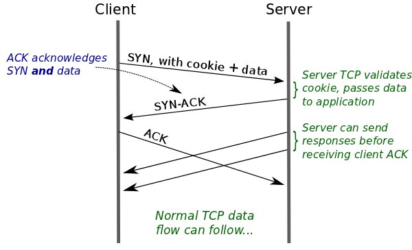

# Nginx 调优

Nginx 本身性能已经优化到极致了，但是还是有一些细节可以收到进行处理。

本文的调优主要包括 CPU 和 TCP 两个方面。

## CPU 相关

### CPU 调度机制

CPU(单核) 同一时间只能执行一个程序，CPU 调度程序则是将 CPU 时间片划分为多分，分给各个进程。

每个进程拿到时间片后才能执行，时间到了CPU就会切换去执行另外的进程。

因此Nginx和CPU相关的优化规则就比较清晰了：

* 尽可能占用全部的CPU资源
  * 即将Nginx worker 进程数设置为CPU核数一致
* 尽可能占用更大的CPU时间片，减少进程间切换
  * CPU在进程间切换是有消耗的，减少切换以提升性能


### 优化策略

* 指定 worker 子进程个数和 CPU 核心数一致，充分利用 CPU 资源；
  * worker_processes auto;
* 将 worker 子进程与每个 CPU 绑定,充分利用 CPU 缓存
  * worker_cpu_affinity 01 10 01 10;
  * worker 子进程可能会被分配到不同 CPU 核心上运行，则会导致 CPU 缓存失效。
  * 一般CPU有L1、L2、L3 三级缓存，其中 L1、L2为私有缓存，速度快，容量小，L3为共享缓存，速度比L1L2慢，但是容量大一些。
  * 比如第一次时间片被分配到 CPU 核心1，第二次被分配到 CPU 核心2，此时就用不到 CPU 核心1 上的L1L2高速缓存了。
  * 甚至有的服务器上还有多颗物理CPU，这样的话连L3缓存都无法公用了，影响则更大。
* 提高 worker 子进程的进程优先级,保证 CPU 资源优先满足 Nginx 运行。
  * worker_priority -20;
  * 如果同一机器上还运行了其他服务则推荐设置，防止其他服务抢占了大量资源，最终 Nginx 因为没有资源导致运行缓慢。
* 延迟处理新连接
  * listen 80 deferred;
  * 默认情况下，用户每次建立连接都会唤醒 Nginx 子进程一次，但是此时用户并没有发送数据，唤醒也没用，所以可以延迟处理，等用户真正发送数据时处理即可。
  * 该设置可以减少大量无效的唤醒。


##  TCP 相关


### TCP 内核参数

注意：内核参数影响的是整个服务器，并不是只影响Nginx，下面的描述只是以 Nginx 为例而已。

>  永久修改需要将对应配置写入到 /etc/sysctl.conf 文件中。
>
> 并通过 sysctl -p 重新加载配置。

**net.ipv4.tcp_syn_retries = 6**

表示应用程序进行connect()系统调用时，在对方不返回SYN + ACK的情况下(也就是超时的情况下)，第一次发送之后，内核最多重试几次发送SYN包;并且决定了等待时间.

Linux 中的默认值为6，即第一次超时后还会尝试6次，每次的等待时间是上一次等待时间的2倍，具体如下：

- 第 1 次发送 SYN 报文后等待 1s（2 的 0 次幂），如果超时，则重试
- 第 2 次发送后等待 2s（2 的 1 次幂），如果超时，则重试
- 第 3 次发送后等待 4s（2 的 2 次幂），如果超时，则重试
- 第 4 次发送后等待 8s（2 的 3 次幂），如果超时，则重试
- 第 5 次发送后等待 16s（2 的 4 次幂），如果超时，则重试
- 第 6 次发送后等待 32s（2 的 5 次幂），如果超时，则重试
- 第 7 次发送后等待 64s（2 的 6 次幂），如果超时，则超时失败

上面的结果累计刚好是 127 秒。也就是说 Linux 内核在尝试建立 TCP 连接时，最多会尝试 7 次。

> 这个时间已经超级超级长了

**对Nginx的影响**

如果配置了 upstream，向上游服务器建立TCP连接时，超时时间则由该参数控制。**如果是内网环境，网络延迟低，可以把该参数调小。**


**net.ipv4.tcp_synack_retries = 5**

和`net.ipv4.tcp_syn_retries`类似，只不过这个是服务器收到 sync 后，返回 ack 包的重试次数。

Linux 中默认值为 5，规则和`net.ipv4.tcp_syn_retries`一致：

- 第 1 次发送 ACK 报文后等待 1s（2 的 0 次幂），如果超时，则重试
- 第 2 次发送后等待 2s（2 的 1 次幂），如果超时，则重试
- 第 3 次发送后等待 4s（2 的 2 次幂），如果超时，则重试
- 第 4 次发送后等待 8s（2 的 3 次幂），如果超时，则重试
- 第 5 次发送后等待 16s（2 的 4 次幂），如果超时，则重试
- 第 6 次发送后等待 32s（2 的 5 次幂），如果超时，则超时失败

累计是 63 秒。

* Nginx作为服务端，再于客户端建立TCP连接时，接收到客户端的 sync 包后，回应客户端 ack  包的最大重试次数


### TCP 3次握手细节

* 1）客户端发送 SYN 包
* 2）服务端接收到SYN包后回复 SYN+ACK 并将该连接加入到 SYN 队列
* 3）客户端收到 SYN+ACK 包后再次回复 ACK 包
* 4）客户端正确收到ACK包后，将该连接从SYN队列移除，并添加到 ACCETP 队列中
* 5）至此，3次握手完成，连接建立。

可以看到该过程中 SYN 队列和 ACCEPT 队列都会影响到并发数。

* SYN 队列影响同时建立连接的数量
* ACCEPT 则影响最大连接数


如何调整

* SYN 队列长度由内核参数 `net.ipv4.tcp_max_syn_backlog` 控制
* ACCEPT 队列长度由内核参数 `net.core.somaxconn`控制
* Nginx 中也可以调整每个 server 的 ACCEPT 队列长度，最大值还是受内核参数限制。
  * 在配置 server 时添加参数 backlog = xxx;
  * 例如：listen 80 backlog 2000；则表示该 server 可以接收2000个连接。


### SYN Flood 攻击

根据上文可以知道内核在接收到 SYN 包后就会将该连接加入 SYN队列，而SYN队列长度是有限的，如果攻击者故意伪造大量IP发送SYN包，服务器收到后依旧会将这些伪造的连接加入 SYN 队列，并回复SYN+ACK，而由于IP是伪造的，永远不会收到ACK回复，但是此时该连接已经被加入到SYN队列了，导致SYN队列被占满，最终正常用户无法建立连接，从而导致服务不可用。

**net.ipv4.tcp_syncookies = 0**

是否开启SYN Cookies。当出现SYN等待队列溢出时，启用cookies来处理，可防范少量SYN攻击，默认为0，表示关闭；

> 新版中一般都会开启，即默认值为1了。

开启后，对应每个 SYN 包只会计算 cookie 值，不会立马分配存储空间。同样回复 SYN+ACK，等最终收到客户端的ACK后先验证 cookie，验证通过后才会真正分配存储空间。

这样就避免了 SYN 队列被占满的情况。


**net.core.netdev_max_backlog**

当网卡接收数据包的速度大于内核处理的速度时，会有一个队列保存这些数据包。这个参数表示该队列的最大值，默认值为 1000；

**net.ipv4.tcp_max_syn_backlog**

SYN 队列长度，默认为 1024。

**net.core.somaxconn**

就是上述的 ACCEPT 队列的长度，超过这个数量就会导致连接超时或者触发重传机制，默认为 128，该参数不能超过 65535。


### TCP FastOpen

TCP Fast Open（TFO） 是用来加速连续 TCP 连接的数据交互的TCP 协议扩展。

由 Google 于 2011 年的论文提出

优化前 TCP 交互流程如下：


* 1）客户端发送 SYN
* 2）服务端收到后回复 SYN+ACK
* 3）客户端再次回复 ACK
* 4）进入数据交互流程

可以看到此时 3 次握手和数据交互是独立的，需要3次握手之后才能客户端才能发送数据。

后续 TCP 协议的 3 次握手交互流程也进行了优化：


* 1）客户端发送 SYN
* 2）服务端收到后回复 SYN+ACK
* 3）客户端再次回复 ACK 并且到带上 DATA

优化点为 TCP 3 次握手的最后一次 ACK 时客户端就可以发送数据了，相比之前少了一次请求。

> 看似只有一个小优化，实际上对并发量大的服务来说提升还是比较明显的。


那么 TFO 又是如何优化的呢：


* 1）客户端发送SYN数据包，该数据包包含Fast Open选项，且该选项的Cookie为空，这表明客户端请求Fast Open Cookie；
* 2）支持TCP Fast Open的服务器生成Cookie，并将其置于SYN-ACK数据包中的Fast Open选项以发回客户端；
* 3）客户端收到SYN-ACK后，缓存Fast Open选项中的Cookie。

TFO 最大的优化不是首次握手，而是后续的握手，以下描述假定客户端在此前的TCP连接中已完成请求Fast Open Cookie的过程并存有有效的Fast Open Cookie：




* 1）客户端发送SYN数据包，该数据包包含数据（对于非TFO的普通TCP握手过程，SYN数据包中不包含数据）以及此前记录的Cookie；
* 2）支持TCP Fast Open的服务器会对收到Cookie进行校验：如果Cookie有效，服务器将在SYN-ACK数据包中对SYN和数据进行确认（Acknowledgement），服务器随后将数据递送至相应的应用程序；否则，服务器将丢弃SYN数据包中包含的数据，且其随后发出的SYN-ACK数据包将仅确认（Acknowledgement）SYN的对应序列号；
* 3）如果服务器接受了SYN数据包中的数据，服务器可在握手完成之前发送数据；
* 4）客户端将发送ACK确认服务器发回的SYN以及数据，但如果客户端在初始的SYN数据包中发送的数据未被确认，则客户端将重新发送数据；
* 5）此后的TCP连接和非TFO的正常情况一致。

> 注：客户端在请求并存储了Fast Open Cookie之后，可以不断重复TCP Fast Open直至服务器认为Cookie无效（通常为过期）

该功能默认是关闭的，需要在 内核参数中去开启，Linux kernel 3.7 及以上才支持 TCP Fast Open。


**net.ipv4.tcp_fastopen = 0**

指定是否开启 TFO，参数含义如下：

* 0：关闭
* 1：作为客户端时开启
* 2：作为服务端时开启
* 3：作为客户端和服务端都开启 


**net.ipv4.tcp_fastopen_key =  00000000-00000000-00000000-00000000**

设置 TFO 密钥，默认都为0。TFO密钥是16个字节，表示为32个字符的十六进制字符串，分为4个8个字符的块，用短划线分隔，类似这样：

```text
32100e0a-9876daaf-7654b836-21096051
```

该密钥用于对 cookie 进行加密，所以需要写到配置文件中，持久化保存，如果密钥变化了，那么之前的 cookie 都会失效，所以一般不会随意改动密钥。