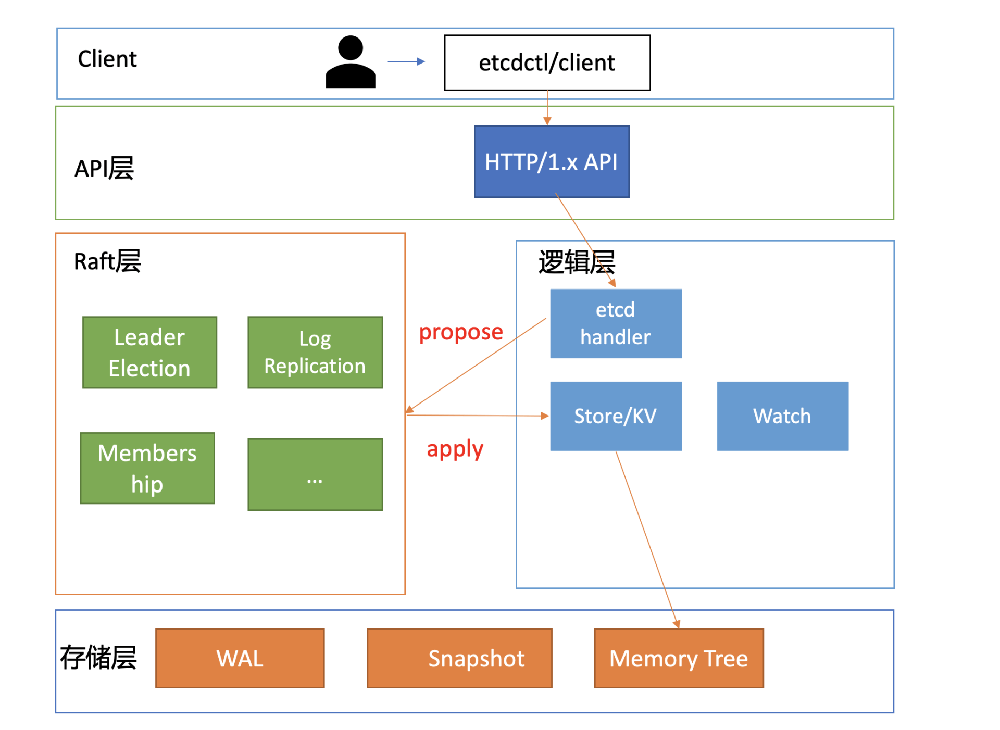
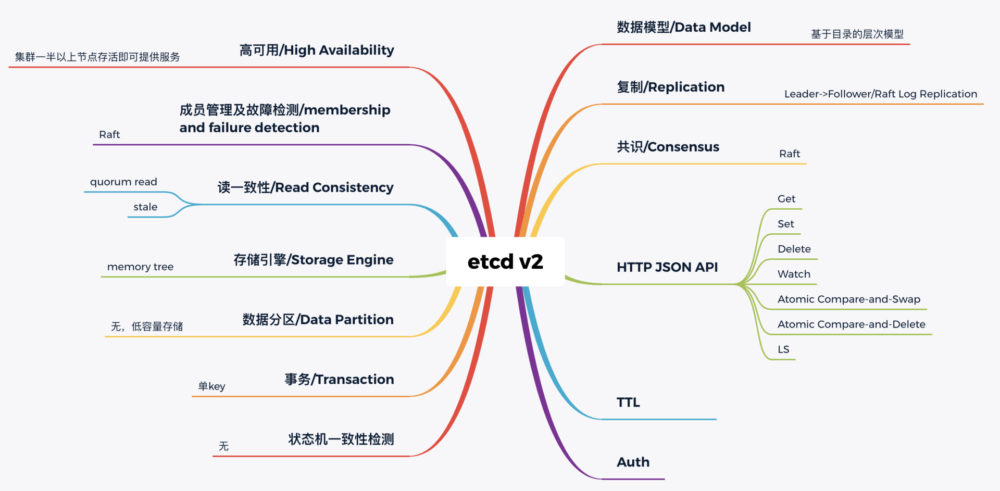
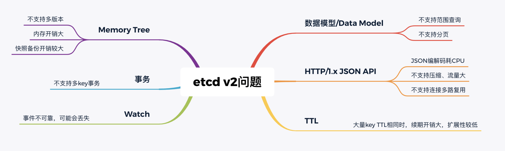

# etcd 的前世今生

## 1. 概述

2013 年，有一个叫 CoreOS 的创业团队，他们构建了一个产品，Container Linux，它是一个开源、轻量级的操作系统，侧重自动化、快速部署应用服务，并要求应用程序都在容器中运行，同时提供集群化的管理方案，用户管理服务就像单机一样方便。

他们希望在重启任意一节点的时候，用户的服务不会因此而宕机，导致无法提供服务，因此需要运行多个副本。但是多个副本之间如何协调，如何避免变更的时候所有副本不可用呢？

CoreOS 团队需要一个协调服务来存储服务配置信息、提供分布式锁等能力。

**一个协调服务，理想状态下大概需要满足以下五个目标**：

* 1）可用性角度：高可用。
* 2）数据一致性角度：提供读取“最新”数据的机制。
* 3）容量角度：低容量、仅存储关键元数据配置。
* 4）功能：增删改查，监听数据变化的机制。
* 5）运维复杂度：可维护性。

然而当时的 ZooKeeper 不支持通过 API 安全地变更成员，需要人工修改一个个节点的配置，并重启进程。导致维护成本较高，因此CoreOS 决定自己造轮子。


## 2. etcd v1 和 v2 诞生

为了解决数据一致性问题，需要引入一个**共识算法**，确保各节点数据一致性，并可容忍一定节点故障。常见的共识算法有 Paxos、ZAB、Raft 等。CoreOS 团队选择了易理解实现的 Raft 算法，它将复杂的一致性问题分解成 Leader 选举、日志同步、安全性三个相对独立的子问题，只要集群一半以上节点存活就可提供服务，具备良好的可用性。


其次我们再来看**数据模型（Data Model）和 API**。数据模型参考了 ZooKeeper，使用的是基于目录的层次模式。API 相比 ZooKeeper 来说，使用了简单、易用的 REST API，提供了常用的 Get/Set/Delete/Watch 等 API，实现对 key-value 数据的查询、更新、删除、监听等操作。key-value 存储引擎上，ZooKeeper 使用的是 Concurrent HashMap，而 etcd 使用的是则是简单内存树，它的节点数据结构精简后如下，含节点路径、值、孩子节点信息。这是一个典型的低容量设计，数据全放在内存，无需考虑数据分片，只能保存 key 的最新版本，简单易实现。

```go
type node struct {
   Path string  //节点路径
   Parent *node //关联父亲节点
   Value      string     //key的value值
   ExpireTime time.Time //过期时间
   Children   map[string]*node //此节点的孩子节点
}
```

最后我们再来看**可维护性**。Raft 算法提供了成员变更算法，可基于此实现成员在线、安全变更，同时此协调服务使用 Go 语言编写，无依赖，部署简单。




那么 etcd 这个名字是怎么来的呢？其实它源于两个方面，unix 的“/etc”文件夹和分布式系统 (“D”istribute system) 的 D，组合在一起表示 etcd 是用于存储分布式配置的信息存储服务。


## 3. Kubernetes 与 etcd

Kubernetes 项目使用 etcd，除了技术因素也与当时的商业竞争有关。CoreOS 是 Kubernetes 容器生态圈的核心成员之一。

当时 Docker 容器浪潮正席卷整个开源技术社区，CoreOS 也将容器集成到自家产品中。一开始与 Docker 公司还是合作伙伴，然而 Docker 公司不断强化 Docker 的 PaaS 平台能力，强势控制 Docker 社区，这与 CoreOS 核心商业战略出现了冲突，也损害了 Google、RedHat 等厂商的利益。

最终 CoreOS 与 Docker 分道扬镳，并推出了 rkt 项目来对抗 Docker，然而此时 Docker 已深入人心，CoreOS 被 Docker 全面压制。

以 Google、RedHat 为首的阵营，基于 Google 多年的大规模容器管理系统 Borg 经验，结合社区的建议和实践，构建以 Kubernetes 为核心的容器生态圈。相比 Docker 的垄断、独裁，Kubernetes 社区推行的是民主、开放原则，Kubernetes 每一层都可以通过插件化扩展，在 Google、RedHat 的带领下不断发展壮大，etcd 也进入了快速发展期。

在 2015 年 1 月，CoreOS 发布了 etcd 第一个稳定版本 2.0，支持了 quorum read，提供了严格的线性一致性读能力。7 月，基于 etcd 2.0 的 Kubernetes 第一个生产环境可用版本 v1.0.1 发布了，Kubernetes 开始了新的里程碑的发展。




## 4. etcd v3 诞生

然而随着 Kubernetes 项目不断发展，v2 版本的瓶颈和缺陷逐渐暴露，遇到了若干性能和稳定性问题，Kubernetes 社区呼吁支持新的存储、批评 etcd 不可靠的声音开始不断出现。




* 功能局限性问题。它主要是指 etcd v2 不支持范围和分页查询、不支持多 key 事务。
* Watch 机制可靠性问题：etcd v2 是内存型、不支持保存 key 历史版本的数据库，只在内存中使用滑动窗口保存了最近的 1000 条变更事件，当 etcd server 写请求较多、网络波动时等场景，很容易出现事件丢失问题，进而又触发 client 数据全量拉取，产生大量 expensive request，甚至导致 etcd 雪崩。
* 性能瓶颈问题。etcd v2 早期使用了简单、易调试的 HTTP/1.x API，但是随着 Kubernetes 支撑的集群规模越来越大，HTTP/1.x 协议的瓶颈逐渐暴露出来。比如集群规模大时，由于 HTTP/1.x 协议没有压缩机制，批量拉取较多 Pod 时容易导致 APIServer 和 etcd 出现 CPU 高负载、OOM、丢包等问题。
* 内存开销问题。etcd v2 在内存维护了一颗树来保存所有节点 key 及 value。在数据量场景略大的场景，如配置项较多、存储了大量 Kubernetes Events， 它会导致较大的内存开销，同时 etcd 需要定时把全量内存树持久化到磁盘。这会消耗大量的 CPU 和磁盘 I/O 资源，对系统的稳定性造成一定影响。

etcd v3 就是为了解决以上稳定性、扩展性、性能问题而诞生的。

在内存开销、Watch 事件可靠性、功能局限上，它通过引入 B-tree、boltdb 实现一个 MVCC 数据库，数据模型从层次型目录结构改成扁平的 key-value，提供稳定可靠的事件通知，实现了事务，支持多 key 原子更新，同时基于 boltdb 的持久化存储，显著降低了 etcd 的内存占用、避免了 etcd v2 定期生成快照时的昂贵的资源开销。

性能上，首先 etcd v3 使用了 gRPC API，使用 protobuf 定义消息，消息编解码性能相比 JSON 超过 2 倍以上，并通过 HTTP/2.0 多路复用机制，减少了大量 watcher 等场景下的连接数。

其次使用 Lease 优化 TTL 机制，每个 Lease 具有一个 TTL，相同的 TTL 的 key 关联一个 Lease，Lease 过期的时候自动删除相关联的所有 key，不再需要为每个 key 单独续期。

最后是 etcd v3 支持范围、分页查询，可避免大包等 expensive request。

2016 年 6 月，etcd 3.0 诞生，随后 Kubernetes 1.6 发布，默认启用 etcd v3，助力 Kubernetes 支撑 5000 节点集群规模。

发展到今天，在 GitHub 上 star 数超过 34K。在 Kubernetes 的业务场景磨炼下它不断成长，走向稳定和成熟，成为技术圈众所周知的开源产品，**而 v3 方案的发布，也标志着 etcd 进入了技术成熟期，成为云原生时代的首选元数据存储产品。**