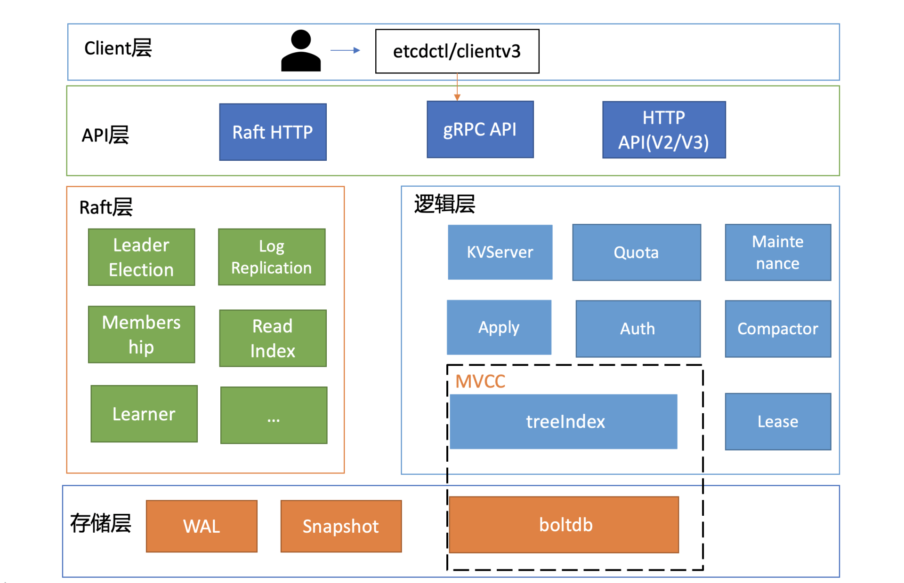
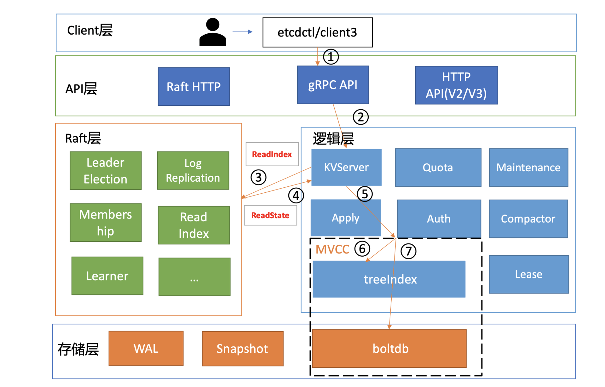

# etcd 读请求执行流程

## 1. 概述

下面是一张 etcd 的简要基础架构图



按照分层模型，etcd 可分为 Client 层、API 网络层、Raft 算法层、逻辑层和存储层。这些层的功能如下：

* **Client 层**：Client 层包括 client v2 和 v3 两个大版本 API 客户端库，提供了简洁易用的 API，同时支持负载均衡、节点间故障自动转移，可极大降低业务使用 etcd 复杂度，提升开发效率、服务可用性。
* **API 网络层**：API 网络层主要包括 client 访问 server 和 server 节点之间的通信协议。一方面，client 访问 etcd server 的 API 分为 v2 和 v3 两个大版本。v2 API 使用 HTTP/1.x 协议，v3 API 使用 gRPC 协议。同时 v3 通过 etcd grpc-gateway 组件也支持 HTTP/1.x 协议，便于各种语言的服务调用。另一方面，server 之间通信协议，是指节点间通过 Raft 算法实现数据复制和 Leader 选举等功能时使用的 HTTP 协议。
* **Raft 算法层**：Raft 算法层实现了 Leader 选举、日志复制、ReadIndex 等核心算法特性，用于保障 etcd 多个节点间的数据一致性、提升服务可用性等，是 etcd 的基石和亮点。
* **功能逻辑层**：etcd 核心特性实现层，如典型的 KVServer 模块、MVCC 模块、Auth 鉴权模块、Lease 租约模块、Compactor 压缩模块等，其中 MVCC 模块主要由 treeIndex 模块和 boltdb 模块组成。
* **存储层**：存储层包含预写日志 (WAL) 模块、快照 (Snapshot) 模块、boltdb 模块。其中 WAL 可保障 etcd crash 后数据不丢失，boltdb 则保存了集群元数据和用户写入的数据。


## 2. 读请求流程

具体流程如下图所示：



以下面的命令进行分析：

```sh
# --endpoint=http://127.0.0.1:2379 用于指定后端的 etcd 地址
/usr/local/bin # etcdctl --endpoint=http://127.0.0.1:2379 put hello world
ok
/usr/local/bin #  --endpoint=http://127.0.0.1:2379 get hello
world
```

### Client

**1）首先，etcdctl 会对命令中的参数进行解析。**

“get”是请求的方法，它是 KVServer 模块的 API；“hello”是我们查询的 key 名，“endpoints”是我们后端的 etcd 地址。

> 通常，生产环境下中需要配置多个 endpoints，这样在 etcd 节点出现故障后，client 就可以自动重连到其它正常的节点，从而保证请求的正常执行。

**2）在解析完请求中的参数后，etcdctl 会创建一个 clientv3 库对象，使用 KVServer 模块的 API 来访问 etcd server。**

etcd clientv3 库采用的负载均衡算法为 **Round-robin**。针对每一个请求，Round-robin 算法通过轮询的方式依次从 endpoint 列表中选择一个 endpoint 访问 (长连接)，使 etcd server 负载尽量均衡。


### KVServer 与 拦截器

client 发送 Range RPC 请求到了 server 后就进入了 KVServer 模块。

etcd 通过**拦截器**以非侵入式的方式实现了许多特性，例如：丰富的 metrics、日志、请求行为检查、所有请求的执行耗时及错误码、来源 IP 等。

拦截器提供了在执行一个请求前后的 hook 能力，除了 debug 日志、metrics 统计、对 etcd Learner 节点请求接口和参数限制等能力，etcd 还基于它实现了以下特性:

* 1）要求执行一个操作前集群必须有 Leader；
* 2）请求延时超过指定阈值的，打印包含来源 IP 的慢查询日志 (3.5 版本)。

server 收到 client 的 Range RPC 请求后，根据 ServiceName 和 RPC Method 将请求转发到对应的 handler 实现，handler 首先会将上面描述的一系列拦截器串联成一个拦截器再执行（具体实现见[这里](https://github.com/grpc/grpc-go/blob/master/server.go#L1093)），在拦截器逻辑中，通过调用 KVServer 模块的 Range 接口获取数据。


### 串行读与线性读

 etcd 为了保证服务高可用，生产环境一般部署多个节点，多节点之间的数据由于延迟等关系可能会存在不一致的情况。

当 client 发起一个写请求后分为以下几个步骤：

* 1）Leader 收到写请求，它会将此请求持久化到 WAL 日志，并广播给各个节点；
  * 只有 Leader 节点能处理写请求。
* 2）若一半以上节点持久化成功，则该请求对应的日志条目被标识为已提交；
* 3）etcdserver 模块异步从 Raft 模块获取已提交的日志条目，应用到状态机 (boltdb 等)。

可以看出在多节点 etcd 集群中，各个节点的状态机数据一致性存在差异。

根据业务场景对数据一致性差异的接受程度，etcd 中有两种读模式。

* 1）**串行 (Serializable) 读**：直接读状态机数据返回、无需通过 Raft 协议与集群进行交互，它具有低延时、高吞吐量的特点，适合对数据一致性要求不高的场景。
* 2）**线性读**：需要经过 Raft 协议模块，反应的是集群共识，因此在延时和吞吐量上相比串行读略差一点，适用于对数据一致性要求高的场景。

### ReadIndex

在 etcd 3.1 时引入了ReadIndex机制，保证在串行读的时候，也能读到最新的数据。

具体流程如下：

* 1）当 Follower 节点 收到一个线性读请求时，它首先会从 Leader 获取集群最新的已提交的日志索引 (committed index)
  * Leader 收到 ReadIndex 请求时，为防止脑裂等异常场景，会向 Follower 节点发送心跳确认，一半以上节点确认 Leader 身份后才能将已提交的索引 (committed index) 返回给请求节点。
* 2）Follower 节点拿到 read index 后会和状态机的 applied index进行比较，如果 read index 大于 applied index 则会等待，直到状态机已应用索引 (applied index) 大于等于 Leader 的已提交索引时 (committed Index)才会去通知读请求，数据已赶上 Leader，你可以去状态机中访问数据了


### MVCC

MVCC 即多版本并发控制 (Multiversion concurrency control) ，MVCC模块是为了解决 etcd v2 不支持保存 key 的历史版本、不支持多 key 事务等问题而产生的。

它核心由内存树形索引模块 (treeIndex) 和嵌入式的 KV 持久化存储库 boltdb 组成。

etcd MVCC 具体方案如下：

**每次修改操作，生成一个新的版本号 (revision)，以版本号为 key， value 为用户 key-value 等信息组成的结构体存储到 blotdb**。

读取时先从 treeIndex 中获取 key 的版本号，再以版本号作为 boltdb 的 key，从 boltdb 中获取其 value 信息。

**treeIndex**

treeIndex 模块是基于 Google 开源的内存版 btree 库实现的，treeIndex 模块只会保存用户的 key 和相关版本号信息，用户 key 的 value 数据存储在 boltdb 里面，所以对内存要求相对较低。

**buffer**

在获取到版本号信息后，就可从 boltdb 模块中获取用户的 key-value 数据了。

etcd 出于数据一致性、性能等考虑，在访问 boltdb 前，首先会从一个内存读事务 buffer 中，二分查找你要访问 key 是否在 buffer 里面，若命中则直接返回。

### boltdb

若 buffer 未命中，此时就真正需要向 boltdb 模块查询数据了。

> boltdb 通过 bucket 隔离集群元数据与用户数据。

boltdb 使用 B+ tree 来组织用户的 key-value 数据，获取 bucket key 对象后，通过 boltdb 的游标 Cursor 可快速在 B+ tree 找到 key hello 对应的 value 数据，返回给 client。

到这里，一个读请求之路执行完成。


##  3. FAQ

Q：**read index需要请求 leader，那为什么不直接让 leader 返回读请求的结果？**

A：**主要是性能因素**，如果将所有读请求都转发到 Leader，会导致 Leader 负载升高，内存、cpu、网络带宽资源都很容易耗尽。特别是expensive request场景，会让 Leader 节点性能会急剧下降。read index 机制的引入，使得每个follower节点都可以处理读请求，极大扩展提升了写性能。


## 4. 小结

一个读请求从 client 通过 Round-robin 负载均衡算法，选择一个 etcd server 节点，发出 gRPC 请求，经过 etcd server 的 KVServer 模块、线性读模块、MVCC 的 treeIndex 和 boltdb 模块紧密协作，完成了一个读请求。


## 5. 参考

`https://en.wikipedia.org/wiki/Serializability`

`https://github.com/etcd-io/etcd`

`https://etcd.io/docs/v3.4/learning/`

`《etcd实战课》`