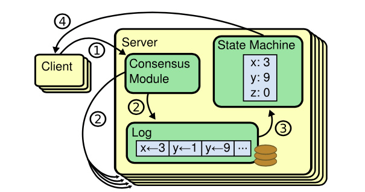
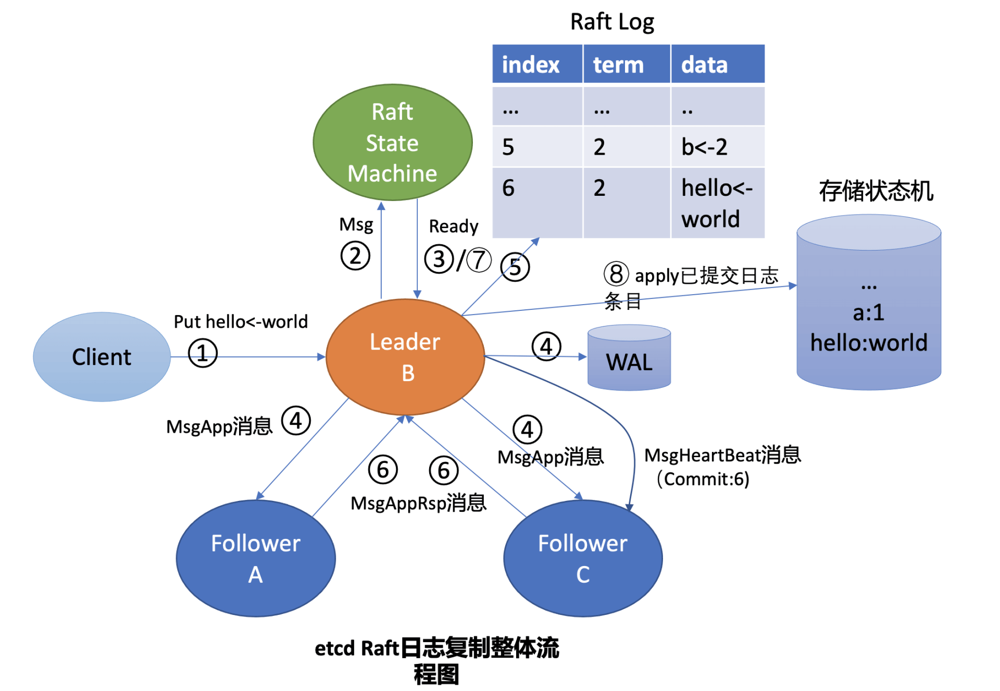
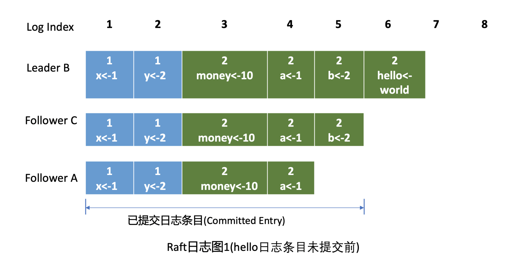
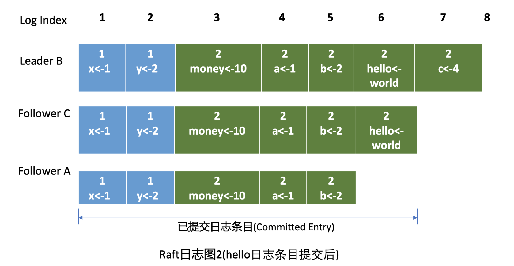

# Raft 协议

> 一个有趣的[raft 协议动画](http://kailing.pub/raft/index.html)

## 1. 概述

为了解决单点问题，软件系统工程师引入了数据复制技术，实现多副本。通过数据复制方案：

* 一方面我们可以提高服务可用性，避免单点故障。
* 另一方面，多副本可以提升读吞吐量、甚至就近部署在业务所在的地理位置，降低访问延迟。

多副本常用的技术方案主要有主从复制和去中心化复制。

**主从复制**

主从复制，又分为全同步复制、异步复制、半同步复制，比如 MySQL/Redis 单机主备版就基于主从复制实现的。

* **全同步复制**：是指主节点收到一个写请求后，必须等待全部从节点确认返回后，才能返回给客户端成功。因此如果一个从节点故障，整个系统就会不可用。这种方案为了保证多副本的一致性，而牺牲了可用性，一般使用不多。
* **异步复制**：是指主收到一个写请求后，可及时返回给 client，异步将请求转发给各个副本，若还未将请求转发到副本前就故障了，则可能导致数据丢失，但是可用性是最高的。
* **半同步复制**：介于全同步复制、异步复制之间，它是指主收到一个写请求后，至少有一个副本接收数据后，就可以返回给客户端成功，在数据一致性、可用性上实现了平衡和取舍。

**去中心化复制**

跟主从复制相反的就是去中心化复制，它是指在一个 n 副本节点集群中，任意节点都可接受写请求，但一个成功的写入需要 w 个节点确认，读取也必须查询至少 r 个节点。

你可以根据实际业务场景对数据一致性的敏感度，设置合适 w/r 参数。比如你希望每次写入后，任意 client 都能读取到新值，如果 n 是 3 个副本，你可以将 w 和 r 设置为 2，这样当你读两个节点时候，必有一个节点含有最近写入的新值，这种读我们称之为法定票数读（quorum read）。

### 问题

从以上分析中，为了解决单点故障，从而引入了多副本。但基于复制算法实现的数据库，为了保证服务可用性，大多数提供的是最终一致性，总而言之，不管是主从复制还是异步复制，都存在一定的缺陷。

**如何解决以上复制算法的困境呢？**

答案就是共识算法，它最早是基于复制状态机背景下提出来的。 下图是复制状态机的结构（引用自 Raft paper）， 它由共识模块、日志模块、状态机组成。通过共识模块保证各个节点日志的一致性，然后各个节点基于同样的日志、顺序执行指令，最终各个复制状态机的结果实现一致。

共识算法的祖师爷是 Paxos， 但是由于它过于复杂，难于理解，工程实践上也较难落地，导致在工程界落地较慢。 Raft 算法正是为了可理解性、易实现而诞生的，它通过问题分解，将复杂的共识问题拆分成三个子问题，分别是：

* Leader 选举，Leader 故障后集群能快速选出新 Leader；
* 日志复制， 集群只有 Leader 能写入日志， Leader 负责复制日志到 Follower 节点，并强制 Follower 节点与自己保持相同；
* 安全性，一个任期内集群只能产生一个 Leader、已提交的日志条目在发生 Leader 选举时，一定会存在更高任期的新 Leader 日志中、各个节点的状态机应用的任意位置的日志条目内容应一样等。

## 2. Leader 选举

### 节点状态

首先在 Raft 协议中它定义了集群中的如下节点状态，任何时刻，每个节点肯定处于其中一个状态：

* Follower，跟随者， 同步从 Leader 收到的日志，etcd 启动的时候默认为此状态；
* Candidate，竞选者，可以发起 Leader 选举；
* Leader，集群领导者， 唯一性，拥有同步日志的特权，需定时广播心跳给 Follower 节点，以维持领导者身份。

### term

Raft 协议将时间划分成一个个**任期（Term）**，任期用连续的整数表示，每个任期从一次选举开始，赢得选举的节点在该任期内充当 Leader 的职责，随着时间的消逝，集群可能会发生新的选举，任期号也会单调递增。

通过任期号，可以比较各个节点的数据新旧、识别过期的 Leader 等，**它在 Raft 算法中充当逻辑时钟**，发挥着重要作用。

### 选举流程

当 Follower 节点接收 Leader 节点心跳消息超时后，它会转变成 Candidate 节点，并可发起竞选 Leader 投票，若获得集群多数节点的支持后，它就可转变成 Leader 节点。

> etcd 默认心跳间隔时间（heartbeat-interval）是 100ms， 默认竞选超时时间（election timeout）是 1000ms，
>
> 注意：你需要根据实际部署环境、业务场景适当调优，否则就很可能会频繁发生 Leader 选举切换，导致服务稳定性下降。

以下图为例：

当 Leader 节点异常后，Follower 节点会接收 Leader 的心跳消息超时，当超时时间大于竞选超时时间后，它们会进入 Candidate 状态。

进入 Candidate 状态的节点，会立即发起选举流程，自增任期号，投票给自己，并向其他节点发送竞选 Leader 投票消息（MsgVote）。

C 节点收到 Follower B 节点竞选 Leader 消息后，这时候可能会出现如下两种情况：

* 1） C 节点判断 B 节点的数据至少和自己一样新、B 节点任期号大于 C 当前任期号、并且 C 未投票给其他候选者，就可投票给 B。这时 B 节点获得了集群多数节点支持，于是成为了新的 Leader。
* 2）恰好 C 也心跳超时超过竞选时间了，它也发起了选举，并投票给了自己，那么它将拒绝投票给 B，这时谁也无法获取集群多数派支持，只能等待竞选超时，开启新一轮选举。

Raft 为了优化选票被瓜分导致选举失败的问题，引入了随机数，每个节点等待发起选举的时间点不一致，优雅的解决了潜在的竞选活锁，同时易于理解。

> 通过随机数优雅的避免了总是出现情况2。

如果现有 Leader 发现了新的 Leader 任期号，那么它就需要转换到 Follower 节点。A 节点 crash 后，再次启动成为 Follower，假设因为网络问题无法连通 B、C 节点，这时候根据状态图，我们知道它将不停自增任期号，发起选举。等 A 节点网络异常恢复后，那么现有 Leader 收到了新的任期号，就会触发新一轮 Leader 选举，影响服务的可用性。

**那如何避免以上场景中的无效的选举呢？**

在 etcd 3.4 中，etcd 引入了一个 PreVote 参数（默认 false），可以用来启用 PreCandidate 状态解决此问题。

Follower 在转换成 Candidate 状态前，先进入 PreCandidate 状态，不自增任期号， 发起预投票。若获得集群多数节点认可，确定有概率成为 Leader 才能进入 Candidate 状态，发起选举流程。

> 因 A 节点数据落后较多，预投票请求无法获得多数节点认可，因此它就不会进入 Candidate 状态，导致集群重新选举。

这就是 Raft Leader 选举核心原理，使用心跳机制维持 Leader 身份、触发 Leader 选举，etcd 基于它实现了高可用，只要集群一半以上节点存活、可相互通信，Leader 宕机后，就能快速选举出新的 Leader，继续对外提供服务。

## 3. 日志复制

具体流程如下图所示：

* 1）首先 Leader 收到 client 的请求后，etcdserver 的 KVServer 模块会向 Raft 模块提交一个 put hello 为 world 提案消息（流程图中的序号 2 流程），  它的消息类型是 MsgProp。
* 2）Leader 的 Raft 模块获取到 MsgProp 提案消息后，为此提案生成一个日志条目，追加到未持久化、不稳定的 Raft 日志中，随后会遍历集群 Follower 列表和进度信息，为每个 Follower 生成追加（MsgApp）类型的 RPC 消息，此消息中包含待复制给 Follower 的日志条目。
* 3）etcdserver 模块通过 channel 从 Raft 模块获取到 Ready 结构后（流程图中的序号 3 流程），因 B 节点是 Leader，它首先会通过基于 HTTP 协议的网络模块将追加日志条目消息（MsgApp）广播给 Follower，并同时将待持久化的日志条目持久化到 WAL 文件中（流程图中的序号 4 流程），最后将日志条目追加到稳定的 Raft 日志存储中（流程图中的序号 5 流程）。
* 4）各个 Follower 收到追加日志条目（MsgApp）消息，并通过安全检查后，它会持久化消息到 WAL 日志中，并将消息追加到 Raft 日志存储，随后会向 Leader 回复一个应答追加日志条目（MsgAppResp）的消息，告知 Leader 当前已复制的日志最大索引（流程图中的序号 6 流程）。
* 5）Leader 收到应答追加日志条目（MsgAppResp）消息后，会将 Follower 回复的已复制日志最大索引更新到跟踪 Follower 进展的 Match Index 字段。
* 6）最后 Leader 根据 Follower 的 MatchIndex 信息，计算出一个位置，如果这个位置已经被一半以上节点持久化，那么这个位置之前的日志条目都可以被标记为已提交。
* 7）最后各个节点的 etcdserver 模块，可通过 channel 从 Raft 模块获取到已提交的日志条目（流程图中的序号 7 流程），应用日志条目内容到存储状态机（流程图中的序号 8 流程），返回结果给 client。

通过以上流程，Leader 就完成了同步日志条目给 Follower 的任务，一个日志条目被确定为已提交的前提是，它需要被 Leader 同步到一半以上节点上。以上就是 etcd Raft 日志复制的核心原理。

### raft 日志

下图是 Raft 日志复制过程中的日志细节图：

在日志图中，最上方的是日志条目**序号 / 索引**，日志由有序号标识的一个个条目组成，每个日志条目内容保存了 **Leader 任期号和提案内容**。最开始的时候，A 节点是 Leader，任期号为 1，A 节点 crash 后，B 节点通过选举成为新的 Leader， 任期号为 2。

### FAQ

**Leader 是如何知道从哪个索引位置发送日志条目给 Follower，以及 Follower 已复制的日志最大索引是多少呢？**

Leader 会维护两个核心字段来追踪各个 Follower 的进度信息，一个字段是 NextIndex， 它表示 Leader 发送给 Follower 节点的下一个日志条目索引。一个字段是 MatchIndex， 它表示 Follower 节点已复制的最大日志条目的索引，比如上面的日志图 1 中 C 节点的已复制最大日志条目索引为 5，A 节点为 4。

**日志条目什么时候才会追加到稳定的 Raft 日志中呢？Raft 模块负责持久化吗？**

上层应用通过 Raft 模块的输出接口（如 Ready 结构），获取到待持久化的日志条目和待发送给 Peer 节点的消息后（如上面的 MsgApp 日志消息），需持久化日志条目到自定义的 WAL 模块，通过自定义的网络模块将消息发送给 Peer 节点。

日志条目持久化到稳定存储中后，这时候你就可以将日志条目追加到稳定的 Raft 日志中。即便这个日志是内存存储，节点重启时也不会丢失任何日志条目，因为 WAL 模块已持久化此日志条目，可通过它重建 Raft 日志。

etcd Raft 模块提供了一个内置的内存存储（MemoryStorage）模块实现，etcd 使用的就是它，Raft 日志条目保存在内存中。网络模块并未提供内置的实现，etcd 基于 HTTP 协议实现了 peer 节点间的网络通信，并根据消息类型，支持选择 pipeline、stream 等模式发送，显著提高了网络吞吐量、降低了延时。

## 4. 安全性

假设当前raft日志条目如下图所示：

Leader B 在应用日志指令 put hello 为 world 到状态机，并返回给 client 成功后，突然 crash 了，那么 Follower A 和 C 是否都有资格选举成为 Leader 呢？

> 从日志图 2 中我们可以看到，如果 A 成为了 Leader 那么就会导致数据丢失，因为它并未含有刚刚 client 已经写入成功的 put hello 为 world 指令。

**Raft 算法如何确保面对这类问题时不丢数据和各节点数据一致性呢？**

Raft 通过给选举和日志复制增加一系列规则，来实现 Raft 算法的安全性。

### 选举规则

当节点收到选举投票的时候，需检查候选者的最后一条日志中的任期号：

* 若小于自己则拒绝投票。
* 如果任期号相同，日志却比自己短，也拒绝为其投票。

这样能保证投票的节点数据至少比当前节点数据新。

### 日志复制规则

在日志图 2 中，Leader B 返回给 client 成功后若突然 crash 了，此时可能还并未将 6 号日志条目已提交的消息通知到 Follower A 和 C，那么如何确保 6 号日志条目不被新 Leader 删除呢？ 同时在 etcd 集群运行过程中，Leader 节点若频繁发生 crash 后，可能会导致 Follower 节点与 Leader 节点日志条目冲突，如何保证各个节点的同 Raft 日志位置含有同样的日志条目？

以上各类异常场景的安全性是通过 Raft 算法中的 Leader 完全特性和只附加原则、日志匹配等安全机制来保证的。

* **Leader 完全特性**：是指如果某个日志条目在某个任期号中已经被提交，那么这个条目必然出现在更大任期号的所有 Leader 中。
* **只附加原则**：Leader 只能追加日志条目，不能删除已持久化的日志条目。因此 Follower C 成为新 Leader 后，会将前任的 6 号日志条目复制到 A 节点。
* **日志匹配特性**：Leader 在发送追加日志 RPC 消息时，会把新的日志条目紧接着之前的条目的索引位置和任期号包含在里面。Follower 节点会检查相同索引位置的任期号是否与 Leader 一致，一致才能追加。
  * 它本质上是一种归纳法，一开始日志空满足匹配特性，随后每增加一个日志条目时，都要求上一个日志条目信息与 Leader 一致，那么最终整个日志集肯定是一致的。

通过以上的 **Leader 选举限制、Leader 完全特性、只附加原则、日志匹配**等安全特性，Raft 就实现了一个可严格通过数学反证法、归纳法证明的高可用、一致性算法，为 etcd 的安全性保驾护航。

## 5. 小结

为了避免单点问题，引入多副本，最终又通过共识算法来解决多副本带来的数据不一致问题。

Raft 算法它将一个复杂问题拆分成三个子问题，分别是 **Leader 选举、日志复制和安全性**。

* 1）Raft 通过心跳机制、随机化等实现了 Leader 选举，只要集群半数以上节点存活可相互通信，etcd 就可对外提供高可用服务。
* 2）一个日志条目只有被 Leader 同步到一半以上节点上，此日志条目才能称之为成功复制、已提交。
* 3）Raft 的安全性，通过对 Leader 选举和日志复制增加一系列规则，保证了整个集群的一致性、完整性。

