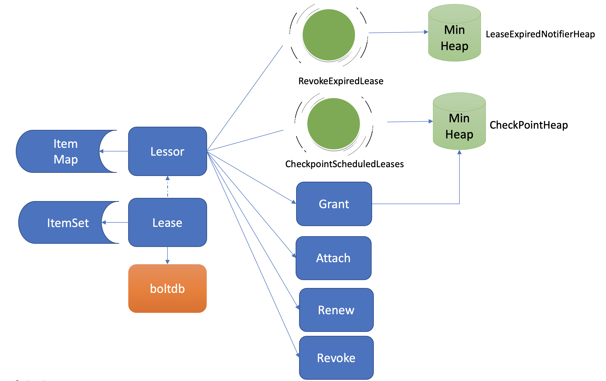
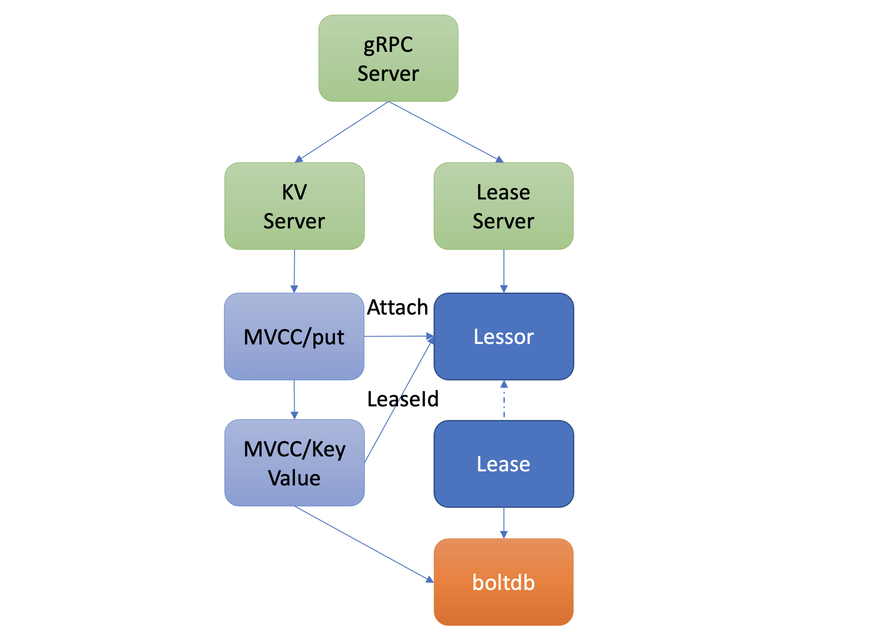

#  etcd 租约Lease

## 1. 概述

Lease 顾名思义，client 和 etcd server 之间存在一个约定，内容是 etcd server 保证在约定的有效期内（TTL），不会删除你关联到此 Lease 上的 key-value。

若你未在有效期内续租，那么 etcd server 就会删除 Lease 和其关联的 key-value。

> 可以简单理解为 key 的有效期。

Lease，是基于主动型上报模式提供的一种活性检测机制。

**Lease 整体架构**如下图所示：



etcd 在启动时创建 Lessor 模块的时候，它会启动两个常驻 goroutine，如上图所示：

* 一个是**RevokeExpiredLease** 任务，定时检查是否有过期 Lease，发起撤销过期的 Lease 操作。
* 一个是**CheckpointScheduledLease**，定时触发更新 Lease 的剩余到期时间的操作。

Lessor 模块提供了 Grant、Revoke、LeaseTimeToLive、LeaseKeepAlive API 给 client 使用，各接口作用如下:

* Grant 表示创建一个 TTL 为你指定秒数的 Lease，Lessor 会将 Lease 信息持久化存储在 boltdb 中；
* Revoke 表示撤销 Lease 并删除其关联的数据；
* LeaseTimeToLive 表示获取一个 Lease 的有效期、剩余时间；
* LeaseKeepAlive 表示为 Lease 续期。


## 2. key 如何关联 Lease

大致分为两步：

* 1）创建 Lease
* 2）将 key 与 lease 关联

**1）创建 Lease**

client 可通过 clientv3 库的 Lease API 发起 RPC 调用来创建 Lease，例如：

```sh

# 创建一个TTL为600秒的lease，etcd server返回LeaseID
$ etcdctl lease grant 600
lease 326975935f48f814 granted with TTL(600s)


# 查看lease的TTL、剩余时间
$ etcdctl lease timetolive 326975935f48f814
lease 326975935f48f814 granted with TTL(600s)， remaining(590s)
```

当 Lease server 收到 client 的创建一个有效期 600 秒的 Lease 请求后，会通过 Raft 模块完成日志同步，随后 Apply 模块通过 Lessor 模块的 Grant 接口执行日志条目内容。

首先 Lessor 的 Grant 接口会把 Lease 保存到内存的 ItemMap 数据结构中，然后它需要持久化 Lease，将 Lease 数据保存到 boltdb 的 Lease bucket 中，返回一个唯一的 LeaseID 给 client。

**2）将 key 与 lease 关联**

KV 模块的 API 接口提供了一个"--lease"参数，你可以通过写入 key 时带上该参数，将 key node 关联到对应的 LeaseID 上。

```sh
$ etcdctl put node healthy --lease 326975935f48f818
OK
$ etcdctl get node -w=json | python -m json.tool
{
    "kvs":[
        {
            "create_revision":24，
            "key":"bm9kZQ=="，
            "Lease":3632563850270275608，
            "mod_revision":24，
            "value":"aGVhbHRoeQ=="，
            "version":1
        }
    ]
}
```

当你通过 put 等命令新增一个指定了"--lease"的 key 时，MVCC 模块它会通过 Lessor 模块的 Attach 方法，将 key 关联到 Lease 的 key 内存集合 ItemSet 中，为了保证持久化，在写入 blotdb 时会将 key 关联的 lease 信息一并写入。具体流程如下：




## 3. Lease 续期

在正常情况下，你的节点存活时，需要定期发送 KeepAlive 请求给 etcd 续期健康状态的 Lease，否则你的 Lease 和关联的数据就会被删除。

**那么如何高效的实现这个需求呢？**

续期性能受多方面影响：

* 首先是 TTL，TTL 过长会导致节点异常后，无法及时从 etcd 中删除，影响服务可用性，而过短，则要求 client 频繁发送续期请求。
* 其次是 Lease 数，如果 Lease 成千上万个，那么 etcd 可能无法支撑如此大规模的 Lease 数，导致高负载。

### v2 版本

在早期 v2 版本中，没有 Lease 概念，TTL 属性是在 key 上面，为了保证 key 不删除，即便你的 TTL 相同，client 也需要为每个 TTL、key 创建一个 HTTP/1.x 连接，定时发送续期请求给 etcd server。

很显然，v2 老版本这种设计，因不支持连接多路复用、相同 TTL 无法复用导致性能较差，无法支撑较大规模的 Lease 场景。

### v3 版本

etcd v3 版本为了解决以上问题，提出了 Lease 特性，TTL 属性转移到了 Lease 上， 同时协议从 HTTP/1.x 优化成 gRPC 协议。

* 一方面不同 key 若 TTL 相同，可复用同一个 Lease， 显著减少了 Lease 数。

* 另一方面，通过 gRPC HTTP/2 实现了多路复用，流式传输，同一连接可支持为多个 Lease 续期，大大减少了连接数。

通过以上两个优化，实现 Lease 性能大幅提升，满足了各个业务场景诉求。


## 4. 如何高效淘汰过期 Lease

**淘汰过期 Lease 的工作由 Lessor 模块的一个异步 goroutine 负责**。它会定时从最小堆中取出已过期的 Lease，执行删除 Lease 和其关联的 key 列表数据的 RevokeExpiredLease 任务。

etcd Lessor 主循环每隔 500ms 执行一次撤销 Lease 检查（RevokeExpiredLease），每次轮询堆顶的元素，若已过期则加入到待淘汰列表，直到堆顶的 Lease 过期时间大于当前，则结束本轮轮询。

**优化前**

etcd 早期的时候，淘汰 Lease 非常暴力。etcd 会直接遍历所有 Lease，逐个检查 Lease 是否过期，过期则从 Lease 关联的 key 集合中，取出 key 列表，删除它们，时间复杂度是 O(N)。

**优化后**

目前 etcd 是基于**最小堆**来管理 Lease，实现快速淘汰过期的 Lease。

每次新增 Lease、续期的时候，它会插入、更新一个对象到最小堆中，对象含有 LeaseID 和其到期时间 unixnano，**对象之间按到期时间升序排序**。

使用堆优化后后，插入、更新、删除，它的时间复杂度是 O(Log N)，查询堆顶对象是否过期时间复杂度仅为 O(1)，性能大大提升，可支撑大规模场景下 Lease 的高效淘汰。

**获取到待过期的 LeaseID 后，Leader 是如何通知其他 Follower 节点淘汰它们呢？**

Lessor 模块会将已确认过期的 LeaseID，保存在一个名为 expiredC 的 channel 中，而 etcd server 的主循环会定期从 channel 中获取 LeaseID，发起 revoke 请求，通过 Raft Log 传递给 Follower 节点。

各个节点收到 revoke Lease 请求后，获取关联到此 Lease 上的 key 列表，从 boltdb 中删除 key，从 Lessor 的 Lease map 内存中删除此 Lease 对象，最后还需要从 boltdb 的 Lease bucket 中删除这个 Lease。


## 5.  checkpoint 机制

为了降低 Lease 特性的实现复杂度，检查 Lease 是否过期、维护最小堆、针对过期的 Lease 发起 revoke 操作，都是 Leader 节点负责的，它类似于 Lease 的仲裁者，通过以上清晰的权责划分。

那么当 Leader 因重启、crash、磁盘 IO 等异常不可用时，Follower 节点就会发起 Leader 选举，新 Leader 要完成以上职责，必须重建 Lease 过期最小堆等管理数据结构，**那么以上重建可能会触发什么问题呢**？

当你的集群发生 Leader 切换后，新的 Leader 基于 Lease map 信息，按 Lease 过期时间构建一个最小堆时，etcd 早期版本为了优化性能，并未持久化存储 Lease 剩余 TTL 信息，因此重建的时候就会自动给所有 Lease 自动续期了。

然而若较频繁出现 Leader 切换，切换时间小于 Lease 的 TTL，这会导致 Lease 永远无法删除，大量 key 堆积，db 大小超过配额等异常。

为了解决这个问题，etcd 引入了检查点机制，也就是 Lessor 模块的另一个常驻 goroutine**CheckpointScheduledLease **任务。

* 一方面，etcd 启动的时候，Leader 节点后台会运行此异步任务，定期批量地将 Lease 剩余的 TTL 基于 Raft Log 同步给 Follower 节点，Follower 节点收到 CheckPoint 请求后，更新内存数据结构 LeaseMap 的剩余 TTL 信息。

* 另一方面，当 Leader 节点收到 KeepAlive 请求的时候，它也会通过 checkpoint 机制把此 Lease 的剩余 TTL 重置，并同步给 Follower 节点，尽量确保续期后集群各个节点的 Lease 剩余 TTL 一致性。

> 最后你要注意的是，此特性对性能有一定影响，目前仍然是试验特性。你可以通过 experimental-enable-lease-checkpoint 参数开启。


## 6. 小结 

* 1）Lease 的核心是 TTL，当 Lease 的 TTL 过期时，它会自动删除其关联的 key-value 数据。
* 2）v3 版本通过引入 Lease 的概念，将 TTL 和 Key 解耦，支持多 key 共用一个 Lease 来提升性能。同时协议从 HTTP/1.x 优化成 gRPC 协议，支持多路连接复用，显著降低了 server 连接数等资源开销。
* 3）Lease 过期通过最小堆来提升效率。
* 4）通过 Checkpoint 机制想 follower 同步 Lease 信息来解决 Leader 异常情况下 TTL 自动被续期，可能导致 Lease 永不淘汰的问题而诞生。