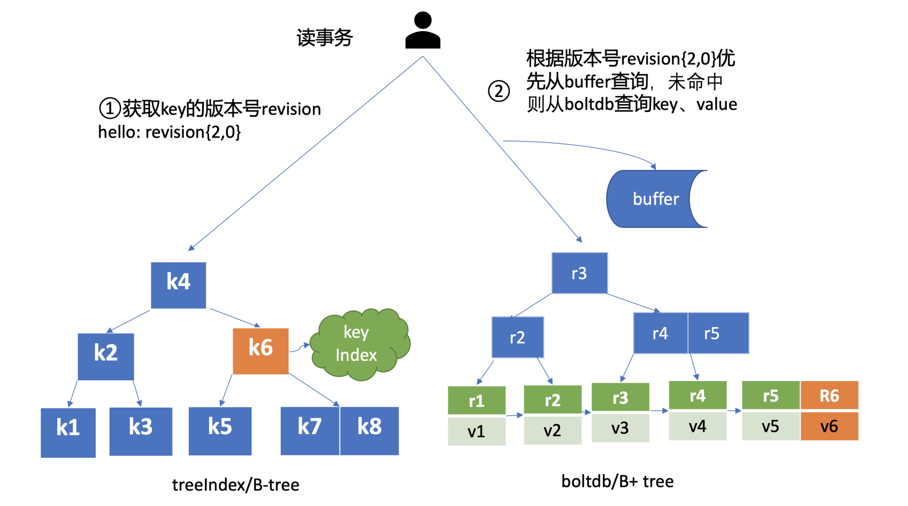

# etcd mvcc

## 1. 概述

 MVCC 即 Multiversion concurrency control 多版本并发控制，**是一种基于多版本技术实现的一种乐观锁机制**。

在 MVCC 数据库中，你更新一个 key-value 数据的时候，它并不会直接覆盖原数据，而是新增一个版本来存储新的数据，每个数据都有一个版本号。

> 版本号它是一个逻辑时间。

* **修改**：每次修改操作，版本号都会递增。每修改一次，生成一条新的数据记录。
* **删除**：当删除数据的时候，它实际也是新增一条带删除标识的数据记录。

**当指定版本号读取数据时，它实际上访问的是版本号生成那个时间点的快照数据。**


## 2. MVCC 初体验

如下面的命令所示，第一次 key hello 更新完后，我们通过 get 命令获取下它的 key-value 详细信息。正如你所看到的，除了 key、value 信息，还有各类版本号。

> 这里我们重点关注 **mod_revision**，它表示 key 最后一次修改时的 etcd 版本号。

当我们再次更新 key hello 为 world2 后，然后通过查询时指定 key 第一次更新后的版本号，你会发现我们查询到了第一次更新的值，甚至我们执行删除 key hello 后，依然可以获得到这个值。那么 etcd 是如何实现的呢?


```sh
# 指定使用 v3 版本API
$ export ETCDCTL_API=3
# 更新key hello为world1
$ etcdctl put hello world1
OK
# 通过指定输出模式为json,查看key hello更新后的详细信息
$ etcdctl get hello -w=json
{
    "kvs":[
        {
            "key":"aGVsbG8=",
            "create_revision":2,
            "mod_revision":2,
            "version":1,
            "value":"d29ybGQx"
        }
    ],
    "count":1
}
# 再次修改key hello为world2
$ etcdctl put hello world2
OK
# 确认修改成功,最新值为wolrd2
$ etcdctl get hello
hello
world2
# 指定查询版本号,获得了hello上一次修改的值
$ etcdctl get hello --rev=2
hello
world1
# 删除key hello
$ etcdctl del  hello
1
# 删除后指定查询版本号3,获得了hello删除前的值
$ etcdctl get hello --rev=3
hello
world2
```


## 3. 整体架构

下图是 MVCC 模块的一个整体架构图，整个 MVCC 特性由 treeIndex、Backend/boltdb 组成。

当你执行 put 命令后，请求经过 gRPC KV Server、Raft 模块流转，对应的日志条目被提交后，Apply 模块开始执行此日志内容。


**Apply 模块**通过 MVCC 模块来执行 put 请求，持久化 key-value 数据。

MVCC 模块将请求请划分成两个类别，分别是读事务（ReadTxn）和写事务（WriteTxn）。读事务负责处理 range 请求，写事务负责 put/delete 操作。读写事务基于 treeIndex、Backend/boltdb 提供的能力，实现对 key-value 的增删改查功能。

**treeIndex 模块**基于内存版 B-tree 实现了 key 索引管理，它保存了用户 key 与版本号（revision）的映射关系等信息。

**Backend 模块**负责 etcd 的 key-value 持久化存储，主要由 ReadTx、BatchTx、Buffer 组成，ReadTx 定义了抽象的读事务接口，BatchTx 在 ReadTx 之上定义了抽象的写事务接口，Buffer 是数据缓存区。

> etcd 设计上支持多种 Backend 实现，目前实现的 Backend 是 boltdb。boltdb 是一个基于 B+ tree 实现的、支持事务的 key-value 嵌入式数据库。


## 4. treeIndex 原理

对于 etcd v2 来说，当你通过 etcdctl 发起一个 put hello 操作时，etcd v2 直接更新内存树，这就导致历史版本直接被覆盖，无法支持保存 key 的历史版本。

在 etcd v3 中引入 treeIndex 模块正是为了解决这个问题，支持保存 key 的历史版本，提供稳定的 Watch 机制和事务隔离等能力。

etcd 在每次修改 key 时会生成一个全局递增的版本号（revision）。

* 然后通过数据结构 B-tree 保存用户 key 与版本号之间的关系；

* 再以版本号作为 boltdb key，以用户的 key-value 等信息作为 boltdb value，保存到 boltdb。

**为什么 etcd 使用 B-tree 而不使用哈希表、平衡二叉树？**

* **从功能特性上分析**， 因 etcd 支持范围查询，因此保存索引的数据结构也必须支持范围查询才行。所以哈希表不适合，而 B-tree 支持范围查询。
* **从性能上分析**，平横二叉树每个节点只能容纳一个数据、导致树的高度较高，而 B-tree 每个节点可以容纳多个数据，树的高度更低，更扁平，涉及的查找次数更少，具有优越的增、删、改、查性能。

在 treeIndex 中，每个节点的 key 是一个 keyIndex 结构，etcd 就是通过它保存了用户的 key 与版本号的映射关系。

每个 B-tree 节点保存的具体内容如下：

```go
type keyIndex struct {
   key         []byte //用户的key名称，比如我们案例中的"hello"
   modified    revision //最后一次修改key时的etcd版本号,比如我们案例中的刚写入hello为world1时的，版本号为2
   generations []generation //generation保存了一个key若干代版本号信息，每代中包含对key的多次修改的版本号列表
}
```

keyIndex 中包含用户的 key、最后一次修改 key 时的 etcd 版本号、key 的若干代（generation）版本号信息，每代中包含对 key 的多次修改的版本号列表。

**generations 表示一个 key 从创建到删除的过程，每代对应 key 的一个生命周期的开始与结束**。当你第一次创建一个 key 时，会生成第 0 代，后续的修改操作都是在往第 0 代中追加修改版本号。当你把 key 删除后，它就会生成新的第 1 代，一个 key 不断经历创建、删除的过程，它就会生成多个代。

generation 结构详细信息如下：

```go
type generation struct {
   ver     int64    //表示此key的修改次数
   created revision //表示generation结构创建时的版本号
   revs    []revision //每次修改key时的revision追加到此数组
}
```

generation 结构中包含此 key 的修改次数、generation 创建时的版本号、对此 key 的修改版本号记录列表。

你需要注意的是版本号（revision）并不是一个简单的整数，而是一个结构体。revision 结构及含义如下：

```go
type revision struct {
   main int64    // 一个全局递增的主版本号，随put/txn/delete事务递增，一个事务内的key main版本号是一致的
   sub int64    // 一个事务内的子版本号，从0开始随事务内put/delete操作递增
}
```

revision 包含 main 和 sub 两个字段，main 是全局递增的版本号，它是个 etcd 逻辑时钟，随着 put/txn/delete 等事务递增。sub 是一个事务内的子版本号，从 0 开始随事务内的 put/delete 操作递增。

比如启动一个空集群，全局版本号默认为 1，执行下面的 txn 事务，它包含两次 put、一次 get 操作，那么按照我们上面介绍的原理，全局版本号随读写事务自增，因此是 main 为 2，sub 随事务内的 put/delete 操作递增，因此 key hello 的 revison 为{2,0}，key world 的 revision 为{2,1}。

```sh
# 以交互模式进入 etcd 事务
$ etcdctl txn -i
/usr/local/bin # etcdctl txn -i
compares:
# 判定条件 这里不填，直接按回车键跳过
success requests (get, put, del):
# 判定条件成功时需要执行的命令 手动输入
put hello 1
get hello
put world 2

failure requests (get, put, del):
# 判定条件失败时时需要执行的命令 这里也为空 直接跳过
SUCCESS # SUCCESS 为前面 compares 的结果 由于没有填任何条件 所以当然是成功的

OK # 第一条 put 命令的结果

hello # 第二条 get 命令的结果
1

OK # 第三条 put 命令的结果
```


## 5. MVCC 增删改原理

### 1. put

一个 put 命令流程如下图所示：


**1）第一步：查询 keyIndex **

首先它需要从 treeIndex 模块中查询 key 的 keyIndex 索引信息。

> keyIndex 中存储了 key 的创建版本号、修改的次数等信息，这些信息在事务中发挥着重要作用，因此会存储在 boltdb 的 value 中。

**2）第二步：写入 boltdb**

其次 etcd 会根据当前的全局版本号（空集群启动时默认为 1）自增，生成 put hello 操作对应的版本号 revision{2,0}，这就是 boltdb 的 key。

boltdb 的 value 是 mvccpb.KeyValue 结构体，它是由用户 key、value、create_revision、mod_revision、version、lease 组成。它们的含义分别如下：

* create_revision 表示此 key 创建时的版本号。在本例中，key hello 是第一次创建，那么值就是 2。当你再次修改 key hello 的时候，写事务会从 treeIndex 模块查询 hello 第一次创建的版本号，也就是 keyIndex.generations[i].created 字段，赋值给 create_revision 字段；
* mod_revision 表示 key 最后一次修改时的版本号，即 put 操作发生时的全局版本号加 1；
* version 表示此 key 的修改次数。每次修改的时候，写事务会从 treeIndex 模块查询 hello 已经历过的修改次数，也就是 keyIndex.generations[i].ver 字段，将 ver 字段值加 1 后，赋值给 version 字段。

填充好 boltdb 的 KeyValue 结构体后，这时就可以通过 Backend 的写事务 batchTx 接口将 key{2,0},value 为 mvccpb.KeyValue 保存到 boltdb 的缓存中，并同步更新 buffer，如上图中的流程二所示。

**3）第三步：更新 treeIndex**

然后 put 事务需将本次修改的版本号与用户 key 的映射关系保存到 treeIndex 模块中，也就是上图中的流程三。

因为 key hello 是首次创建，treeIndex 模块它会生成 key hello 对应的 keyIndex 对象，并填充相关数据结构。

keyIndex 填充后的结果如下所示：

```sh

key hello的keyIndex:
key:     "hello"
modified: <2,0>
generations:
[{ver:1,created:<2,0>,revisions: [<2,0>]} ]
```

* key 为 hello，modified 为最后一次修改版本号 <2,0>，key hello 是首次创建的，因此新增一个 generation 代跟踪它的生命周期、修改记录；
* generation 的 ver 表示修改次数，首次创建为 1，后续随着修改操作递增；
* generation.created 表示创建 generation 时的版本号为 <2,0>；
* revision 数组保存对此 key 修改的版本号列表，每次修改都会将将相应的版本号追加到 revisions 数组中。

**4）第四步：持久化**

通过以上流程，一个 put 操作终于完成，但是此时数据还并未持久化。

为了提升 etcd 的写吞吐量、性能，一般情况下（默认堆积的写事务数大于 1 万才在写事务结束时同步持久化），数据持久化由 Backend 的异步 goroutine 完成，它通过事务批量提交，定时将 boltdb 页缓存中的脏数据提交到持久化存储磁盘中。


### 2. get

执行 get 命令时，，MVCC 模块首先会创建一个读事务对象（TxnRead）。在 etcd 3.4 中 Backend 实现了 ConcurrentReadTx， 也就是并发读特性。

并发读特性的核心原理是创建读事务对象时，它会全量拷贝当前写事务未提交的 buffer 数据，并发的读写事务不再阻塞在一个 buffer 资源锁上，实现了全并发读。





**1）第一步：查询版本号**

首先需要根据 key 从 treeIndex 模块获取版本号（因我们未带版本号读，默认是读取最新的数据）。treeIndex 模块从 B-tree 中，根据 key 查找到 keyIndex 对象后，匹配有效的 generation，返回 generation 的 revisions 数组中最后一个版本号{2,0}给读事务对象。

**2）第二步：查询 blotdb**

读事务对象根据此版本号为 key，通过 Backend 的并发读事务（ConcurrentReadTx）接口，优先从 buffer 中查询，命中则直接返回，否则从 boltdb 中查询此 key 的 value 信息。


### 3. del

当执行 del 命令时 etcd 实现的是**延期删除模式**，原理与 key 更新类似。

与更新 key 不一样之处在于：

* 一方面，生成的 boltdb key 版本号{4,0,t}追加了删除标识（tombstone, 简写 t），boltdb value 变成只含用户 key 的 KeyValue 结构体。
* 另一方面 treeIndex 模块也会给此 key hello 对应的 keyIndex 对象，**追加一个空的 generation 对象，表示此索引对应的 key 被删除了**。

当你再次查询 hello 的时候，treeIndex 模块根据 key hello 查找到 keyindex 对象后，**若发现其存在空的 generation 对象，并且查询的版本号大于等于被删除时的版本号，则会返回空**。

**那么 key 打上删除标记后有哪些用途呢？什么时候会真正删除它呢？**

* 一方面删除 key 时会生成 events，Watch 模块根据 key 的删除标识，会生成对应的 Delete 事件。
* 另一方面，当你重启 etcd，遍历 boltdb 中的 key 构建 treeIndex 内存树时，你需要知道哪些 key 是已经被删除的，并为对应的 key 索引生成 tombstone 标识。

而真正删除 treeIndex 中的索引对象、boltdb 中的 key 是通过压缩 (compactor) 组件异步完成。

正因为 etcd 的删除 key 操作是基于以上延期删除原理实现的，因此只要压缩组件未回收历史版本，我们就能从 etcd 中找回误删的数据。


## 6. 小结

* 1）MVCC 模块由 treeIndex、boltdb 组成
  * treeIndex 模块基于 Google 开源的 btree 库实现
* 2）treeIndex 保存了用户 key 与版本号关系。blotdb 中的 key 为 treeIndex 中记录的版本号，value 包含用户 key-value、各种版本号、lease 的 mvccpb.KeyValue 结构体。
* 3）当你未带版本号查询 key 时，etcd 返回的是 key 最新版本数据。
* 4）删除一个数据时，etcd 并未真正删除它，而是基于 lazy delete 实现的异步删除，真正删除 key 是通过 etcd 的压缩组件去异步实现的。