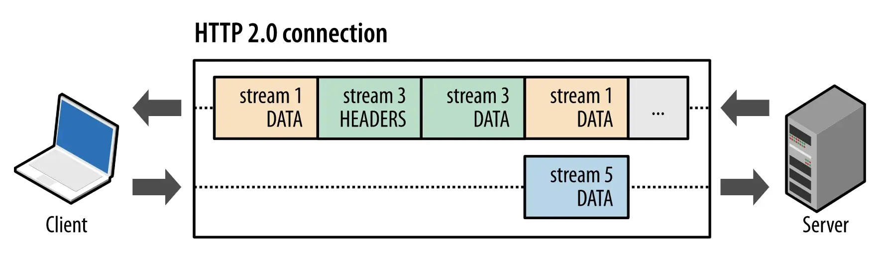
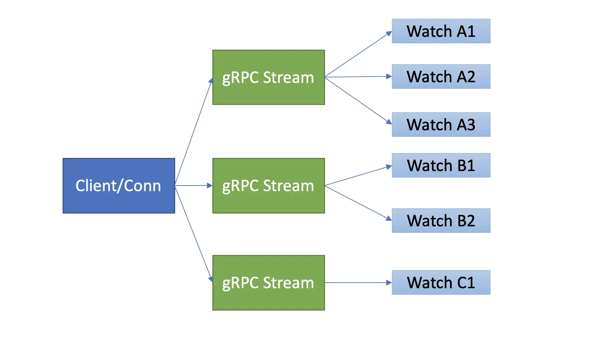
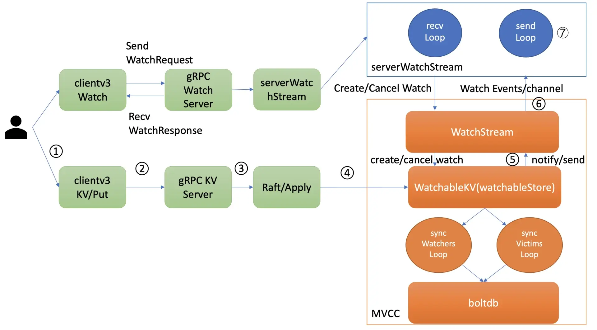

# etcd Watch 机制

## 1. 概述

etcd 的 Watch 特性说起，它是 Kubernetes 控制器的工作基础。

在 Kubernetes 中，各种各样的控制器实现了 Deployment、StatefulSet、Job 等功能强大的 Workload。控制器的核心思想是监听、比较资源实际状态与期望状态是否一致，若不一致则进行协调工作，使其最终一致。

这主要依赖于 etcd 的 Watch 机制。


## 2. Watch 特性初体验

启动一个空集群，更新两次 key hello 后，使用 Watch 特性如何获取 key hello 的历史修改记录。

```sh
$ etcdctl put hello world1
$ etcdctl put hello world2
$ etcdctl watch hello -w=json --rev=1
{
    "Events":[
        {
            "kv":{
                "key":"aGVsbG8=",
                "create_revision":2,
                "mod_revision":2,
                "version":1,
                "value":"d29ybGQx"
            }
        },
        {
            "kv":{
                "key":"aGVsbG8=",
                "create_revision":2,
                "mod_revision":3,
                "version":2,
                "value":"d29ybGQy"
            }
        }
    ],
    "CompactRevision":0,
    "Canceled":false,
    "Created":false
}
```

可以看到，**基于 Watch 特性，你可以快速获取到你感兴趣的数据变化事件**，这也是 Kubernetes 控制器工作的核心基础。

在这过程中，其实有以下四大核心问题：

* 第一，client 获取事件的机制，etcd 是使用轮询模式还是推送模式呢？两者各有什么优缺点？
* 第二，事件是如何存储的？ 会保留多久？watch 命令中的版本号具有什么作用？
* 第三，当 client 和 server 端出现短暂网络波动等异常因素后，导致事件堆积时，server 端会丢弃事件吗？若你监听的历史版本号 server 端不存在了，你的代码该如何处理？
* 第四，如果你创建了上万个 watcher 监听 key 变化，当 server 端收到一个写请求后，etcd 是如何根据变化的 key 快速找到监听它的 watcher 呢？


## 3. 4大核心问题

### 1. 轮询 vs 流式推送

首先第一个问题是 **client 获取事件机制**，etcd 是使用轮询模式还是推送模式呢？两者各有什么优缺点？

#### etcd v2 轮询模式

在 etcd v2 Watch 机制实现中，使用的是 HTTP/1.x 协议，实现简单、兼容性好，每个 watcher 对应一个 TCP 连接。client 通过 HTTP/1.1 协议长连接定时轮询 server，获取最新的数据变化事件。

然而当你的 watcher 成千上万的时，即使集群空负载，大量轮询也会产生一定的 QPS，server 端会消耗大量的 socket、内存等资源，导致 etcd 的扩展性、稳定性无法满足 Kubernetes 等业务场景诉求。

#### etcd v3 推送模式

在 etcd v3 中，为了解决 etcd v2 的以上缺陷，使用的是基于 HTTP/2 的 gRPC 协议，双向流的 Watch API 设计，实现了连接多路复用。

*HTTP/2 多路复用*



在 HTTP/2 协议中，HTTP 消息被分解独立的帧（Frame），交错发送，帧是最小的数据单位。每个帧会标识属于哪个流（Stream），流由多个数据帧组成，每个流拥有一个唯一的 ID，一个数据流对应一个请求或响应包。

通过以上机制，HTTP/2 就解决了 HTTP/1 的请求阻塞、连接无法复用的问题，实现了多路复用、乱序发送。



etcd 基于以上介绍的 HTTP/2 协议的多路复用等机制，实现了一个 client/TCP 连接支持多 gRPC Stream， 一个 gRPC Stream 又支持多个 watcher，如下图所示。同时事件通知模式也从 client 轮询优化成 server 流式推送，极大降低了 server 端 socket、内存等资源。


### 2. 滑动窗口 vs MVCC

第二个问题的本质是历史版本存储，etcd 经历了从滑动窗口到 MVCC 机制的演变，滑动窗口是仅保存有限的最近历史版本到内存中，而 MVCC 机制则将历史版本保存在磁盘中，避免了历史版本的丢失，极大的提升了 Watch 机制的可靠性。

#### etcd v2 滑动窗口

etcd v2 它使用的是如下一个简单的环形数组来存储历史事件版本，当 key 被修改后，相关事件就会被添加到数组中来。若超过 eventQueue 的容量，则淘汰最旧的事件。在 etcd v2 中，eventQueue 的容量是固定的 1000，因此它最多只会保存 1000 条事件记录，不会占用大量 etcd 内存导致 etcd OOM。

```go
type EventHistory struct {
   Queue      eventQueue
   StartIndex uint64
   LastIndex  uint64
   rwl        sync.RWMutex
}
```

但是它的缺陷显而易见的，固定的事件窗口只能保存有限的历史事件版本，是不可靠的。**当写请求较多的时候、client 与 server 网络出现波动等异常时，很容易导致事件丢失**，client 不得不触发大量的 expensive 查询操作，以获取最新的数据及版本号，才能持续监听数据。

#### etcd v3 mvcc

etcd v3 的 MVCC 机制，正如上一节课所介绍的，就是为解决 etcd v2 Watch 机制不可靠而诞生。相比 etcd v2 直接保存事件到内存的环形数组中，etcd v3 则是将一个 key 的历史修改版本保存在 boltdb 里面。boltdb 是一个基于磁盘文件的持久化存储，因此它重启后历史事件不像 etcd v2 一样会丢失，同时你可通过配置压缩策略，来控制保存的历史版本数。

*最后 watch 命令中的版本号具有什么作用呢?*

版本号是 etcd 逻辑时钟，当 client 因网络等异常出现连接闪断后，通过版本号，它就可从 server 端的 boltdb 中获取错过的历史事件，而无需全量同步，**它是 etcd Watch 机制数据增量同步的核心**。

### 

### 3. 可靠的事件推送机制

第三个问题，当 client 和 server 端出现短暂网络波动等异常因素后，导致事件堆积时，server 端会丢弃事件吗？若你监听的历史版本号 server 端不存在了，你的代码该如何处理？

第三个问题的本质是**可靠事件推送机制**，要搞懂它，我们就得弄懂 etcd Watch 特性的整体架构、核心流程，下图是 Watch 特性整体架构图。




当你通过 etcdctl 或 API 发起一个 watch key 请求的时候，etcd 的 gRPCWatchServer 收到 watch 请求后，会创建一个 serverWatchStream, 它负责接收 client 的 gRPC Stream 的 create/cancel watcher 请求 (recvLoop goroutine)，并将从 MVCC 模块接收的 Watch 事件转发给 client(sendLoop goroutine)。


当 serverWatchStream 收到 create watcher 请求后，serverWatchStream 会调用 MVCC 模块的 WatchStream 子模块分配一个 watcher id，并将 watcher 注册到 MVCC 的 WatchableKV 模块。

在 etcd 启动的时候，WatchableKV 模块会运行 syncWatchersLoop 和 syncVictimsLoop goroutine，分别负责不同场景下的事件推送，它们也是 Watch 特性可靠性的核心之一。

**etcd 核心解决方案是复杂度管理，问题拆分。**

etcd 根据不同场景，对问题进行了分解，将 watcher 按场景分类，实现了轻重分离、低耦合。我首先给你介绍下 synced watcher、unsynced watcher 它们各自的含义。

**synced watcher**，顾名思义，表示此类 watcher 监听的数据都已经同步完毕，在等待新的变更。

> 如果你创建的 watcher 未指定版本号 (默认 0)、或指定的版本号大于 etcd sever 当前最新的版本号 (currentRev)，那么它就会保存到 synced watcherGroup 中。

**unsynced watcher**，表示此类 watcher 监听的数据还未同步完成，落后于当前最新数据变更，正在努力追赶。

> 如果你创建的 watcher 指定版本号小于 etcd server 当前最新版本号，那么它就会保存到 unsynced watcherGroup 中。

从以上介绍中，我们可以将可靠的事件推送机制拆分成最新事件推送、异常场景重试、历史事件推送机制三个子问题来进行分析。


#### 最新事件推送机制

当 etcd 收到一个写请求，key-value 发生变化的时候，处于 syncedGroup 中的 watcher，是如何获取到最新变化事件并推送给 client 的呢？

当你创建完成 watcher 后，此时你执行 put hello 修改操作时，如上图所示，请求经过 KVServer、Raft 模块后 Apply 到状态机时，在 MVCC 的 put 事务中，它会将本次修改的后的 mvccpb.KeyValue 保存到一个 changes 数组中。

在 put 事务结束时，如下面的精简代码所示，它会将 KeyValue 转换成 Event 事件，然后回调 watchableStore.notify 函数（流程 5）。notify 会匹配出监听过此 key 并处于 synced watcherGroup 中的 watcher，同时事件中的版本号要大于等于 watcher 监听的最小版本号，才能将事件发送到此 watcher 的事件 channel 中。

serverWatchStream 的 sendLoop goroutine 监听到 channel 消息后，读出消息立即推送给 client（流程 6 和 7），至此，完成一个最新修改事件推送。

```go

evs := make([]mvccpb.Event, len(changes))
for i, change := range changes {
   evs[i].Kv = &changes[i]
   if change.CreateRevision == 0 {
      evs[i].Type = mvccpb.DELETE
      evs[i].Kv.ModRevision = rev
   } else {
      evs[i].Type = mvccpb.PUT
   }
}
tw.s.notify(rev, evs)
```

注意接收 Watch 事件 channel 的 buffer 容量默认 1024(etcd v3.4.9)。若 client 与 server 端因网络波动、高负载等原因导致推送缓慢，buffer 满了，事件会丢失吗？


#### 异常场景重试机制

若出现 channel buffer 满了，etcd 为了保证 Watch 事件的高可靠性，并不会丢弃它，而是将此 watcher 从 synced watcherGroup 中删除，然后将此 watcher 和事件列表保存到一个名为受害者 victim 的 watcherBatch 结构中，通过**异步机制重试**保证事件的可靠性。

那么若因网络波动、CPU 高负载等异常导致 watcher 处于 victim 集合中后，etcd 是如何处理这种 slow watcher 呢？

在介绍 Watch 机制整体架构时，我们知道 WatchableKV 模块会启动两个异步 goroutine，其中一个是 syncVictimsLoop，正是它负责 slower watcher 的堆积的事件推送。

它的基本工作原理是，遍历 victim watcherBatch 数据结构，尝试将堆积的事件再次推送到 watcher 的接收 channel 中。若推送失败，则再次加入到 victim watcherBatch 数据结构中等待下次重试。

若推送成功，watcher 监听的最小版本号 (minRev) 小于等于 server 当前版本号 (currentRev)，说明可能还有历史事件未推送，需加入到 unsynced watcherGroup 中，由下面介绍的历史事件推送机制，推送 minRev 到 currentRev 之间的事件。

若 watcher 的最小版本号大于 server 当前版本号，则加入到 synced watcher 集合中，进入上面介绍的最新事件通知机制。

#### 历史事件推送机制

WatchableKV 模块的另一个 goroutine，syncWatchersLoop，正是负责 unsynced watcherGroup 中的 watcher 历史事件推送。

在历史事件推送机制中，如果你监听老的版本号已经被 etcd 压缩了，client 该如何处理？

要了解这个问题，我们就得搞清楚 syncWatchersLoop 如何工作，它的核心支撑是 boltdb 中存储了 key-value 的历史版本。

syncWatchersLoop，它会遍历处于 unsynced watcherGroup 中的每个 watcher，为了优化性能，它会选择一批 unsynced watcher 批量同步，找出这一批 unsynced watcher 中监听的最小版本号。

因 boltdb 的 key 是按版本号存储的，因此可通过指定查询的 key 范围的最小版本号作为开始区间，当前 server 最大版本号作为结束区间，遍历 boltdb 获得所有历史数据。

然后将 KeyValue 结构转换成事件，匹配出监听过事件中 key 的 watcher 后，将事件发送给对应的 watcher 事件接收 channel 即可。发送完成后，watcher 从 unsynced watcherGroup 中移除、添加到 synced watcherGroup 中，如下面的 watcher 状态转换图黑色虚线框所示。

若 watcher 监听的版本号已经小于当前 etcd server 压缩的版本号，历史变更数据就可能已丢失，因此 etcd server 会返回 **ErrCompacted **错误给 client。client 收到此错误后，需重新获取数据最新版本号后，再次 Watch。


### 4. 高效的事件匹配

我们再看第四个问题，如果你创建了上万个 watcher 监听 key 变化，当 server 端收到一个写请求后，etcd 是如何根据变化的 key 快速找到监听它的 watcher 呢？一个个遍历 watcher 吗？

当收到创建 watcher 请求的时候，它会把 watcher 监听的 key 范围插入到上面的区间树中，区间的值保存了监听同样 key 范围的 watcher 集合 /watcherSet。

当产生一个事件时，etcd 首先需要从 map 查找是否有 watcher 监听了单 key，其次它还需要从区间树找出与此 key 相交的所有区间，然后从区间的值获取监听的 watcher 集合。

区间树支持快速查找一个 key 是否在某个区间内，时间复杂度 O(LogN)，因此 **etcd 基于 map 和区间树实现了 watcher 与事件快速匹配**，具备良好的扩展性。


## 5. 小结

整体流程如下图所示，可以分为两个部分:

* 1）创建 watcher
* 2）watch 事件推送


**1）创建 watcher**

* 发起一个 watch key 请求的时候，etcd 的 gRPCWatchServer 收到 watch 请求后，会创建一个 serverWatchStream, 它负责接收 client 的 gRPC Stream 的 create/cancel watcher 请求 (recvLoop goroutine)，并将从 MVCC 模块接收的 Watch 事件转发给 client(sendLoop goroutine)。
* 当 serverWatchStream 收到 create watcher 请求后，serverWatchStream 会调用 MVCC 模块的 WatchStream 子模块分配一个 watcher id，并将 watcher 注册到 MVCC 的 WatchableKV 模块。
* 在 etcd 启动的时候，WatchableKV 模块会运行 syncWatchersLoop 和 syncVictimsLoop goroutine，分别负责不同场景下的事件推送，它们也是 Watch 特性可靠性的核心之一。

**2）watch 事件推送**

* 当你创建完成 watcher 后，此时你执行 put hello 修改操作时，请求经过 KVServer、Raft 模块后 Apply 到状态机时，在 MVCC 的 put 事务中，它会将本次修改的后的 mvccpb.KeyValue 保存到一个 changes 数组中。
* 在 put 事务结束时，它会将 KeyValue 转换成 Event 事件，然后回调 watchableStore.notify 函数（如下精简代码所示）。notify 会匹配出监听过此 key 并处于 synced watcherGroup 中的 watcher，同时事件中的版本号要大于等于 watcher 监听的最小版本号，才能将事件发送到此 watcher 的事件 channel 中。
* serverWatchStream 的 sendLoop goroutine 监听到 channel 消息后，读出消息立即推送给 client，至此，完成一个最新修改事件推送。

```go
evs := make([]mvccpb.Event, len(changes))
for i, change := range changes {
   evs[i].Kv = &changes[i]
   if change.CreateRevision == 0 {
      evs[i].Type = mvccpb.DELETE
      evs[i].Kv.ModRevision = rev
   } else {
      evs[i].Type = mvccpb.PUT
   }
}
tw.s.notify(rev, evs)
```


etcd v3 相对 v2 的提升：

* 1）基于 HTTP/2 的 gRPC Stream，使用多路复用机制 + 流式推送极大降低了 server 端 socket、内存等资源。
* 2）使用 MVCC 机制避免了历史事件的丢失

其他：

* 3）通过最新事件推送、异常事件重试、历史事件推送保证了推送的可靠性
* 4）基于 map 和区间树实现了 watcher 与事件快速匹配