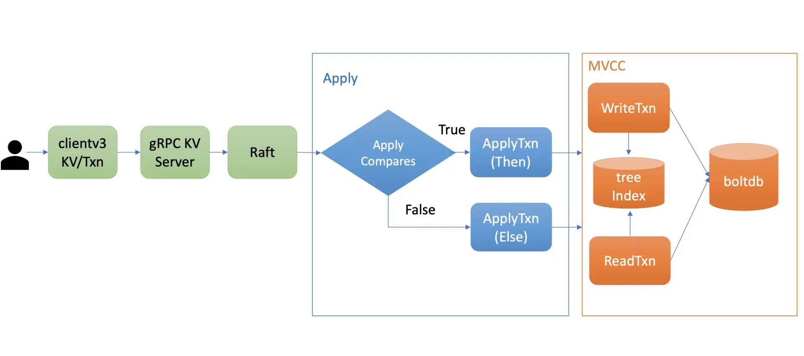
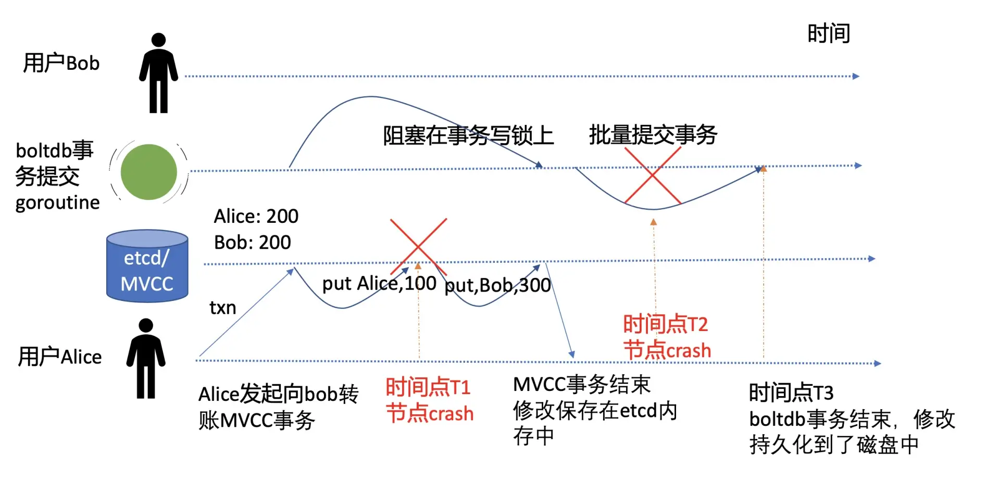

# etcd 事务

## 1. 事务特性初体验及 API

### 概述

以 Alice 向 Bob 转账为例：Alice 给 Bob 转账 100 元，Alice 账号减少 100，Bob 账号增加 100，这涉及到多个 key 的原子更新。

在 etcd v2 的时候， etcd 提供了 CAS（Compare and swap），然而其只支持单 key，不支持多 key，因此无法满足类似转账场景的需求。严格意义上说 CAS 称不上事务，无法实现事务的各个隔离级别。

etcd v3 为了解决多 key 的原子操作问题，提供了全新迷你事务 API，同时基于 MVCC 版本号，它可以实现各种隔离级别的事务。它的基本结构如下：

```sh
client.Txn(ctx).If(cmp1, cmp2, ...).Then(op1, op2, ...,).Else(op1, op2, …)
```

**事务 API 由 If 语句、Then 语句、Else 语句组成**

它的基本原理是，在 If 语句中，你可以添加一系列的条件表达式，若条件表达式全部通过检查，则执行 Then 语句的 get/put/delete 等操作，否则执行 Else 的 get/put/delete 等操作。

If 语句中的支持项如下：

* 1）**key 的最近一次修改版本号 mod_revision，简称 mod**，可以用于检查 key 最近一次被修改时的版本号是否符合你的预期。
  * 比如当你查询到 Alice 账号资金为 100 元时，它的 mod_revision 是 v1，当你发起转账操作时，你得确保 Alice 账号上的 100 元未被挪用，这就可以通过 `mod("Alice") = "v1"` 条件表达式来保障转账安全性。
* 2）**key 的创建版本号 create_revision，简称 create**,可以用于检测 key 是否已存在。
  * 比如在分布式锁场景里，只有分布式锁 key(lock) 不存在的时候，你才能发起 put 操作创建锁，这时你可以通过` create("lock") = "0"`来判断，因为一个 key 不存在的话它的 create_revision 版本号就是 0。
* 3） **key 的修改次数 version**；可以用于检查 key 的修改次数是否符合预期。
  * 比如你期望 key 在修改次数小于 3 时，才能发起某些操作时，可以通过 version("key") < "3"来判断。
* 4）**key 的值**，可以用于检查 key 的 value 值是否符合预期。
  * 比如期望 Alice 的账号资金为 200, `value("Alice") = "200"`。

If 语句通过以上 MVCC 版本号、value 值、各种比较运算符 (等于、大于、小于、不等于)，实现了灵活的比较的功能，满足你各类业务场景诉求。


### Demo

下面是使用 etcdctl 的 txn 事务命令，基于以上介绍的特性，初步实现的一个 Alice 向 Bob 转账 100 元的事务：

```sh
# 指定使用 etcd v3 api
$ export ETCDCTL_API=3
// -i 交互式事务
$ etcdctl txn -i
compares: //对应If语句
value("Alice") = "200" //判断Alice账号资金是否为200


success requests (get, put, del): //对应Then语句
put Alice 100 //Alice账号初始资金200减100
put Bob 300 //Bob账号初始资金200加100


failure requests (get, put, del): //对应Else语句
get Alice  
get Bob


SUCCESS //If语句检测通过

OK // Then 中的语句1执行成功
OK // Then 中的语句1执行成功
```


### 整体流程



当你通过 client 发起一个 txn 转账事务操作时，通过 gRPC KV Server、Raft 模块处理后，在 Apply 模块执行此事务的时候，它首先对你的事务的 If 语句进行检查，也就是 ApplyCompares 操作，如果通过此操作，则执行 ApplyTxn/Then 语句，否则执行 ApplyTxn/Else 语句。

在执行以上操作过程中，它会根据事务是否只读、可写，通过 MVCC 层的读写事务对象，执行事务中的 get/put/delete 各操作。


## 2. 事务 ACID 特性

ACID 是衡量事务的四个特性，由原子性（Atomicity）、一致性（Consistency）、隔离性（Isolation）、持久性（Durability）组成。


### 原子性与持久性

事务的原子性（Atomicity）是指在一个事务中，所有请求要么同时成功，要么同时失败。

> 比如在我们的转账案例中，是绝对无法容忍 Alice 账号扣款成功，但是 Bob 账号资金到账失败的场景。

持久性（Durability）是指事务一旦提交，其所做的修改会永久保存在数据库。

软件系统在运行过程中会遇到各种各样的软硬件故障，如果 etcd 在执行上面事务过程中，刚执行完扣款命令（put Alice 100）就突然 crash 了，它是如何保证转账事务的原子性与持久性的呢？




T1 时间点只是将修改写入到了内存，并未持久化。 crash 后事务并未成功执行和持久化任意数据到磁盘上。在节点重启时，etcd  server 会重放 WAL 中的已提交日志条目，再次执行以上转账事务。

T2 时间点则是写入内存完成后，持久化到磁盘时 crash。我们知道 consistent index 字段值是和 key-value 数据在一个 boltdb 事务里同时持久化到磁盘中的，所以持久化失败后者两个值也没能更新成功，那么当节点重启，etcd  server 重放 WAL 中已提交日志条目时，同样会再次应用转账事务到状态机中，因此事务的原子性和持久化依然能得到保证。

> 会不会部分数据提交成功，部分数据提交失败呢？


### 一致性

* 分布式系统中多副本数据一致性，它是指各个副本之间的数据是否一致，比如 Redis 的主备是异步复制的，那么它的一致性是最终一致性的。
* CAP 原理中的一致性是指可线性化。核心原理是虽然整个系统是由多副本组成，但是通过线性化能力支持，对 client 而言就如一个副本，应用程序无需关心系统有多少个副本。
* 一致性哈希，它是一种分布式系统中的数据分片算法，具备良好的分散性、平衡性。
* 事务中的一致性，它是指事务变更前后，数据库必须满足若干恒等条件的状态约束

**一致性往往是由数据库和业务程序两方面来保障的**。

在本例中，转账系统内的各账号资金总额，在转账前后应该一致，同时各账号资产不能小于 0。

* 一方面，业务程序在转账逻辑里面，需检查转账者资产大于等于转账金额。在事务提交时，通过账号资产的版本号，确保双方账号资产未被其他事务修改。
* 另一方面，etcd 会通过 WAL 日志和 consistent index、boltdb 事务特性，去确保事务的原子性，因此不会有部分成功部分失败的操作，导致资金凭空消失、新增。


## 隔离性

