# etcd blotdb

> [blotdb 源码分析](https://github.com/ZhengHe-MD/learn-bolt)

## 1. 概述

etcd 适合读多写少的场景主要和底层 [boltdb](https://github.com/boltdb/bolt) 有关。本文通过一个写请求在 boltdb 中执行的简要流程，分析其背后的 boltdb 的磁盘文件布局，从而了解 page、node、bucket 等核心数据结构的原理与作用，搞懂 boltdb 基于 B+ tree、各类 page 实现查找、更新、事务提交的原理 。

> etcd 中使用的是 etcd 社区基于 boltdb fork 的一个 [版本](https://github.com/etcd-io/bbolt) ，etcd 社区负责维护此版本。
>
> boltdb 作者认为 boltdb 已经足够成熟稳定，经过了大规模生产环境检验，新特性和优化点合入会对 boltdb稳定性造成一定的影响，个人没更多时间再投入到 boltdb上，因此 boltdb 项目变成 archived 状态。


### 磁盘布局

boltdb 文件指的是你 etcd 数据目录下的 `member/snap/db` 的文件， etcd 的 key-value、lease、meta、member、cluster、auth 等所有数据存储在其中。etcd 启动的时候，会通过 **mmap 机制**将 db 文件映射到内存，后续可从内存中快速读取文件中的数据。写请求通过 fwrite 和 fdatasync 来写入、持久化数据到磁盘。

blotdb 磁盘布局如下图：

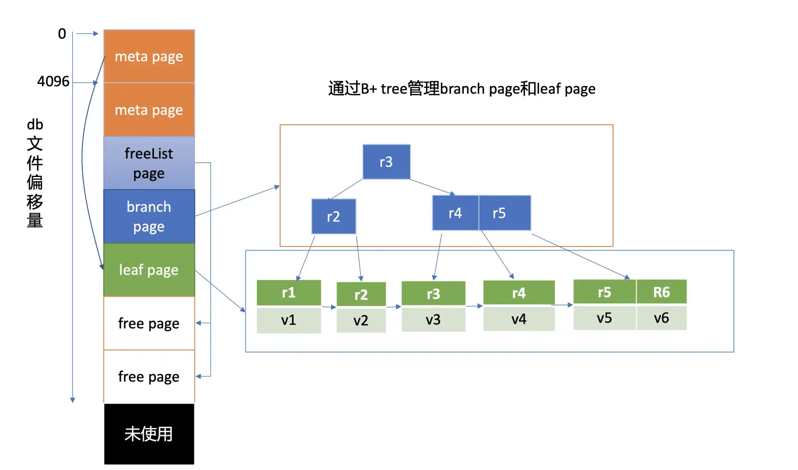

文件的内容由若干个 page 组成，一般情况下 page size 为 4KB。

page 按照功能可分为：

* **元数据页 (meta page)**：
  * 文件最开头的两个 page 是固定的 db 元数据 meta page
* **空闲页管理页 (freelist page)**
  * 空闲页管理页记录了 db 中哪些页是空闲、可使用的。
* **B+ tree 索引节点页 (branch page)**
  * 索引节点页保存了 B+ tree 的内部节点，如图中的右边部分所示，它们记录了 key 值
* **B+ tree 叶子节点页 (leaf page)**
  * 叶子节点页记录了 B+ tree 中的 key-value 和 bucket 数据。
* **空闲页 (free page)**
  * 当前暂未使用的 page。

boltdb 逻辑上通过 B+ tree 来管理 branch/leaf page， 实现快速查找、写入 key-value 数据。


## 2 API

**boltdb 作为一个库，提供了什么 API 给 client 访问写入数据？**

boltdb 提供了非常简单的 API 给上层业务使用，当我们执行一个 put hello 为 world 命令时，boltdb 实际写入的 key 是版本号，value 为 mvccpb.KeyValue 结构体。

这里我们简化下，假设往 key bucket 写入一个 key 为 r94，value 为 world 的字符串，其核心代码如下：

```go

// 打开boltdb文件，获取db对象
db,err := bolt.Open("db"， 0600， nil)
if err != nil {
   log.Fatal(err)
}
defer db.Close()
// 参数true表示创建一个写事务，false则为读事务
tx,err := db.Begin(true)
if err != nil {
   return err
}
defer tx.Rollback()
// 使用事务对象创建key bucket
b,err := tx.CreatebucketIfNotExists([]byte("key"))
if err != nil {
   return err
}
// 使用bucket对象更新一个key
if err := b.Put([]byte("r94"),[]byte("world")); err != nil {
   return err
}
// 提交事务
if err := tx.Commit(); err != nil {
   return err
}
```

整体代码非常简单，并没有想象中的困难。


## 3. 核心数据结构

boltdb 整个文件由一个个 page 组成。最开头的两个 page 描述 db 元数据信息，而它正是在 client 调用 boltdb Open API 时被填充的。那么描述磁盘页面的 page 数据结构是怎样的呢？元数据页又含有哪些核心数据结构？

boltdb 本身自带了一个工具 [bbolt](https://github.com/etcd-io/bbolt/blob/master/cmd/bbolt/main.go)，它可以按页打印出 db 文件的十六进制的内容，下面我们就使用此工具来揭开 db 文件的神秘面纱。

下图左边的十六进制是执行如下 [bbolt dump](https://github.com/etcd-io/bbolt/blob/master/cmd/bbolt/main.go) 命令，所打印的 boltdb 第 0 页的数据，图的右边是对应的 page 磁盘页结构和 meta page 的数据结构。

```shell
$ ./bbolt dump ./infra1.etcd/member/snap/db 0
```


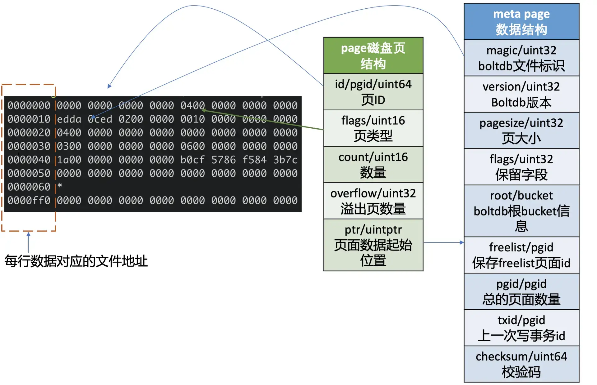

### page 磁盘页结构

我们先了解下 page 磁盘页结构，如上图所示，它由页 ID(id)、页类型 (flags)、数量 (count)、溢出页数量 (overflow)、页面数据起始位置 (ptr) 字段组成。

页类型目前有如下四种：

* 0x01 表示 branch page
* 0x02 表示 leaf page
* 0x04 表示 meta page
* 0x10 表示 freelist page。

数量字段仅在页类型为 leaf 和 branch 时生效，溢出页数量是指当前页面数据存放不下，需要向后再申请 overflow 个连续页面使用，页面数据起始位置指向 page 的载体数据，比如 meta page、branch/leaf 等 page 的内容。


### meta page 数据结构

如上图中的 meta page 数据结构所示，你可以看到它由 boltdb 的文件标识 (magic)、版本号 (version)、页大小 (pagesize)、boltdb 的根 bucket 信息 (root bucket)、freelist 页面 ID(freelist)、总的页面数量 (pgid)、上一次写事务 ID(txid)、校验码 (checksum) 组成。


### meta page 十六进制分析

上图中十六进制输出的是 db 文件的 page 0 页结构，左边第一列表示此行十六进制内容对应的文件起始地址，每行 16 个字节。

结合 page 磁盘页和 meta page 数据结构我们可知，第一行前 8 个字节描述 pgid(忽略第一列) 是 0。接下来 2 个字节描述的页类型， 其值为 0x04 表示 meta page， 说明此页的数据存储的是 meta page 内容，因此 ptr 开始的数据存储的是 meta page 内容。

正如你下图中所看到的，第二行首先含有一个 4 字节的 magic number(0xED0CDAED)，通过它来识别当前文件是否 boltdb，接下来是两个字节描述 boltdb 的版本号 0x2， 然后是四个字节的 page size 大小，0x1000 表示 4096 个字节，四个字节的 flags 为 0。

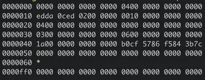

第三行对应的就是 meta page 的 root bucket 结构（16 个字节），它描述了 boltdb 的 root bucket 信息，比如一个 db 中有哪些 bucket， bucket 里面的数据存储在哪里。

第四行中前面的 8 个字节，0x3 表示 freelist 页面 ID，此页面记录了 db 当前哪些页面是空闲的。后面 8 个字节，0x6 表示当前 db 总的页面数。

第五行前面的 8 个字节，0x1a 表示上一次的写事务 ID，后面的 8 个字节表示校验码，用于检测文件是否损坏。


### bucket 数据结构

如下命令所示，你可以使用 bbolt buckets 命令，输出一个 db 文件的 bucket 列表。执行完此命令后，我们可以看到之前介绍过的 auth/lease/meta 等熟悉的 bucket，它们都是 etcd 默认创建的。那么 boltdb 是如何存储、管理 bucket 的呢？

```sh
$ ./bbolt buckets  ./infra1.etcd/member/snap/db
alarm
auth
authRoles
authUsers
cluster
key
lease
members
members_removed
meta
```

 meta page 中的，有一个名为 root、类型 bucket 的重要数据结构，如下所示，bucket 由 root 和 sequence 两个字段组成，root 表示该 bucket 根节点的 page id。

> 注意 meta page 中的 bucket.root 字段，存储的是 db 的 root bucket 页面信息，你所看到的 key/lease/auth 等 bucket 都是 root bucket 的子 bucket。

```go
type bucket struct {
   root     pgid   // page id of the bucket's root-level page
   sequence uint64 // monotonically incrementing, used by NextSequence()
}
```

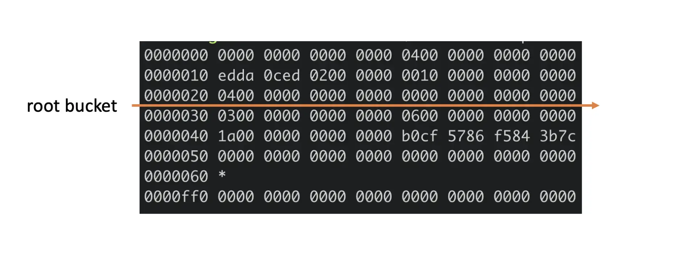

上面 meta page 十六进制图中，第三行的 16 个字节就是描述的 root bucket 信息。root bucket 指向的 page id 为 4，page id 为 4 的页面是什么类型呢？ 我们可以通过如下 bbolt pages 命令看看各个 page 类型和元素数量，从下图结果可知，4 号页面为 leaf page。

```sh
$ ./bbolt pages  ./infra1.etcd/member/snap/db
ID       TYPE       ITEMS  OVRFLW
======== ========== ====== ======
0        meta       0
1        meta       0
2        free
3        freelist   2
4        leaf       10
5        free
```

通过上面的分析可知，当 bucket 比较少时，我们子 bucket 数据可直接从 meta page 里指向的 leaf page 中找到。


### leaf page

 leaf page 它的磁盘布局如下图所示，前半部分是 leafPageElement 数组，后半部分是 key-value 数组。

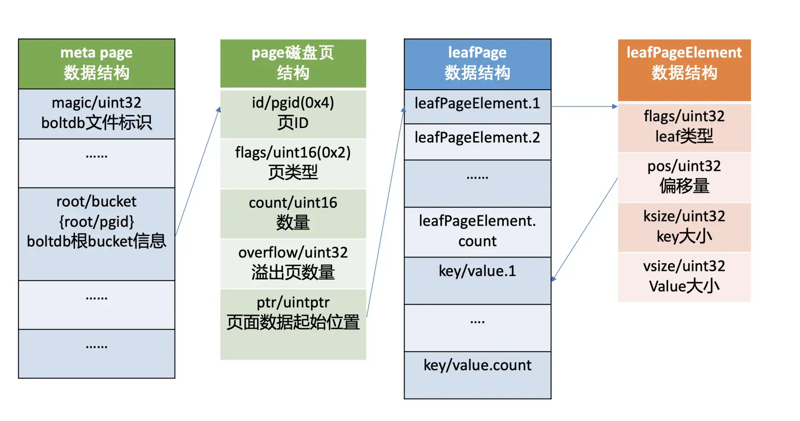

leafPageElement 包含 leaf page 的类型 flags， 通过它可以区分存储的是 bucket 名称还是 key-value 数据。

当 flag 为 bucketLeafFlag(0x01) 时，表示存储的是 bucket 数据，否则存储的是 key-value 数据，leafPageElement 它还含有 key-value 的读取偏移量，key-value 大小，根据偏移量和 key-value 大小，我们就可以方便地从 leaf page 中解析出所有 key-value 对。

当存储的是 bucket 数据的时候，key 是 bucket 名称，value 则是 bucket 结构信息。bucket 结构信息含有 root page 信息，通过 root page（基于 B+ tree 查找算法），你可以快速找到你存储在这个 bucket 下面的 key-value 数据所在页面。

从上面分析你可以看到，每个子 bucket 至少需要一个 page 来存储其下面的 key-value 数据，如果子 bucket 数据量很少，就会造成磁盘空间的浪费。实际上 boltdb 实现了 inline bucket，在满足一些条件限制的情况下，可以将小的子 bucket 内嵌在它的父亲叶子节点上，友好的支持了大量小 bucket。

> 为了方便大家快速理解核心原理，本节我们讨论的 bucket 是假设都是非 inline bucket。


### branch page

boltdb 使用了 B+ tree 来高效管理所有子 bucket 和 key-value 数据，因此它可以支持大量的 bucket 和 key-value，只不过 B+ tree 的根节点不再直接指向 leaf page，而是 branch page 索引节点页。branch page flags 为 0x01。它的磁盘布局如下图所示，前半部分是 branchPageElement 数组，后半部分是 key 数组。

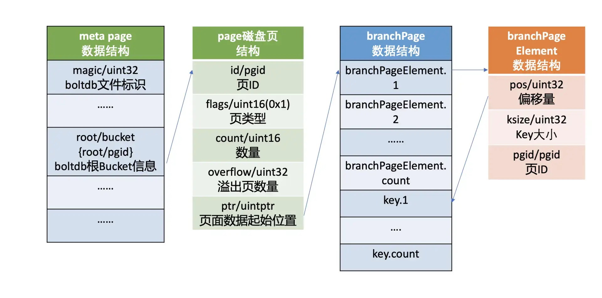

branchPageElement 包含 key 的读取偏移量、key 大小、子节点的 page id。根据偏移量和 key 大小，我们就可以方便地从 branch page 中解析出所有 key，然后二分搜索匹配 key，获取其子节点 page id，递归搜索，直至从 bucketLeafFlag 类型的 leaf page 中找到目的 bucket name。

注意，boltdb 在内存中使用了一个名为 node 的数据结构，来保存 page 反序列化的结果。下面我给出了一个 boltdb 读取 page 到 node 的代码片段，你可以直观感受下。

```go
func (n *node) read(p *page) {
   n.pgid = p.id
   n.isLeaf = ((p.flags & leafPageFlag) != 0)
   n.inodes = make(inodes, int(p.count))


   for i := 0; i < int(p.count); i++ {
      inode := &n.inodes[i]
      if n.isLeaf {
         elem := p.leafPageElement(uint16(i))
         inode.flags = elem.flags
         inode.key = elem.key()
         inode.value = elem.value()
      } else {
         elem := p.branchPageElement(uint16(i))
         inode.pgid = elem.pgid
         inode.key = elem.key()
      }
   }
```

从上面分析过程中你会发现，boltdb 存储 bucket 和 key-value 原理是类似的，将 page 划分成 branch page、leaf page，通过 B+ tree 来管理实现。boltdb 为了区分 leaf page 存储的数据类型是 bucket 还是 key-value，增加了标识字段（leafPageElement.flags），因此 key-value 的数据存储过程我就不再重复分析了。


### freelist

**boltdb 通过 meta page 中的 freelist 来管理页面的分配，freelist page 中记录了哪些页是空闲的**。当你在 boltdb 中删除大量数据的时候，其对应的 page 就会被释放，页 ID 存储到 freelist 所指向的空闲页中。当你写入数据的时候，就可直接从空闲页中申请页面使用。

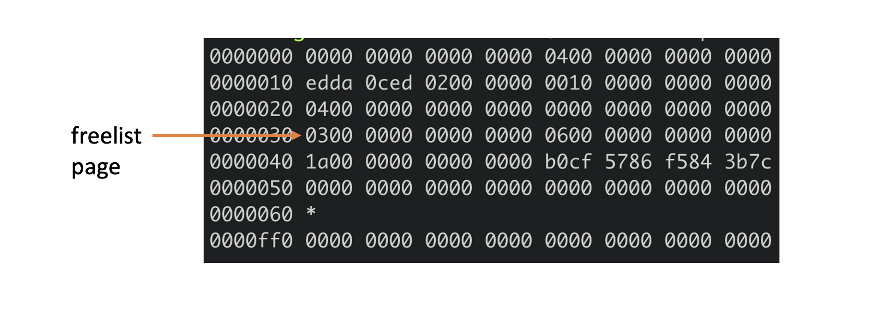

下面 meta page 十六进制图中，第四行的前 8 个字节就是描述的 freelist 信息，page id 为 3。我们可以通过 bbolt page 命令查看 3 号 page 内容，如下所示，它记录了 2 和 5 为空闲页，与我们上面通过 bbolt pages 命令所看到的信息一致。

```sh
$ ./bbolt page  ./infra1.etcd/member/snap/db 3
page ID:    3
page Type:  freelist
Total Size: 4096 bytes
Item Count: 2
Overflow: 0

2
5
```

下图是 freelist page 存储结构，pageflags 为 0x10，表示 freelist 类型的页，ptr 指向空闲页 id 数组。注意在 boltdb 中支持通过多种数据结构（数组和 hashmap）来管理 free page，这里我介绍的是数组。

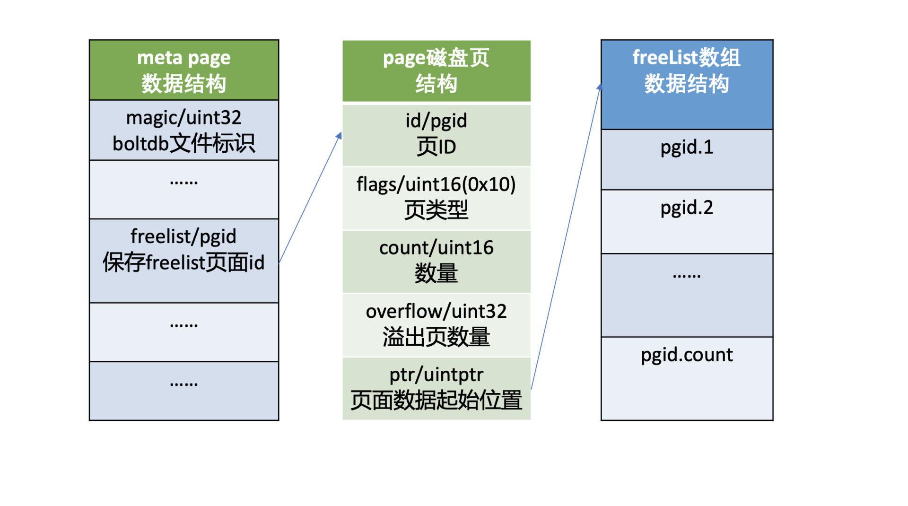


## 4. API 原理

### open

首先它会打开 db 文件并对其增加文件锁，目的是防止其他进程也以读写模式打开它后，操作 meta 和 free page，导致 db 文件损坏。

其次 boltdb 通过 mmap 机制将 db 文件映射到内存中，并读取两个 meta page 到 db 对象实例中，然后校验 meta page 的 magic、version、checksum 是否有效，若两个 meta page 都无效，那么 db 文件就出现了严重损坏，导致异常退出。

### put

put 操作它首先是根据 meta page 中记录 root bucket 的 root page，按照 B+ tree 的查找算法，从 root page 递归搜索到对应的叶子节点 page 面，返回 key 名称、leaf 类型。

如果 leaf 类型为 bucketLeafFlag，且 key 相等，那么说明已经创建过，不允许 bucket 重复创建，结束请求。否则往 B+ tree 中添加一个 flag 为 bucketLeafFlag 的 key，key 名称为 bucket name，value 为 bucket 的结构。

创建完 bucket 后，你就可以通过 bucket 的 Put API 发起一个 Put 请求更新数据。它的核心原理跟 bucket 类似，根据子 bucket 的 root page，从 root page 递归搜索此 key 到 leaf page，如果没有找到，则在返回的位置处插入新 key 和 value。

那么如何确定这个 key 的插入位置呢？

如下图所示：

首先从 boltdb 的 key bucket 的 root page 里，二分查找大于等于 r94 的 key 所在 page，最终找到 key r9 指向的 page（流程 1）。r9 指向的 page 是个 leaf page，B+ tree 需要确保叶子节点 key 的有序性，因此同样二分查找其插入位置，将 key r94 插入到相关位置（流程二）。

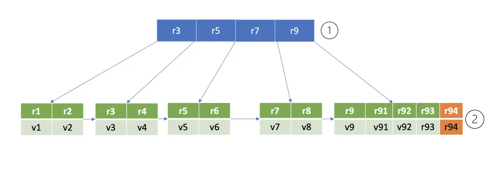

boltdb 在内存中通过 node 数据结构来存储 page 磁盘页内容，它记录了 key-value 数据、page id、parent 及 children 的 node、B+ tree 是否需要进行重平衡和分裂操作等信息。

因此，当我们执行完一个 put 请求时，它只是将值更新到 boltdb 的内存 node 数据结构里，并未持久化到磁盘中。


## 5. 事务提交原理

当你的代码执行 tx.Commit API 时，它才会将我们上面保存到 node 内存数据结构中的数据，持久化到 boltdb 中。下图我给出了一个事务提交的流程图，接下来我就分别和你简要分析下各个核心步骤。

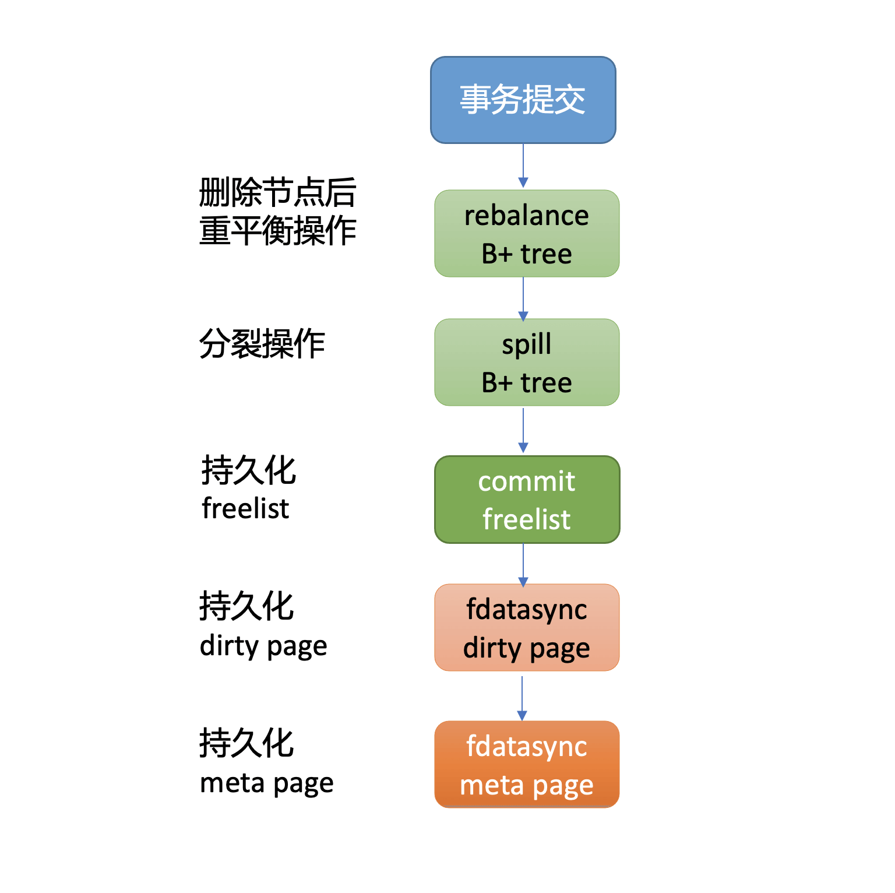

首先从上面 put 案例中我们可以看到，插入了一个新的元素在 B+ tree 的叶子节点，它可能已不满足 B+ tree 的特性，因此事务提交时，第一步首先要调整 B+ tree，进行重平衡、分裂操作，使其满足 B+ tree 树的特性。上面案例里插入一个 key r94 后，经过重平衡、分裂操作后的 B+ tree 如下图所示。

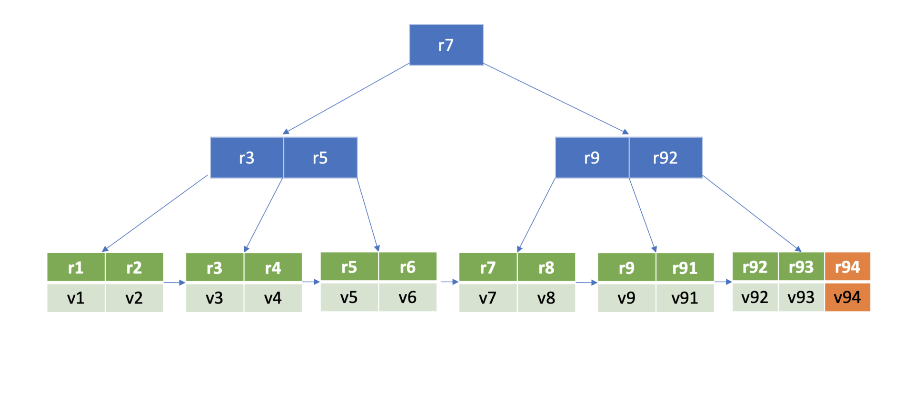

在重平衡、分裂过程中可能会申请、释放 free page，freelist 所管理的 free page 也发生了变化。因此事务提交的第二步，就是持久化 freelist。

> 注意，在 etcd v3.4.9 中，为了优化写性能等，freelist 持久化功能是关闭的。etcd 启动获取 boltdb db 对象的时候，boltdb 会遍历所有 page，构建空闲页列表。

事务提交的第三步就是将 client 更新操作产生的 dirty page 通过 fdatasync 系统调用，持久化存储到磁盘中。

最后，在执行写事务过程中，meta page 的 txid、freelist 等字段会发生变化，因此事务的最后一步就是持久化 meta page。

通过以上四大步骤，我们就完成了事务提交的工作，成功将数据持久化到了磁盘文件中，安全地完成了一个 put 操作。


## 6. 小结 

* db 文件由 meta page、freelist page、branch page、leaf page、free page 组成
*  Open API 获取 db 对象，其通过 mmap 将 db 文件映射到内存，构建 meta page，校验 meta page 的有效性
* 添加 bucket 和 key-value 操作本质，是从 B+ tree 管理的 page 中找到插入的页和位置，并将数据更新到 page 的内存 node 数据结构中
* 真正持久化数据到磁盘是通过事务提交执行的。它首先需要通过一系列重平衡、分裂操作，确保 boltdb 维护的 B+ tree 满足相关特性，其次需要持久化 freelist page，并将用户更新操作产生的 dirty page 数据持久化到磁盘中，最后则是持久化 meta page。


