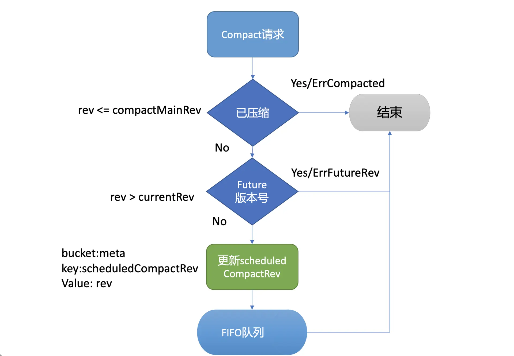
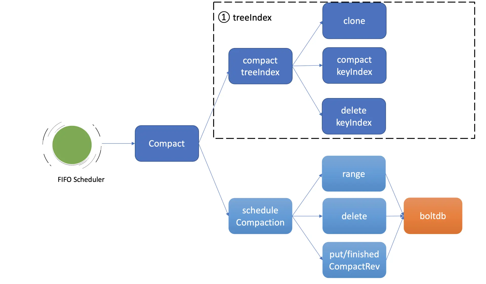
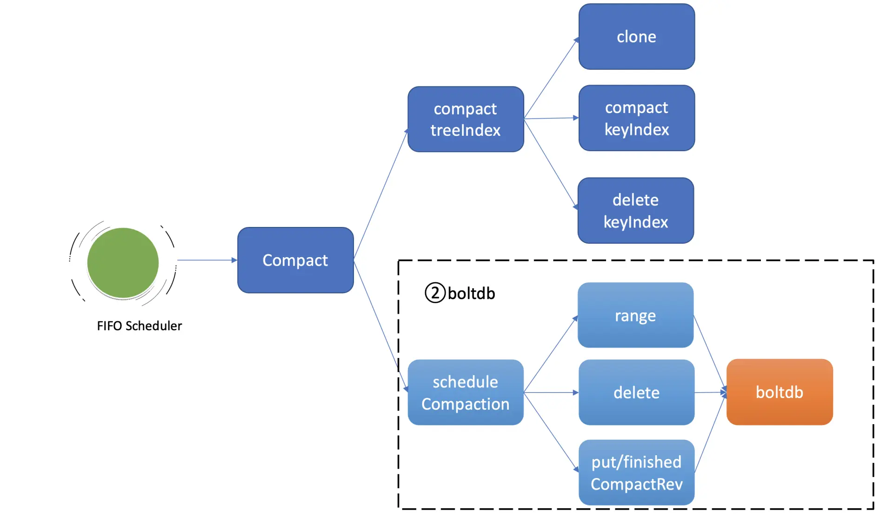

# etcd 数据压缩功能

## 1. 概述

我们知道 etcd 中的每一次更新、删除 key 操作，treeIndex 的 keyIndex 索引中都会追加一个版本号，在 boltdb 中会生成一个新版本 boltdb key 和 value。也就是随着你不停更新、删除，你的 etcd 进程内存占用和 db 文件就会越来越大。很显然，这会导致 etcd OOM 和 db 大小增长到最大 db 配额，最终不可写。

 etcd 压缩机制则是用于解决该问题。


## 2. 整体架构


从图中可以看到，你可以通过 client API 发起人工的压缩 (Compact) 操作，也可以配置自动压缩策略。在自动压缩策略中，你可以根据你的业务场景选择合适的压缩模式。目前 etcd 支持两种压缩模式，分别是时间周期性压缩和版本号压缩。

当你通过 API 发起一个 Compact 请求后，KV Server 收到 Compact 请求提交到 Raft 模块处理，在 Raft 模块中提交后，Apply 模块就会通过 MVCC 模块的 Compact 接口执行此压缩任务。

Compact 接口首先会更新当前 server 已压缩的版本号，并将耗时昂贵的压缩任务保存到 FIFO 队列中异步执行。压缩任务执行时，它首先会压缩 treeIndex 模块中的 keyIndex 索引，其次会遍历 boltdb 中的 key，删除已废弃的 key。

以上就是压缩模块的一个工作流程。


## 3. 压缩特性初体验

在使用 etcd 过程中，当你遇到"etcdserver: mvcc: database space exceeded"错误时，若是你未开启压缩策略导致 db 大小达到配额，这时你可以使用 etcdctl compact 命令，主动触发压缩操作，回收历史版本。

如下所示，你可以先通过 endpoint status 命令获取 etcd 当前版本号，然后再通过 etcdctl compact 命令发起压缩操作即可。

```sh
# 获取etcd当前版本号
$ rev=$(etcdctl endpoint status --write-out="json" | egrep -o '"revision":[0-9]*' | egrep -o '[0-9].*')
$ echo $rev
9
# 执行压缩操作，指定压缩的版本号为当前版本号
$ etcdctl compact $rev
Compacted revision 9
# 压缩一个已经压缩的版本号
$ etcdctl compact $rev
Error: etcdserver: mvcc: required revision has been compacted
# 压缩一个比当前最大版号大的版本号
$ etcdctl compact 12
Error: etcdserver: mvcc: required revision is a future revision
```

> 请注意，如果你压缩命令传递的版本号小于等于当前 etcd server 记录的压缩版本号，etcd server 会返回已压缩错误 ("mvcc: required revision has been compacted") 给 client。如果版本号大于当前 etcd server 最新的版本号，etcd server 则返回一个未来的版本号错误给 client("mvcc: required revision is a future revision")。

执行压缩命令的时候，不少初学者有一个常见的误区，就是担心压缩会不会把我最新版本数据给删除？

压缩的本质是回收历史版本，目标对象仅是历史版本，不包括一个 key-value 数据的最新版本，因此你可以放心执行压缩命令，不会删除你的最新版本数据。

> 注意：不过 Watch 特性中的历史版本数据同步，依赖于 MVCC 中是否还保存了相关数据，因此我建议你不要每次简单粗暴地回收所有历史版本。

**在一般情况下，我建议使用 etcd 自带的压缩机制**。它支持两种模式，分别是按时间周期性压缩和保留版本号的压缩，配置相应策略后，etcd 节点会自动化的发起 Compact 操作。


## 4. 压缩策略

### 周期性压缩

当你希望 etcd 只保留最近一段时间写入的历史版本时，你就可以选择配置 etcd 的压缩模式为 periodic，保留时间为你自定义的 1h 等。

如下所示，etcd server 提供了配置压缩模式和保留时间的参数：

```sh
--auto-compaction-retention '0'
Auto compaction retention length. 0 means disable auto Compaction.
--auto-compaction-mode 'periodic'
Interpret 'auto-Compaction-retention' one of: periodic|revision.
```

* auto-compaction-mode 为 periodic 时，它表示启用时间周期性压缩，auto-compaction-retention 为保留的时间的周期，比如 1h。
* auto-compaction-mode 为 revision 时，它表示启用版本号压缩模式，auto-compaction-retention 为保留的历史版本号数，比如 10000。

> 注意，etcd server 的 auto-compaction-retention 为'0'时，将关闭自动压缩策略，

那么周期性压缩模式的原理是怎样的呢？ etcd 是如何知道你配置的 1h 前的 etcd server 版本号呢？

其实非常简单，etcd server 启动后，根据你的配置的模式 periodic，会创建 periodic Compactor，它会异步的获取、记录过去一段时间的版本号。periodic Compactor 组件获取你设置的压缩间隔参数 1h， 并将其划分成 10 个区间，也就是每个区间 6 分钟。每隔 6 分钟，它会通过 etcd MVCC 模块的接口获取当前的 server 版本号，追加到 rev 数组中。

因为你只需要保留过去 1 个小时的历史版本，periodic Compactor 组件会通过当前时间减去上一次成功执行 Compact 操作的时间，如果间隔大于一个小时，它会取出 rev 数组的首元素，通过 etcd server 的 Compact 接口，发起压缩操作。

> 注意：在 etcd v3.3.3 版本之前，不同的 etcd 版本对周期性压缩的行为是有一定差异的，具体的区别你可以参考下[官方文档](https://github.com/etcd-io/etcd/blob/v3.4.9/Documentation/op-guide/maintenance.md)。


### 版本号压缩

当你写请求比较多，可能产生比较多的历史版本导致 db 增长时，或者不确定配置 periodic 周期为多少才是最佳的时候，你可以通过设置压缩模式为 revision，指定保留的历史版本号数。比如你希望 etcd 尽量只保存 1 万个历史版本，那么你可以指定 

* compaction-mode 为 revision；
* auto-compaction-retention 为 10000。

它的实现原理又是怎样的呢?

也很简单，etcd 启动后会根据你的压缩模式 revision，创建 revision Compactor。revision Compactor 会根据你设置的保留版本号数，每隔 5 分钟定时获取当前 server 的最大版本号，减去你想保留的历史版本数，然后通过 etcd server 的 Compact 接口发起如下的压缩操作即可。

```sh
# 获取当前版本号，减去保留的版本号数
rev := rc.rg.Rev() - rc.retention
# 调用server的Compact接口压缩
_，err := rc.c.Compact(rc.ctx，&pb.CompactionRequest{Revision: rev})
```


### 压缩原理

如架构图所示：Compact 请求经过 Raft 日志同步给多数节点后，etcd 会从 Raft 日志取出 Compact 请求，应用此请求到状态机执行。

执行流程如下图所示，MVCC 模块的 Compact 接口首先会检查 Compact 请求的版本号 rev 是否已被压缩过，若是则返回 ErrCompacted 错误给 client。其次会检查 rev 是否大于当前 etcd server 的最大版本号，若是则返回 ErrFutureRev 给 client，这就是我们上面执行 etcdctl compact 命令所看到的那两个错误原理。

通过检查后，Compact 接口会通过 boltdb 的 API 在 meta bucket 中更新当前已调度的压缩版本号 (scheduledCompactedRev) 号，然后将压缩任务追加到 FIFO Scheduled 中，异步调度执行。



为什么 Compact 接口需要持久化存储当前已调度的压缩版本号到 boltdb 中呢？

试想下如果不保存这个版本号，etcd 在异步执行的 Compact 任务过程中 crash 了，那么异常节点重启后，各个节点数据就会不一致。

**因此 etcd 通过持久化存储 scheduledCompactedRev，节点 crash 重启后，会重新向 FIFO Scheduled 中添加压缩任务，已保证各个节点间的数据一致性**。

异步的执行压缩任务会做哪些工作呢？

异步压缩任务的第一项工作，就是**压缩 treeIndex 模块中的各 key 的历史版本、已删除的版本**。为了避免压缩工作影响读写性能，首先会克隆一个 B-tree，然后通过克隆后的 B-tree 遍历每一个 keyIndex 对象，压缩历史版本号、清理已删除的版本。

假设当前压缩的版本号是 CompactedRev， 它会保留 keyIndex 中最大的版本号，移除小于等于 CompactedRev 的版本号，并通过一个 map 记录 treeIndex 中有效的版本号返回给 boltdb 模块使用。




为什么要保留最大版本号呢?

因为最大版本号是这个 key 的最新版本，移除了会导致 key 丢失。而 Compact 的目的是回收旧版本。当然如果 keyIndex 中的最大版本号被打了删除标记 (tombstone)， 就会从 treeIndex 中删除这个 keyIndex，否则会出现内存泄露。

Compact 任务执行完索引压缩后，它通过遍历 B-tree、keyIndex 中的所有 generation 获得当前内存索引模块中有效的版本号，这些信息将帮助 etcd 清理 boltdb 中的废弃历史版本。



压缩任务的第二项工作就是**删除 boltdb 中废弃的历史版本数据**。如上图所示，它通过 etcd 一个名为 scheduleCompaction 任务来完成。

scheduleCompaction 任务会根据 key 区间，从 0 到 CompactedRev 遍历 boltdb 中的所有 key，通过 treeIndex 模块返回的有效索引信息，判断这个 key 是否有效，无效则调用 boltdb 的 delete 接口将 key-value 数据删除。

在这过程中，scheduleCompaction 任务还会更新当前 etcd 已经完成的压缩版本号 (finishedCompactRev)，将其保存到 boltdb 的 meta bucket 中。

scheduleCompaction 任务遍历、删除 key 的过程可能会对 boltdb 造成压力，为了不影响正常读写请求，它在执行过程中会通过参数控制每次遍历、删除的 key 数（默认为 100，每批间隔 10ms），分批完成 boltdb key 的删除操作。


### 为什么压缩后 db 大小不减少呢?

当我们通过 boltdb 删除大量的 key，在事务提交后 B+ tree 经过分裂、平衡，会释放出若干 branch/leaf page 页面，**然而 boltdb 并不会将其释放给磁盘，调整 db 大小操作是昂贵的，会对性能有较大的损害**。

**boltdb 是通过 freelist page 记录这些空闲页的分布位置，当收到新的写请求时，优先从空闲页数组中申请若干连续页使用，实现高性能的读写（而不是直接扩大 db 大小）**。当连续空闲页申请无法得到满足的时候，  boltdb 才会通过增大 db 大小来补充空闲页。

一般情况下，压缩操作释放的空闲页就能满足后续新增写请求的空闲页需求，db 大小会趋于整体稳定。


## 5. 小结 

* etcd 压缩操作可通过 API 人工触发，也可以配置压缩模式由 etcd server 自动触发。
* 压缩模式支持按周期和版本两种。
  * 在周期模式中你可以实现保留最近一段时间的历史版本数；
  * 在版本模式中你可以实现保留期望的历史版本数。
* 压缩的核心工作原理分为两大任务，
  * 第一个任务是压缩 treeIndex 中的各 key 历史索引，清理已删除 key，并将有效的版本号保存到 map 数据结构中。
  * 第二个任务是删除 boltdb 中的无效 key。基本原理是根据版本号遍历 boltdb 已压缩区间范围的 key，通过 treeIndex 返回的有效索引 map 数据结构判断 key 是否有效，无效则通过 boltdb API 删除它。
* 最后在执行压缩的操作中，虽然我们删除了 boltdb db 的 key-value 数据，但是 db 大小并不会减少。db 大小不变的原因是存放 key-value 数据的 branch 和 leaf 页，它们释放后变成了空闲页，并不会将空间释放给磁盘。


boltdb 通过 freelist page 来管理一系列空闲页，后续新增的写请求优先从 freelist 中申请空闲页使用，以提高性能。在写请求速率稳定、新增 key-value 较少的情况下，压缩操作释放的空闲页就可以基本满足后续写请求对空闲页的需求，db 大小就会处于一个基本稳定、健康的状态。