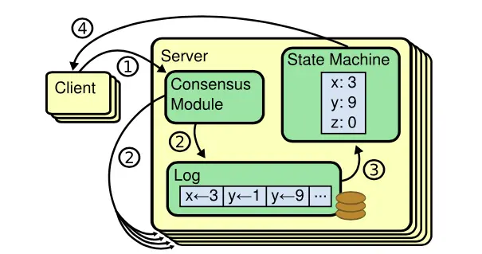

# 为什么基于Raft实现的etcd还会出现数据不一致？

## 1. 概述

首先我们知道，etcd 各个节点数据一致性基于 Raft 算法的日志复制实现的，etcd 是个基于复制状态机实现的分布式系统。下图是分布式复制状态机原理架构，核心由 3 个组件组成，一致性模块、日志、状态机，其工作流程如下：

* client 发起一个写请求（set x = 3）；
* server 向一致性模块（假设是 Raft）提交请求，一致性模块生成一个写提案日志条目。若 server 是 Leader，把日志条目广播给其他节点，并持久化日志条目到 WAL 中；
* 当一半以上节点持久化日志条目后，Leader 的一致性模块将此日志条目标记为已提交（committed），并通知其他节点提交；
* server 从一致性模块获取已经提交的日志条目，异步应用到状态机持久化存储中（boltdb 等），然后返回给 client。

从图中我们可以了解到，在基于复制状态机实现的分布式存储系统中，Raft 等一致性算法它只能确保各个节点的日志一致性，也就是图中的流程二。

而对于流程三来说，server 从日志里面获取已提交的日志条目，将其应用到状态机的过程，跟 Raft 算法本身无关，属于 server 本身的数据存储逻辑。

**也就是说有可能存在 server 应用日志条目到状态机失败，进而导致各个节点出现数据不一致。但是这个不一致并非 Raft 模块导致的，它已超过 Raft 模块的功能界限。**

在应用日志条目到状态机流程中，可能会出现逻辑错误，导致 key-value 数据未能持久化存储到 boltdb。

这种逻辑错误即便重试也无法解决，目前社区也没有彻底的根治方案，只能根据具体案例进行针对性的修复。

**算法一致性不代表一个庞大的分布式系统工程实现中一定能保障一致性，工程实现上充满着各种挑战，从不可靠的网络环境到时钟、再到人为错误、各模块间的复杂交互等，几乎没有一个存储系统能保证任意分支逻辑能被测试用例 100% 覆盖。**

## 2. 最佳实践

实践中可以通过以下手段来提前发现和规避不一致问题：

* 开启 etcd 的数据毁坏检测功能；
* 应用层的数据一致性检测；
* 定时数据备份；
* 良好的运维规范（比如使用较新稳定版本、确保版本一致性、灰度变更）。

### 2.1 开启 etcd 的数据毁坏检测功能

etcd 不仅支持在启动的时候，通过 --experimental-initial-corrupt-check 参数检查各个节点数据是否一致，也支持在运行过程通过指定 --experimental-corrupt-check-time 参数每隔一定时间检查数据一致性。

etcd 的实现也就是通过遍历 treeIndex 模块中的所有 key 获取到版本号，然后再根据版本号从 boltdb 里面获取 key 的 value，使用 crc32 hash 算法，将 bucket name、key、value 组合起来计算它的 hash 值。

如果你开启了 --experimental-initial-corrupt-check，启动的时候每个节点都会去获取 peer 节点的 boltdb hash 值，然后相互对比，如果不相等就会无法启动。

而定时检测是指 Leader 节点获取它当前最新的版本号，并通过 Raft 模块的 ReadIndex 机制确认 Leader 身份。当确认完成后，获取各个节点的 revision 和 boltdb hash 值，若出现 Follower 节点的 revision 大于 Leader 等异常情况时，就可以认为不一致，发送 corrupt 告警，触发集群 corruption 保护，拒绝读写。

> etcd 数据毁坏检测的功能目前还是一个试验 (experimental) 特性，在比较新的版本才趋于稳定、成熟（推荐 v3.4.9 以上），预计在未来的 etcd 3.5 版本中才会变成稳定特性，因此 etcd 3.2/3.3 系列版本就不能使用此方案。

### 2.2 应用层的数据一致性检测

从上面我们对数据不一致性案例的分析中，我们知道数据不一致在 MVCC、boltdb 会出现很多种情况，比如说 key 数量不一致、etcd 逻辑时钟版本号不一致、MVCC 模块收到的 put 操作 metrics 指标值不一致等等。因此我们的应用层检测方法就是基于它们的差异进行巡检。

首先针对 key 数量不一致的情况，我们可以实现巡检功能，定时去统计各个节点的 key 数，这样可以快速地发现数据不一致，从而及时介入，控制数据不一致影响，降低风险。

在你统计节点 key 数时，记得查询的时候带上 **WithCountOnly** 参数。etcd 从 treeIndex 模块获取到 key 数后就及时返回了，无需访问 boltdb 模块。如果你的数据量非常大（涉及到百万级别），那即便是从 treeIndex 模块返回也会有一定的内存开销，因为它会把 key 追加到一个数组里面返回。

其次我们可以基于 endpoint 各个节点的 revision 信息做一致性监控。一般情况下，各个节点的差异是极小的。

最后我们还可以基于 etcd MVCC 的 metrics 指标来监控。比如上面提到的 mvcc_put_total，理论上每个节点这些 MVCC 指标是一致的，不会出现偏离太多。

### 2.3 定时数据备份

etcd 数据不一致的修复工作极其棘手。发生数据不一致后，各个节点可能都包含部分最新数据和脏数据。如果最终我们无法修复，那就只能使用备份数据来恢复了。

**请记住，在做任何重要变更前一定先备份数据，以及在生产环境中建议增加定期的数据备份机制（比如每隔 30 分钟备份一次数据）。**

### 2.4 良好的运维规范

首先是确保集群中各节点 etcd 版本一致。若各个节点的版本不一致，因各版本逻辑存在差异性，这就会增大触发不一致 Bug 的概率。比如我们前面提到的升级版本触发的不一致 Bug 就属于此类问题。

其次是优先使用较新稳定版本的 etcd。

最后是你在升级 etcd 版本的时候，需要多查看 change log，评估是否存在可能有不兼容的特性。在你升级集群的时候注意先在测试环境多验证，生产环境务必先灰度、再全量。