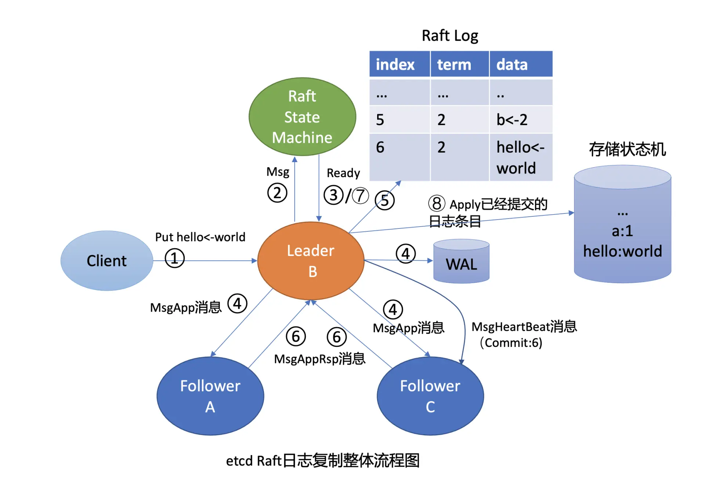
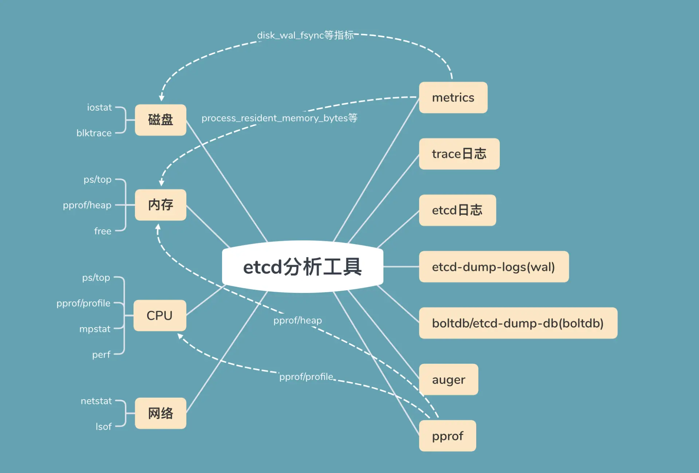
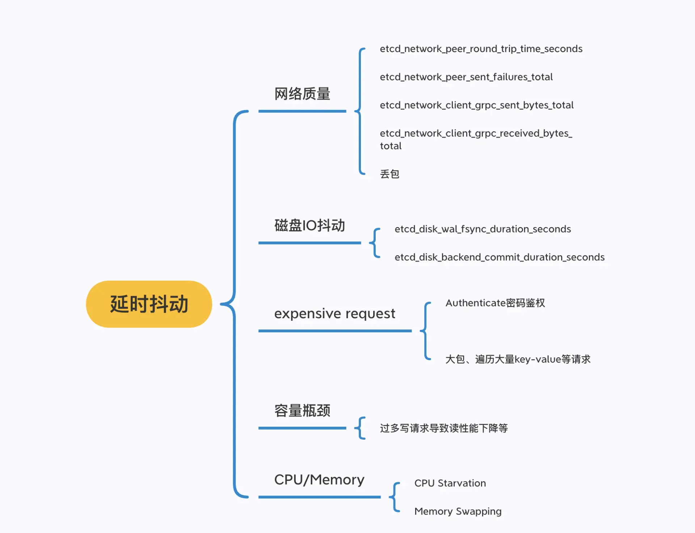

# etcd 请求超时原因分析

## 1. 概述

下图为Leader 收到一个写请求，将一个日志条目复制到集群多数节点并应用到存储状态机的流程（如下图所示），通过此图我们看看写流程上哪些地方可能会导致请求超时：




首先是流程四，一方面，Leader 需要并行将消息通过网络发送给各 Follower 节点，依赖网络性能。另一方面，Leader 需持久化日志条目到 WAL，依赖磁盘 I/O 顺序写入性能。

其次是流程八，应用日志条目到存储状态机时，etcd 后端 key-value 存储引擎是 boltdb。它是一个基于 B+ tree 实现的存储引擎，当你写入数据，提交事务时，它会将 dirty page 持久化到磁盘中。在这过程中 boltdb 会产生磁盘随机 I/O 写入，因此事务提交性能依赖磁盘 I/O 随机写入性能。

最后，在整个写流程处理过程中，etcd 节点的 CPU、内存、网络带宽资源应充足，否则肯定也会影响性能。

下图为etcd 问题定位过程中常用的工具：



图的左边是读写请求链路中可能出现瓶颈或异常的点，比如上面流程分析中提到的磁盘、内存、CPU、网络资源。

图的右边是常用的工具，分别是 metrics、trace 日志、etcd 其他日志、WAL 及 boltdb 分析工具等。


## 2. 分析

### 2.1 网络

在 etcd 中，各个节点之间需要通过 2380 端口相互通信，以完成 Leader 选举、日志同步等功能，因此底层网络质量（吞吐量、延时、稳定性）对上层 etcd 服务的性能有显著影响。

一方面，我们可以使用常规的 ping/traceroute/mtr、ethtool、ifconfig/ip、netstat、tcpdump 网络分析工具等命令，测试网络的连通性、延时，查看网卡的速率是否存在丢包等错误，确认 etcd 进程的连接状态及数量是否合理，抓取 etcd 报文分析等。

另一方面，etcd 应用层提供了节点之间网络统计的 metrics 指标，分别如下：

* etcd_network_active_peer，表示 peer 之间活跃的连接数
* etcd_network_peer_round_trip_time_seconds，表示 peer 之间 RTT 延时；
* etcd_network_peer_sent_failures_total，表示发送给 peer 的失败消息数；
* etcd_network_client_grpc_sent_bytes_total，表示 server 发送给 client 的总字节数，通过这个指标我们可以监控 etcd 出流量；
* etcd_network_client_grpc_received_bytes_total，表示 server 收到 client 发送的总字节数，通过这个指标可以监控 etcd 入流量。

etcd metrics 指标名由 namespace 和 subsystem、name 组成。namespace 为 etcd， subsystem 是模块名（比如 network、name 具体的指标名）。你可以在 Prometheus 里搜索 etcd_network 找到所有 network 相关的 metrics 指标名。

在 etcd 场景中，网络质量导致 etcd 性能下降主要源自两个方面：

一方面，expensive request 中的大包查询会使网卡出现瓶颈，产生丢包等错误，从而导致 etcd 吞吐量下降、高延时。expensive request 导致网卡丢包，出现超时，这在 etcd 中是非常典型且易发生的问题，它主要是因为业务没有遵循最佳实践，查询了大量 key-value。

另一方面，在跨故障域部署的时候，故障域可能是可用区、城市。故障域越大，容灾级别越高，但各个节点之间的 RTT 越高，请求的延时更高。磁盘 I/O


### 2.2 磁盘I/O

在 etcd 中无论是 Raft 日志持久化还是 boltdb 事务提交，都依赖于磁盘 I/O 的性能。

**当 etcd 请求延时出现波动时，我们往往首先关注 disk 相关指标是否正常。**


我们可以通过 etcd 磁盘相关的 metrics(etcd_disk_wal_fsync_duration_seconds 和 etcd_disk_backend_commit_duration_seconds) 来观测应用层数据写入磁盘的性能。

etcd_disk_wal_fsync_duration_seconds（简称 disk_wal_fsync）表示 WAL 日志持久化的 fsync 系统调用延时数据。一般本地 SSD 盘 P99 延时在 10ms 内

etcd_disk_backend_commit_duration_seconds（简称 disk_backend_commit）表示后端 boltdb 事务提交的延时，一般 P99 在 120ms 内。

> 当 disk_backend_commit 指标的异常时候，说明事务提交过程中的 B+ tree 树重平衡、分裂、持久化 dirty page、持久化 meta page 等操作耗费了大量时间。

etcd 还提供了 disk_backend_commit_rebalance_duration 和disk_backend_commit_spill_duration 两个 metrics，分别表示事务提交过程中 B+ tree 的重平衡和分裂操作耗时分布区间。

最后，你需要注意 disk_wal_fsync 记录的是 WAL 文件顺序写入的持久化时间，disk_backend_commit 记录的是整个事务提交的耗时。后者涉及的磁盘 I/O 是随机的，为了保证你 etcd 集群的稳定性，建议使用 SSD 磁盘以确保事务提交的稳定性。


### 2.3 expensive request

若磁盘和网络指标都很正常，那么延时高还有可能是什么原因引起的呢？

对 etcd 而言，List Pod 请求涉及到大量的 key 查询，会消耗较多的 CPU、内存、网络资源，此类请求也称做 expensive request。若此类 expensive request 的 QPS 若较大，则很可能导致 OOM、丢包。

> 比如在 Kubernetes 中，当集群 Pod 较多的时候，若你频繁执行 List Pod，可能会导致 etcd 出现大量的"apply request took too long"警告日志。

为了提高请求延时分布的可观测性、延时问题的定位效率，etcd 社区在 3.4 版本后中实现了 trace 特性，详细记录了一个请求在各个阶段的耗时。若某阶段耗时流程超过默认的 100ms，则会打印一条 trace 日志。

下图是一个阈值为 1us 的读请求日志：记录了以下阶段耗时

* agreement among raft nodes before linearized reading，此阶段读请求向 Leader 发起 readIndex 查询并等待本地 applied index >= Leader 的 committed index， 但是你无法区分是 readIndex 慢还是等待本地 applied index > Leader 的 committed index 慢。在 etcd 3.5 中新增了 trace，区分了以上阶段；
* get authentication metadata，获取鉴权元数据；
* range keys from in-memory index tree，从内存索引 B-tree 中查找 key 列表对应的版本号列表；
* filter and sort the key-value pairs，过滤、排序 key-value 列表；
* assemble the response，聚合结果。

```sh
{
    "level":"info"，
    "ts":"2020-12-16T08:11:43.720+0800"，
    "caller":"traceutil/trace.go:145"，
    "msg":"trace[789864563] range"，
    "detail":"{range_begin:a; range_end:; response_count:1; response_revision:32011; }"，
    "duration":"318.774µs"，
    "start":"2020-12-16T08:11:43.719+0800"，
    "end":"2020-12-16T08:11:43.720+0800"，
    "steps":[
        "trace[789864563] 'agreement among raft nodes before linearized reading'  (duration: 255.227µs)"，
        "trace[789864563] 'get authentication metadata'  (duration: 2.97µs)"，
        "trace[789864563] 'range keys from in-memory index tree'  (duration: 44.578µs)"，
        "trace[789864563] 'range keys from bolt db'  (duration: 8.688µs)"，
        "trace[789864563] 'filter and sort the key-value pairs'  (duration: 578ns)"，
        "trace[789864563] 'assemble the response'  (duration: 643ns)"
    ]
}
```


下面是 put 写请求的执行 trace 日志，记录了以下阶段耗时：

* process raft request，写请求提交到 Raft 模块处理完成耗时；
* get key's previous created_revision and leaseID，获取 key 上一个创建版本号及 leaseID 的耗时；
* marshal mvccpb.KeyValue，序列化 KeyValue 结构体耗时；
* store kv pair into bolt db，存储 kv 数据到 boltdb 的耗时；
* attach lease to kv pair，将 lease id 关联到 kv 上所用时间。

```sh
{
    "level":"info"，
    "ts":"2020-12-16T08:25:12.707+0800"，
    "caller":"traceutil/trace.go:145"，
    "msg":"trace[1402827146] put"，
    "detail":"{key:16; req_size:8; response_revision:32030; }"，
    "duration":"6.826438ms"，
    "start":"2020-12-16T08:25:12.700+0800"，
    "end":"2020-12-16T08:25:12.707+0800"，
    "steps":[
        "trace[1402827146] 'process raft request'  (duration: 6.659094ms)"，
        "trace[1402827146] 'get key's previous created_revision and leaseID'  (duration: 23.498µs)"，
        "trace[1402827146] 'marshal mvccpb.KeyValue'  (duration: 1.857µs)"，
        "trace[1402827146] 'store kv pair into bolt db'  (duration: 30.121µs)"，
        "trace[1402827146] 'attach lease to kv pair'  (duration: 661ns)"
    ]
}
```

通过以上介绍的 trace 特性，你就可以快速定位到高延时读写请求的原因。比如当你向 etcd 发起了一个涉及到大量 key 或 value 较大的 expensive request 请求的时候，它会产生如下的 warn 和 trace 日志。

注意事项：

* 第一，在 etcd 3.4 中，logger 默认为 capnslog，trace 特性只有在当 logger 为 zap 时才开启，因此你需要设置 --logger=zap。
* 第二，trace 特性并不能记录所有类型的请求，它目前只覆盖了 MVCC 模块中的 range/put/txn 等常用接口。像 Authenticate 鉴权请求，涉及到大量 CPU 计算，延时是非常高的，在 trace 日志中目前没有相关记录。


### 2.4 集群容量、节点 CPU/Memory 瓶颈

若网络、磁盘 I/O 正常，也无 expensive request，那此时高延时请求是怎么产生的呢？它的 trace 日志会输出怎样的耗时结果？

下面是一个社区用户反馈的一个读接口高延时案例的两条 trace 日志。从第一条日志中我们可以知道瓶颈在于线性读的准备步骤，readIndex 和 wait applied index。

那么是其中具体哪个步骤导致的高延时呢？通过在 etcd 3.5 版本中细化此流程，我们获得了第二条日志，发现瓶颈在于等待 applied index >= Leader 的 committed index。

```sh
{
"level": "info"，
"ts": "2020-08-12T08:24:56.181Z"，
"caller": "traceutil/trace.go:145"，
"msg": "trace[677217921] range"，
"detail": "{range_begin:/...redacted...; range_end:; response_count:1; response_revision:2725080604; }"，
"duration": "1.553047811s"，
"start": "2020-08-12T08:24:54.628Z"，
"end": "2020-08-12T08:24:56.181Z"，
"steps": [
"trace[677217921] 'agreement among raft nodes before linearized reading'  (duration: 1.534322015s)"
]
}

{
  "level": "info"，
  "ts": "2020-09-22T12:54:01.021Z"，
  "caller": "traceutil/trace.go:152"，
  "msg": "trace[2138445431] linearizableReadLoop"，
  "detail": ""，
  "duration": "855.447896ms"，
  "start": "2020-09-22T12:54:00.166Z"，
  "end": "2020-09-22T12:54:01.021Z"，
  "steps": [
    "trace[2138445431] read index received  (duration: 824.408µs)"，
    "trace[2138445431] applied index is now lower than readState.Index  (duration: 854.622058ms)"
  ]
}
```

为什么会发生这样的现象呢?

首先你可以通过 etcd_server_slow_apply_total 指标，观查其值快速增长的时间点与高延时请求产生的日志时间点是否吻合。

其次检查是否存在大量写请求。线性读需确保本节点数据与 Leader 数据一样新， 若本节点的数据与 Leader 差异较大，本节点追赶 Leader 数据过程会花费一定时间，最终导致高延时的线性读请求产生。

**etcd 适合读多写少的业务场景，若写请求较大，很容易出现容量瓶颈，导致高延时的读写请求产生。**

后通过 ps/top/mpstat/perf 等 CPU、Memory 性能分析工具，检查 etcd 节点是否存在 CPU、Memory 瓶颈。goroutine 饥饿、内存不足都会导致高延时请求产生，若确定 CPU 和 Memory 存在异常，你可以通过开启 debug 模式，通过 pprof 分析 CPU 和内存瓶颈点。


## 3. 小结

导致请求延时上升的原因主要有以下几个方面：

* 网络质量，如节点之间 RTT 延时、网卡带宽满，出现丢包；
* 磁盘 I/O 抖动，会导致 WAL 日志持久化、boltdb 事务提交出现抖动，Leader 出现切换等；
* expensive request，比如大包请求、涉及到大量 key 遍历、Authenticate 密码鉴权等操作；
* 容量瓶颈，太多写请求导致线性读请求性能下降等；
* 节点配置，CPU 繁忙导致请求处理延时、内存不够导致 swap 等。



