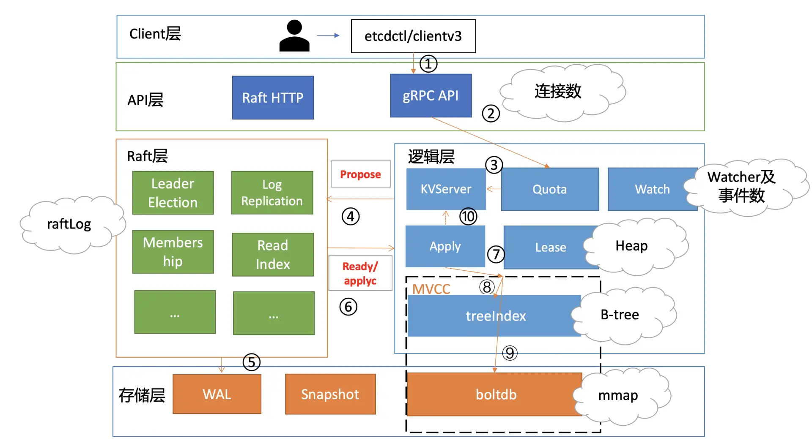
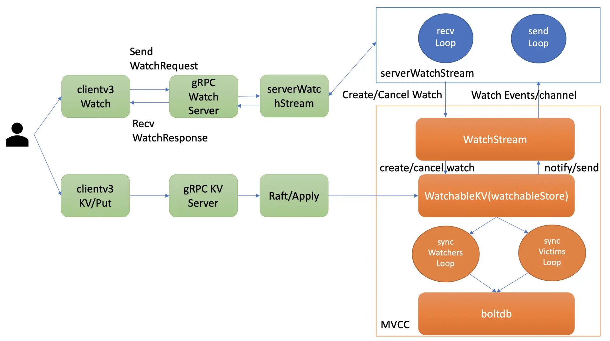

# etcd 内存占用分析

## 1. 概述

下图是以 etcd 写请求流程中可能导致 etcd 内存占用较高的核心模块与其数据结构。



当 etcd 收到一个写请求后，gRPC Server 会和你建立连接。连接数越多，会导致 etcd 进程的 fd、goroutine 等资源上涨，因此会使用越来越多的内存。

其次，etcd raftLog 后端实现是内存存储，核心就是数组。因此 raftLog 使用的内存与其保存的日志条目成正比，它也是内存分析过程中最容易被忽视的一个数据结构。

然后当此日志条目被集群多数节点确认后，在应用到状态机的过程中，会在内存 treeIndex 模块的 B-tree 中创建、更新 key 与版本号信息。 在这过程中 treeIndex 模块的 B-tree 使用的内存与 key、历史版本号数量成正比。

更新完 treeIndex 模块的索引信息后，etcd 将 key-value 数据持久化存储到 boltdb。boltdb 使用了 mmap 技术，将 db 文件映射到操作系统内存中。因此在未触发操作系统将 db 对应的内存 page 换出的情况下，etcd 的 db 文件越大，使用的内存也就越大。

同时，在这个过程中还有两个注意事项。

一方面，其他 client 可能会创建若干 watcher、监听这个写请求涉及的 key， etcd 也需要使用一定的内存维护 watcher、推送 key 变化监听的事件。

另一方面，如果这个写请求的 key 还关联了 Lease，Lease 模块会在内存中使用数据结构 Heap 来快速淘汰过期的 Lease，因此 Heap 也是一个占用一定内存的数据结构。

最后，不仅仅是写请求流程会占用内存，读请求本身也会导致内存上升。尤其是 expensive request，当产生大包查询时，MVCC 模块需要使用内存保存查询的结果，很容易导致内存突增。


## 2. 案例分析

我们通过 goreman 启动一个 3 节点 etcd 集群 (linux/etcd v3.4.9)，db quota 为 6G，执行如下的命令并观察 etcd 内存占用情况：

* 执行 1000 次的 put 同一个 key 操作，value 为 1MB；
* 更新完后并进行 compact、defrag 操作；

```sh
# put同一个key，执行1000次
for i in {1..1000}; do dd if=/dev/urandom bs=1024 
count=1024  | ETCDCTL_API=3 etcdctl put key  || break; done

# 获取最新revision，并压缩
etcdctl compact `(etcdctl endpoint status --write-out="json" | egrep -o '"revision":[0-9]*' | egrep -o '[0-9].*')`

# 对集群所有节点进行碎片整理
etcdctl defrag --cluster
```

在执行操作前，空集群 etcd db size 20KB，etcd 进程内存 36M 左右

执行 compact、defrag 命令后，db 大小只有 1M 左右，但是你会发现 etcd 进程实际却仍占用了 2G 左右内存。

整个集群只有一个 key，为什么 etcd 占用了这么多的内存呢？是 etcd 发生了内存泄露吗？

### 2.1 raftLog

当你发起一个 put 请求的时候，etcd 需通过 Raft 模块将此请求同步到其他节点，详细流程你可结合下图再次了解下。


Raft 模块的输入是一个消息 /Msg，输出统一为 Ready 结构。etcd 会把此请求封装成一个消息，提交到 Raft 模块。

Raft 模块收到此请求后，会把此消息追加到 raftLog 的 unstable 存储的 entry 内存数组中（图中流程 2），并且将待持久化的此消息封装到 Ready 结构内，通过管道通知到 etcdserver（图中流程 3）。

etcdserver 取出消息，持久化到 WAL 中，并追加到 raftLog 的内存存储 storage 的 entry 数组中（图中流程 5）。

下面是 [raftLog](https://github.com/etcd-io/etcd/blob/v3.4.9/raft/log.go#L24:L45) 的核心数据结构，它由 storage、unstable、committed、applied 等组成。storage 存储已经持久化到 WAL 中的日志条目，unstable 存储未持久化的条目和快照，一旦持久化会及时删除日志条目，因此不存在过多内存占用的问题。

```go
type raftLog struct {
	// storage contains all stable entries since the last snapshot.
	storage Storage

	// unstable contains all unstable entries and snapshot.
	// they will be saved into storage.
	unstable unstable

	// committed is the highest log position that is known to be in
	// stable storage on a quorum of nodes.
	committed uint64
	// applied is the highest log position that the application has
	// been instructed to apply to its state machine.
	// Invariant: applied <= committed
	applied uint64

	logger Logger

	// maxNextEntsSize is the maximum number aggregate byte size of the messages
	// returned from calls to nextEnts.
	maxNextEntsSize uint64
}
```

上面 raftLog 结构体中，你可以看到，存储稳定的日志条目的 storage 类型是 Storage，Storage 定义了存储 Raft 日志条目的核心 API 接口，业务应用层可根据实际场景进行定制化实现。etcd 使用的是 Raft 算法库本身提供的 MemoryStorage，其定义如下，核心是使用了一个数组来存储已经持久化后的日志条目。

```go

// MemoryStorage implements the Storage interface backed
// by an in-memory array.
type MemoryStorage struct {
   // Protects access to all fields. Most methods of MemoryStorage are
   // run on the raft goroutine， but Append() is run on an application
   // goroutine.
   sync.Mutex

   hardState pb.HardState
   snapshot  pb.Snapshot
   // ents[i] has raftLog position i+snapshot.Metadata.Index
   ents []pb.Entry
}
```

*那么随着写请求增多，内存中保留的 Raft 日志条目会越来越多，如何防止 etcd 出现 OOM 呢？*

**etcd 提供了快照和压缩功能来解决这个问题。**

首先你可以通过调整 --snapshot-count 参数来控制生成快照的频率，其值默认是 100000（etcd v3.4.9，早期 etcd 版本是 10000），也就是每 10 万个写请求触发一次快照生成操作。

快照生成完之后，etcd 会通过压缩来删除旧的日志条目,会**保留一小部分 Raft 日志条目**。数量由 `DefaultSnapshotCatchUpEntries` 参数控制，默认 5000，目前不支持自定义配置。

> 保留一小部分日志条目其实是**为了帮助慢的 Follower 以较低的开销向 Leader 获取 Raft 日志条目，以尽快追上 Leader 进度**。若 raftLog 中不保留任何日志条目，就只能发送快照给慢的 Follower，这开销就非常大了。

通过以上分析可知，如果你的请求 key-value 比较大，比如上面我们的案例中是 1M，1000 次修改，那么 etcd raftLog 至少会消耗 1G 的内存。这就是为什么内存随着写请求修改次数不断增长的原因。


### 2.2 treeIndex

一个 put 写请求的日志条目被集群多数节点确认提交后，这时 etcdserver 就会从 Raft 模块获取已提交的日志条目，应用到 MVCC 模块的 treeIndex 和 boltdb。

 treeIndex 是基于 google 内存 btree 库实现的一个索引管理模块，在 etcd 中每个 key 都会在 treeIndex 中保存一个索引项 (keyIndex)，记录你的 key 和版本号等信息，如下面的数据结构所示。

```go
type keyIndex struct {
   key         []byte
   modified    revision // the main rev of the last modification
   generations []generation
}
```

同时，你每次对 key 的修改、删除操作都会在 key 的索引项中追加一条修改记录 (revision)。因此，随着修改次数的增加，etcd 内存会一直增加。那么如何清理旧版本，防止过多的内存占用呢？

答案也是**压缩**。正如我在11压缩篇和你介绍的，当你执行 compact 命令时，etcd 会遍历 treeIndex 中的各个 keyIndex，清理历史版本号记录与已删除的 key，释放内存。

从上面的 keyIndex 数据结构我们可知，一个 key 的索引项内存开销跟你的 key 大小、保存的历史版本数、compact 策略有关。为了避免内存索引项占用过多的内存，key 的长度不应过长，同时你需要配置好合理的压缩策略。


### 2.3 boltdb

在 treeIndex 模块中创建、更新完 keyIndex 数据结构后，你的 key-value 数据、各种版本号、lease 等相关信息会保存到如下的一个 mvccpb.keyValue 结构体中。它是 boltdb 的 value，key 则是 treeIndex 中保存的版本号，然后通过 boltdb 的写接口保存到 db 文件中。

```go
kv := mvccpb.KeyValue{
   Key:            key，
   Value:          value，
   CreateRevision: c，
   ModRevision:    rev，
   Version:        ver，
   Lease:          int64(leaseID)，
}
```

提到过**etcd 在启动时会通过 mmap 机制，将 etcd db 文件映射到 etcd 进程地址空间**，并设置 mmap  的 MAP_POPULATE flag，它会告诉 Linux 内核预读文件，让 Linux 内核将文件内容拷贝到物理内存中。

从以上 boltdb 的 key-value 和 mmap 机制介绍中我们可知，我们应控制 boltdb 文件大小，优化 key-value 大小，配置合理的压缩策略，回收旧版本，避免过多内存占用。


### 2.4 watcher

创建 watcher 的整体流程与架构，如下图所示。当你创建一个 watcher 时，client 与 server 建立连接后，会创建一个 gRPC Watch Stream，随后通过这个 gRPC Watch Stream 发送创建 watcher 请求。



每个 gRPC Watch Stream 中 etcd WatchServer 会分配两个 goroutine 处理，一个是 sendLoop，它负责 Watch 事件的推送。一个是 recvLoop，负责接收 client 的创建、取消 watcher 请求消息。

同时对每个 watcher 来说，etcd 的 WatchableKV 模块需将其保存到相应的内存管理数据结构中，实现可靠的 Watch 事件推送。

因此 watch 监听机制耗费的内存跟 client 连接数、gRPC Stream、watcher 数 (watching) 有关，如下面公式所示：

* c1 表示每个连接耗费的内存；
* c2 表示每个 gRPC Stream 耗费的内存；
* c3 表示每个 watcher 耗费的内存。

```sh
memory = c1 * number_of_conn + c2 * 
avg_number_of_stream_per_conn + c3 * 
avg_number_of_watch_stream
```

根据 etcd 社区的[压测报告](https://etcd.io/docs/v3.4/benchmarks/etcd-3-watch-memory-benchmark/)，大概估算出 Watch 机制中 c1、c2、c3 占用的内存分别如下：

* 每个 client 连接消耗大约 17kb 的内存 (c1)；
* 每个 gRPC Stream 消耗大约 18kb 的内存 (c2)；
* 每个 watcher 消耗大约 350 个字节 (c3)；

> 注意以上估算并不包括 watch 事件堆积的开销。变更事件较多，服务端、客户端高负载，网络阻塞等情况都可能导致事件堆积。

当你的业务场景大量使用 watcher 的时候，应提前估算下内存容量大小，选择合适的内存配置节点。

在 etcd 3.4.9 版本中，每个 watcher 默认 buffer 是 1024。buffer 内保存 watch 响应结果，如 watchID、watch 事件（watch 事件包含 key、value）等。

若大量事件堆积，将产生较高昂的内存的开销。你可以通过 etcd_debugging_mvcc_pending_events_total 指标监控堆积的事件数，etcd_debugging_slow_watcher_total 指标监控慢的 watcher 数，来及时发现异常。


### 2.5 expensive request

当你写入比较大的 key-value 后，如果 client 频繁查询它，也会产生高昂的内存开销。

假设我们写入了 100 个这样 1M 大小的 key， 通过 Range 接口一次查询 100 个 key， 那么 boltdb 遍历、反序列化过程将花费至少 100MB 的内存。如下面代码所示，它会遍历整个 key-value，将 key-value 保存到数组 kvs 中。

```go
kvs := make([]mvccpb.KeyValue， limit)
revBytes := newRevBytes()
for i， revpair := range revpairs[:len(kvs)] {
   revToBytes(revpair， revBytes)
   _， vs := tr.tx.UnsafeRange(keyBucketName， revBytes， nil， 0)
   if len(vs) != 1 {
        ......    
   }
   if err := kvs[i].Unmarshal(vs[0]); err != nil {
        .......
   }
```

也就是说，一次查询就耗费了至少 100MB 的内存、产生了至少 100MB 的流量，随着你 QPS 增大后，很容易 OOM、网卡出现丢包。


## 3. 小结

* 首先是 raftLog。为了帮助 slow Follower 同步数据，它至少要保留 5000 条最近收到的写请求在内存中。若你的 key 非常大，你更新 5000 次会产生较大的内存开销。
* 其次是 treeIndex。 每个 key-value 会在内存中保留一个索引项。索引项的开销跟 key 长度、保留的历史版本有关，你可以通过 compact 命令压缩。
* 然后是 boltdb。etcd 启动的时候，会通过 mmap 系统调用，将文件映射到虚拟内存中。你可以通过 compact 命令回收旧版本，defrag 命令进行碎片整理。
* 接着是 watcher。它的内存占用跟连接数、gRPC Watch Stream 数、watcher 数有关。watch 机制一个不可忽视的内存开销其实是事件堆积的占用缓存，你可以通过相关 metrics 及时发现堆积的事件以及 slow watcher。
* 最后则是 expensive request 也会占用不小的内存，在QPS较大时也会产生内存压力了。


