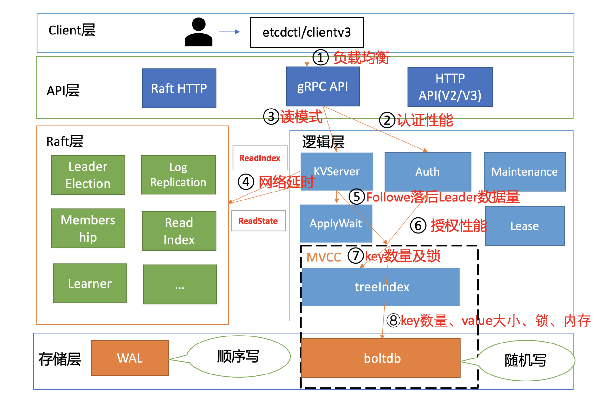

# 性能及稳定性

## 1. 性能分析链路

以下是一个开启密码鉴权场景的读性能瓶颈分析链路图，并在每个核心步骤数字旁边，标出了影响性能的关键因素。

### 1.1 负载均衡

在 etcd 3.4 后前client 为了节省与 server 节点的连接数，clientv3 负载均衡器最终只会选择一个 sever 节点 IP，与其建立一个长连接。但是这可能会导致对应的 server 节点过载（如单节点流量过大，出现丢包）， 其他节点却是低负载，最终导致业务无法获得集群的最佳性能。

在 etcd 3.4 后，引入了 Round-robin 负载均衡算法，它通过轮询的方式依次从 endpoint 列表中选择一个 endpoint 访问 (长连接)，使 server 节点负载尽量均衡。

### 1.2 鉴权

选择好 server 之后就进行到流程2鉴权。

如果 server 使用的是密码鉴权，你在创建 client 时，需指定用户名和密码。etcd clientv3 库发现用户名、密码非空，就会先校验用户名和密码是否正确。

server 节点收到鉴权请求后，它会从 boltdb 获取此用户密码对应的算法版本、salt、cost 值，并基于用户的请求明文密码计算出一个 hash 值。

在得到 hash 值后，就可以对比 db 里保存的 hash 密码是否与其一致了。如果一致，就会返回一个 token 给 client。 这个 token 是 client 访问 server 节点的通行证，后续 server 只需要校验“通行证”是否有效即可，无需每次发起昂贵的 Authenticate RPC 请求。

> 若你的业务在访问 etcd 过程中未复用 token，每次访问 etcd 都发起一次 Authenticate 调用，这将是一个非常大的性能瓶颈和隐患。为了保证密码的安全性，密码认证（Authenticate）的开销非常昂贵，涉及到大量 CPU 资源。

16核32G 机器的压测结果表明，在 etcd 3.4.9 之前 Authenticate QPS 只有10几，在 3.4.9版本 [优化](https://github.com/etcd-io/etcd/pull/11735)到了 200左右。

> 由于导致 Authenticate 接口性能差的核心瓶颈，是在于密码鉴权使用了 bcrpt 计算 hash 值，因此 Authenticate 性能已接近极限。

因此鉴权也可能是性能瓶颈，使用建议：

* 第一，如果你的生产环境需要开启鉴权，并且读写 QPS 较大，那我建议你不要图省事使用密码鉴权。**最好使用证书鉴权**，这样能完美避坑认证性能差、token 过期等问题，性能几乎无损失。
* 第二，确保你的业务每次发起请求时有**复用 token** 机制，尽可能减少 Authenticate RPC 调用。
* 第三，如果你使用密码鉴权时遇到性能瓶颈问题，可**将 etcd 升级到 3.4.9 及以上版本**，能适当提升密码鉴权的性能。

### 1.3 选择合适的读模式

client 通过 server 的鉴权后，就可以发起读请求调用了，也就是我们图中的流程三。

 etcd 提供了串行读和线性读两种读模式。

* 串行读因为不经过 ReadIndex 模块，具有低延时、高吞吐量的特点；
* 线性读在牺牲一点延时和吞吐量的基础上，实现了数据的强一致性读。

这两种读模式分别为不同场景的读提供了解决方案。

根据[社区压测结果](https://etcd.io/docs/v3.4/op-guide/performance/)显示，**串行读QPS几乎时线性读的两倍**。

如果业务可以容忍短暂的不一致，那么可以通过串行读来提升 etcd 的读性能。

### 1.4 性读实现机制、网络延时

