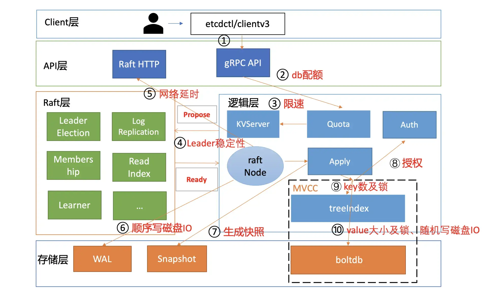

# 写性能及稳定性

## 1. 概述

下图为一个开启鉴权场景的写性能瓶颈及稳定性分析链路图，并在每个核心步骤数字旁边标识了影响性能、稳定性的关键因素。




### 1.1 db quota

etcd 收到 gRPC 写请求后，首先经过的是 Quota 模块，它会影响写请求的稳定性，若 db 大小超过配额就无法写入。

etcd 是个小型的元数据存储，默认 db quota 大小是 2G，超过 2G 就只读无法写入。因此你需要根据你的业务场景，适当调整 db quota 大小，并**配置的合适的压缩策略**,因为压缩过程中会加一系列锁和删除 boltdb 数据，过于**频繁的压缩会对性能有一定的影响**。

一般情况下 db 大小尽量不要超过 8G，过大的 db 文件和数据量对集群稳定性各方面都会有一定的影响，


### 1.2 限速

通过流程二的 Quota 模块后，请求就进入流程三 KVServer 模块。在 KVServer 模块里，影响写性能的核心因素是限速。

KVServer 模块的写请求在提交到 Raft 模块前，会进行限速判断。如果 Raft 模块已提交的日志索引（committed index）比已应用到状态机的日志索引（applied index）超过了 5000，那么它就返回一个"etcdserver: too many requests"错误给 client。

那么哪些情况可能会导致 committed Index 远大于 applied index 呢?

首先是 long expensive read request 导致写阻塞。

其次 etcd 定时批量将 boltdb 写事务提交的时候，需要对 B+ tree 进行重平衡、分裂，并将 freelist、dirty page、meta page 持久化到磁盘。	

最后执行 defrag 等运维操作时，也会导致写阻塞，它们会持有相关锁，导致写性能下降。


### 1.3 心跳及选举参数优化

写请求经过 KVServer 模块后，则会提交到流程四的 Raft 模块，由于只有 Leader 节点可以处理写请求，因此 集群 Leader 的稳定性也是影响此模块性能和稳定性的核心因素之一。

*那如何判断 Leader 的稳定性呢?*

答案是日志和 metrics。

```sh
21:30:27 etcd3 | {"level":"warn","ts":"2021-02-23T21:30:27.255+0800","caller":"wal/wal.go:782","msg":"slow fdatasync","took":"3.259857956s","expected-duration":"1s"}
21:30:30 etcd3 | {"level":"warn","ts":"2021-02-23T21:30:30.396+0800","caller":"etcdserver/raft.go:390","msg":"leader failed to send out heartbeat on time; took too long, leader is overloaded likely from slow disk","to":"91bc3c398fb3c146","heartbeat-interval":"100ms","expected-duration":"200ms","exceeded-duration":"827.162111ms"}
```

* 一方面，在你使用 etcd 过程中，你很可能见过如下 Leader 发送心跳超时的警告日志，你可以通过此日志判断集群是否有频繁切换 Leader 的风险。
* 另一方面，你可以通过 etcd_server_leader_changes_seen_total metrics 来观察已发生 Leader 切换的次数。

*那么哪些因素会导致此日志产生以及发生 Leader 切换呢?*

在 etcd 中，Leader 节点会根据 heartbeart-interval 参数（默认 100ms）定时向 Follower 节点发送心跳。如果两次发送心跳间隔超过 2*heartbeart-interval，就会打印此警告日志。超过 election timeout（默认 1000ms），Follower 节点就会发起新一轮的 Leader 选举。

*哪些原因会导致心跳超时呢？*

* 一方面可能是你的磁盘 IO 比较慢。因为 etcd 从 Raft 的 Ready 结构获取到相关待提交日志条目后，它需要将此消息写入到 WAL 日志中持久化。你可以通过观察 etcd_wal_fsync_durations_seconds_bucket 指标来确定写 WAL 日志的延时。

* 另一方面也可能是 CPU 使用率过高和网络延时过大导致。CPU 使用率较高可能导致发送心跳的 goroutine 出现饥饿

*最后我们应该如何调整心跳相关参数，以避免频繁 Leader 选举呢？*

一般情况下，为了避免频繁 Leader 切换，**建议你可以根据实际部署环境、业务场景，将心跳间隔时间调整到 100ms 到 400ms 左右，选举超时时间要求至少是心跳间隔的 10 倍**。


### 1.4 网络和磁盘 IO 延时

写请求通过 Propose 接口提交到 Raft 模块后，Raft 模块会输出一系列消息。

etcd server 的 raftNode goroutine 通过 Raft 模块的输出接口 Ready，获取到待发送给 Follower 的日志条目追加消息和待持久化的日志条目。

raftNode goroutine 首先通过 HTTP 协议将日志条目追加消息广播给各个 Follower 节点，也就是流程五。

流程五涉及到各个节点之间网络通信，因此**节点之间 RTT 延时对其性能有较大影响**。

同时，raftNode goroutine 也会**将待持久化的日志条目追加到 WAL 中**，它可以防止进程 crash 后数据丢失，也就是流程六。注意此过程需要同步等待数据落地，因此**磁盘顺序写性能决定着性能优异**。


### 1.5 快照参数优化

但是某 Follower 节点若数据落后太多，Leader 内存中的 Raft 日志已经被 compact 了，那么 Leader 只能发送一个快照给 Follower 节点重建恢复。

在快照较大的时候，发送快照可能会消耗大量的 CPU、Memory、网络资源，那么它就会影响我们的读写性能，也就是我们图中的流程七。


* 一方面， etcd Raft 模块引入了流控机制，来解决日志同步过程中可能出现的大量资源开销、导致集群不稳定的问题。
* 另一方面，我们可以通过快照参数优化，去降低 Follower 节点通过 Leader 快照重建的概率，使其尽量能通过增量的日志同步保持集群的一致性。

etcd 提供了一个名为 --snapshot-count 的参数来控制快照行为。它是指收到多少个写请求后就触发生成一次快照，并对 Raft 日志条目进行压缩。为了帮助 slower Follower 赶上 Leader 进度，etcd 在生成快照，压缩日志条目的时候也会至少保留 5000 条日志条目在内存中。

*那 snapshot-count 参数设置多少合适呢?*

snapshot-count 值过大它会消耗较多内存，过小则的话在某节点数据落后时，如果它请求同步的日志条目 Leader 已经压缩了，此时我们就不得不将整个 db 文件发送给落后节点，然后进行快照重建。

etcd 3.2 版本之前 snapshot-count 参数值是 1 万，比较低，容易触发快照重建，etcd 3.2 版本后将其默认值调大到 10 万。


### 1. 6 大 value

当写请求对应的日志条目被集群多数节点确认后，就可以提交到状态机执行了。

etcd 的 raftNode goroutine 就可通过 Raft 模块的输出接口 Ready，获取到已提交的日志条目，然后提交到 Apply 模块的 FIFO 待执行队列。

当 Raft 日志条目命令从 FIFO 队列取出执行后，它会首先通过授权模块校验是否有权限执行对应的写操作，对应图中的流程八。影响其性能因素是**RBAC 规则数和锁**。

然后通过权限检查后，写事务则会从 treeIndex 模块中查找 key、更新的 key 版本号等信息，对应图中的流程九，影响其性能因素是 **key 数和锁**。

更新完索引后，我们就可以把新版本号作为 boltdb key， 把用户 key/value、版本号等信息组合成一个 value，写入到 boltdb，对应图中的流程十，影响其性能因素是**大 value、锁**。

*如果你在应用中保存 1Mb 的 value，这会给 etcd 稳定性带来哪些风险呢？*

* 首先会导致读性能大幅下降、内存突增、网络带宽资源出现瓶颈等。
* 其次 etcd 底层使用的 boltdb 存储，它是个基于 COW(Copy-on-write) 机制实现的嵌入式 key-value 数据库。较大的 value 频繁更新，因为 boltdb 的 COW 机制，会导致 boltdb 大小不断膨胀，很容易超过默认 db quota 值，导致无法写入。

*那如何优化呢？*

* 首先进行大 Key 拆分，改造；
* 如果不好拆分、改造就尽量降低大 Key 更新频率；
* 如果写请求降低不了，就拆分数据结构，将经常更新的字段单独处理。


### 1.7 boltdb 锁

并发读特性的核心原理是创建读事务对象时，它会全量拷贝当前写事务未提交的 buffer 数据，并发的读写事务不再阻塞在一个 buffer 资源锁上，实现了全并发读。

etcd 读写性能优化历史，它经历了以下流程：

* 3.0 基于 Raft log read 实现线性读，线性读需要经过磁盘 IO，性能较差；
* 3.1 基于 ReadIndex 实现线性读，每个节点只需要向 Leader 发送 ReadIndex 请求，不涉及磁盘 IO，提升了线性读性能；
* 3.2 将访问 boltdb 的锁从互斥锁优化到读写锁，提升了并发读的性能；
* 3.4 实现全并发读，去掉了 buffer 锁，长尾读几乎不再影响写。


## 2. 扩展

etcd 社区提供了一个名为[gRPC-Proxy](https://etcd.io/docs/v3.4/op-guide/grpc_proxy/)的组件，帮助你扩展读、扩展 watch、扩展 Lease 性能的机制


### 2.1 扩展读

它是个无状态节点，为你提供高性能的读缓存的能力。你可以根据业务场景需要水平扩容若干节点，同时通过连接复用，降低服务端连接数、负载。

它也提供了故障探测和自动切换能力，当后端 etcd 某节点失效后，会自动切换到其他正常节点，业务 client 可对此无感知。


### 2.2 扩展Watch

大量的 watcher 会显著增大 etcd server 的负载，导致读写性能下降。

gRPC proxy 组件里面提供了 watcher 合并的能力。如果多个 client Watch 同 key 或者范围（如上图三个 client Watch 同 key）时，它会尝试将你的 watcher 进行合并，降低服务端的 watcher 数。


### 2.3 扩展 Lease

我们知道 etcd Lease 特性，提供了一种客户端活性检测机制。为了确保你的 key 不被淘汰，client 需要定时发送 keepalive 心跳给 server。当 Lease 非常多时，这就会导致 etcd 服务端的负载增加。

在这种场景下，gRPC proxy 提供了 keepalive 心跳连接合并的机制，来降低服务端负载。


## 3. 小结

* 1）db quota,频繁的key压缩会影响性能
* 2）KVServer 限速也会限制写性能
* 3）心跳超时导致Leader选举也会限制写性能
* 4）Raft 日志同步到各个节点若网络慢会影响性能，磁盘IO性能差导致持久化 WAL 日志慢也会影响性能
* 5）snapshot-count 设置异常，导致频繁触发快照重建
* 6）大 Key的写入和保存都会影响性能
* 7）etcd 社区提供了[gRPC-Proxy](https://etcd.io/docs/v3.4/op-guide/grpc_proxy/)组件