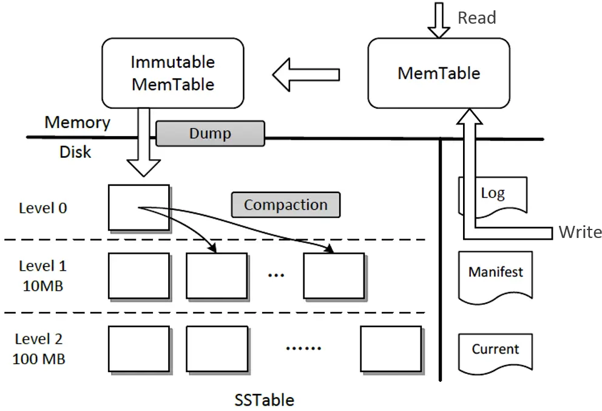

# raft example

## 1. 概述

etcd 中包含了一个 [raft example](https://github.com/etcd-io/etcd/tree/v3.4.9/contrib/raftexample),本节基于 这个 demo 构建一个 小型的 KV 存储 metcd。


## 2. 整体架构设计

metcd 由 API 层、Raft 层的共识模块、逻辑层及存储层组成的状态机组成。

### 2.1 API 设计

API 是软件系统对外的语言，它是应用编程接口的缩写，由一组接口定义和协议组成。

在设计 API 的时候，我们往往会考虑以下几个因素：

* 性能。如 etcd v2 使用的是简单的 HTTP/1.x，性能上无法满足大规模 Kubernetes 集群等场景的诉求，因此 etcd v3 使用的是基于 HTTP/2 的 gRPC 协议。
* 易用性、可调试性。如有的内部高并发服务为了满足性能等诉求，使用的是 UDP 协议。相比 HTTP 协议，UDP 协议显然在易用性、可调试性上存在一定的差距。
* 开发效率、跨平台、可移植性。相比基于裸 UDP、TCP 协议设计的接口，如果你使用 Protobuf 等 IDL 语言，它支持跨平台、代码自动自动生成，开发效率更高。
* 安全性。如相比 HTTP 协议，使用 HTTPS 协议可对通信数据加密更安全，可适用于不安全的网络环境（比如公网传输）。
* 接口幂等性。幂等性简单来说，就是同样一个接口请求一次与多次的效果一样。若你的接口对外保证幂等性，则可降低使用者的复杂度。

因为我们场景的是 POC(Proof of concept)、Demo 开发，因此在 metcd 项目中，我们优先考虑点是易用性、可调试性，选择 HTTP/1.x 协议，接口上为了满足 key-value 操作，支持 Get 和 Put 接口即可。

假设 metcd 项目使用 3379 端口，Put 和 Get 接口，如下所示。

Put 接口，设置 key-value

```sh
curl -L http://127.0.0.1:3379/hello -XPUT -d world
```

Get 接口，查询 key-value

```sh
curl -L http://127.0.0.1:3379/hello
world
```


### 2.2 复制状态机

metcd 使用 etcd 项目中实现的 Raft 算法库作为共识模块，此算法库已被广泛应用在 etcd、cockroachdb、dgraph 等开源项目中。

以下是复制状态机的写请求流程：

* client 发起一个写请求（put hello = world）；
* server 向 Raft 共识模块提交请求，共识模块生成一个写提案日志条目。若 server 是 Leader，则把日志条目广播给其他节点，并持久化日志条目到 WAL 中；
* 当一半以上节点持久化日志条目后，Leader 的共识模块将此日志条目标记为已提交（committed），并通知其他节点提交；s
* erver 从共识模块获取已经提交的日志条目，异步应用到状态机存储中（boltdb/leveldb/memory），然后返回给 client。


### 2.3 多存储引擎

metcd 项目将基于 etcd 本身自带的 raftexample 项目进行快速开发，而 raftexample 本身只支持内存存储。

因此我们通过将 KV 存储接口进行抽象化设计，实现支持多存储引擎。KVStore interface 的定义如下所示。

```go
type KVStore interface {
   // LookUp get key value
   Lookup(key string) (string, bool)

   // Propose propose kv request into raft state machine
   Propose(k, v string)

   // ReadCommits consume entry from raft state machine into KvStore map until error
   ReadCommits(commitC <-chan *string, errorC <-chan error)

   // Snapshot return KvStore snapshot
   Snapshot() ([]byte, error)

   // RecoverFromSnapshot recover data from snapshot
   RecoverFromSnapshot(snapshot []byte) error

   // Close close backend databases
   Close() err
}
```

基于 KV 接口抽象化的设计，我们只需要针对具体的存储引擎，实现对应的操作即可。

我们期望支持三种存储引擎，分别是内存 map、boltdb、leveldb，并做一系列简化设计。一组 metcd 实例，通过 metcd 启动时的配置来决定使用哪种存储引擎。不同业务场景不同实例，比如读多写少的存储引擎可使用 boltdb，写多读少的可使用 leveldb。


#### boltdb

boltdb 是一个基于 B+ tree 实现的存储引擎库，适合读多写少的场景。

对于读请求而言，一般情况下它可直接从内存中基于 B+ tree 遍历，快速获取数据返回给 client，不涉及经过磁盘 I/O。

对于写请求，它基于 B+ tree 查找写入位置，更新 key-value。事务提交时，写请求包括 B+ tree 重平衡、分裂、持久化 ditry page、持久化 freelist、持久化 meta page 流程。同时，ditry page 可能分布在文件的各个位置，它发起的是随机写磁盘 I/O。

因此在 boltdb 中，完成一个写请求的开销相比读请求是大很多的。


#### leveldb

*那要如何设计适合写多读少的存储引擎呢?*

* 1）最简单的思路当然是写内存最快。可是内存有限的，无法支撑大容量的数据存储，不持久化数据会丢失。

* 2）直接将数据顺序追加到文件末尾（AOF），利用顺序写来替代随机写。

[Bitcask](https://en.wikipedia.org/wiki/Bitcask)存储模型就是采用 AOF 模式，把写请求顺序追加到文件。Facebook 的图片存储[Haystack](https://www.usenix.org/legacy/event/osdi10/tech/full_papers/Beaver.pdf)根据其论文介绍，也是使用类似的方案来解决大规模写入痛点。

*那在 AOF 写入模型中如何实现查询数据呢？*

很显然通过遍历文件一个个匹配 key 是可以的，但是它的性能是极差的。为了实现高性能的查询，最理想的解决方案从直接从内存中查询，但是内存是有限的，那么我们能否通过内存索引来记录一个 key-value 数据在文件中的偏移量，实现从磁盘快速读取呢？

是的，这正是Bitcask存储模型的查询的实现，它通过内存哈希表维护各个 key-value 数据的索引，实现了快速查找 key-value 数据。不过，内存中虽然只保存 key 索引信息，但是当 key 较多的时候，其对内存要求依然比较高。

**存储引擎提升写性能的核心思路就是随机写转化为顺序写。**

*leveldb 具体实现如下：*

leveldb 是基于 LSM tree(log-structured merge-tree) 实现的 key-value 存储，它的架构如下图所示（引用自[微软博客](https://microsoft.github.io/MLOS/notebooks/LevelDbTuning/)）。



它提升写性能的核心思路同样是将随机写转化为顺序写磁盘 WAL 文件和内存，结合了我们上面讨论的写内存和磁盘两种方法。数据持久化到 WAL 文件是为了确保机器 crash 后数据不丢失。

*那么它要如何解决内存不足和查询的痛点问题呢？*

核心解决方案是分层的设计和基于一系列对象的转换和压缩。

写流程

* 首先写请求顺序写入 Log 文件 (WAL)；
* 更新内存的 Memtable。leveldb Memtable 后端数据结构实现是 skiplist，skiplist 相比平衡二叉树，实现简单却同样拥有高性能的读写；
* 当 Memtable 达到一定的阈值时，转换成不可变的 Memtable，也就是只读不可写；
* leveldb 后台 Compact 任务会将不可变的 Memtable 生成 SSTable 文件，它有序地存储一系列 key-value 数据。注意 SST 文件按写入时间进行了分层，Level 层次越小数据越新。Manifest 文件记录了各个 SSTable 文件处于哪个层级、它的最小与最大 key 范围；
* 当某个 level 下的 SSTable 文件数目超过一定阈值后，Compact 任务会从这个 level 的 SSTable 中选择一个文件（level>0），将其和高一层级的 level+1 的 SSTable 文件合并；
* 注意 level 0 是由 Immutable 直接生成的，因此 level 0 SSTable 文件中的 key-value 存在相互重叠。而 level > 0 时，在和更高一层 SSTable 合并过程中，参与的 SSTable 文件是多个，leveldb 会确保各个 SSTable 中的 key-value 不重叠。

读请求

* 从 Memtable 跳跃表中查询 key；
* 未找到则从 Immutable 中查找；
* Immutable 仍未命中，则按照 leveldb 的分层属性，因 level 0 SSTable 文件是直接从 Immutable 生成的，level 0 存在特殊性，因此你需要从 level 0 遍历 SSTable 查找 key；
* level 0 中若未命中，则从 level 1 乃至更高的层次查找。level 大于 0 时，各个 SSTable 中的 key 是不存在相互重叠的。根据 manifest 记录的 key-value 范围信息，可快递定位到具体的 SSTable。同时 leveldb 基于bloom filter实现了快速筛选 SSTable，因此查询效率较高。


## 3. 实现分析

### 3.1 Raft 算法库

共识模块使用的是 [etcd Raft 算法库](https://github.com/etcd-io/etcd/tree/v3.4.9/raft)，它是一个经过大量业务生产环境检验、具备良好可扩展性的共识算法库。


#### API

Raft 作为一个库，它对外最核心的对象是一个名为 [Node](https://github.com/etcd-io/etcd/blob/v3.4.9/raft/node.go#L125:L203) 的接口。Node 表示 Raft 集群中的一个节点，它的输入与输出接口如下图所示，下面我重点和你介绍它的几个接口功能：

* Campaign，状态转换成 Candidate，发起新一轮 Leader 选举；
* Propose，提交提案接口；
* Ready，Raft 状态机输出接口，它的返回是一个输出 Ready 数据结构类型的管道，应用需要监听此管道，获取 Ready 数据，处理其中的各个消息（如持久化未提交的日志条目到 WAL 中，发送消息给其他节点等）；
* Advance，通知 Raft 状态机，应用已处理上一个输出的 Ready 数据，等待发送下一个 Ready 数据；
* TransferLeaderShip，尝试将 Leader 转移到某个节点；
* Step，向 Raft 状态机提交收到的消息，比如当 Leader 广播完 MsgApp 消息给 Follower 节点后，Leader 收到 Follower 节点回复的 MsgAppResp 消息时，就通过 Step 接口将此消息提交给 Raft 状态机驱动其工作；ReadIndex，用于实现线性读。

[Ready 数据结构](https://github.com/etcd-io/etcd/blob/v3.4.9/raft/node.go#L52:L90)如下：

* SoftState，软状态。包括集群 Leader 和节点状态，不需要持久化到 WAL；
* pb.HardState，硬状态。与软状态相反，包括了节点当前 Term、Vote 等信息，需要持久化到 WAL 中；
* ReadStates，用于线性一致性读；
* Entries，在向其他节点发送消息之前需持久化到 WAL 中；
* Messages，持久化 Entries 后，发送给其他节点的消息；
* Committed Entries，已提交的日志条目，需要应用到存储状态机中；
* Snapshot，快照需保存到持久化存储中；
* MustSync，HardState 和 Entries 是否要持久化到 WAL 中；

```go
type Ready struct {
	*SoftState

	pb.HardState

	ReadStates []ReadState

	Entries []pb.Entry

	Snapshot pb.Snapshot

	CommittedEntries []pb.Entry

	Messages []pb.Message
    
	MustSync bool
}
```


#### raft node

**etcd Raft 库的设计抽象了网络、Raft 日志存储等模块**，它本身并不会进行网络、存储相关的操作，上层应用需结合自己业务场景选择内置的模块或自定义实现网络、存储、日志等模块。

因此我们在使用 Raft 库时，需要先自定义好相关网络、存储等模块，再结合上面介绍的 Raft Node API，就可以完成一个 Node 的核心操作了。


```go
// A key-value stream backed by raft
type raftNode struct {
   proposeC    <-chan string            // proposed messages (k,v)
   confChangeC <-chan raftpb.ConfChange // proposed cluster config changes
   commitC     chan<- *string           // entries committed to log (k,v)
   errorC      chan<- error             // errors from raft session
   id          int      // client ID for raft session
   ......
   node        raft.Node
   raftStorage *raft.MemoryStorage
   wal         *wal.WAL
   transport *rafthttp.Transport
}
```

这个数据结构名字叫 raftNode，它表示 Raft 集群中的一个节点。它是由我们业务应用层设计的一个组合结构。从结构体定义中你可以看到它包含了 Raft 核心数据结构 Node(raft.Node)、Raft 日志条目内存存储模块 (raft.MemoryStorage）、WAL 持久化模块 (wal.WAL) 以及网络模块 (rafthttp.Transport)。

同时，它提供了三个核心的管道与业务逻辑模块、存储状态机交互:

* proposeC，它用来接收 client 发送的写请求提案消息；
* confChangeC，它用来接收集群配置变化消息；
* commitC，它用来输出 Raft 共识模块已提交的日志条目消息。

另外的日志持久化存储、网络也是使用 etcd 自带的 [WAL](https://github.com/etcd-io/etcd/blob/v3.4.9/wal/wal.go) 和 [rafthttp](https://github.com/etcd-io/etcd/tree/v3.4.9/etcdserver/api/rafthttp)模块。