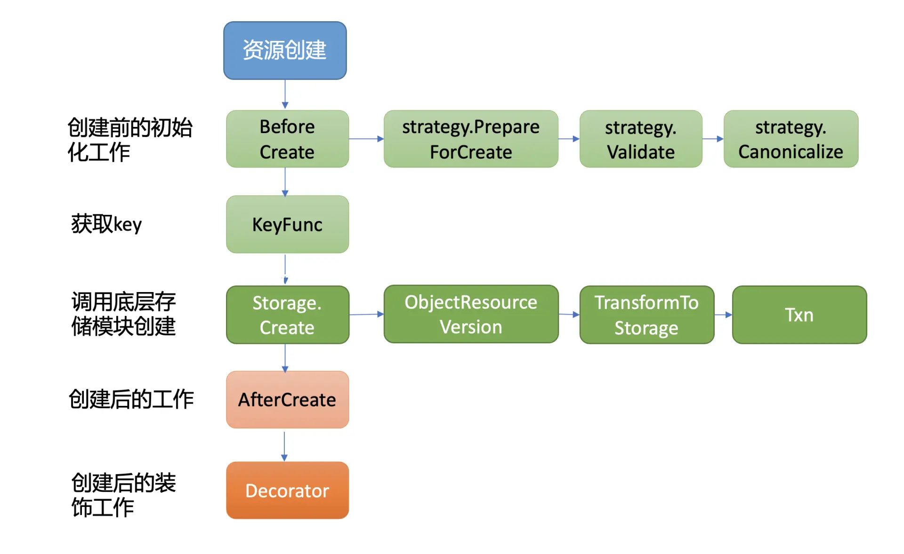
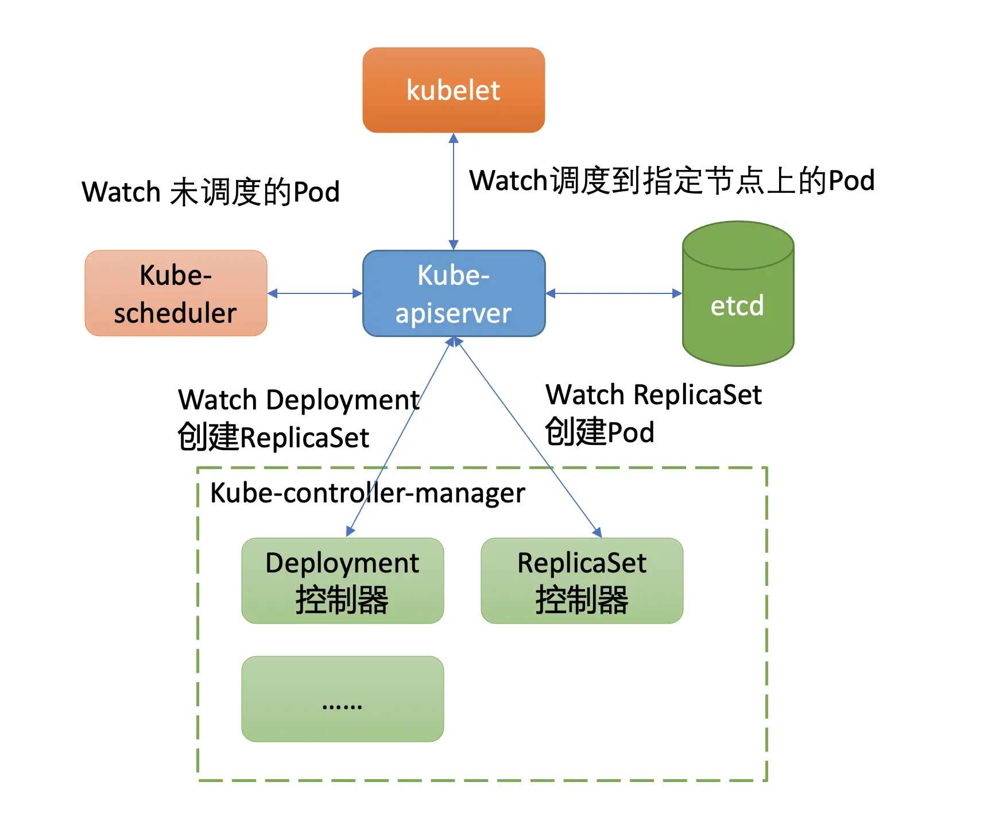

# 创建一个Pod背后etcd发生了什么？

## 1. 概述

下面是创建一个 nginx 服务的 YAML 文件，Workload 是 Deployment，期望的副本数是 1。

```yaml
apiVersion: apps/v1
kind: Deployment
metadata:
  name: nginx-deployment
  labels:
    app: nginx
spec:
  replicas: 1
  selector:
    matchLabels:
      app: nginx
  template:
    metadata:
      labels:
        app: nginx
    spec:
      containers:
      - name: nginx
        image: nginx:1.14.2
        ports:
        - containerPort: 80
```

假设此 YAML 文件名为 nginx.yaml，首先我们通过如下的 kubectl create -f nginx.yml 命令创建 Deployment 资源。

```sh
$ kubectl create -f nginx.yml
deployment.apps/nginx-deployment created
```

创建之后，我们立刻通过如下命令，带标签查询 Pod，输出如下：

```sh
$ kubectl get po -l app=nginx
NAME                                READY   STATUS    RESTARTS   AGE
nginx-deployment-756d9fd5f9-fkqnf   1/1     Running   0          8s
```

那么在 kubectl create 命令发出，nginx Deployment 资源成功创建的背后：

* 1）kube-apiserver 是如何与 etcd 打交道的呢？ 
* 2）它是通过什么接口**安全写入**资源到 etcd 的？

同时，使用 kubectl 带标签查询 Pod 背后：

* 3）kube-apiserver 是直接从缓存读取还是向 etcd 发出一个线性读或串行读请求呢？
* 4） 若同 namespace 下存在大量的 Pod，此操作性能又是怎样的呢?


## 2. Kubernetes 资源存储格式

Kubernetes 中存在各种各样的资源，并提供了以下几种灵活的资源查询方式：

* 按具体资源名称查询，比如 PodName、kubectl get po/PodName。
* 按 namespace 查询，获取一个 namespace 下的所有 Pod，比如 kubectl get po -n kube-system。
* 按标签名，标签是极度灵活的一种方式，你可以为你的 Kubernetes 资源打上各种各样的标签，比如上面案例中的 kubectl get po -l app=nginx。

但 etcd 仅仅是个 key-value 存储，那 Kubernetes 中是如何实现的呢？

首先是**按具体资源名称查询**。它本质就是个 key-value 查询，只需要写入 etcd 的 key 名称与资源 key 一致即可。

其次是**按 namespace 查询**。这种查询也并不难。因为我们知道 etcd 支持**范围查询**，若 key 名称前缀包含 namespace、资源类型，查询的时候指定 namespace 和资源类型的组合的最小开始区间、最大结束区间即可。

最后是**按标签名查询**。这种查询方式非常灵活，业务可随时添加、删除标签，各种标签可相互组合。实现标签查询的办法主要有以下两种：

最后是标签名查询。这种查询方式非常灵活，业务可随时添加、删除标签，各种标签可相互组合。实现标签查询的办法主要有以下两种：

* 方案一，在 etcd 中存储标签数据，实现通过标签可快速定位（时间复杂度 O(1)）到具体资源名称。然而一个标签可能容易实现，但是在 Kubernetes 集群中，它支持按各个标签组合查询，各个标签组合后的数量相当庞大。在 etcd 中维护各种标签组合对应的资源列表，会显著增加 kube-apiserver 的实现复杂度，导致更频繁的 etcd 写入。
* 方案二，在 etcd 中不存储标签数据，而是由 kube-apiserver 通过范围遍历 etcd 获取原始数据，然后基于用户指定标签，来筛选符合条件的资源返回给 client。此方案优点是实现简单，但是大量标签查询可能会导致 etcd 大流量等异常情况发生。

那么 Kubernetes 集群选择的是哪种实现方式呢?

下面是一个 Kubernetes 集群中的 coredns 一系列资源在 etcd 中的存储格式：

```sh
/registry/clusterrolebindings/system:coredns
/registry/clusterroles/system:coredns
/registry/configmaps/kube-system/coredns
/registry/deployments/kube-system/coredns
/registry/events/kube-system/coredns-7fcc6d65dc-6njlg.1662c287aabf742b
/registry/events/kube-system/coredns-7fcc6d65dc-6njlg.1662c288232143ae
/registry/pods/kube-system/coredns-7fcc6d65dc-jvj26
/registry/pods/kube-system/coredns-7fcc6d65dc-mgvtb
/registry/pods/kube-system/coredns-7fcc6d65dc-whzq9
/registry/replicasets/kube-system/coredns-7fcc6d65dc
/registry/secrets/kube-system/coredns-token-hpqbt
/registry/serviceaccounts/kube-system/coredns
```

从中你可以看到，一方面 Kubernetes 资源在 etcd 中的存储格式由 prefix + "/" + 资源类型 + "/" + namespace + "/" + 具体资源名组成，基于 etcd 提供的范围查询能力，非常简单地支持了按具体资源名称查询和 namespace 查询。

另一方面，我们未看到任何标签相关的 key。**Kubernetes 实现标签查询的方式显然是方案二**，即由 kube-apiserver 通过范围遍历 etcd 获取原始数据，然后基于用户指定标签，来筛选符合条件的资源返回给 client（资源 key 的 value 中记录了资源 YAML 文件内容等，如标签）。

也就是当你执行"kubectl get po -l app=nginx"命令，按标签查询 Pod 时，它会向 etcd 发起一个范围遍历整个 default namespace 下的 Pod 操作。

```sh
$ kubectl get pods -l app=nginx -v 8
I0301 23:45:25.597465   32411 loader.go:359] Config loaded from file /root/.kube/config
I0301 23:45:25.603182   32411 round_trippers.go:416] GET https://ip:port/api/v1/namespaces/default/pods?
labelSelector=app%3Dnginx&limit=500
```

由此可见当一个 namespace 存在大量 Pod 等资源时，若频繁通过 kubectl，使用标签查询 Pod 等资源，后端 etcd 将出现较大的压力。


## 3. 通用存储模块

kube-apiserver 实现了类似数据库 ORM 机制的通用资源存储机制，提供了对一个资源创建、更新、删除前后的 hook 能力，将其封装成策略接口。当你新增一个资源时，你只需要编写相应的创建、更新、删除等策略即可，不需要写任何 etcd 的 API。

下面是 kube-apiserver 通用存储模块的创建流程图：



从图中可以看到，创建一个资源主要由 BeforeCreate、Storage.Create 以及 AfterCreate 三大步骤组成。

当收到创建 nginx Deployment 请求后，通用存储模块首先会回调各个资源自定义实现的 BeforeCreate 策略，为资源写入 etcd 做一些初始化工作。下面是 Deployment 资源的创建策略实现，它会进行将 deployment.Generation 设置为 1 等操作。

```go
// PrepareForCreate clears fields that are not allowed to be set by end users on creation.
func (deploymentStrategy) PrepareForCreate(ctx context.Context, obj runtime.Object) {
   deployment := obj.(*apps.Deployment)
   deployment.Status = apps.DeploymentStatus{}
   deployment.Generation = 1

   pod.DropDisabledTemplateFields(&deployment.Spec.Template, nil)
}
```

执行完 BeforeCreate 策略后，它就会执行 Storage.Create 接口，也就是由它真正开始调用底层存储模块 etcd3，将 nginx Deployment 资源对象写入 etcd。


### 资源安全创建及更新

*那么 Kubernetes 是使用 etcd Put 接口写入资源 key-value 的吗？如果是，那要如何防止同名资源并发创建被覆盖的问题？*

etcd Put 接口在并发场景下若收到 key 相同的资源创建，就会导致被覆盖，所以 Kubernetes 使用的是 Txn 接口。

Txn 接口正是为了多 key 原子更新、并发操作安全性等而诞生的，它提供了丰富的冲突检查机制。

Kubernetes 集群使用的正是事务 Txn 接口来防止并发创建、更新被覆盖等问题。当执行完 BeforeCreate 策略后，这时 kube-apiserver 就会调用 Storage 的模块的 Create 接口写入资源。1.6 版本后的 Kubernete 集群默认使用的存储是 etcd3，它的创建接口简要实现如下：

```go
// Create implements storage.Interface.Create.
func (s *store) Create(ctx context.Context, key string, obj, out runtime.Object, ttl uint64) error {
   ......
   key = path.Join(s.pathPrefix, key)

   opts, err := s.ttlOpts(ctx, int64(ttl))
   if err != nil {
      return err
   }

   newData, err := s.transformer.TransformToStorage(data, authenticatedDataString(key))
   if err != nil {
      return storage.NewInternalError(err.Error())
   }

   startTime := time.Now()
   txnResp, err := s.client.KV.Txn(ctx).If(
      notFound(key),
   ).Then(
      clientv3.OpPut(key, string(newData), opts...),
   ).Commit
```

从上面的代码片段中，我们可以得出首先它会按照我们介绍的 Kubernetes 资源存储格式拼接 key。

然后若 TTL 非 0，它会根据 TTL 从 leaseManager 获取可复用的 Lease ID。Kubernetes 集群默认若不同 key（如 Kubernetes 的 Event 资源对象）的 TTL 差异在 1 分钟内，可复用同一个 Lease ID，避免大量 Lease 影响 etcd 性能和稳定性。

其次若开启了数据加密，在写入 etcd 前数据还将按加密算法进行转换工作。最后就是使用 etcd 的 Txn 接口，向 etcd 发起一个创建 deployment 资源的 Txn 请求。

*那么 etcd 收到 kube-apiserver 的请求是长什么样子的呢？*

下面是 etcd 收到创建 nginx deployment 资源的请求日志：

```sh
{
    "level":"debug",
    "ts":"2021-02-11T09:55:45.914+0800",
    "caller":"v3rpc/interceptor.go:181",
    "msg":"request stats",
    "start time":"2021-02-11T09:55:45.911+0800",
    "time spent":"2.697925ms",
    "remote":"127.0.0.1:44822",
    "response type":"/etcdserverpb.KV/Txn",
    "request count":1,
    "request size":479,
    "response count":0,
    "response size":44,
    "request content":"compare:<target:MOD key:"/registry/deployments/default/nginx-deployment" mod_revision:0 > success:<request_put:<key:"/registry/deployments/default/nginx-deployment" value_size:421 >> failure:<>"
}
```

从这个请求日志中，你可以得到以下信息：

* 请求的模块和接口，KV/Txn；
* key 路径，/registry/deployments/default/nginx-deployment，由 prefix + "/" + 资源类型 + "/" + namespace + "/" + 具体资源名组成；
* 安全的并发创建检查机制，mod_revision 为 0 时，也就是此 key 不存在时，才允许执行 put 更新操作。

通过 Txn 接口成功将数据写入到 etcd 后，kubectl create -f nginx.yml 命令就执行完毕，返回给 client 了。

*kube-apiserver 并没有任何逻辑去真正创建 Pod,那么创建逻辑是谁执行的呢?*


### Watch 机制在 Kubernetes 中应用

实际上 Deployment 资源就由其中的 **Deployment 控制器**来负责的。

*那么它又是如何感知到新建 Deployment 资源，最终驱动 ReplicaSet 控制器创建出 Pod 的呢？*

获取数据变化的方案，主要有轮询和推送两种方案组成。轮询会产生大量 expensive request，并且存在高延时。而 etcd **Watch 机制**提供的流式推送能力，赋予了 kube-apiserver 对外提供数据监听能力。

在 etcd 中版本号是个逻辑时钟，随着 client 对 etcd 的增、删、改操作而全局递增，它被广泛应用在 MVCC、事务、Watch 特性中。尤其是在 Watch 特性中，版本号是数据增量同步的核心

*那么在 Kubernetes 集群中，它提供了什么概念来实现增量监听逻辑呢？*

答案是 Resource Version。


### Resource Version 与 etcd 版本号

Resource Version 是 Kubernetes API 中非常重要的一个概念，它是一个 Kubernetes 资源的内部版本字符串，client 可通过它来**判断资源是否发生了变化**。

同时，你可以在 Get、List、Watch 接口中，通过指定 Resource Version 值来满足你对数据一致性、高性能等诉求。

在 Get 请求查询案例中，ResourceVersion 主要有以下这三种取值：

* 1）未指定 ResourceVersion，默认空字符串。kube-apiserver 收到一个此类型的读请求后，它会向 etcd 发出共识读 / 线性读请求获取 etcd 集群最新的数据。
* 2） ResourceVersion="0"，赋值字符串 0。kube-apiserver 收到此类请求时，它可能会返回任意资源版本号的数据，但是优先返回较新版本。
  * 一般情况下它直接从 kube-apiserver 缓存中获取数据返回给 client，有可能读到过期的数据，适用于对数据一致性要求不高的场景。
* 3） ResourceVersion 为一个非 0 的字符串。kube-apiserver 收到此类请求时，它会保证 Cache 中的最新 ResourceVersion 大于等于你传入的 ResourceVersion，然后从 Cache 中查找你请求的资源对象 key，返回数据给 client。
  * 基本原理是 kube-apiserver 为各个核心资源（如 Pod）维护了一个 Cache，通过 etcd 的 Watch 机制来实时更新 Cache。当你的 Get 请求中携带了非 0 的 ResourceVersion，它会等待缓存中最新 ResourceVersion 大于等于你 Get 请求中的 ResoureVersion，若满足条件则从 Cache 中查询数据，返回给 client。若不满足条件，它最多等待 3 秒，若超过 3 秒，Cache 中的最新 ResourceVersion 还小于 Get 请求中的 ResourceVersion，就会返回 ResourceVersionTooLarge 错误给 client。


可以通过指定 kubectl 日志级别为 6，观察它向 kube-apiserver 发出的请求参数。从下面请求日志里你可以看到，默认是未指定 Resource Version，也就是会发出一个共识读 / 线性读请求给 etcd，获取 etcd 最新共识数据。

```sh
$ kubectl get po -l app=nginx -v 6
4410 loader.go:359] Config loaded from file /root/.kube/config
4410 round_trippers.go:438] GET https://*.*.*.*:*/api/v1/namespaces/default/pods?labelSelector=app%3Dnginx&limit=500 200 OK in 8 milliseconds
```

> 注意：在规模较大的集群中，尽量不要使用 kubectl 频繁查询资源，它会直接查询 etcd 数据，可能会产生大量的 expensive request 请求，可能导致集群不稳定。


Watch 中统一含有查询案例中的三种取值，官方定义的含义分别如下：

* 1）未指定 ResourceVersion，默认空字符串。一方面为了帮助 client 建立初始状态，它会将当前已存在的资源通过 Add 事件返回给 client。另一方面，它会从 etcd 当前版本号开始监听，后续新增写请求导致数据变化时可及时推送给 client。
* 2）设置 ResourceVersion="0"，赋值字符串 0。它同样会帮助 client 建立初始状态，但是它会从任意版本号开始监听（当前 kube-apiserver 的实现指定 ResourceVersion=0 和不指定行为一致，在获取初始状态后，都会从 cache 最新的 ResourceVersion 开始监听），这种场景可能会导致集群返回陈旧的数据。
* 3）设置 ResourceVersion 为一个非 0 的字符串。从精确的版本号开始监听数据，它只会返回大于等于精确版本号的变更事件。

Kubernetes 的控制器组件就基于以上的 Watch 特性，在快速感知到新建 Deployment 资源后，进入一致性协调逻辑，创建 ReplicaSet 控制器，整体交互流程如下所示。




Deployment 控制器创建 ReplicaSet 资源对象的日志如下所示。

```sh
{
    "level":"debug",
    "ts":"2021-02-11T09:55:45.923+0800",
    "caller":"v3rpc/interceptor.go:181",
    "msg":"request stats",
    "start time":"2021-02-11T09:55:45.917+0800",
    "time spent":"5.922089ms",
    "remote":"127.0.0.1:44828",
    "response type":"/etcdserverpb.KV/Txn",
    "request count":1,
    "request size":766,
    "response count":0,
    "response size":44,
    "request content":"compare:<target:MOD key:"/registry/replicasets/default/nginx-deployment-756d9fd5f9" mod_revision:0 > success:<request_put:<key:"/registry/replicasets/default/nginx-deployment-756d9fd5f9" value_size:697 >> failure:<>"
}
```

真正创建 Pod 则是由 ReplicaSet 控制器负责，它同样基于 Watch 机制感知到新的 RS 资源创建后，发起请求创建 Pod，确保实际运行 Pod 数与期望一致。

```sh
{
    "level":"debug",
    "ts":"2021-02-11T09:55:46.023+0800",
    "caller":"v3rpc/interceptor.go:181",
    "msg":"request stats",
    "start time":"2021-02-11T09:55:46.019+0800",
    "time spent":"3.519326ms",
    "remote":"127.0.0.1:44664",
    "response type":"/etcdserverpb.KV/Txn",
    "request count":1,
    "request size":822,
    "response count":0,
    "response size":44,
    "request content":"compare:<target:MOD key:"/registry/pods/default/nginx-deployment-756d9fd5f9-x6r6q" mod_revision:0 > success:<request_put:<key:"/registry/pods/default/nginx-deployment-756d9fd5f9-x6r6q" value_size:754 >> failure:<>"
}
```

在这过程中也产生了若干 Event，下面是 etcd 收到新增 Events 资源的请求，你可以看到 Event 事件 key 关联了 Lease，这个 Lease 正是由我上面所介绍的 leaseManager 所负责创建。

```sh

{
    "level":"debug",
    "ts":"2021-02-11T09:55:45.930+0800",
    "caller":"v3rpc/interceptor.go:181",
    "msg":"request stats",
    "start time":"2021-02-11T09:55:45.926+0800",
    "time spent":"3.259966ms",
    "remote":"127.0.0.1:44632",
    "response type":"/etcdserverpb.KV/Txn",
    "request count":1,
    "request size":449,
    "response count":0,
    "response size":44,
    "request content":"compare:<target:MOD key:"/registry/events/default/nginx-deployment.16628eb9f79e0ab0" mod_revision:0 > success:<request_put:<key:"/registry/events/default/nginx-deployment.16628eb9f79e0ab0" value_size:369 lease:5772338802590698925 >> failure:<>"
}
```

Pod 创建出来后，这时 kube-scheduler 监听到待调度的 Pod，于是为其分配 Node，通过 kube-apiserver 的 Bind 接口，将调度后的节点 IP 绑定到 Pod 资源上。kubelet 通过同样的 Watch 机制感知到新建的 Pod 后，发起 Pod 创建流程即可。

以上就是当我们在 Kubernetes 集群中创建一个 Pod 后，Kubernetes 和 etcd 之间交互的简要分析。


## 4. 小结

* 1）Kubernetes 集群的 etcd 存储格式，每个资源的保存路径为 prefix + "/" + 资源类型 + "/" + namespace + "/" + 具体资源名组成。
* 2）结合 etcd3 的范围查询，可快速实现按 namesapace、资源名称查询
* 3）按标签查询则是通过 kube-apiserver 遍历指定 namespace 下的资源实现的，若未从 kube-apiserver 的 Cache 中查询，请求较频繁，很可能导致 etcd 流量较大，出现不稳定。
* 4）Pod 创建流程。


**Pod 创建大致流程**：

> 只是大致流程，其中还有很多细节。

* 1）kubectl apply -f deployment.yaml 手动部署一个 deployment 对象
* 2）Deployment 控制器 通过 watch 机制感知到有 deployment 对象创建后，创建 ReplicaSet 对象
* 3）ReplicaSet 控制器同样通过 watch 机制感知到有 ReplicaSet 对象创建后，就会去创建对应的 Pod 对象。
* 4）kube-scheduler 感知到有Pod对象创建后，开始为其分配 Node，通过 kube-apiserver 的 Bind 接口，将调度后的节点 IP 绑定到 Pod 资源上
* 5）kubelet 通过同样的 Watch 机制感知到新建的 Pod 后，发起 Pod 创建流程。

