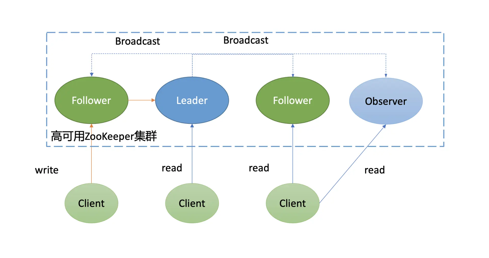

# etcd/ZooKeeper/Consul 如何选型

## 1. 概述

### 1.1 etcd

etcd 是基于复制状态机实现的分布式协调服务。由 Raft 共识模块、日志模块、基于 boltdb 持久化存储的状态机组成。

以下是 etcd 基于复制状态机模型的写请求流程：

* 1）client 发起一个写请求（put x = 3）；
* 2）etcdserver 模块向 Raft 共识模块提交请求，共识模块生成一个写提案日志条目。若 server 是 Leader，则把日志条目广播给其他节点，并持久化日志条目到 WAL 中；
* 3）当一半以上节点持久化日志条目后，Leader 的共识模块将此日志条目标记为已提交（committed），并通知其他节点提交；
* 4）etcdserver 模块从 Raft 共识模块获取已经提交的日志条目，异步应用到 boltdb 状态机存储中，然后返回给 client。

### 1.2 Zookeeper

ZooKeeper 中的节点与 etcd 类似，也划分为 Leader 节点、Follower 节点、Observer 节点（对应的 Raft 协议的 Learner 节点）。同时，写请求统一由 Leader 处理，读请求各个节点都能处理。

不一样的是它们的读行为和共识算法。

* 在读行为上，ZooKeeper 默认读可能会返回 stale data，而 etcd 使用的线性读，能确保读取到反应集群共识的最新数据。
* 共识算法上，etcd 使用的是 Raft，ZooKeeper 使用的是 Zab。

Zab 协议可以分为以下阶段：

* Phase 0，Leader 选举（Leader Election)。一个节点只要求获得半数以上投票，就可以当选为准 Leader；
* Phase 1，发现（Discovery）。准 Leader 收集其他节点的数据信息，并将最新的数据复制到自身；
* Phase 2，同步（Synchronization）。准 Leader 将自身最新数据复制给其他落后的节点，并告知其他节点自己正式当选为 Leader；
* Phase 3，广播（Broadcast）。Leader 正式对外服务，处理客户端写请求，对消息进行广播。当收到一个写请求后，它会生成 Proposal 广播给各个 Follower 节点，一半以上 Follower 节点应答之后，Leader 再发送 Commit 命令给各个 Follower，告知它们提交相关提案；

ZooKeeper 在实现中并未严格按[论文](https://marcoserafini.github.io/papers/zab.pdf)定义的分阶段实现，而是对部分阶段进行了整合，分别如下：

* Fast Leader Election。首先 ZooKeeper 使用了一个名为 Fast Leader Election 的选举算法，通过 Leader 选举安全规则限制，确保选举出来的 Leader 就含有最新数据， 避免了 Zab 协议的 Phase 1 阶段准 Leader 收集各个节点数据信息并复制到自身。
  * 也就是将 Phase 0 和 Phase 1 进行了合并。
* Recovery Phase。各个 Follower 发送自己的最新数据信息给 Leader，Leader 根据差异情况，选择发送 SNAP、DIFF 差异数据、Truncate 指令删除冲突数据等，确保 Follower 追赶上 Leader 数据进度并保持一致。
* Broadcast Phase。与 Zab 论文 Broadcast Phase 一致。

### 1.3 Consul

下图是[Consul 架构图](https://www.consul.io/docs/architecture)（引用自 HashiCorp 官方文档）

它由 Client、Server、Gossip 协议、Raft 共识算法、两个数据中心组成。

每个数据中心内的 Server 基于 Raft 共识算法复制日志，Server 节点分为 Leader、Follower 等角色。Client 通过 Gossip 协议发现 Server 地址、分布式探测节点健康状态等。

*那什么是 Gossip 协议呢？*

Gossip 中文名称叫流言协议，它是一种消息传播协议。

Gossip 协议的基本思想：一个节点想要分享一些信息给网络中的其他的一些节点。于是，它**周期性**的**随机**选择一些节点，并把信息传递给这些节点。这些收到信息的节点接下来会做同样的事情，即把这些信息传递给其他一些随机选择的节点。

> 一般而言，信息会周期性的传递给N个目标节点，而不只是一个。这个N被称为**fanout**（这个单词的本意是扇出）。

最终经过一定次数的扩散、传播，整个集群的各个节点都能感知到此消息，各个节点的数据趋于一致。

*多数据中心支持*

Consul 天然支持多数据中心，但是多数据中心内的服务数据并不会跨数据中心同步，各个数据中心的 Server 集群是独立的。

同时，Consul 提供了[Prepared Query](https://www.consul.io/api-docs/query)功能，它支持根据一定的策略返回多数据中心下的最佳的服务实例地址，使你的服务具备跨数据中心容灾。

*读模式*

Consul 支持以下三种模式的读请求：

* 默认（default）。绝大部分场景下它能保证数据的强一致性。但在老的 Leader 出现网络分区被隔离、新的 Leader 被选举出来的一个极小时间窗口内，可能会导致 stale read。这是因为 Consul 为了提高读性能，使用的是基于 Lease 机制来维持 Leader 身份，避免了与其他节点进行交互确认的开销。
* 强一致性（consistent）。强一致性读与 etcd 默认线性读模式一样，每次请求需要集群多数节点确认 Leader 身份，因此相比 default 模式读，性能会有所下降。
* 弱一致性（stale)。任何节点都可以读，无论它是否 Leader。可能读取到陈旧的数据，类似 etcd 的串行读。这种读模式不要求集群有 Leader，因此当集群不可用时，只要有节点存活，它依然可以响应读请求。

## 2. 对比

他们都是基于共识算法实现的强一致的分布式存储系统，并都提供了多种模式的读机制。

|                                    | etcd                                                         | ZooKeeper                                                    | Consul                                                       | NewSQL (Cloud Spanner, CockroachDB, TiDB)                    |
| ---------------------------------- | ------------------------------------------------------------ | ------------------------------------------------------------ | ------------------------------------------------------------ | ------------------------------------------------------------ |
| Concurrency Primitives             | [Lock RPCs](https://godoc.org/github.com/etcd-io/etcd/server/etcdserver/api/v3lock/v3lockpb), [Election RPCs](https://godoc.org/github.com/etcd-io/etcd/server/etcdserver/api/v3election/v3electionpb), [command line locks](https://github.com/etcd-io/etcd/blob/master/etcdctl/README.md#lock-options-lockname-command-arg1-arg2-), [command line elections](https://github.com/etcd-io/etcd/blob/master/etcdctl/README.md#elect-options-election-name-proposal), [recipes](https://godoc.org/github.com/etcd-io/etcd/client/v3/experimental/recipes) in go | External [curator recipes](http://curator.apache.org/) in Java | [Native lock API](https://www.consul.io/commands/lock)       | [Rare](http://dl.acm.org/citation.cfm?id=2960999), if any    |
| Linearizable Reads                 | [Yes](https://etcd.io/docs/v3.5/learning/api_guarantees/#isolation-level-and-consistency-of-replicas) | No                                                           | [Yes](https://www.consul.io/api-docs#consistency)            | Sometimes                                                    |
| Multi-version Concurrency Control  | [Yes](https://etcd.io/docs/v3.5/learning/data_model/)        | No                                                           | No                                                           | Sometimes                                                    |
| Transactions                       | [Field compares, Read, Write](https://etcd.io/docs/v3.5/learning/api/#transaction) | [Version checks, Write](https://zookeeper.apache.org/doc/r3.4.3/api/org/apache/zookeeper/ZooKeeper.html#multi(java.lang.Iterable)) | [Field compare, Lock, Read, Write](https://www.consul.io/api/kv#txn) | SQL-style                                                    |
| Change Notification                | [Historical and current key intervals](https://etcd.io/docs/v3.5/learning/api/#watch-streams) | [Current keys and directories](https://zookeeper.apache.org/doc/current/zookeeperProgrammers.html#ch_zkWatches) | [Current keys and prefixes](https://www.consul.io/docs/dynamic-app-config/watches) | Triggers (sometimes)                                         |
| User permissions                   | [Role based](https://etcd.io/docs/v3.5/op-guide/authentication/#working-with-roles) | [ACLs](https://zookeeper.apache.org/doc/r3.1.2/zookeeperProgrammers.html#sc_ZooKeeperAccessControl) | [ACLs](https://www.consul.io/docs/security/acl)              | Varies (per-table [GRANT](https://www.cockroachlabs.com/docs/stable/grant.html), per-database [roles](https://cloud.google.com/spanner/docs/iam#roles)) |
| HTTP/JSON API                      | [Yes](https://etcd.io/docs/v3.5/dev-guide/api_grpc_gateway/) | No                                                           | [Yes](https://www.consul.io/api-docs#formatted-json-output)  | Rarely                                                       |
| Membership Reconfiguration         | [Yes](https://etcd.io/docs/v3.5/op-guide/runtime-configuration/) | [>3.5.0](https://zookeeper.apache.org/doc/current/zookeeperReconfig.html) | [Yes](https://learn.hashicorp.com/tutorials/consul/add-remove-servers?in=consul/day-2-operations) | Yes                                                          |
| Maximum reliable database size     | Several gigabytes                                            | Hundreds of megabytes (sometimes several gigabytes)          | Hundreds of MBs                                              | Terabytes+                                                   |
| Minimum read linearization latency | Network RTT                                                  | No read linearization                                        | RTT + fsync                                                  | Clock barriers (atomic, NTP)                                 |

### 

### 2.1 并发原语

* etcd 社区提供了[concurrency](https://github.com/etcd-io/etcd/tree/v3.4.9/clientv3/concurrency)包来实现以上功能。同时，在 etcdserver 中内置了 Lock 和 Election 服务，不过其也是基于 concurrency 包做了一层封装而已。
* ZooKeeper 所属的 Apache 社区提供了[Apache Curator Recipes](http://curator.apache.org/curator-recipes/index.html)库来帮助大家快速使用分布式锁、Leader 选举功能。
* Consul 对分布式锁就提供了[原生](https://www.consul.io/commands/lock)的支持，可直接通过命令行使用。

总体而言，etcd、ZooKeeper、Consul 都能解决分布式锁、Leader 选举的痛点，在选型时，你可能会重点考虑其提供的 API 语言是否与业务服务所使用的语言一致。

### 2.2 健康检查、服务发现

分布式协调服务的另外一个核心应用场景是服务发现、健康检查。

**etcd 提供了 Lease 机制来实现活性检测**。它是一种中心化的健康检查，依赖用户不断地发送心跳续租、更新 TTL。

**ZooKeeper 使用的是一种名为临时节点的状态来实现健康检查**。当 client 与 ZooKeeper 节点连接断掉时，ZooKeeper 就会删除此临时节点的 key-value 数据。它比基于心跳机制更复杂，也给 client 带去了更多的复杂性，所有 client 必须维持与 ZooKeeper server 的活跃连接并保持存活。

**Consul 提供了服务发现的框架**，帮助你的业务快速接入，并提供了 HTTP 和 DNS 两种获取服务方式。**还集成了分布式的健康检查机制。**与 etcd 和 ZooKeeper 健康检查不一样的是，它是一种基于 client、Gossip 协议、分布式的健康检查机制，具备低延时、可扩展的特点。

### 2.3 数据模型比较

etcd 是个扁平的 key-value 模型，内存索引通过 B-tree 实现，数据持久化存储基于 B+ tree 的 boltdb，支持范围查询、适合读多写少，可容纳数 G 的数据。

[ZooKeeper 的数据模型](https://www.usenix.org/legacy/event/atc10/tech/full_papers/Hunt.pdf)如下:

如上图所示，它是一种层次模型，你可能已经发现，etcd v2 的内存数据模型与它是一样的。ZooKeeper 作为分布式协调服务的祖师爷，早期 etcd v2 的确就是参考它而设计的。

ZooKeeper 的层次模型中的每个节点叫 Znode，它分为持久性和临时型两种。

* 持久性顾名思义，除非你通过 API 删除它，否则它将永远存在。
* 临时型是指它与客户端会话绑定，若客户端会话结束或出现异常中断等，它都将被 ZooKeeper server 自动删除，被广泛应用于活性检测。

同时你创建节点的时候，还可以指定一个顺序标识，这样节点名创建出来后就具有顺序性，一般应用于分布式选举等场景中。

ZooKeeper 使用的是内存 ConcurrentHashMap 来实现此数据结构，因此具有良好的读性能。但是受限于内存的瓶颈，一般 ZooKeeper 的数据库文件大小是几百 M 左右。

Consul 也提供了常用 key-value 操作，它的存储引擎是基于[Radix Tree](https://en.wikipedia.org/wiki/Radix_tree#)实现的[go-memdb](https://github.com/hashicorp/go-memdb)，要求 value 大小不能超过 512 个字节，数据库文件大小一般也是几百 M 左右。与 boltdb 类似，它也支持事务、MVCC。

### 2.4 Watch 特性比较

etcd v3 的 Watch 是基于 MVCC 机制实现的。

Consul 是采用滑动窗口实现的。Consul 存储引擎是基于[Radix Tree](https://en.wikipedia.org/wiki/Radix_tree#)实现的，因此它不支持范围查询和监听，只支持前缀查询和监听，而 etcd 都支持。

相比 etcd、Consul，ZooKeeper 的 Watch 特性有更多的局限性，它是个一次性触发器。

在 ZooKeeper 中，client 对 Znode 设置了 Watch 时，如果 Znode 内容发生改变，那么 client 就会获得 Watch 事件。然而此 Znode 再次发生变化，那 client 是无法收到 Watch 事件的，除非 client 设置了新的 Watch。

### 2.5 其他比较

* 线性读。etcd 和 Consul 都支持线性读，而 ZooKeeper 并不具备。
* 权限机制比较。etcd 实现了 RBAC 的权限校验，而 ZooKeeper 和 Consul 实现的 ACL。
* 事务比较。etcd 和 Consul 都提供了简易的事务能力，支持对字段进行比较，而 ZooKeeper 只提供了版本号检查能力，功能较弱。
* 多数据中心。在多数据中心支持上，只有 Consul 是天然支持的，虽然它本身不支持数据自动跨数据中心同步，但是它提供的服务发现机制、Prepared Query功能，赋予了业务在一个可用区后端实例故障时，可将请求转发到最近的数据中心实例。而 etcd 和 ZooKeeper 并不支持。

## 3. 小结

从**共识算法角度**上看，etcd、Consul 是基于 Raft 算法实现的数据复制，ZooKeeper 则是基于 Zab 算法实现的。

* Raft 算法由 Leader 选举、日志同步、安全性组成
* Zab 协议则由 Leader 选举、发现、同步、广播组成。

从 **CAP 角度**上看，在发生网络分区时，etcd、Consul、ZooKeeper 都是一个 CP 系统，无法写入新数据。

* 同时，etcd、Consul、ZooKeeper 提供了各种模式的读机制，总体上可分为强一致性读、非强一致性读。
* 其中 etcd 和 Consul 则提供了线性读，ZooKeeper 默认是非强一致性读，不过业务可以通过 sync() 接口，等待 Follower 数据追赶上 Leader 进度，以读取最新值。

最后 Consul 提供了原生的分布式锁、健康检查、服务发现机制支持，让业务可以更省心，不过 etcd 和 ZooKeeper 也都有相应的库，帮助你降低工作量。Consul 最大的亮点则是对多数据中心的支持。

* 如果业务使用 Go 语言编写的，国内一般使用 etcd 较多，文档、书籍、最佳实践案例丰富。
* Consul 在国外应用比较多，中文文档及实践案例相比 etcd 较少。
* ZooKeeper 一般是 Java 业务使用较多，广泛应用在大数据领域。
* 另外 Nacos 也是个非常优秀的开源项目，支持服务发现、配置管理等，是 Java 业务的热门选择。

