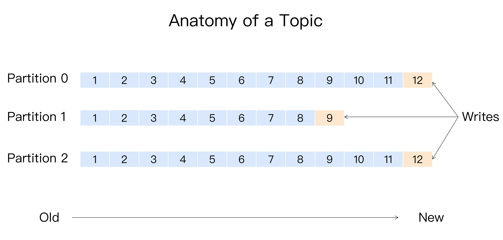

本文主要分析了 Kafka 消息分区（Partition）机制的原理，并对常见分区策略以及自定义分区策略进行了演示。

<!--more-->

## 1. 概述

 Kafka 有主题（Topic）的概念，它是承载真实数据的逻辑容器，而在主题之下还分为若干个分区，也就是说 Kafka 的消息组织方式实际上是三级结构：**主题 - 分区 - 消息**。主题下的每条消息只会保存在某一个分区中，而不会在多个分区中被保存多份。官网上的这张图非常清晰地展示了 Kafka 的三级结构，如下所示：



*你觉得为什么 Kafka 要做这样的设计？为什么使用分区的概念而不是直接使用多个主题呢？*

**其实分区的作用就是提供负载均衡的能力，或者说对数据进行分区的主要原因，就是为了实现系统的高伸缩性（Scalability）。**

不同的分区能够被放置到不同节点的机器上，而数据的读写操作也都是针对分区这个粒度而进行的，这样每个节点的机器都能独立地执行各自分区的读写请求处理。并且，我们还可以通过添加新的节点机器来增加整体系统的吞吐量。

不同的分布式系统对分区的叫法也不尽相同。比如在 Kafka 中叫分区，在 MongoDB 和 Elasticsearch 中就叫分片 Shard，而在 HBase 中则叫 Region，在 Cassandra 中又被称作 vnode。

> 从表面看起来它们实现原理可能不尽相同，但对底层分区（Partitioning）的整体思想却从未改变。


## 2. 分区策略

**所谓分区策略是决定生产者将消息发送到哪个分区的算法**。Kafka 为我们提供了默认的分区策略，同时它也支持你自定义分区策略。

### 自定义分区策略

如果要自定义分区策略，你需要显式地配置生产者端的参数partitioner.class。这个参数该怎么设定呢？方法很简单，在编写生产者程序时，你可以编写一个具体的类实现org.apache.kafka.clients.producer.Partitioner接口。这个接口也很简单，只定义了两个方法：partition()和close()，通常你只需要实现最重要的 partition 方法。我们来看看这个方法的方法签名：

```java
int partition(String topic, Object key, byte[] keyBytes, Object value, byte[] valueBytes, Cluster cluster);
```

这里的topic、key、keyBytes、value和valueBytes都属于消息数据，cluster则是集群信息（比如当前 Kafka 集群共有多少主题、多少 Broker 等）。Kafka 给你这么多信息，就是希望让你能够充分地利用这些信息对消息进行分区，计算出它要被发送到哪个分区中。只要你自己的实现类定义好了 partition 方法，同时设置partitioner.class参数为你自己实现类的 Full Qualified Name，那么生产者程序就会按照你的代码逻辑对消息进行分区。


### 轮询策略

也称 Round-robin 策略，即顺序分配。

> 比如一个主题下有 3 个分区，那么第一条消息被发送到分区 0，第二条被发送到分区 1，第三条被发送到分区 2，以此类推。


**轮询策略有非常优秀的负载均衡表现，它总是能保证消息最大限度地被平均分配到所有分区上，故默认情况下它是最合理的分区策略，也是我们最常用的分区策略之一。**


### 随机策略

也称 Randomness 策略。所谓随机就是我们随意地将消息放置到任意一个分区上，如下面这张图所示。


从实际表现来看，它要逊于轮询策略，所以**如果追求数据的均匀分布，还是使用轮询策略比较好**。


### 按消息键保序策略

也称 Key-ordering 策略。

Kafka 允许为每条消息定义消息键，简称为 Key。这个 Key 的作用非常大，它可以是一个有着明确业务含义的字符串，比如客户代码、部门编号或是业务 ID 等；也可以用来表征消息元数据。特别是在 Kafka 不支持时间戳的年代，在一些场景中，工程师们都是直接将消息创建时间封装进 Key 里面的。一旦消息被定义了 Key，那么你就可以保证同一个 Key 的所有消息都进入到相同的分区里面，由于每个分区下的消息处理都是有顺序的，故这个策略被称为按消息键保序策略，如下图所示。


实现这个策略的 partition 方法同样简单，只需要下面两行代码即可：

```java
List<PartitionInfo> partitions = cluster.partitionsForTopic(topic);
return Math.abs(key.hashCode()) % partitions.size();
```

前面提到的 Kafka 默认分区策略实际上同时实现了两种策略：如果指定了 Key，那么默认实现按消息键保序策略；如果没有指定 Key，则使用轮询策略。


## 3. Go 自定义分区策略

前面讲的自定义分区策略是按照 Java客户端的逻辑，不同语言 客户端 可能实现上有所不同，这里用 Go Client sarama 写个 Demo 展示一下：

> 大致逻辑相同，只是具体实现不同

首先还是创建生产者时通过参数配置具体的分区策略

```go
type Config struct {
    	Producer struct {
			Partitioner PartitionerConstructor
        }
}
```

可以看到 Producer 里有一个 Partitioner 的参数，这就是分区策略配置项。

类型为 PartitionerConstructor，分区构造器，具体如下：

```go
type PartitionerConstructor func(topic string) Partitioner
```

可以看到是一个 构造方法，该方法返回的 Partitioner 才是正在的 分区器。

```go
type Partitioner interface {

	Partition(message *ProducerMessage, numPartitions int32) (int32, error)

	RequiresConsistency() bool
}
```

是一个 接口类型，所以要定义自定义分区策略只需要实现该接口即可。


我们先实现一个自定义的 Partitioner

```go
type myPartitioner struct {
	partition int32
}

func (p *myPartitioner) Partition(message *sarama.ProducerMessage, numPartitions int32) (int32, error) {
	if p.partition >= numPartitions {
		p.partition = 0
	}
	ret := p.partition
	p.partition++
	return ret, nil
}

func (p *myPartitioner) RequiresConsistency() bool {
	return false
}
```

然后在实现一个构造方法即可

```go
func NewMyPartitioner(topic string) sarama.Partitioner {
	return &myPartitioner{}
}
```

最后构造生产者时指定自定义的 分区策略

```go
	config := sarama.NewConfig()
	config.Producer.Partitioner = NewMyPartitioner // 这个就是我们自定义 Partitioner 的构造方法
```


## 4. 小结

* Kafka的消息组织方式实际上是三级结构:主题-分区-消息。主题下的每条消息只会保存在某一一个分区中，而不会在多个分区中被保存多份。
* 分区是实现负载均衡以及高吞吐量的关键。
* 所谓分区策略，也就是决定生产者将消息发送到哪个分区的算法。Kafka为我们提供了默认分区策略，同时，它也支持你自定义分区策略。
* 比较常见的分区策略包括轮询策略、随机策略和按消息键保序策略。还有一种是基于地理位置的分区策略，但这种策略一-般只针对那些 大规模的Kafka集群，特别是跨城市、跨国家甚至是跨大洲的集群。


## 5. 参考

`https://kafka.apache.org/documentation/#configuration`

`《Kafka 核心技术与实战》`


[kafka-config-params]:https://github.com/lixd/blog/raw/master/images/kafka/kafka-config-params.png