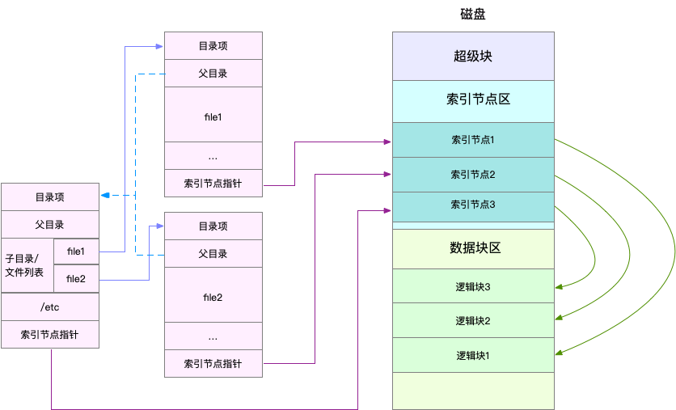
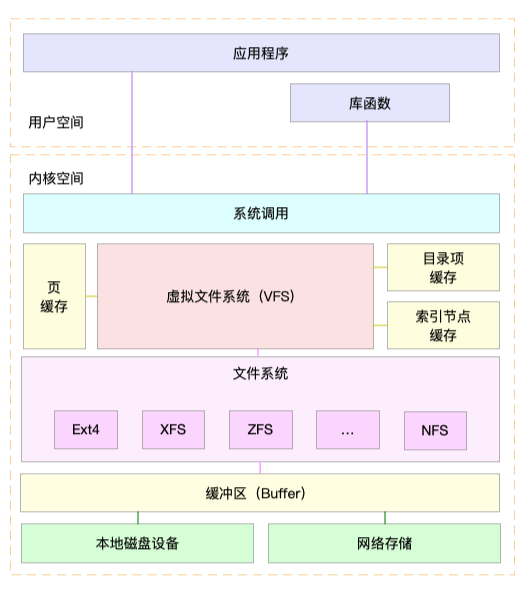

# Linux文件系统是怎么工作的

## 1. 概述

同 CPU、内存一样，磁盘和文件系统的管理，也是操作系统最核心的功能。

* 磁盘为系统提供了最基本的持久化存储。
* 文件系统则在磁盘的基础上，提供了一个用来管理文件的树状结构。

## 2. 索引节点和目录项

文件系统，本身是对存储设备上的文件，进行组织管理的机制。组织方式不同，就会形成不同的文件系统。

> **在 Linux 中一切皆文件**，不仅普通的文件和目录，就连块设备、套接字、管道等，也都要通过统一的文件系统来管理。

Linux 文件系统为每个文件都分配两个数据结构，索引节点（index node）和目录项（directory entry）。它们主要用来记录文件的元信息和目录结构。

* 索引节点，简称为 inode，用来记录文件的元数据，比如 inode 编号、文件大小、访问权限、修改日期、数据的位置等。索引节点和文件一一对应，它跟文件内容一样，都会被持久化存储到磁盘中。所以记住，索引节点同样占用磁盘空间。
* 目录项，简称为 dentry，用来记录文件的名字、索引节点指针以及与其他目录项的关联关系。多个关联的目录项，就构成了文件系统的目录结构。不过，不同于索引节点，目录项是由内核维护的一个内存数据结构，所以通常也被叫做目录项缓存。

> 索引节点是每个文件的唯一标志，而目录项维护的正是文件系统的树状结构。目录项和索引节点的关系是多对一，你可以简单理解为，一个文件可以有多个别名。

**磁盘概述**

实际上，磁盘读写的最小单位是扇区，每个扇区 512B 大小，为了提升操作效率，文件系统又把连续的扇区组成了逻辑块，然后每次都以逻辑块为最小单元，来管理数据。常见的逻辑块大小为 4KB，也就是由连续的 8 个扇区组成。

具体对应关系示意图如下：

注意点：

* 第一，目录项本身就是一个内存缓存，而索引节点则是存储在磁盘中的数据。
* 第二，磁盘在执行文件系统格式化时，会被分成三个存储区域，超级块、索引节点区和数据块区。
  * 超级块，存储整个文件系统的状态。
  * 索引节点区，用来存储索引节点。
  * 数据块区，则用来存储文件数据。

## 3. 虚拟文件系统

目录项、索引节点、逻辑块以及超级块，构成了 Linux 文件系统的四大基本要素。

为了支持各种不同的文件系统，Linux 内核在用户进程和文件系统的中间，又引入了一个抽象层，也就是虚拟文件系统 VFS（Virtual File System），VFS 定义了一组所有文件系统都支持的数据结构和标准接口。

具体Linux文件系统架构如下：

在 VFS 的下方，Linux 支持各种各样的文件系统，如 Ext4、XFS、NFS 等等。按照存储位置的不同，这些文件系统可以分为三类。

* **第一类是基于磁盘的文件系统**，也就是把数据直接存储在计算机本地挂载的磁盘中。常见的 Ext4、XFS、OverlayFS 等，都是这类文件系统。
* **第二类是基于内存的文件系统**，也就是我们常说的虚拟文件系统。这类文件系统，不需要任何磁盘分配存储空间，但会占用内存。我们经常用到的 /proc 文件系统，其实就是一种最常见的虚拟文件系统。此外，/sys 文件系统也属于这一类，主要向用户空间导出层次化的内核对象。
* **第三类是网络文件系统**，也就是用来访问其他计算机数据的文件系统，比如 NFS、SMB、iSCSI 等。

这些文件系统，要先挂载到 VFS 目录树中的某个子目录（称为挂载点），然后才能访问其中的文件。

> 以基于磁盘的文件系统为例，在安装系统时，要先挂载一个根目录（/），在根目录下再把其他文件系统（比如其他的磁盘分区、/proc 文件系统、/sys 文件系统、NFS 等）挂载进来。

## 4. 文件系统 I/O

VFS 提供了一组标准的文件访问接口。这些接口以系统调用的方式，提供给应用程序使用。

文件读写方式的各种差异，导致 I/O 的分类多种多样。最常见的有，缓冲与非缓冲 I/O、直接与非直接 I/O、阻塞与非阻塞 I/O、同步与异步 I/O 等。

第一种，根据是否利用标准库缓存，可以把文件 I/O 分为缓冲 I/O 与非缓冲 I/O：

* 缓冲 I/O，是指利用标准库缓存来加速文件的访问，而标准库内部再通过系统调度访问文件。
* 非缓冲 I/O，是指直接通过系统调用来访问文件，不再经过标准库缓存。

> 这里所说的“缓冲”，是指标准库内部实现的缓存。比如很多程序遇到换行时才真正输出，而换行前的内容，其实就是被标准库暂时缓存了起来。

除了程序实现的缓冲之外，操作系统也有自己的缓存。

第二，根据是否利用操作系统的页缓存，可以把文件 I/O 分为直接 I/O 与非直接 I/O：

* 直接 I/O，是指跳过操作系统的页缓存，直接跟文件系统交互来访问文件。
* 非直接 I/O 正好相反，文件读写时，先要经过系统的页缓存，然后再由内核或额外的系统调用，真正写入磁盘。

> 直接 I/O、非直接 I/O，本质上还是和文件系统交互。如果是在数据库等场景中，还会存在跳过文件系统读写磁盘的情况，也就是我们通常所说的裸 I/O。

第三，根据应用程序是否阻塞自身运行，可以把文件 I/O 分为阻塞 I/O 和非阻塞 I/O：

* 所谓阻塞 I/O，是指应用程序执行 I/O 操作后，如果没有获得响应，就会阻塞当前线程，自然就不能执行其他任务。
* 所谓非阻塞 I/O，是指应用程序执行 I/O 操作后，不会阻塞当前的线程，可以继续执行其他的任务，随后再通过轮询或者事件通知的形式，获取调用的结果。

第四，根据是否等待响应结果，可以把文件 I/O 分为同步和异步 I/O：

* 所谓同步 I/O，是指应用程序执行 I/O 操作后，要一直等到整个 I/O 完成后，才能获得 I/O 响应。
* 所谓异步 I/O，是指应用程序执行 I/O 操作后，不用等待完成和完成后的响应，而是继续执行就可以。等到这次 I/O 完成后，响应会用事件通知的方式，告诉应用程序。

## 5. 小结

* 磁盘提供最基本的持久化存储，文件系统用于管理文件。
  * 磁盘分为超级块、索引节点区和数据块区三个区域。
  * Linux 文件系统中每个文件都由索引节点（index node）和目录项（directory entry）构成。
* 为了支持多种文件系统，Linux在文件系统上提取了抽象层-虚拟文件系统VFS，由VFS来定义统一接口。
* I/O分类：缓冲与非缓冲 I/O、直接与非直接 I/O、阻塞与非阻塞 I/O、同步与异步 I/O 等。