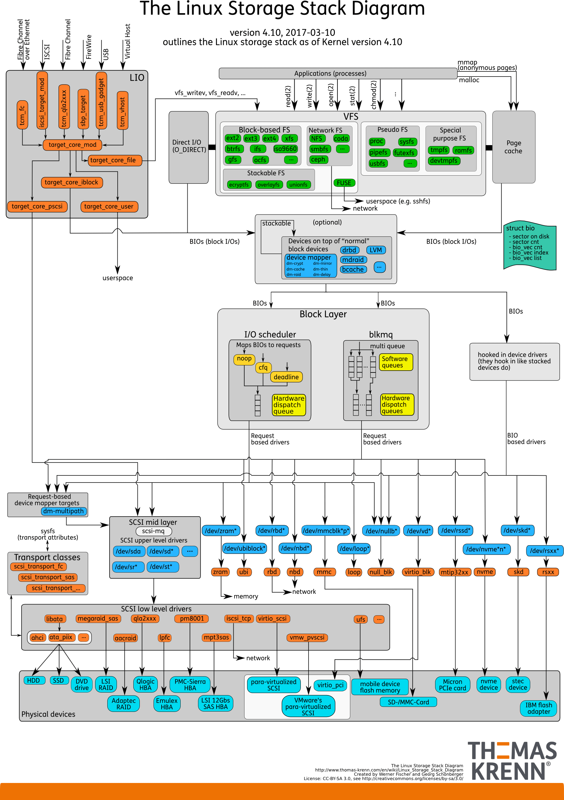

# Linux磁盘I/O原理

## 1. 磁盘

磁盘是可以持久化存储的设备，根据存储介质的不同，常见磁盘可以分为两类：机械磁盘和固态磁盘。

第一类，**机械磁盘**也称为硬盘驱动器（Hard Disk Driver），通常缩写为 HDD。机械磁盘主要由盘片和读写磁头组成，数据就存储在盘片的环状磁道中。**在读写数据前，需要移动读写磁头，定位到数据所在的磁道，然后才能访问数据**。

> 如果 I/O 请求刚好连续，那就不需要磁道寻址，就可以获得最佳性能。这其实就是我们熟悉的，连续 I/O 的工作原理。与之相对应的，就是随机 I/O，它需要不停地移动磁头，来定位数据位置，所以读写速度就会比较慢。

第二类，**固态磁盘**（Solid State Disk），通常缩写为 SSD，由固态电子元器件组成。固态磁盘**不需要磁道寻址**，所以，不管是连续 I/O，还是随机 I/O 的性能，都比机械磁盘要好得多。

> 而对固态磁盘来说，虽然它的随机性能比机械硬盘好很多，但是需要“先擦除再写入”且存在循环擦写的次数限制，也被称作 P/E。随机读写会导致大量的垃圾回收，所以相对应的，随机 I/O 的性能比起连续 I/O 来，也还是差了很多。

连续I/O和随机I/O：

* 机械硬盘随机I/O需要移动读写磁头，固态硬盘同样存在“先擦除再写入”的限制，所以随机IO效率远低于连续I/O
* 此外，连续 I/O 还可以通过预读的方式，来减少 I/O 请求的次数，这也是其性能优异的一个原因。

此外，机械磁盘和固态磁盘还分别有一个最小的读写单位。

* 机械磁盘的最小读写单位是扇区，一般大小为 512 字节。
* 而固态磁盘的最小读写单位是页，通常大小是 4KB、8KB 等。

**为了提升效率，文件系统会把连续的扇区或页，组成逻辑块，然后以逻辑块作为最小单元来管理数据**。常见的逻辑块的大小是 4KB，也就是说，连续 8 个扇区，或者单独的一个页，都可以组成一个逻辑块。

## 2. 通用块层

Linux 通过一个统一的通用块层，来管理各种不同的块设备。和虚拟文件系统 VFS 类似，通用块层也是为了减小不同块设备的差异带来的影响。

通用块层，其实是处在文件系统和磁盘驱动中间的一个块设备抽象层。它主要有两个功能：

* 第一个功能跟虚拟文件系统的功能类似。向上，为文件系统和应用程序，提供访问块设备的标准接口；向下，把各种异构的磁盘设备抽象为统一的块设备，并提供统一框架来管理这些设备的驱动程序。
* 第二个功能，通用块层还会给文件系统和应用程序发来的 I/O 请求排队，并通过重新排序、请求合并等方式，提高磁盘读写的效率。

其中，对 I/O 请求排序的过程，也就是我们熟悉的 I/O 调度。事实上，Linux 内核支持四种 I/O 调度算法，分别是 NONE、NOOP、CFQ 以及 DeadLine。这里我也分别介绍一下。

* 第一种 NONE，完全不使用任何 I/O 调度器，对文件系统和应用程序的 I/O 其实不做任何处理，常用在虚拟机中（此时磁盘 I/O 调度完全由物理机负责）。
* 第二种 NOOP ，是最简单的一种 I/O 调度算法。它实际上是一个先入先出的队列，只做一些最基本的请求合并，常用于 SSD 磁盘。
* 第三种 CFQ（Completely Fair Scheduler），也被称为完全公平调度器，是现在很多发行版的默认 I/O 调度器，它为每个进程维护了一个 I/O 调度队列，并按照时间片来均匀分布每个进程的 I/O 请求。
* 最后一种 DeadLine 调度算法，分别为读、写请求创建了不同的 I/O 队列，可以提高机械磁盘的吞吐量，并确保达到最终期限（deadline）的请求被优先处理。DeadLine 调度算法，多用在 I/O 压力比较重的场景，比如数据库等。

## 3. I/O 栈

我们可以把 Linux 存储系统的 I/O 栈，由上到下分为三个层次，分别是文件系统层、通用块层和设备层。这三个 I/O 层的关系如下图所示，这其实也是 Linux 存储系统的 I/O 栈全景图。

根据这张 I/O 栈的全景图，我们可以更清楚地理解，存储系统 I/O 的工作原理。

* 文件系统层，包括虚拟文件系统和其他各种文件系统的具体实现。它为上层的应用程序，提供标准的文件访问接口；对下会通过通用块层，来存储和管理磁盘数据。
* 通用块层，包括块设备 I/O 队列和 I/O 调度器。它会对文件系统的 I/O 请求进行排队，再通过重新排序和请求合并，然后才要发送给下一级的设备层。
* 设备层，包括存储设备和相应的驱动程序，负责最终物理设备的 I/O 操作。

存储系统的 I/O ，通常是整个系统中最慢的一环。所以， Linux 通过多种缓存机制来优化 I/O 效率。

比方说，为了优化文件访问的性能，会使用页缓存、索引节点缓存、目录项缓存等多种缓存机制，以减少对下层块设备的直接调用。

同样，为了优化块设备的访问效率，会使用缓冲区，来缓存块设备的数据。

## 4. 小结

**磁盘**

机械硬盘随机I/O需要移动磁头所以效率低，固态硬盘也存在“先擦除再写入”的限制，还是不如连续I/O。

**I/O栈**

从上到下分为

* 文件系统层
  * 向上：给应用程序提供标准接口
  * 向下：调用通用块层来管理文件
* 通用块层
  * 将文件系统的请求进行排队和合并之后交给设备层
* 设备层
  * 负责最终物理设备的 I/O 操作