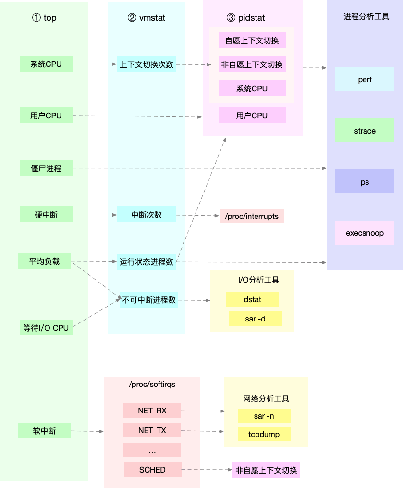
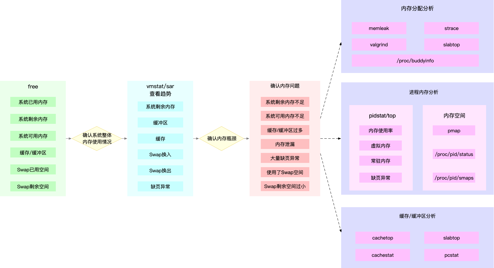
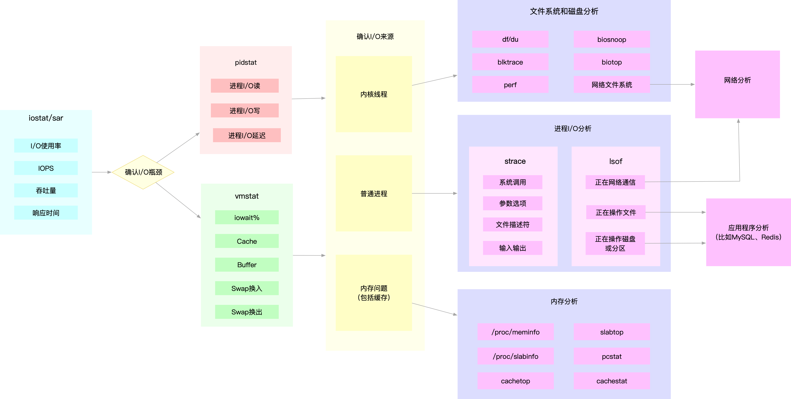
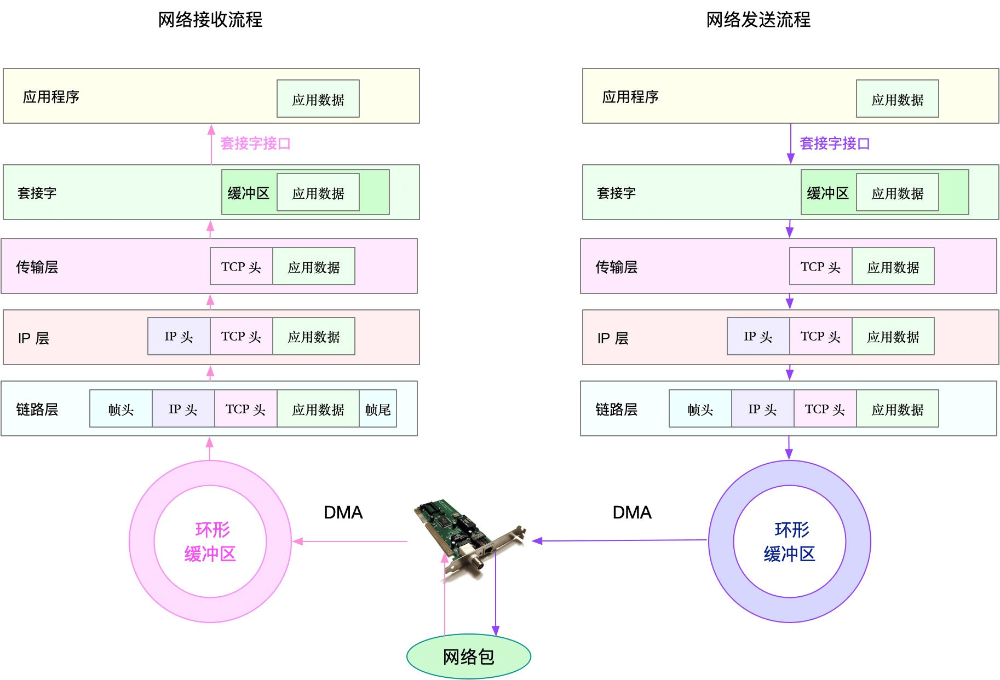

# 性能问题分析思路

## 1. 概述

应用程序性能问题来源主要分三类：

* 1）**资源瓶颈**，即 CPU、内存、磁盘和文件系统 I/O、网络以及内核资源等各类软硬件资源出现了瓶颈，从而导致应用程序的运行受限。
  * 和系统资源瓶颈分析方法类似。
* 2）**依赖服务的瓶颈**，也就是诸如数据库、分布式缓存、中间件等应用程序，直接或者间接调用的服务出现了性能问题，从而导致应用程序的响应变慢，或者错误率升高。
  * 可以使用全链路跟踪系统进行快速定位。
* 3）**应用程序自身的性能问题**，包括了多线程处理不当、死锁、业务算法的复杂度过高等等。
  * 通过系统调用、热点函数，或者应用自身的指标和日志等，进行分析定位。

## 2. 系统资源瓶颈

首先来看系统资源的瓶颈，这也是最为常见的性能问题。

> 系统资源的瓶颈可以通过USE法，即使用率、饱和度以及错误数这三类指标来衡量。

系统的资源，可以分为硬件资源和软件资源两类。

* 硬件资源：如 CPU、内存、磁盘和文件系统以及网络等。
* 软件资源：件描述符数、连接跟踪数、套接字缓冲区大小等。

### 1. CPU 性能分析

利用 top、vmstat、pidstat、strace 以及 perf 等几个最常见的工具，获取 CPU 性能指标后，再结合进程与 CPU 的工作原理，就可以迅速定位出 CPU 性能瓶颈的来源。

实际上，top、pidstat、vmstat 这类工具所汇报的 CPU 性能指标，都源自 /proc 文件系统（比如 /proc/loadavg、/proc/stat、/proc/softirqs 等）。这些指标，都应该通过监控系统监控起来。虽然并非所有指标都需要报警，但这些指标却可以加快性能问题的定位分析。

### 2. 内存性能分析

我们可以通过 free 和 vmstat 输出的性能指标，确认内存瓶颈；然后，再根据内存问题的类型，进一步分析内存的使用、分配、泄漏以及缓存等，最后找出问题的来源。

### 3. I/O

当你使用 iostat ，发现磁盘 I/O 存在性能瓶颈（比如 I/O 使用率过高、响应时间过长或者等待队列长度突然增大等）后，可以再通过 pidstat、 vmstat 等，确认 I/O 的来源。接着，再根据来源的不同，进一步分析文件系统和磁盘的使用率、缓存以及进程的 I/O 等，从而揪出 I/O 问题的真凶。

### 4. 网络

网络性能的分析，要从 Linux 网络协议栈的原理来切入。下面这张图，就是 Linux 网络协议栈的基本原理，包括应用层、套机字接口、传输层、网络层以及链路层等。

## 3. 系统优化

系统优化也可以根据 USE 法入手。

### 1. CPU

常见的 3种优化方案。

* 1）把进程绑定到一个或者多个 CPU 上，充分利用 CPU 缓存的本地性，并减少进程间的相互影响。
* 2）为中断处理程序开启多 CPU 负载均衡，以便在发生大量中断时，可以充分利用多 CPU 的优势分摊负载。
* 3）使用 Cgroups 等方法，为进程设置资源限制，避免个别进程消耗过多的 CPU。同时，为核心应用程序设置更高的优先级，减少低优先级任务的影响。

### 2. 内存

* 1）除非有必要，Swap 应该禁止掉。这样就可以避免 Swap 的额外 I/O ，带来内存访问变慢的问题。
* 2）使用 Cgroups 等方法，为进程设置内存限制。这样就可以避免个别进程消耗过多内存，而影响了其他进程。对于核心应用，还应该降低 oom_score，避免被 OOM 杀死。
* 3）使用大页、内存池等方法，减少内存的动态分配，从而减少缺页异常。

### 3. I/O

* 1）通过 SSD 替代 HDD、或者使用 RAID 等方法，提升 I/O 性能。
* 2）针对磁盘和应用程序 I/O 模式的特征，选择最适合的 I/O 调度算法。比如，SSD 和虚拟机中的磁盘，通常用的是 noop 调度算法；而数据库应用，更推荐使用 deadline 算法。
* 3）优化文件系统和磁盘的缓存、缓冲区，比如优化脏页的刷新频率、脏页限额，以及内核回收目录项缓存和索引节点缓存的倾向等等。

除此之外，使用不同磁盘隔离不同应用的数据、优化文件系统的配置选项、优化磁盘预读、增大磁盘队列长度等，也都是常用的优化思路。

### 4. 网络

首先，从内核资源和网络协议的角度来说，我们可以对内核选项进行优化，比如：

* 1）增大套接字缓冲区、连接跟踪表、最大半连接数、最大文件描述符数、本地端口范围等内核资源配额；
* 2）减少 TIMEOUT 超时时间、SYN+ACK 重传数、Keepalive 探测时间等异常处理参数；
* 3）开启端口复用、反向地址校验，并调整 MTU 大小等降低内核的负担。

其次，从网络接口的角度来说，我们可以考虑对网络接口的功能进行优化，比如：

* 1）将原来 CPU 上执行的工作，卸载到网卡中执行，即开启网卡的 GRO、GSO、RSS、VXLAN 等卸载功能；
* 2）开启网络接口的多队列功能，这样，每个队列就可以用不同的中断号，调度到不同 CPU 上执行；
* 3）增大网络接口的缓冲区大小以及队列长度等，提升网络传输的吞吐量。

最后，在极限性能情况（比如 C10M）下，内核的网络协议栈可能是最主要的性能瓶颈，所以，一般会考虑绕过内核协议栈。

* 1）用 DPDK 技术，跳过内核协议栈，直接由用户态进程用轮询的方式，来处理网络请求。同时，再结合大页、CPU 绑定、内存对齐、流水线并发等多种机制，优化网络包的处理效率。
* 2）使用内核自带的 XDP 技术，在网络包进入内核协议栈前，就对其进行处理。这样，也可以达到目的，获得很好的性能。

## 4. 应用程序优化

**性能优化的最佳位置，还是应用程序内部**。

常见优化方案：

* 1）从 CPU 使用的角度来说，简化代码、优化算法、异步处理以及编译器优化等，都是常用的降低 CPU 使用率的方法，这样可以利用有限的 CPU 处理更多的请求。
* 2）从数据访问的角度来说，使用缓存、写时复制、增加 I/O 尺寸等，都是常用的减少磁盘 I/O 的方法，这样可以获得更快的数据处理速度。
* 3）从内存管理的角度来说，使用大页、内存池等方法，可以预先分配内存，减少内存的动态分配，从而更好地内存访问性能。
* 4）从网络的角度来说，使用 I/O 多路复用、长连接代替短连接、DNS 缓存等方法，可以优化网络 I/O 并减少网络请求数，从而减少网络延时带来的性能问题。
* 5）从进程的工作模型来说，异步处理、多线程或多进程等，可以充分利用每一个 CPU 的处理能力，从而提高应用程序的吞吐能力。

除此之外，你还可以使用消息队列、CDN、负载均衡等各种方法，来优化应用程序的架构，将原来单机要承担的任务，调度到多台服务器中并行处理。这样也往往能获得更好的整体性能。