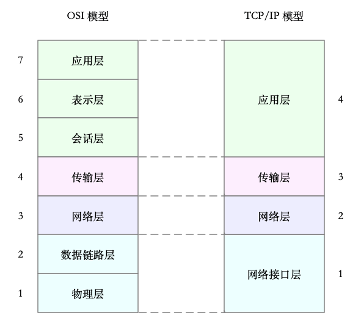
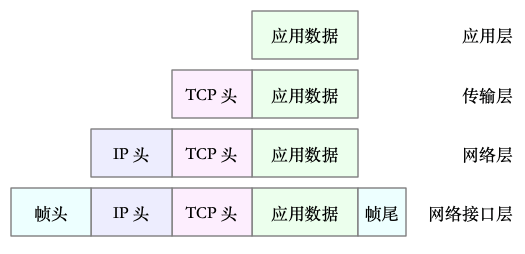
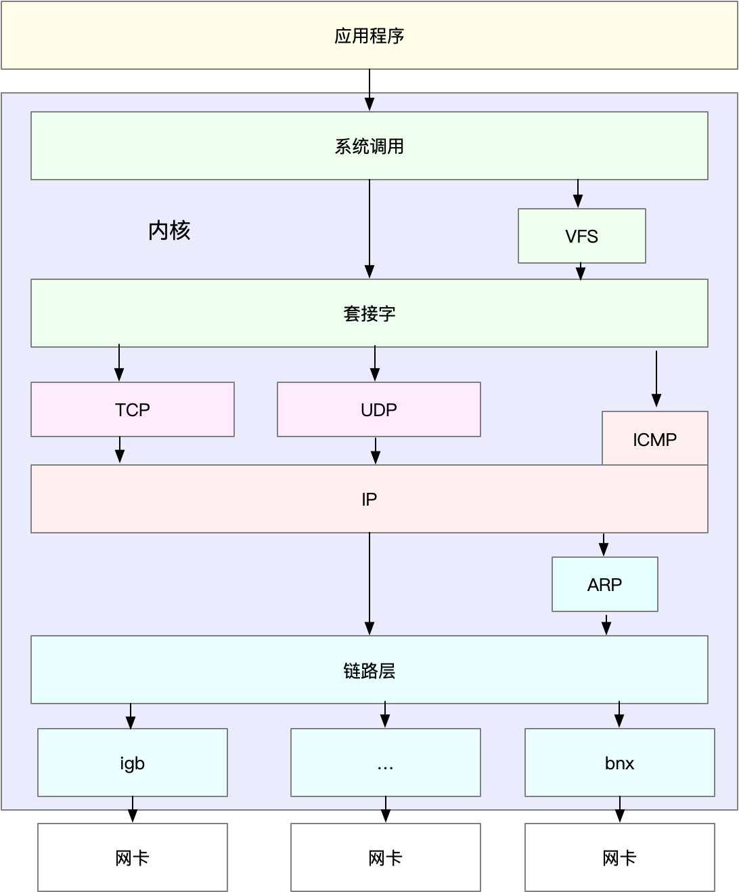

# Linux网络基础知识

## 1. 网络分层

为了解决网络互联中异构设备的兼容性问题，并解耦复杂的网络包处理流程，所以将网络进行分层。

### 1.1 OSI 七层模型

第一个模型为**OSI 网络模型**。国际标准化组织制定的开放式系统互联通信参考模型（Open System Interconnection Reference Model。

OSI 模型把网络互联的框架分为七层：

* 应用层，负责为应用程序提供统一的接口。
* 表示层，负责把数据转换成兼容接收系统的格式。
* 会话层，负责维护计算机之间的通信连接。
* 传输层，负责为数据加上传输表头，形成数据包。
* 网络层，负责数据的路由和转发。
* 数据链路层，负责 MAC 寻址、错误侦测和改错。
* 物理层，负责在物理网络中传输数据帧。

### 1.2 TCP/IP 四层模型

但是 OSI 模型还是太复杂了，所以，在 Linux 中实际上使用的是另一个更实用的四层模型，即 TCP/IP 网络模型。

**TCP/IP 模型**，把网络互联的框架分为四层：

* TCP/IP 模型，把网络互联的框架分为应用层、传输层、网络层、网络接口层等四层，其中，
* 传输层，负责端到端的通信，比如 TCP、UDP 等。
* 网络层，负责网络包的封装、寻址和路由，比如 IP、ICMP 等。
* 网络接口层，负责网络包在物理网络中的传输，比如 MAC 寻址、错误侦测以及通过网卡传输网络帧等。

具体对应关系如下图所示：

> 虽说 Linux 实际按照 TCP/IP 模型，实现了网络协议栈，但在平时的学习交流中，我们习惯上还是用 OSI 七层模型来描述。比如，说到七层和四层负载均衡，对应的分别是 OSI 模型中的应用层和传输层。

## 2. Linux 网络栈

### 2.1 数据封装

有了 TCP/IP 模型后，在进行网络传输时，数据包就会按照协议栈，对上一层发来的数据进行逐层处理；然后封装上该层的协议头，再发送给下一层。

> 比如在应用层，一个提供 REST API 的应用，可以使用 HTTP 协议，把它需要传输的 JSON 数据封装到 HTTP 协议中，然后向下传递给 TCP 层。

而封装做的事情就很简单了，只是**在原来的负载前后，增加固定格式的元数据，原始的负载数据并不会被修改**。

* 传输层在应用程序数据前面增加了 TCP 头；
* 网络层在 TCP 数据包前增加了 IP 头；
* 而网络接口层，又在 IP 数据包前后分别增加了帧头和帧尾。

### 2.2 网络栈

Linux 中的网络栈类似于TCP/IP 的四层结构，如下图所示：

* 最上层的应用程序，需要通过系统调用，来跟套接字接口进行交互；
* 套接字的下面，就是我们前面提到的传输层、网络层和网络接口层；
* 最底层，则是网卡驱动程序以及物理网卡设备。

## 3. Linux 网络收发流程

### 3.1 接收流程

* 1）当一个网络帧到达网卡后，网卡会通过 DMA 方式，把这个网络包放到收包队列中；然后通过硬中断，告诉中断处理程序已经收到了网络包。
* 2）接着，网卡中断处理程序会为网络帧分配内核数据结构（sk_buff），并将其拷贝到 sk_buff 缓冲区中；然后再通过软中断，通知内核收到了新的网络帧。
* 3）接下来，内核协议栈从缓冲区中取出网络帧，并通过网络协议栈，从下到上逐层处理这个网络帧。
  * 在链路层检查报文的合法性，找出上层协议的类型（比如 IPv4 还是 IPv6），再去掉帧头、帧尾，然后交给网络层。
  * 网络层取出 IP 头，判断网络包下一步的走向，比如是交给上层处理还是转发。当网络层确认这个包是要发送到本机后，就会取出上层协议的类型（比如 TCP 还是 UDP），去掉 IP 头，再交给传输层处理。
  * 传输层取出 TCP 头或者 UDP 头后，根据 < 源 IP、源端口、目的 IP、目的端口 > 四元组作为标识，找出对应的 Socket，并把数据拷贝到 Socket 的接收缓存中。
* 4）最后，应用程序就可以使用 Socket 接口，读取到新接收到的数据了。

### 3.2 发送流程

发送流程和接收流程正好相反。

* 1）首先，应用程序调用 Socket API（比如 sendmsg）发送网络包。
  * 由于这是一个系统调用，所以会陷入到内核态的套接字层中
* 2）套接字层会把数据包放到 Socket 发送缓冲区中。
* 3）接下来，网络协议栈从 Socket 发送缓冲区中，取出数据包；再按照 TCP/IP 栈，从上到下逐层处理。比如，传输层和网络层，分别为其增加 TCP 头和 IP 头，执行路由查找确认下一跳的 IP，并按照 MTU 大小进行分片。
* 4）分片后的网络包，再送到网络接口层，进行物理地址寻址，以找到下一跳的 MAC 地址。然后添加帧头和帧尾，放到发包队列中。这一切完成后，会有软中断通知驱动程序：发包队列中有新的网络帧需要发送。
* 5）最后，驱动程序通过 DMA ，从发包队列中读出网络帧，并通过物理网卡把它发送出去。

## 4. 小结 

网络分层模型：

* OSI 七层模型
* TCP/IP 四层模型

网络栈

* 逐层数据封装
* 调用关系

网络包收发流程

读取流程：

* DMA方式从网物理卡中将数据读入内核缓冲区
* 内核网络协议栈处理后写入Socket缓冲区
* 应用程序从Socket缓冲区中读取数据

发送流程和读取流程相反：

* 应用程序通过系统调用将数据写到 Socket缓冲区
* 内核网络协议栈从Socket缓冲区读出数据处理后写入发包队列
* 驱动程序通过 DMA从发包队列读取数据并从物理网卡发送出去