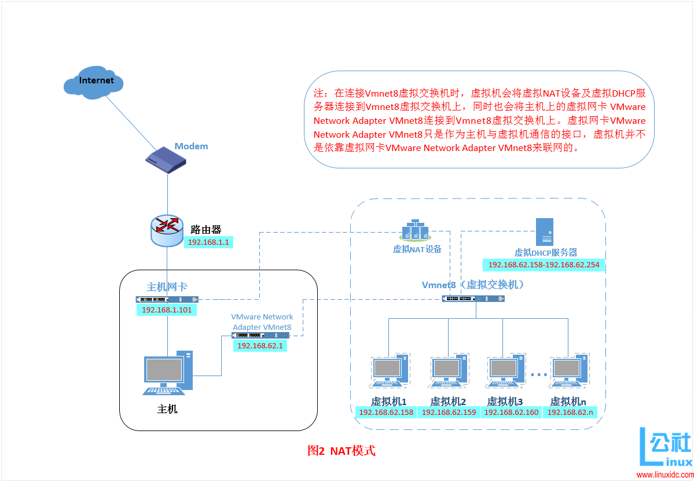
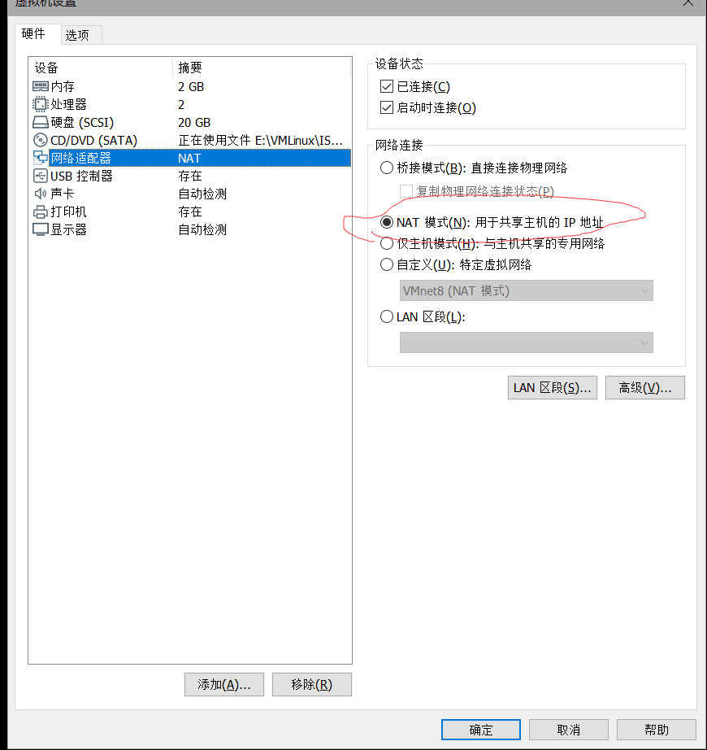
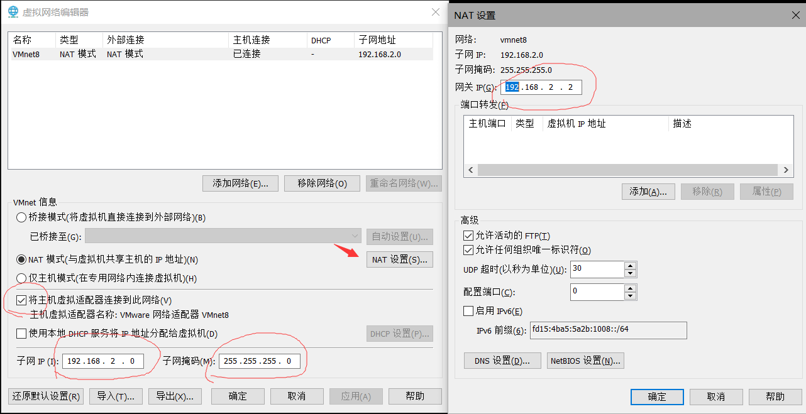

# VMware虚拟机NAT网络模式配置

## 1. 概述

装了好几次虚拟了，网络设置每次都要弄很久，也不知道怎么回事。莫名其妙就能用或者不能用了。这次好好记录一下。

**1 想要达成的效果**

主机和虚拟机之间，可以互相ping通，若主机可以上网，则虚拟机亦可以正常连接网络。
**注：**与当前主机处于同一个局域网的其他主机是不能访问当前主机上的虚拟机的。


## 2. 原理

如果你的网络ip资源紧缺，但是你又希望你的虚拟机能够联网，这时候NAT模式是最好的选择。NAT模式借助虚拟NAT设备和虚拟DHCP服务器，使得虚拟机可以联网。其网络结构如下图所示：




* 1）**在NAT模式中，主机网卡直接与虚拟NAT设备相连，然后虚拟NAT设备与虚拟DHCP服务器一起连接在虚拟交换机VMnet8上，这样就实现了虚拟机联网**。

* 2）而VMware Network Adapter VMnet8虚拟网卡主要是为了实现主机与虚拟机之间的通信。


## 3. 具体设置


* 1）首先将虚拟机设置成 NAT 模式。




* 2）打开 vmware，点击“编辑”下的“虚拟网络编辑器”，设置NAT参数。



1.将主机虚拟适配器连接到此网络**打钩**

2.子网IP固定格式一般为`192.168.X.0`，**前两段和宿主机相同，第三段不要和宿主机相同**，我这里宿主机IP是192.168.1.3，所以虚拟机子网IP我选的是192.168.2.0。子网掩码默认`255.255.255.0`

3.网关IP一般设置为`192.168.X.2`，X和子网IP一致。

* 3）设置虚拟机中的IP

以 Ubuntu20.04为例。

相关配置文件在`/etc/netplan`目录下，当前机器上的文件名为`50-cloud-init.yaml`

> 注意这里的配置文件名未必和你机器上的相同，请根据实际情况修改。

```shell
cd /etc/netplan
sudo vi 50-cloud-init.yaml
```

修改内容如下：

**其中网关就是步骤2中设置的网关，然后IP必须和网关在相同网段中才行，否则无法上网。**

```yaml
network:
    ethernets:
        ens33: #配置的网卡名称 ip addr 命令查看
          dhcp4: false
          dhcp6: false
          addresses: [192.168.2.99/24] #设置本机IP及掩码
          gateway4: 192.168.2.2 #网关
          nameservers:
            addresses: [114.114.114.114] #DNS
    version: 2
```

使配置生效 `netplan apply`


到这里应该就OK了，虚拟机主机通过 VMnet8互通，然后虚拟机也通过宿主机网卡连接外网。


> 测试发现把宿主机中的 VMnet8网卡禁用后虚拟机确实可以上网，说明虚拟机并不是依赖该网卡进行上网的，有的文章说需要共享网络其实也是没必要的。


## 4. 参考

`http://www.linuxidc.com/Linux/2016-09/135521p2.htm`

`https://zhuanlan.zhihu.com/p/130984945`