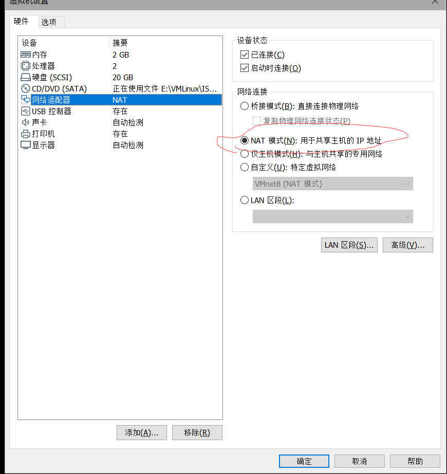
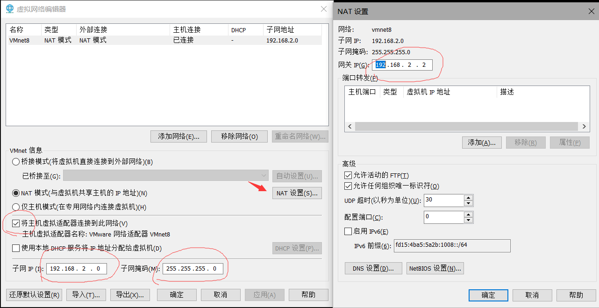
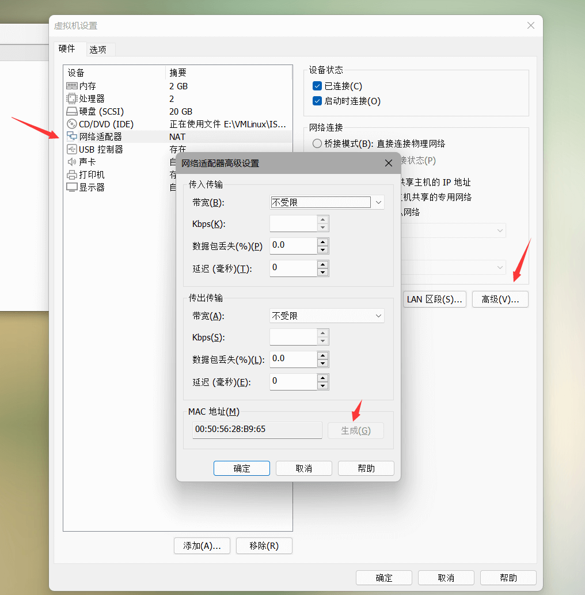

# CentOS 7 测试环境搭建

## 1. 安装

首先使用 VMware 安装 CentOS 7 虚拟机。

VMware 下载地址及许可证见

> 链接：https://pan.baidu.com/s/1ZXKDPEzft8zrR35AUUKLbA 
> 提取码：6666

ISO 文件下载地址见 [centos.org](http://isoredirect.centos.org/centos/7/isos/x86_64/)，推荐使用 [aliyun 镜像](http://mirrors.aliyun.com/centos/7.9.2009/isos/x86_64/)


## 2. 配置

### 设置静态IP

> VMware 网络推荐使用NAT模式

1）首先将虚拟机设置成 NAT 模式。




2）打开 vmware，点击“编辑”下的“虚拟网络编辑器”，设置NAT参数。




* 1）将主机虚拟适配器连接到此网络**打钩**
* 2）子网IP固定格式一般为`192.168.X.0`，**x 不要和宿主机相同**，我这里宿主机IP是192.168.1.3，所以虚拟机子网IP我选的是192.168.2.0。子网掩码默认`255.255.255.0`
* 3）网关IP一般设置为`192.168.X.2`，X和子网IP中的X一致。

3）设置虚拟机中的IP。

根据步骤而可知：

* 子网IP网段：192.168.2.0/24，这里就取个 192.168.2.111吧。
* 网关：192.168.2.2
* 子网掩码：255.255.255.0


> 适用于 CentOS7

默认网卡设备文件存放于`/etc/sysconfig/network-scripts/`

当然不一定都叫`ifcfg-ens33`这个名字 

```sh
vi /etc/sysconfig/network-scripts/ifcfg-ens33
```

修改如下内容

```sh
BOOTPROTO=static #设置网卡引导协议为 静态
ONBOOT=yes #设置网卡启动方式为 开机启动 并且可以通过系统服务管理器 systemctl 控制网卡
```

新增如下内容

```sh
IPADDR=192.168.2.111 #IP
NETMASK=255.255.255.0 #子网掩码
GATEWAY=192.168.2.2 #网关
DNS1=8.8.8.8
DNS2=114.114.114.114
```

设置这 IP 网关等参数要根据你当前所处的网络环境。

保存退出重启网络服务即可

```sh
systemctl restart network
```


### ssh root 登录

默认情况下无法使用 root 账号登录。


**设置允许远程登录 Root**

```shell
vi /etc/ssh/sshd_config
```

增加`PermitRootLogin yes   `

```shell
# Authentication:
LoginGraceTime 120
PermitRootLogin yes                 #接触此行
StrictModes yes
```

**重启ssh服务**

```shell
systemctl restart ssh
```


### 关闭防火墙

```shell
#centos
systemctl stop firewalld
systemctl disable firewalld
```


### 替换yum源

1）备份(针对所有CentOS可用，备份文件在当前路径下)

```shell
mv /etc/yum.repos.d/CentOS-Base.repo /etc/yum.repos.d/CentOS-Base.repo.backup
```


2 ）下载新的CentOS-Base.repo 到/etc/yum.repos.d/

阿里云源

```shell
wget -O /etc/yum.repos.d/CentOS-Base.repo http://mirrors.aliyun.com/repo/Centos-7.repo
```


3）更新软件包缓存

```shell
yum makecache
```


### 修改主机名

在同一局域网中主机名最好都不同，所以我们需要做修改。

**查看当前 Hostname**

```shell
$ hostnamectl
   Static hostname: localhost.localdomain
         Icon name: computer-vm
           Chassis: vm
        Machine ID: d9be835d9ac243298b0f3657c5363887
           Boot ID: a0a245bb1dc34b56939243e5b7920941
    Virtualization: vmware
  Operating System: CentOS Linux 7 (Core)
       CPE OS Name: cpe:/o:centos:centos:7
            Kernel: Linux 3.10.0-1160.el7.x86_64
      Architecture: x86-64
```

**修改 Hostname**

```bash
# 使用 hostnamectl 命令修改，其中 docker 为新的主机名
hostnamectl set-hostname docker
```


## 3. 软件安装

至此一个最基本的环境就准备好了，如果需要其他软件可以从当前虚拟机克隆镜像出去单独安装。


### 镜像克隆

需要先关闭目标虚拟机才能进行克隆。

克隆完成后需要配置新的IP并重新随机一个MAC地址，避免冲突。

随机MAC具体位置：设置-->网络-->高级里面，如下图所示：




修改IP见第二部分的设置静态IP，具体命令如下：

```shell
vi /etc/sysconfig/network-scripts/ifcfg-ens33
```

修改IP后重启网络服务。

```shell
systemctl restart network
```


然后可以创建个快照，后续安装错了可以直接恢复。


### [containerd](https://kubernetes.io/zh/docs/setup/production-environment/container-runtimes/#containerd)

后续会安装 K8s，所以先给基础镜像安装上 containerd。


安装和配置的先决条件：

```shell
cat <<EOF | sudo tee /etc/modules-load.d/containerd.conf
overlay
br_netfilter
EOF

sudo modprobe overlay
sudo modprobe br_netfilter

# 设置必需的 sysctl 参数，这些参数在重新启动后仍然存在。
cat <<EOF | sudo tee /etc/sysctl.d/99-kubernetes-cri.conf
net.bridge.bridge-nf-call-iptables  = 1
net.ipv4.ip_forward                 = 1
net.bridge.bridge-nf-call-ip6tables = 1
EOF

# 应用 sysctl 参数而无需重新启动
sudo sysctl --system
```


安装`yum-utils`包（提供`yum-config-manager` 实用程序）并设置**稳定**的存储库。

> 这部分参考如何安装 Docker：[在 CentOS 上安装 Docker 引擎](https://docs.docker.com/engine/install/centos/)，安装的时候只安装 containerd 即可。

```shell
sudo yum install -y yum-utils

# 这里可以替换成阿里的源 
# yum-config-manager --add-repo http://mirrors.aliyun.com/docker-ce/linux/centos/docker-ce.repo
sudo yum-config-manager \
    --add-repo \
    https://download.docker.com/linux/centos/docker-ce.repo

   
yum install containerd -y
```

配置 containerd：

```shell
sudo mkdir -p /etc/containerd
# 生成默认配置文件并写入到 config.toml 中
containerd config default | sudo tee /etc/containerd/config.toml
```


**使用 `systemd` cgroup 驱动程序**

> 注意：cri 使用的 cgroup 和 kubelet 使用的 cgroup 最好是一致的，如果使用 kubeadm 安装的那么 kubelet 也默认使用 systemd cgroup。

结合 `runc` 使用 `systemd` cgroup 驱动，在 `/etc/containerd/config.toml` 中设置

```toml
# 把配置文件中的 SystemdCgroup 修改为 true
[plugins."io.containerd.grpc.v1.cri".containerd.runtimes.runc]
  ...
  [plugins."io.containerd.grpc.v1.cri".containerd.runtimes.runc.options]
    SystemdCgroup = true
```


用国内源替换 containerd 默认的 sand_box 镜像，编辑 /etc/containerd/config.toml 

```shell
[plugins]
  .....
  [plugins."io.containerd.grpc.v1.cri"]
  	...
	sandbox_image = "registry.aliyuncs.com/google_containers/pause:3.5"
```

**配置镜像加速器地址**

然后再为镜像仓库配置一个加速器，需要在 cri 配置块下面的 `registry` 配置块下面进行配置 `registry.mirrors`：（注意缩进）

> 镜像来源：[ registry-mirrors](https://github.com/muzi502/registry-mirrors)

```bash
$ vim /etc/containerd/config.toml

[plugins."io.containerd.grpc.v1.cri".registry]
  [plugins."io.containerd.grpc.v1.cri".registry.mirrors]
  # 添加下面两个配置
    [plugins."io.containerd.grpc.v1.cri".registry.mirrors."docker.io"]
      endpoint = ["https://ekxinbbh.mirror.aliyuncs.com"]
    [plugins."io.containerd.grpc.v1.cri".registry.mirrors."k8s.gcr.io"]
      endpoint = ["https://gcr.k8s.li"]
```


启动 containerd

```shell
systemctl daemon-reload
systemctl enable containerd --now
```


**验证**

启动完成后就可以使用 containerd 的本地 CLI 工具 `ctr` 和 `crictl` 了，比如查看版本：

```
ctr version
crictl version
```


###  k8s 环境准备

#### 关闭交换空间

> 不关则会出现以下错误：failed to run Kubelet: running with swap on is not supported, please disable swap! 

```shell
sudo swapoff -a
sed -ri 's/.*swap.*/#&/' /etc/fstab
```
